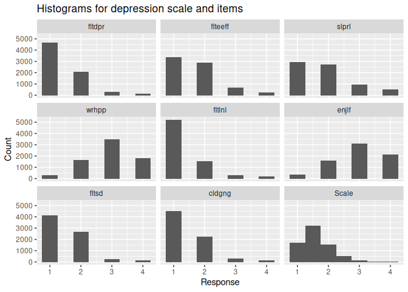
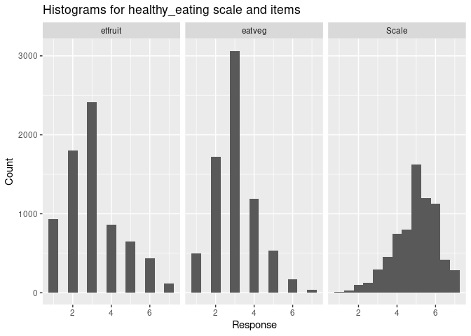

<!-- README.md is generated from README.Rmd. Please edit that file -->

# timesaveR 

<!-- badges: start -->

[](https://github.com/LukasWallrich/timesaveR/actions)
[](https://app.codecov.io/gh/LukasWallrich/timesaveR?branch=master)
[](https://github.com/LukasWallrich/timesaveR)
<!-- badges: end -->

This package aims to speed up research projects in social psychology
(and related fields). For that, it primarily includes some functions
that help lay the groundwork and others that facilitate the reporting of
results.

Among others, the package can help with the following:

- **Creating scales**, including reverse-coding and reporting their
  internal consistency,
- **Creating correlation tables** in APA style, including descriptive
  statistics and confidence intervals, and an option to use survey
  weights, multiple imputation or full-information maximum-likelihood
  estimation
- **Creating regression tables** comparing standardised and
  non-standardised regression coefficients, and comparing the F-change
  between two nested models
- **Formatting numbers for statistical reporting**, including rounding
  with trailing zeros, or displaying numbers as *p*-values or as
  confidence intervals
- **Data entry and transfer**, for quick interactive use. This includes
  splitting clipboard content into vectors, converting tibbles to
  tribble code, or obtaining nicely formatted code and results to paste
  into another application

## Why use this package?

There are many packages that support data analysis and reporting. For
instance, the `psych` package offers functions to create scales, while
the `modelsummary` package offers options to create customisable tables
in a wide variety of output format. They power many of the functions
offered here ‘under the hood.’

`apa` and `papaja` are two packages that directly support the reporting
of results in APA style - they can complement this package well.
However, none of the existing offered quite what we needed. This package

- takes an end-to-end view of the data analysis process, streamlining
  time-consuming steps at various stages
- offers analysis templates that make it easy to get started,
  particularly for R novices,
- prioritises publication-readiness and good reporting practices over
  customisability in creating tables and charts
- integrates with the `tidyverse` by supporting tidy evaluation and
  returning tibbles where possible

# Installation

You can install timesaveR from GitHub with the command below. If you do
not have the `remotes`-package installed, run
`install.packages("remote")` first.

``` r
remotes::install_github('lukaswallrich/timesaveR')
```

# Get started

There are many functions in the package, and we will create vignettes
detailing various use cases. However, the following can give you an
initial flavor. The examples use data from the European Social Survey
Wave 7 (2014). Here, I ignore survey weights. However, the package
offers similar functions for analysing weighted survey data, which are
explained in the [survey data vignette](doc/survey_functions.html).

## Load the package

(I also load `dplyr` since that is the recommended usage - of course,
there are base R alternatives for all of the steps.)

``` r
library(dplyr)
#> 
#> Attaching package: 'dplyr'
#> The following objects are masked from 'package:stats':
#> 
#>     filter, lag
#> The following objects are masked from 'package:base':
#> 
#>     intersect, setdiff, setequal, union
library(timesaveR)
#> Note re timesaveR: Many functions in this package are alpha-versions - please treat results with care and report bugs and desired features.
```

## Create scales

Let’s create scales for health behaviours and depressive symptoms, each
including some reverse coding.

``` r
scales <- list(
  depression = c("fltdpr", "flteeff", "slprl", "wrhpp", "fltlnl", 
                 "enjlf", "fltsd", "cldgng"),
  healthy_eating = c("etfruit", "eatveg")
  )
  
scales_reverse <- list(
  depression = c("wrhpp", "enjlf"),
  healthy_eating = c("etfruit", "eatveg")
)

scales <- make_scales(ess_health, items = scales, reversed = scales_reverse)
#> The following scales will be calculated with specified reverse coding: depression, healthy_eating
```



``` r

#Check descriptives, including reliability
scales$descriptives
#> # A tibble: 2 × 10
#>   Scale      n_items reliability reliability_method  mean    SD reversed rev_min
#>   <chr>        <int>       <dbl> <chr>              <dbl> <dbl> <chr>      <dbl>
#> 1 depression       8       0.802 cronbachs_alpha     1.67 0.484 wrhpp e…       1
#> 2 healthy_e…       2       0.658 spearman_brown      4.97 1.11  etfruit…       1
#> # ℹ 2 more variables: rev_max <dbl>, text <chr>

#Add scale scores to dataset
ess_health <- bind_cols(ess_health, scales$scores)
```

## Report correlations and descriptive statistics

Next, we are often interested in descriptive statistics, variable
distributions and correlations.

``` r
ess_health %>% select(agea, health, depression, healthy_eating) %>% 
    cor_matrix() %>% report_cor_table()
```

<div id="uuaxumjvmz" style="padding-left:0px;padding-right:0px;padding-top:10px;padding-bottom:10px;overflow-x:auto;overflow-y:auto;width:auto;height:auto;">
<style>#uuaxumjvmz table {
  font-family: times, system-ui, 'Segoe UI', Roboto, Helvetica, Arial, sans-serif, 'Apple Color Emoji', 'Segoe UI Emoji', 'Segoe UI Symbol', 'Noto Color Emoji';
  -webkit-font-smoothing: antialiased;
  -moz-osx-font-smoothing: grayscale;
}

#uuaxumjvmz thead, #uuaxumjvmz tbody, #uuaxumjvmz tfoot, #uuaxumjvmz tr, #uuaxumjvmz td, #uuaxumjvmz th {
  border-style: none;
}

#uuaxumjvmz p {
  margin: 0;
  padding: 0;
}

#uuaxumjvmz .gt_table {
  display: table;
  border-collapse: collapse;
  line-height: normal;
  margin-left: auto;
  margin-right: auto;
  color: #333333;
  font-size: 12px;
  font-weight: normal;
  font-style: none;
  background-color: #FFFFFF;
  width: auto;
  border-top-style: none;
  border-top-width: 2px;
  border-top-color: #FFFFFF;
  border-right-style: none;
  border-right-width: 2px;
  border-right-color: #D3D3D3;
  border-bottom-style: none;
  border-bottom-width: 2px;
  border-bottom-color: #A8A8A8;
  border-left-style: none;
  border-left-width: 2px;
  border-left-color: #D3D3D3;
}

#uuaxumjvmz .gt_caption {
  padding-top: 4px;
  padding-bottom: 4px;
}

#uuaxumjvmz .gt_title {
  color: #333333;
  font-size: 12px;
  font-weight: initial;
  padding-top: 4px;
  padding-bottom: 4px;
  padding-left: 5px;
  padding-right: 5px;
  border-bottom-color: #FFFFFF;
  border-bottom-width: 0;
}

#uuaxumjvmz .gt_subtitle {
  color: #333333;
  font-size: 12px;
  font-weight: initial;
  padding-top: 3px;
  padding-bottom: 5px;
  padding-left: 5px;
  padding-right: 5px;
  border-top-color: #FFFFFF;
  border-top-width: 0;
}

#uuaxumjvmz .gt_heading {
  background-color: #FFFFFF;
  text-align: center;
  border-bottom-color: #FFFFFF;
  border-left-style: none;
  border-left-width: 1px;
  border-left-color: #D3D3D3;
  border-right-style: none;
  border-right-width: 1px;
  border-right-color: #D3D3D3;
}

#uuaxumjvmz .gt_bottom_border {
  border-bottom-style: solid;
  border-bottom-width: 2px;
  border-bottom-color: #000000;
}

#uuaxumjvmz .gt_col_headings {
  border-top-style: none;
  border-top-width: 2px;
  border-top-color: #D3D3D3;
  border-bottom-style: solid;
  border-bottom-width: 1px;
  border-bottom-color: #000000;
  border-left-style: none;
  border-left-width: 1px;
  border-left-color: #D3D3D3;
  border-right-style: none;
  border-right-width: 1px;
  border-right-color: #D3D3D3;
}

#uuaxumjvmz .gt_col_heading {
  color: #333333;
  background-color: #FFFFFF;
  font-size: 100%;
  font-weight: normal;
  text-transform: inherit;
  border-left-style: none;
  border-left-width: 1px;
  border-left-color: #D3D3D3;
  border-right-style: none;
  border-right-width: 1px;
  border-right-color: #D3D3D3;
  vertical-align: bottom;
  padding-top: 5px;
  padding-bottom: 6px;
  padding-left: 5px;
  padding-right: 5px;
  overflow-x: hidden;
}

#uuaxumjvmz .gt_column_spanner_outer {
  color: #333333;
  background-color: #FFFFFF;
  font-size: 100%;
  font-weight: normal;
  text-transform: inherit;
  padding-top: 0;
  padding-bottom: 0;
  padding-left: 4px;
  padding-right: 4px;
}

#uuaxumjvmz .gt_column_spanner_outer:first-child {
  padding-left: 0;
}

#uuaxumjvmz .gt_column_spanner_outer:last-child {
  padding-right: 0;
}

#uuaxumjvmz .gt_column_spanner {
  border-bottom-style: solid;
  border-bottom-width: 1px;
  border-bottom-color: #000000;
  vertical-align: bottom;
  padding-top: 5px;
  padding-bottom: 5px;
  overflow-x: hidden;
  display: inline-block;
  width: 100%;
}

#uuaxumjvmz .gt_spanner_row {
  border-bottom-style: hidden;
}

#uuaxumjvmz .gt_group_heading {
  padding-top: 8px;
  padding-bottom: 8px;
  padding-left: 5px;
  padding-right: 5px;
  color: #333333;
  background-color: #FFFFFF;
  font-size: 100%;
  font-weight: initial;
  text-transform: inherit;
  border-top-style: none;
  border-top-width: 2px;
  border-top-color: #D3D3D3;
  border-bottom-style: none;
  border-bottom-width: 2px;
  border-bottom-color: #D3D3D3;
  border-left-style: none;
  border-left-width: 1px;
  border-left-color: #D3D3D3;
  border-right-style: none;
  border-right-width: 1px;
  border-right-color: #D3D3D3;
  vertical-align: middle;
  text-align: left;
}

#uuaxumjvmz .gt_empty_group_heading {
  padding: 0.5px;
  color: #333333;
  background-color: #FFFFFF;
  font-size: 100%;
  font-weight: initial;
  border-top-style: none;
  border-top-width: 2px;
  border-top-color: #D3D3D3;
  border-bottom-style: none;
  border-bottom-width: 2px;
  border-bottom-color: #D3D3D3;
  vertical-align: middle;
}

#uuaxumjvmz .gt_from_md > :first-child {
  margin-top: 0;
}

#uuaxumjvmz .gt_from_md > :last-child {
  margin-bottom: 0;
}

#uuaxumjvmz .gt_row {
  padding-top: 8px;
  padding-bottom: 8px;
  padding-left: 5px;
  padding-right: 5px;
  margin: 10px;
  border-top-style: none;
  border-top-width: 1px;
  border-top-color: #FFFFFF;
  border-left-style: none;
  border-left-width: 1px;
  border-left-color: #D3D3D3;
  border-right-style: none;
  border-right-width: 1px;
  border-right-color: #D3D3D3;
  vertical-align: middle;
  overflow-x: hidden;
}

#uuaxumjvmz .gt_stub {
  color: #333333;
  background-color: #FFFFFF;
  font-size: 100%;
  font-weight: initial;
  text-transform: inherit;
  border-right-style: none;
  border-right-width: 2px;
  border-right-color: #D3D3D3;
  padding-left: 5px;
  padding-right: 5px;
}

#uuaxumjvmz .gt_stub_row_group {
  color: #333333;
  background-color: #FFFFFF;
  font-size: 100%;
  font-weight: initial;
  text-transform: inherit;
  border-right-style: none;
  border-right-width: 2px;
  border-right-color: #D3D3D3;
  padding-left: 5px;
  padding-right: 5px;
  vertical-align: top;
}

#uuaxumjvmz .gt_row_group_first td {
  border-top-width: 2px;
}

#uuaxumjvmz .gt_row_group_first th {
  border-top-width: 2px;
}

#uuaxumjvmz .gt_summary_row {
  color: #333333;
  background-color: #FFFFFF;
  text-transform: inherit;
  padding-top: 8px;
  padding-bottom: 8px;
  padding-left: 5px;
  padding-right: 5px;
}

#uuaxumjvmz .gt_first_summary_row {
  border-top-style: none;
  border-top-color: #D3D3D3;
}

#uuaxumjvmz .gt_first_summary_row.thick {
  border-top-width: 2px;
}

#uuaxumjvmz .gt_last_summary_row {
  padding-top: 8px;
  padding-bottom: 8px;
  padding-left: 5px;
  padding-right: 5px;
  border-bottom-style: none;
  border-bottom-width: 2px;
  border-bottom-color: #D3D3D3;
}

#uuaxumjvmz .gt_grand_summary_row {
  color: #333333;
  background-color: #FFFFFF;
  text-transform: inherit;
  padding-top: 8px;
  padding-bottom: 8px;
  padding-left: 5px;
  padding-right: 5px;
}

#uuaxumjvmz .gt_first_grand_summary_row {
  padding-top: 8px;
  padding-bottom: 8px;
  padding-left: 5px;
  padding-right: 5px;
  border-top-style: none;
  border-top-width: 6px;
  border-top-color: #D3D3D3;
}

#uuaxumjvmz .gt_last_grand_summary_row_top {
  padding-top: 8px;
  padding-bottom: 8px;
  padding-left: 5px;
  padding-right: 5px;
  border-bottom-style: none;
  border-bottom-width: 6px;
  border-bottom-color: #D3D3D3;
}

#uuaxumjvmz .gt_striped {
  background-color: rgba(128, 128, 128, 0.05);
}

#uuaxumjvmz .gt_table_body {
  border-top-style: solid;
  border-top-width: 1px;
  border-top-color: #000000;
  border-bottom-style: solid;
  border-bottom-width: 1px;
  border-bottom-color: #000000;
}

#uuaxumjvmz .gt_footnotes {
  color: #333333;
  background-color: #FFFFFF;
  border-bottom-style: none;
  border-bottom-width: 2px;
  border-bottom-color: #D3D3D3;
  border-left-style: none;
  border-left-width: 2px;
  border-left-color: #D3D3D3;
  border-right-style: none;
  border-right-width: 2px;
  border-right-color: #D3D3D3;
}

#uuaxumjvmz .gt_footnote {
  margin: 0px;
  font-size: 90%;
  padding-top: 4px;
  padding-bottom: 4px;
  padding-left: 5px;
  padding-right: 5px;
}

#uuaxumjvmz .gt_sourcenotes {
  color: #333333;
  background-color: #FFFFFF;
  border-bottom-style: none;
  border-bottom-width: 2px;
  border-bottom-color: #D3D3D3;
  border-left-style: none;
  border-left-width: 2px;
  border-left-color: #D3D3D3;
  border-right-style: none;
  border-right-width: 2px;
  border-right-color: #D3D3D3;
}

#uuaxumjvmz .gt_sourcenote {
  font-size: 90%;
  padding-top: 4px;
  padding-bottom: 4px;
  padding-left: 5px;
  padding-right: 5px;
}

#uuaxumjvmz .gt_left {
  text-align: left;
}

#uuaxumjvmz .gt_center {
  text-align: center;
}

#uuaxumjvmz .gt_right {
  text-align: right;
  font-variant-numeric: tabular-nums;
}

#uuaxumjvmz .gt_font_normal {
  font-weight: normal;
}

#uuaxumjvmz .gt_font_bold {
  font-weight: bold;
}

#uuaxumjvmz .gt_font_italic {
  font-style: italic;
}

#uuaxumjvmz .gt_super {
  font-size: 65%;
}

#uuaxumjvmz .gt_footnote_marks {
  font-size: 75%;
  vertical-align: 0.4em;
  position: initial;
}

#uuaxumjvmz .gt_asterisk {
  font-size: 100%;
  vertical-align: 0;
}

#uuaxumjvmz .gt_indent_1 {
  text-indent: 5px;
}

#uuaxumjvmz .gt_indent_2 {
  text-indent: 10px;
}

#uuaxumjvmz .gt_indent_3 {
  text-indent: 15px;
}

#uuaxumjvmz .gt_indent_4 {
  text-indent: 20px;
}

#uuaxumjvmz .gt_indent_5 {
  text-indent: 25px;
}
</style>
<table class="gt_table" data-quarto-disable-processing="false" data-quarto-bootstrap="false">
  <thead>
    
    <tr class="gt_col_headings">
      <th class="gt_col_heading gt_columns_bottom_border gt_left" rowspan="1" colspan="1" scope="col" id="Variable">Variable</th>
      <th class="gt_col_heading gt_columns_bottom_border gt_right" rowspan="1" colspan="1" scope="col" id="&lt;em&gt;M (SD)&lt;/em&gt;"><em>M (SD)</em></th>
      <th class="gt_col_heading gt_columns_bottom_border gt_left" rowspan="1" colspan="1" scope="col" id="1">1</th>
      <th class="gt_col_heading gt_columns_bottom_border gt_left" rowspan="1" colspan="1" scope="col" id="2">2</th>
      <th class="gt_col_heading gt_columns_bottom_border gt_left" rowspan="1" colspan="1" scope="col" id="3">3</th>
    </tr>
  </thead>
  <tbody class="gt_table_body">
    <tr><td headers="Variable" class="gt_row gt_left"><div class='gt_from_md'><ol>
<li>agea</li>
</ol>
</div></td>
<td headers="desc" class="gt_row gt_right"><div class='gt_from_md'><p>50.61 (18.51)</p>
</div></td>
<td headers="1" class="gt_row gt_left"><div class='gt_from_md'> <br /> 
</div></td>
<td headers="2" class="gt_row gt_left"><div class='gt_from_md'> <br /> 
</div></td>
<td headers="3" class="gt_row gt_left"><div class='gt_from_md'> <br /> 
</div></td></tr>
    <tr><td headers="Variable" class="gt_row gt_left"><div class='gt_from_md'><ol start="2">
<li>health</li>
</ol>
</div></td>
<td headers="desc" class="gt_row gt_right"><div class='gt_from_md'><p>2.26 (0.92)</p>
</div></td>
<td headers="1" class="gt_row gt_left"><div class='gt_from_md'><p>.28 ***<br /><span style="font-size:80%">[0.25, 0.30]</span></p>
</div></td>
<td headers="2" class="gt_row gt_left"><div class='gt_from_md'> <br /> 
</div></td>
<td headers="3" class="gt_row gt_left"><div class='gt_from_md'> <br /> 
</div></td></tr>
    <tr><td headers="Variable" class="gt_row gt_left"><div class='gt_from_md'><ol start="3">
<li>depression</li>
</ol>
</div></td>
<td headers="desc" class="gt_row gt_right"><div class='gt_from_md'><p>1.67 (0.48)</p>
</div></td>
<td headers="1" class="gt_row gt_left"><div class='gt_from_md'><p>.03 *<br /><span style="font-size:80%">[0.00, 0.05]</span></p>
</div></td>
<td headers="2" class="gt_row gt_left"><div class='gt_from_md'><p>.42 ***<br /><span style="font-size:80%">[0.40, 0.44]</span></p>
</div></td>
<td headers="3" class="gt_row gt_left"><div class='gt_from_md'> <br /> 
</div></td></tr>
    <tr><td headers="Variable" class="gt_row gt_left"><div class='gt_from_md'><ol start="4">
<li>healthy_eating</li>
</ol>
</div></td>
<td headers="desc" class="gt_row gt_right"><div class='gt_from_md'><p>4.97 (1.11)</p>
</div></td>
<td headers="1" class="gt_row gt_left"><div class='gt_from_md'><p>.17 ***<br /><span style="font-size:80%">[0.15, 0.19]</span></p>
</div></td>
<td headers="2" class="gt_row gt_left"><div class='gt_from_md'><p>-.09 ***<br /><span style="font-size:80%">[-0.11, -0.07]</span></p>
</div></td>
<td headers="3" class="gt_row gt_left"><div class='gt_from_md'><p>-.13 ***<br /><span style="font-size:80%">[-0.15, -0.10]</span></p>
</div></td></tr>
  </tbody>
  <tfoot class="gt_sourcenotes">
    <tr>
      <td class="gt_sourcenote" colspan="5"><em>M</em> and <em>SD</em> are used to represent mean and standard deviation, respectively. Values in square brackets indicate the 95% confidence interval for each correlation.</td>
    </tr>
    <tr>
      <td class="gt_sourcenote" colspan="5">† <em>p</em> &lt; .1, * <em>p</em> &lt; .05, ** <em>p</em> &lt; .01, *** <em>p</em> &lt; .001</td>
    </tr>
  </tfoot>
  
</table>
</div>

#It is often helpful to rename variables in this step
#Use get_rename_tribbles(ess_health) to get most of this code
var_renames <- tibble::tribble(
    ~old,     ~new,     
    "agea",   "Age",  
    "health",  "Poor health",
    "depression",  "Depression",
    "healthy_eating",  "Healthy eating",
)

#A rename tibble or vector automatically only selects the variables included into it
ess_health %>% cor_matrix(var_names = var_renames) %>% report_cor_table()
<div id="qvuoajfxcb" style="padding-left:0px;padding-right:0px;padding-top:10px;padding-bottom:10px;overflow-x:auto;overflow-y:auto;width:auto;height:auto;">
<style>#qvuoajfxcb table {
  font-family: times, system-ui, 'Segoe UI', Roboto, Helvetica, Arial, sans-serif, 'Apple Color Emoji', 'Segoe UI Emoji', 'Segoe UI Symbol', 'Noto Color Emoji';
  -webkit-font-smoothing: antialiased;
  -moz-osx-font-smoothing: grayscale;
}

#qvuoajfxcb thead, #qvuoajfxcb tbody, #qvuoajfxcb tfoot, #qvuoajfxcb tr, #qvuoajfxcb td, #qvuoajfxcb th {
  border-style: none;
}

#qvuoajfxcb p {
  margin: 0;
  padding: 0;
}

#qvuoajfxcb .gt_table {
  display: table;
  border-collapse: collapse;
  line-height: normal;
  margin-left: auto;
  margin-right: auto;
  color: #333333;
  font-size: 12px;
  font-weight: normal;
  font-style: none;
  background-color: #FFFFFF;
  width: auto;
  border-top-style: none;
  border-top-width: 2px;
  border-top-color: #FFFFFF;
  border-right-style: none;
  border-right-width: 2px;
  border-right-color: #D3D3D3;
  border-bottom-style: none;
  border-bottom-width: 2px;
  border-bottom-color: #A8A8A8;
  border-left-style: none;
  border-left-width: 2px;
  border-left-color: #D3D3D3;
}

#qvuoajfxcb .gt_caption {
  padding-top: 4px;
  padding-bottom: 4px;
}

#qvuoajfxcb .gt_title {
  color: #333333;
  font-size: 12px;
  font-weight: initial;
  padding-top: 4px;
  padding-bottom: 4px;
  padding-left: 5px;
  padding-right: 5px;
  border-bottom-color: #FFFFFF;
  border-bottom-width: 0;
}

#qvuoajfxcb .gt_subtitle {
  color: #333333;
  font-size: 12px;
  font-weight: initial;
  padding-top: 3px;
  padding-bottom: 5px;
  padding-left: 5px;
  padding-right: 5px;
  border-top-color: #FFFFFF;
  border-top-width: 0;
}

#qvuoajfxcb .gt_heading {
  background-color: #FFFFFF;
  text-align: center;
  border-bottom-color: #FFFFFF;
  border-left-style: none;
  border-left-width: 1px;
  border-left-color: #D3D3D3;
  border-right-style: none;
  border-right-width: 1px;
  border-right-color: #D3D3D3;
}

#qvuoajfxcb .gt_bottom_border {
  border-bottom-style: solid;
  border-bottom-width: 2px;
  border-bottom-color: #000000;
}

#qvuoajfxcb .gt_col_headings {
  border-top-style: none;
  border-top-width: 2px;
  border-top-color: #D3D3D3;
  border-bottom-style: solid;
  border-bottom-width: 1px;
  border-bottom-color: #000000;
  border-left-style: none;
  border-left-width: 1px;
  border-left-color: #D3D3D3;
  border-right-style: none;
  border-right-width: 1px;
  border-right-color: #D3D3D3;
}

#qvuoajfxcb .gt_col_heading {
  color: #333333;
  background-color: #FFFFFF;
  font-size: 100%;
  font-weight: normal;
  text-transform: inherit;
  border-left-style: none;
  border-left-width: 1px;
  border-left-color: #D3D3D3;
  border-right-style: none;
  border-right-width: 1px;
  border-right-color: #D3D3D3;
  vertical-align: bottom;
  padding-top: 5px;
  padding-bottom: 6px;
  padding-left: 5px;
  padding-right: 5px;
  overflow-x: hidden;
}

#qvuoajfxcb .gt_column_spanner_outer {
  color: #333333;
  background-color: #FFFFFF;
  font-size: 100%;
  font-weight: normal;
  text-transform: inherit;
  padding-top: 0;
  padding-bottom: 0;
  padding-left: 4px;
  padding-right: 4px;
}

#qvuoajfxcb .gt_column_spanner_outer:first-child {
  padding-left: 0;
}

#qvuoajfxcb .gt_column_spanner_outer:last-child {
  padding-right: 0;
}

#qvuoajfxcb .gt_column_spanner {
  border-bottom-style: solid;
  border-bottom-width: 1px;
  border-bottom-color: #000000;
  vertical-align: bottom;
  padding-top: 5px;
  padding-bottom: 5px;
  overflow-x: hidden;
  display: inline-block;
  width: 100%;
}

#qvuoajfxcb .gt_spanner_row {
  border-bottom-style: hidden;
}

#qvuoajfxcb .gt_group_heading {
  padding-top: 8px;
  padding-bottom: 8px;
  padding-left: 5px;
  padding-right: 5px;
  color: #333333;
  background-color: #FFFFFF;
  font-size: 100%;
  font-weight: initial;
  text-transform: inherit;
  border-top-style: none;
  border-top-width: 2px;
  border-top-color: #D3D3D3;
  border-bottom-style: none;
  border-bottom-width: 2px;
  border-bottom-color: #D3D3D3;
  border-left-style: none;
  border-left-width: 1px;
  border-left-color: #D3D3D3;
  border-right-style: none;
  border-right-width: 1px;
  border-right-color: #D3D3D3;
  vertical-align: middle;
  text-align: left;
}

#qvuoajfxcb .gt_empty_group_heading {
  padding: 0.5px;
  color: #333333;
  background-color: #FFFFFF;
  font-size: 100%;
  font-weight: initial;
  border-top-style: none;
  border-top-width: 2px;
  border-top-color: #D3D3D3;
  border-bottom-style: none;
  border-bottom-width: 2px;
  border-bottom-color: #D3D3D3;
  vertical-align: middle;
}

#qvuoajfxcb .gt_from_md > :first-child {
  margin-top: 0;
}

#qvuoajfxcb .gt_from_md > :last-child {
  margin-bottom: 0;
}

#qvuoajfxcb .gt_row {
  padding-top: 8px;
  padding-bottom: 8px;
  padding-left: 5px;
  padding-right: 5px;
  margin: 10px;
  border-top-style: none;
  border-top-width: 1px;
  border-top-color: #FFFFFF;
  border-left-style: none;
  border-left-width: 1px;
  border-left-color: #D3D3D3;
  border-right-style: none;
  border-right-width: 1px;
  border-right-color: #D3D3D3;
  vertical-align: middle;
  overflow-x: hidden;
}

#qvuoajfxcb .gt_stub {
  color: #333333;
  background-color: #FFFFFF;
  font-size: 100%;
  font-weight: initial;
  text-transform: inherit;
  border-right-style: none;
  border-right-width: 2px;
  border-right-color: #D3D3D3;
  padding-left: 5px;
  padding-right: 5px;
}

#qvuoajfxcb .gt_stub_row_group {
  color: #333333;
  background-color: #FFFFFF;
  font-size: 100%;
  font-weight: initial;
  text-transform: inherit;
  border-right-style: none;
  border-right-width: 2px;
  border-right-color: #D3D3D3;
  padding-left: 5px;
  padding-right: 5px;
  vertical-align: top;
}

#qvuoajfxcb .gt_row_group_first td {
  border-top-width: 2px;
}

#qvuoajfxcb .gt_row_group_first th {
  border-top-width: 2px;
}

#qvuoajfxcb .gt_summary_row {
  color: #333333;
  background-color: #FFFFFF;
  text-transform: inherit;
  padding-top: 8px;
  padding-bottom: 8px;
  padding-left: 5px;
  padding-right: 5px;
}

#qvuoajfxcb .gt_first_summary_row {
  border-top-style: none;
  border-top-color: #D3D3D3;
}

#qvuoajfxcb .gt_first_summary_row.thick {
  border-top-width: 2px;
}

#qvuoajfxcb .gt_last_summary_row {
  padding-top: 8px;
  padding-bottom: 8px;
  padding-left: 5px;
  padding-right: 5px;
  border-bottom-style: none;
  border-bottom-width: 2px;
  border-bottom-color: #D3D3D3;
}

#qvuoajfxcb .gt_grand_summary_row {
  color: #333333;
  background-color: #FFFFFF;
  text-transform: inherit;
  padding-top: 8px;
  padding-bottom: 8px;
  padding-left: 5px;
  padding-right: 5px;
}

#qvuoajfxcb .gt_first_grand_summary_row {
  padding-top: 8px;
  padding-bottom: 8px;
  padding-left: 5px;
  padding-right: 5px;
  border-top-style: none;
  border-top-width: 6px;
  border-top-color: #D3D3D3;
}

#qvuoajfxcb .gt_last_grand_summary_row_top {
  padding-top: 8px;
  padding-bottom: 8px;
  padding-left: 5px;
  padding-right: 5px;
  border-bottom-style: none;
  border-bottom-width: 6px;
  border-bottom-color: #D3D3D3;
}

#qvuoajfxcb .gt_striped {
  background-color: rgba(128, 128, 128, 0.05);
}

#qvuoajfxcb .gt_table_body {
  border-top-style: solid;
  border-top-width: 1px;
  border-top-color: #000000;
  border-bottom-style: solid;
  border-bottom-width: 1px;
  border-bottom-color: #000000;
}

#qvuoajfxcb .gt_footnotes {
  color: #333333;
  background-color: #FFFFFF;
  border-bottom-style: none;
  border-bottom-width: 2px;
  border-bottom-color: #D3D3D3;
  border-left-style: none;
  border-left-width: 2px;
  border-left-color: #D3D3D3;
  border-right-style: none;
  border-right-width: 2px;
  border-right-color: #D3D3D3;
}

#qvuoajfxcb .gt_footnote {
  margin: 0px;
  font-size: 90%;
  padding-top: 4px;
  padding-bottom: 4px;
  padding-left: 5px;
  padding-right: 5px;
}

#qvuoajfxcb .gt_sourcenotes {
  color: #333333;
  background-color: #FFFFFF;
  border-bottom-style: none;
  border-bottom-width: 2px;
  border-bottom-color: #D3D3D3;
  border-left-style: none;
  border-left-width: 2px;
  border-left-color: #D3D3D3;
  border-right-style: none;
  border-right-width: 2px;
  border-right-color: #D3D3D3;
}

#qvuoajfxcb .gt_sourcenote {
  font-size: 90%;
  padding-top: 4px;
  padding-bottom: 4px;
  padding-left: 5px;
  padding-right: 5px;
}

#qvuoajfxcb .gt_left {
  text-align: left;
}

#qvuoajfxcb .gt_center {
  text-align: center;
}

#qvuoajfxcb .gt_right {
  text-align: right;
  font-variant-numeric: tabular-nums;
}

#qvuoajfxcb .gt_font_normal {
  font-weight: normal;
}

#qvuoajfxcb .gt_font_bold {
  font-weight: bold;
}

#qvuoajfxcb .gt_font_italic {
  font-style: italic;
}

#qvuoajfxcb .gt_super {
  font-size: 65%;
}

#qvuoajfxcb .gt_footnote_marks {
  font-size: 75%;
  vertical-align: 0.4em;
  position: initial;
}

#qvuoajfxcb .gt_asterisk {
  font-size: 100%;
  vertical-align: 0;
}

#qvuoajfxcb .gt_indent_1 {
  text-indent: 5px;
}

#qvuoajfxcb .gt_indent_2 {
  text-indent: 10px;
}

#qvuoajfxcb .gt_indent_3 {
  text-indent: 15px;
}

#qvuoajfxcb .gt_indent_4 {
  text-indent: 20px;
}

#qvuoajfxcb .gt_indent_5 {
  text-indent: 25px;
}
</style>
<table class="gt_table" data-quarto-disable-processing="false" data-quarto-bootstrap="false">
  <thead>
    
    <tr class="gt_col_headings">
      <th class="gt_col_heading gt_columns_bottom_border gt_left" rowspan="1" colspan="1" scope="col" id="Variable">Variable</th>
      <th class="gt_col_heading gt_columns_bottom_border gt_right" rowspan="1" colspan="1" scope="col" id="&lt;em&gt;M (SD)&lt;/em&gt;"><em>M (SD)</em></th>
      <th class="gt_col_heading gt_columns_bottom_border gt_left" rowspan="1" colspan="1" scope="col" id="1">1</th>
      <th class="gt_col_heading gt_columns_bottom_border gt_left" rowspan="1" colspan="1" scope="col" id="2">2</th>
      <th class="gt_col_heading gt_columns_bottom_border gt_left" rowspan="1" colspan="1" scope="col" id="3">3</th>
    </tr>
  </thead>
  <tbody class="gt_table_body">
    <tr><td headers="Variable" class="gt_row gt_left"><div class='gt_from_md'><ol>
<li>Age</li>
</ol>
</div></td>
<td headers="desc" class="gt_row gt_right"><div class='gt_from_md'><p>50.61 (18.51)</p>
</div></td>
<td headers="1" class="gt_row gt_left"><div class='gt_from_md'> <br /> 
</div></td>
<td headers="2" class="gt_row gt_left"><div class='gt_from_md'> <br /> 
</div></td>
<td headers="3" class="gt_row gt_left"><div class='gt_from_md'> <br /> 
</div></td></tr>
    <tr><td headers="Variable" class="gt_row gt_left"><div class='gt_from_md'><ol start="2">
<li>Poor health</li>
</ol>
</div></td>
<td headers="desc" class="gt_row gt_right"><div class='gt_from_md'><p>2.26 (0.92)</p>
</div></td>
<td headers="1" class="gt_row gt_left"><div class='gt_from_md'><p>.28 ***<br /><span style="font-size:80%">[0.25, 0.30]</span></p>
</div></td>
<td headers="2" class="gt_row gt_left"><div class='gt_from_md'> <br /> 
</div></td>
<td headers="3" class="gt_row gt_left"><div class='gt_from_md'> <br /> 
</div></td></tr>
    <tr><td headers="Variable" class="gt_row gt_left"><div class='gt_from_md'><ol start="3">
<li>Depression</li>
</ol>
</div></td>
<td headers="desc" class="gt_row gt_right"><div class='gt_from_md'><p>1.67 (0.48)</p>
</div></td>
<td headers="1" class="gt_row gt_left"><div class='gt_from_md'><p>.03 *<br /><span style="font-size:80%">[0.00, 0.05]</span></p>
</div></td>
<td headers="2" class="gt_row gt_left"><div class='gt_from_md'><p>.42 ***<br /><span style="font-size:80%">[0.40, 0.44]</span></p>
</div></td>
<td headers="3" class="gt_row gt_left"><div class='gt_from_md'> <br /> 
</div></td></tr>
    <tr><td headers="Variable" class="gt_row gt_left"><div class='gt_from_md'><ol start="4">
<li>Healthy eating</li>
</ol>
</div></td>
<td headers="desc" class="gt_row gt_right"><div class='gt_from_md'><p>4.97 (1.11)</p>
</div></td>
<td headers="1" class="gt_row gt_left"><div class='gt_from_md'><p>.17 ***<br /><span style="font-size:80%">[0.15, 0.19]</span></p>
</div></td>
<td headers="2" class="gt_row gt_left"><div class='gt_from_md'><p>-.09 ***<br /><span style="font-size:80%">[-0.11, -0.07]</span></p>
</div></td>
<td headers="3" class="gt_row gt_left"><div class='gt_from_md'><p>-.13 ***<br /><span style="font-size:80%">[-0.15, -0.10]</span></p>
</div></td></tr>
  </tbody>
  <tfoot class="gt_sourcenotes">
    <tr>
      <td class="gt_sourcenote" colspan="5"><em>M</em> and <em>SD</em> are used to represent mean and standard deviation, respectively. Values in square brackets indicate the 95% confidence interval for each correlation.</td>
    </tr>
    <tr>
      <td class="gt_sourcenote" colspan="5">† <em>p</em> &lt; .1, * <em>p</em> &lt; .05, ** <em>p</em> &lt; .01, *** <em>p</em> &lt; .001</td>
    </tr>
  </tfoot>
  
</table>
</div>

#Often, it is also interesting to include variable distributions
ess_health %>% cor_matrix(var_names = var_renames) %>%
    report_cor_table(add_distributions = TRUE, data = ess_health)
<div id="actthsbpbh" style="padding-left:0px;padding-right:0px;padding-top:10px;padding-bottom:10px;overflow-x:auto;overflow-y:auto;width:auto;height:auto;">
<style>#actthsbpbh table {
  font-family: times, system-ui, 'Segoe UI', Roboto, Helvetica, Arial, sans-serif, 'Apple Color Emoji', 'Segoe UI Emoji', 'Segoe UI Symbol', 'Noto Color Emoji';
  -webkit-font-smoothing: antialiased;
  -moz-osx-font-smoothing: grayscale;
}

#actthsbpbh thead, #actthsbpbh tbody, #actthsbpbh tfoot, #actthsbpbh tr, #actthsbpbh td, #actthsbpbh th {
  border-style: none;
}

#actthsbpbh p {
  margin: 0;
  padding: 0;
}

#actthsbpbh .gt_table {
  display: table;
  border-collapse: collapse;
  line-height: normal;
  margin-left: auto;
  margin-right: auto;
  color: #333333;
  font-size: 12px;
  font-weight: normal;
  font-style: none;
  background-color: #FFFFFF;
  width: auto;
  border-top-style: none;
  border-top-width: 2px;
  border-top-color: #FFFFFF;
  border-right-style: none;
  border-right-width: 2px;
  border-right-color: #D3D3D3;
  border-bottom-style: none;
  border-bottom-width: 2px;
  border-bottom-color: #A8A8A8;
  border-left-style: none;
  border-left-width: 2px;
  border-left-color: #D3D3D3;
}

#actthsbpbh .gt_caption {
  padding-top: 4px;
  padding-bottom: 4px;
}

#actthsbpbh .gt_title {
  color: #333333;
  font-size: 12px;
  font-weight: initial;
  padding-top: 4px;
  padding-bottom: 4px;
  padding-left: 5px;
  padding-right: 5px;
  border-bottom-color: #FFFFFF;
  border-bottom-width: 0;
}

#actthsbpbh .gt_subtitle {
  color: #333333;
  font-size: 12px;
  font-weight: initial;
  padding-top: 3px;
  padding-bottom: 5px;
  padding-left: 5px;
  padding-right: 5px;
  border-top-color: #FFFFFF;
  border-top-width: 0;
}

#actthsbpbh .gt_heading {
  background-color: #FFFFFF;
  text-align: center;
  border-bottom-color: #FFFFFF;
  border-left-style: none;
  border-left-width: 1px;
  border-left-color: #D3D3D3;
  border-right-style: none;
  border-right-width: 1px;
  border-right-color: #D3D3D3;
}

#actthsbpbh .gt_bottom_border {
  border-bottom-style: solid;
  border-bottom-width: 2px;
  border-bottom-color: #000000;
}

#actthsbpbh .gt_col_headings {
  border-top-style: none;
  border-top-width: 2px;
  border-top-color: #D3D3D3;
  border-bottom-style: solid;
  border-bottom-width: 1px;
  border-bottom-color: #000000;
  border-left-style: none;
  border-left-width: 1px;
  border-left-color: #D3D3D3;
  border-right-style: none;
  border-right-width: 1px;
  border-right-color: #D3D3D3;
}

#actthsbpbh .gt_col_heading {
  color: #333333;
  background-color: #FFFFFF;
  font-size: 100%;
  font-weight: normal;
  text-transform: inherit;
  border-left-style: none;
  border-left-width: 1px;
  border-left-color: #D3D3D3;
  border-right-style: none;
  border-right-width: 1px;
  border-right-color: #D3D3D3;
  vertical-align: bottom;
  padding-top: 5px;
  padding-bottom: 6px;
  padding-left: 5px;
  padding-right: 5px;
  overflow-x: hidden;
}

#actthsbpbh .gt_column_spanner_outer {
  color: #333333;
  background-color: #FFFFFF;
  font-size: 100%;
  font-weight: normal;
  text-transform: inherit;
  padding-top: 0;
  padding-bottom: 0;
  padding-left: 4px;
  padding-right: 4px;
}

#actthsbpbh .gt_column_spanner_outer:first-child {
  padding-left: 0;
}

#actthsbpbh .gt_column_spanner_outer:last-child {
  padding-right: 0;
}

#actthsbpbh .gt_column_spanner {
  border-bottom-style: solid;
  border-bottom-width: 1px;
  border-bottom-color: #000000;
  vertical-align: bottom;
  padding-top: 5px;
  padding-bottom: 5px;
  overflow-x: hidden;
  display: inline-block;
  width: 100%;
}

#actthsbpbh .gt_spanner_row {
  border-bottom-style: hidden;
}

#actthsbpbh .gt_group_heading {
  padding-top: 8px;
  padding-bottom: 8px;
  padding-left: 5px;
  padding-right: 5px;
  color: #333333;
  background-color: #FFFFFF;
  font-size: 100%;
  font-weight: initial;
  text-transform: inherit;
  border-top-style: none;
  border-top-width: 2px;
  border-top-color: #D3D3D3;
  border-bottom-style: none;
  border-bottom-width: 2px;
  border-bottom-color: #D3D3D3;
  border-left-style: none;
  border-left-width: 1px;
  border-left-color: #D3D3D3;
  border-right-style: none;
  border-right-width: 1px;
  border-right-color: #D3D3D3;
  vertical-align: middle;
  text-align: left;
}

#actthsbpbh .gt_empty_group_heading {
  padding: 0.5px;
  color: #333333;
  background-color: #FFFFFF;
  font-size: 100%;
  font-weight: initial;
  border-top-style: none;
  border-top-width: 2px;
  border-top-color: #D3D3D3;
  border-bottom-style: none;
  border-bottom-width: 2px;
  border-bottom-color: #D3D3D3;
  vertical-align: middle;
}

#actthsbpbh .gt_from_md > :first-child {
  margin-top: 0;
}

#actthsbpbh .gt_from_md > :last-child {
  margin-bottom: 0;
}

#actthsbpbh .gt_row {
  padding-top: 8px;
  padding-bottom: 8px;
  padding-left: 5px;
  padding-right: 5px;
  margin: 10px;
  border-top-style: none;
  border-top-width: 1px;
  border-top-color: #FFFFFF;
  border-left-style: none;
  border-left-width: 1px;
  border-left-color: #D3D3D3;
  border-right-style: none;
  border-right-width: 1px;
  border-right-color: #D3D3D3;
  vertical-align: middle;
  overflow-x: hidden;
}

#actthsbpbh .gt_stub {
  color: #333333;
  background-color: #FFFFFF;
  font-size: 100%;
  font-weight: initial;
  text-transform: inherit;
  border-right-style: none;
  border-right-width: 2px;
  border-right-color: #D3D3D3;
  padding-left: 5px;
  padding-right: 5px;
}

#actthsbpbh .gt_stub_row_group {
  color: #333333;
  background-color: #FFFFFF;
  font-size: 100%;
  font-weight: initial;
  text-transform: inherit;
  border-right-style: none;
  border-right-width: 2px;
  border-right-color: #D3D3D3;
  padding-left: 5px;
  padding-right: 5px;
  vertical-align: top;
}

#actthsbpbh .gt_row_group_first td {
  border-top-width: 2px;
}

#actthsbpbh .gt_row_group_first th {
  border-top-width: 2px;
}

#actthsbpbh .gt_summary_row {
  color: #333333;
  background-color: #FFFFFF;
  text-transform: inherit;
  padding-top: 8px;
  padding-bottom: 8px;
  padding-left: 5px;
  padding-right: 5px;
}

#actthsbpbh .gt_first_summary_row {
  border-top-style: none;
  border-top-color: #D3D3D3;
}

#actthsbpbh .gt_first_summary_row.thick {
  border-top-width: 2px;
}

#actthsbpbh .gt_last_summary_row {
  padding-top: 8px;
  padding-bottom: 8px;
  padding-left: 5px;
  padding-right: 5px;
  border-bottom-style: none;
  border-bottom-width: 2px;
  border-bottom-color: #D3D3D3;
}

#actthsbpbh .gt_grand_summary_row {
  color: #333333;
  background-color: #FFFFFF;
  text-transform: inherit;
  padding-top: 8px;
  padding-bottom: 8px;
  padding-left: 5px;
  padding-right: 5px;
}

#actthsbpbh .gt_first_grand_summary_row {
  padding-top: 8px;
  padding-bottom: 8px;
  padding-left: 5px;
  padding-right: 5px;
  border-top-style: none;
  border-top-width: 6px;
  border-top-color: #D3D3D3;
}

#actthsbpbh .gt_last_grand_summary_row_top {
  padding-top: 8px;
  padding-bottom: 8px;
  padding-left: 5px;
  padding-right: 5px;
  border-bottom-style: none;
  border-bottom-width: 6px;
  border-bottom-color: #D3D3D3;
}

#actthsbpbh .gt_striped {
  background-color: rgba(128, 128, 128, 0.05);
}

#actthsbpbh .gt_table_body {
  border-top-style: solid;
  border-top-width: 1px;
  border-top-color: #000000;
  border-bottom-style: solid;
  border-bottom-width: 1px;
  border-bottom-color: #000000;
}

#actthsbpbh .gt_footnotes {
  color: #333333;
  background-color: #FFFFFF;
  border-bottom-style: none;
  border-bottom-width: 2px;
  border-bottom-color: #D3D3D3;
  border-left-style: none;
  border-left-width: 2px;
  border-left-color: #D3D3D3;
  border-right-style: none;
  border-right-width: 2px;
  border-right-color: #D3D3D3;
}

#actthsbpbh .gt_footnote {
  margin: 0px;
  font-size: 90%;
  padding-top: 4px;
  padding-bottom: 4px;
  padding-left: 5px;
  padding-right: 5px;
}

#actthsbpbh .gt_sourcenotes {
  color: #333333;
  background-color: #FFFFFF;
  border-bottom-style: none;
  border-bottom-width: 2px;
  border-bottom-color: #D3D3D3;
  border-left-style: none;
  border-left-width: 2px;
  border-left-color: #D3D3D3;
  border-right-style: none;
  border-right-width: 2px;
  border-right-color: #D3D3D3;
}

#actthsbpbh .gt_sourcenote {
  font-size: 90%;
  padding-top: 4px;
  padding-bottom: 4px;
  padding-left: 5px;
  padding-right: 5px;
}

#actthsbpbh .gt_left {
  text-align: left;
}

#actthsbpbh .gt_center {
  text-align: center;
}

#actthsbpbh .gt_right {
  text-align: right;
  font-variant-numeric: tabular-nums;
}

#actthsbpbh .gt_font_normal {
  font-weight: normal;
}

#actthsbpbh .gt_font_bold {
  font-weight: bold;
}

#actthsbpbh .gt_font_italic {
  font-style: italic;
}

#actthsbpbh .gt_super {
  font-size: 65%;
}

#actthsbpbh .gt_footnote_marks {
  font-size: 75%;
  vertical-align: 0.4em;
  position: initial;
}

#actthsbpbh .gt_asterisk {
  font-size: 100%;
  vertical-align: 0;
}

#actthsbpbh .gt_indent_1 {
  text-indent: 5px;
}

#actthsbpbh .gt_indent_2 {
  text-indent: 10px;
}

#actthsbpbh .gt_indent_3 {
  text-indent: 15px;
}

#actthsbpbh .gt_indent_4 {
  text-indent: 20px;
}

#actthsbpbh .gt_indent_5 {
  text-indent: 25px;
}
</style>
<table class="gt_table" data-quarto-disable-processing="false" data-quarto-bootstrap="false">
  <thead>
    
    <tr class="gt_col_headings">
      <th class="gt_col_heading gt_columns_bottom_border gt_left" rowspan="1" colspan="1" scope="col" id="Variable">Variable</th>
      <th class="gt_col_heading gt_columns_bottom_border gt_right" rowspan="1" colspan="1" scope="col" id="&lt;em&gt;M (SD)&lt;/em&gt;"><em>M (SD)</em></th>
      <th class="gt_col_heading gt_columns_bottom_border gt_right" rowspan="1" colspan="1" scope="col" id="Distributions">Distributions</th>
      <th class="gt_col_heading gt_columns_bottom_border gt_left" rowspan="1" colspan="1" scope="col" id="1">1</th>
      <th class="gt_col_heading gt_columns_bottom_border gt_left" rowspan="1" colspan="1" scope="col" id="2">2</th>
      <th class="gt_col_heading gt_columns_bottom_border gt_left" rowspan="1" colspan="1" scope="col" id="3">3</th>
    </tr>
  </thead>
  <tbody class="gt_table_body">
    <tr><td headers="Variable" class="gt_row gt_left"><div class='gt_from_md'><ol>
<li>Age</li>
</ol>
</div></td>
<td headers="desc" class="gt_row gt_right"><div class='gt_from_md'><p>50.61 (18.51)</p>
</div></td>
<td headers="Distributions" class="gt_row gt_right"><img src="data:image/png;base64,iVBORw0KGgoAAAANSUhEUgAAAfQAAAH0CAIAAABEtEjdAAAABmJLR0QA/wD/AP+gvaeTAAAACXBIWXMAAA9hAAAPYQGoP6dpAAAgAElEQVR4nO3dd0AT5+MG8Bx7RagioyJLQWQIIqJU2VMrThwoaEUr1lFrFVfdo9ZWqxVxgQjugXvvuke1qEjFhQqIoCJ7BZL7/UF/fNOoyEjy3l2ez18kJpfH69vH4817dxRN0zwAAOAWJdIBAABA+lDuAAAchHIHAOAglDsAAAeh3AEAOAjlDgDAQSh3AAAOQrkDAHAQyh0AgINQ7gAAHIRyBwDgIJQ7AAAHodwBADgI5Q4AwEEodwAADkK5AwBwEModAICDUO4AAByEcgcA4CCUOwAAB6HcAQA4COUOAMBBKHcAAA5CuQMAcBDKHQCAg1RIBwAFlZaWduzYsdu3b2dnZ1MUZWRk5Ojo6O/v36lTJ4qiSKcDYD2KpmnSGUCxnDx5csGCBTdu3ODxeCYmJgYGBjRNv3v3Lisri6ZpGxubqKio4cOHq6jgyAOg8VDuID9v3rwZO3bsgQMHTExM+vfv7+np+cUXX9T+aXFx8fXr1w8dOvTw4cP27duvX7/ew8ODYFoAVkO5g5xcu3atf//+BQUFERER/fr1+9SBOU3TN2/eXLt2bVZW1tSpU3/++WdVVVU5RwXgAJQ7yMO+ffuGDh1qZGS0YMECMzOzz76+srIyLi5u3759Hh4eSUlJLVu2lENIAC5BuYPMJSUlDRkyxN7eftGiRTo6OvV/48WLF3/55ZdWrVqdOnWqbdu2sksIwD0od5Cts2fP9uzZ09bW9pdfflFXV2/o2x89ejRr1ixVVdVz587Z29vLIiEAJ6HcQYb++eefrl27GhkZrVy5UktLq3EbqZl8FwqFf/75J/odoJ5Q7iArhYWFnTp1KiwsXLduXYsWLZqyqdevX0+ePJnH4125csXKykpKAQG4DGeogkzQND1q1KiXL1/Onz+/ic3O4/GMjY2XL19eXV3t5+f36tUrqSQE4DaUO8jEpk2b9u3bFxkZaWtrK5UNmpiYLFu2LC8vLygoqLCwUCrbBOAwTMuA9L148cLe3r59+/bLli2T7rUE7t69O336dA8PjxMnTmD9O0AdcOQOUkbT9OjRoymKioqKkvpVYpycnKZNm3bu3Llx48bhuASgDrh8B0jZ1q1bz507N2XKFBmdeeTr6/vq1au4uLj27dv/+OOPsvgIAA7AtAxIU35+vrW1datWrX7//XfZXdyRpuklS5b8+eefR44c6dmzp4w+BYDVMC0D0jR37tz3799PmjRJppftrZnzsba2HjJkyMOHD2X3QQDshSN3kJrU1FRHR8e+ffuOHz9eDh+Xl5c3duxYPT29v/76S/zqkgDAw5E7SNG0adO0tbWHDx8un49r0aLFokWLMjMzhwwZUl1dLZ8PBWALlDtIx4ULF44fPx4eHs7n8+X2oTY2Nj/++OPp06enTZsmtw8FYAXl+fPnk84ArEfT9ODBg2manj59urKysjw/uk2bNuXl5Zs2bTI3N3dycpLnRwMwGY7cQQoOHz78119/jRgxgsiJRWPGjHF1dY2MjLx69ar8Px2AmfCFKjSVSCRycnIqKiratGmTkhKZw4XS0tIJEyaUlpbeunXLwsKCSAYARsGROzTVwYMHU1JSRowYQarZeTyetrb2kiVLqqqqvv7664KCAlIxAJgDR+7QJDRN1x62y3Rte32kpKRMnTq1e/fuJ0+eVFNTIxsGgCwcuUOTHD169P79+2FhYcSbncfjOTg4TJ8+/cKFCxERESKRiHQcAJJwbRlovJrLAJiYmHh5eZHO8i8fH593796tX7/ewMBgxYoVTPgnB4AIlDs03qVLl27evDllyhSCs+0fGjRo0Pv371euXNmsWTOs9AWFhXKHxlu2bFmLFi0CAgJIB5EUGRlZVla2YMECFRWV2bNnk44DQADKHRopJSXlxIkTY8aMYeBNMyiKmjx5skgkmjNnTkVFxaJFizA/A4oG5Q6NtGLFCi0treDgYNJBPo6iqClTpqipqS1ZsuTt27cxMTEqKhjtoEAw3KExsrOzd+zY0adPH21tbdJZPomiqIkTJ+rq6m7cuPH58+e7du1q3rw56VAAcsKg78GARWJiYoRC4YABA0gH+QyKokaMGDFz5syLFy927Njx+vXrpBMByAnKHRqsrKxs3bp1Hh4ehoaGpLPUi7+/f3R0tFAo7N69+7Rp00pLS0knApA5lDs02LZt2/Lz80NCQkgHaQArK6uNGzf26tXrt99+s7KyWrduXUVFBelQADKEyw9Aw9A0bWdnx+PxYmJiSGdpjLS0tA0bNty7d6958+bh4eH9+vXr2rWrurr6h68UCoUvX7589OjRkydP0tPTX7169e7du5KSElVV1RYtWlhaWjo7O/v7+3/55Zfy/1sAfBbKHRrm7Nmz/v7+P/30k6+vL+ksjZeSknLo0KErV64IBAJVVdV27dqZm5vr6elRFFVWVpaXl5eZmZmRkVFVVVXzeh0dHQMDg2bNmmlqagqFwsLCwlevXpWUlFAU5e/vP2XKFH9/f6y2BEZBuUPD9O7d+9q1azt37uTAysLy8vJ79+79888/L168ePv2bVlZGU3TampqzZo109fXNzIyatWqVevWrVu3bv3h7aVoms7IyLh8+fKxY8dyc3N9fHzWr19vZWVF5C8C8CGUOzTAs2fPrKysvvnmm/DwcNJZmKK6uvrEiRPx8fECgWD9+vVyu4UsQN3whSo0wNq1a5WVlXv16kU6CIOoqKgEBwfHx8fb2dmNGDFixowZOGACJsCRO9RXaWlpq1atXF1dZ86cSToLE4lEorVr1+7fv//bb79dv349oy6mBgqI9dOmIDfbtm0rLCzs168f6SAMpaSkNH78eD6fHxsbq66uvnr1anzFCgSh3KFeaJqOjo5u3769jY0N6SzMVXNCbFVV1Zo1a0xNTaOiokgnAsWF3xyhXi5evJiamtq3b1/SQVhg1KhRfn5+06dPP378OOksoLgw5w71EhIScu7cud27dzPwAr8MJBAIJk2alJOTc/fuXXNzc9JxQBHhyB0+LzMz8+DBg7169UKz15Oamtr8+fNFItHgwYNrz4QCkCeUO3zeunXraJpm7KXbmcnQ0DAqKurWrVuLFy8mnQUUEcodPqO8vHzjxo3u7u4tW7YknYVlunfv3rNnzyVLlvz999+ks4DCQbnDZ+zatSsvL69///6kg7DSd99916JFi5EjR2JyBuQM5Q51oWl61apVbdu2tbe3J52FlbS1tSdNmnT//v1Vq1aRzgKKBeUOdbl06dL9+/f79++P83Eazc3NzcPDY968eRkZGaSzgAJBuUNd/vjjDz09PR8fH9JB2G38+PE8Hm/q1Kmkg4ACQbnDJ6Wnpx88eLB3795qamqks7Bby5Ytw8LC9u7de+HCBdJZQFGg3OGTVq9erays3Lt3b9JBuCAkJKRVq1Y//PCDUCgknQUUAsodPq6goCAuLs7Pz6958+aks3CBqqpqZGTk/fv3ExMTSWcBhYByh4/bsGFDaWkpu+6CzXDdunVzcHCYPXt2WVkZ6SzAfSh3+IjKyspVq1Z16dLF0tKSdBbuoCgqMjLy9evXq1evJp0FuA/lDh+xdevWnJycwYMHkw7CNba2tt27d1+6dGl+fj7pLMBxKHeQJBQKly1bZmtr6+joSDoLB40aNaqkpOTXX38lHQQ4DuUOkvbu3fv06dPQ0FCcuCQLZmZm/v7+f/zxR25uLukswGUod/gPkUi0ePHiNm3afPXVV6SzcNbw4cMFAsHSpUtJBwEuQ7nDf+zbty81NTUsLAyH7bJjbGzcs2fP9evXZ2dnk84CnIVyh/8RCoXz5s2zsLDw8PAgnYXjhg0bJhKJcPAOsoNyh//Ztm3bw4cPIyIicNguawYGBj179oyNjX316hXpLMBNKHf4V3l5+ezZs21tbTHbLh+hoaFCoRDLZkBGUO7wr1WrVmVlZY0dOxaH7fJhYGDQo0ePjRs3vn79mnQW4CCUO/B4PF52dvbixYu9vLxwUw55Cg0NraqqWr58OekgwEEod+DxeLypU6cKhcLIyEjSQRSLkZFRQEDAunXr3r59SzoLcA3KHXinTp3auXNnWFiYoaEh6SwKZ+jQoTVX8iEdBLiGommadAYgqbCw0MHBQUVFZcOGDSoqKqTjKKIlS5bcvHkzMzNTT0+PdBbgDhy5KzSapidMmJCdnT1t2jQ0OynDhg0rKSlZs2YN6SDAKSh3hRYfH79t27aRI0e2a9eOdBbFZW5u3r1795UrV5aWlpLOAtyBcldcN27cGDduXJcuXUJDQ0lnUXTDhg17//79xo0bSQcB7sCcu4J68uSJm5ubpqZmTEwMn88nHQd4UVFRr1+/Tk9PV1dXJ50FuABH7oro0aNHXl5eNE0vW7YMzc4Qw4YNy87O3rp1K+kgwBE4cmeH9+/fZ2RkFBcXq6mp6evrt27dWk1NrXGbOn/+fEhIiJKS0vLly83MzKSbExqNpumJEycKBIK0tDRlZWXScYD1cOTOXDRNX7p0adSoUaampi1atOjYsaOHh0fXrl3btm2rpaVlY2MTHh6+fv36tLS0ev4LXVZWNn36dD8/v+bNm0dHR6PZGYWiqKFDhz59+nTfvn2kswAX4MidoS5fvjx16tRbt27x+fzOnTu3b9/e2NhYS0ururo6Pz8/Ozv7+fPnaWlpb9684fF4RkZGvr6+np6e3bp1s7GxUVKS/Dc7IyNjx44dq1atys3N7dOnz9ixYzGxy0A0TY8ePbpZs2bJycm4wg80EcqdccrLy6dMmbJu3TpjY+OwsDBfX986ZmBycnLu3r2bnJx89+7dmlPYtbW127dvb2ZmVnNGzLt37x48ePDs2TMej+fq6jpixIj27dvL7e8CDXXmzJmlS5eeOHEiKCiIdBZgN5Q7s2RnZwcHBycnJw8ZMmTEiBH1n1inaTonJyc1NfXx48cZGRnv3r2rWTTN5/NbtWplb2/frVs3IyMjWWYHKaiurh4+fLi1tfXFixdJZwF2Q7kzSHp6uo+Pz7t37+bMmePq6ko6DpBx8ODB1atXX716FRfWh6bAF6pMkZmZ6eXlVVhYuHLlSjS7IuvRo4eent4vv/xCOgiwG8qdEQoKCgICAgoKCpYvX962bVvScYAkdXX1AQMGHDly5MGDB6SzAIuh3MkTCoWDBg169uzZkiVLLC0tSccB8vr06aOlpbVs2TLSQYDFUO7kzZ8//8yZMz/++CPuggQ1dHR0goODd+7c+fLlS9JZgK1Q7oSdPXt2yZIlwcHBgYGBpLMAg9SeRUw6CLAVVsuQlJeXZ29vr6WlFRMTg7OKQMKKFSvOnTuXkZHRsmVL0lmAfXDkTtKECRPy8vJmzZqFZocPDR48uLKyMjo6mnQQYCWUOzEHDx7ctWvXN998gy9R4aNMTEw8PDyio6NLSkpIZwH2QbmTUVhYOG7cuHbt2g0aNIh0FmCu0NDQgoKC2NhY0kGAfVDuZMydOzc3N/fHH3/ExV2hDtbW1p06dVqxYoVAICCdBVgG5U7A3bt316xZ069fPysrK9JZgOmGDBny6tWrnTt3kg4CLIPVMvJG03T37t0fPXqUmJiopaVFOg4wHU3T3333nbKy8oMHDz68mDPAp2CsyNuOHTuuXbs2ZswYNDvUB0VRQ4YMefjw4bFjx0hnATbBkbtclZaWWltb6+npRUdH424MUE8ikWj48OEWFhZXrlwhnQVYA0fucvXbb79lZ2dPmDABzQ71p6SkNGjQoKtXr169epV0FmANlLv8vHr16tdff/Xz87OxsSGdBVgmMDBQT0/v119/JR0EWAPlLj9z584VCoWjR48mHQTYR11dvX///ocPH05LSyOdBdgB5S4n9+/f37x584ABAwwMDEhnAVbq06ePhoYGLiUG9YRyl5Pp06c3a9Zs6NChpIMAW/H5/B49emzdujUnJ4d0FmABlLs8nDt37uTJk+Hh4dra2qSzAIuFhIRUV1fjUmJQH1gKKXMikcjFxeXNmzebN29WUVEhHQfYbdGiRcnJyZmZmTo6OqSzAKPhyF3mdu3alZycHBERgWaHphs0aFBBQUFCQgLpIMB0OHKXrcrKShsbG3V19bVr12JtO0jF5MmTCwsLnz59iqvOQR1w5C5b69ate/HiRWRkJJodpGXgwIEvXrw4dOgQ6SDAaDhyl6GCggJLS0tra+ulS5eSzgLcQdP0iBEjWrdufe3aNdJZgLlw5C5Dv/zyS2Fh4ZgxY0gHAU6hKGrAgAHXr1+/desW6SzAXCh3WcnIyFi1alVgYKCFhQXpLMA1gYGBfD5/5cqVpIMAc6HcZWX27Nk8Hm/kyJGkgwAHaWho9OrVKykpKSsri3QWYCiUu0z8/fffW7duHThwoL6+PukswE19+vQRiUQxMTGkgwBDodylj6bpH3/8sXnz5kOGDCGdBTjLwMDAw8Nj48aN5eXlpLMAE6Hcpe/w4cMXL14cOXIk7rUEMjVgwID3799v376ddBBgIiyFlDKBQGBra0vT9MaNG3HHS5Cpmturqqur37t3DydSgAS0j5RFR0c/e/Zs3LhxaHaQNYqi+vbtm5KScvnyZdJZgHFQQNL05s2bBQsWdOvWzdnZmXQWUAg+Pj56enpr1qwhHQQYB+UuTbNmzaqoqPjuu+9IBwFFoaam1qNHjwMHDmRnZ5POAsyCcpea27dvx8fHh4SEfPnll6SzgALp3bu3SCSKjY0lHQSYBV+oSodIJHJzc0tPT09MTNTU1CQdBxTL7Nmznz9//vLlS1VVVdJZgClw5C4d8fHxt27dGjt2LJod5K93796vX78+evQo6SDAIDhyl4K8vDxra2szM7Ply5djRRrIn0gkCg8Pt7OzO3PmDOkswBQ4cpeCGTNmFBUVff/992h2IEJJSenrr78+e/bss2fPSGcBpkC5N9XVq1fj4uIGDx5sZmZGOgsorqCgIGVl5bi4ONJBgCkwLdMkVVVVHTt2fP/+fXx8vLq6Ouk4oNAWLFjw8OHDrKwsfK0KPBy5N9GKFStSU1MnTZqEZgfivv766zdv3hw5coR0EGAElHvjPX36dMGCBd7e3q6urqSzAPA6depkZGSEBe9QA+XeSDRNR0ZGqqqqTpgwgXQWAB6Px6MoKigo6NSpU5mZmaSzAHko90bavHnz+fPnx44d+8UXX5DOAvCvoKAgiqI2b95MOgiQhy9UGyMnJ8fGxsbS0hIL24Fppk+f/vbt22fPnuG6pAoO//kbY8KECRUVFVOmTEGzA9P06NHjxYsXFy9eJB0ECEO5N9i+ffv27dsXERGBC4QBA3Xr1o3P5ycmJpIOAoRhWqZh8vLybG1tW7RoER0djV97gZn++OOP06dP5+bm8vl80lmAGNRTw0yePPn9+/dRUVFodmCswMDA8vLy/fv3kw4CJKGhGuDYsWNbt24NDw83NzcnnQXgk9q1a2dqapqQkEA6CJCEcq+vgoKCMWPGtG3bNjQ0lHQWgLpQFBUQEPDnn39mZGSQzgLEoNzra8qUKbm5udOmTVNRUSGdBeAz/Pz8KIravn076SBADMq9Xk6dOhUfHz906NC2bduSzgLweQYGBk5OTomJiVgxobBQ7p9XVFQ0evRoS0vL8PBw0lkA6svf3//Ro0fJycmkgwAZKPfPi4qKys7OxoQMsIu7u7uamtq2bdtIBwEyUO6fce7cuY0bN4aGhlpbW5POAtAA2trabm5uO3bsEAqFpLMAASj3uhQXF0dERJibmw8fPpx0FoAG8/Pzy83N/fPPP0kHAQJQ7nWZMWNGVlbWtGnTcGsbYCNXV1c+n481M4oJ5f5JFy5cWLt27aBBg2xsbEhnAWgMVVXV7t2779u3r7KyknQWkDeU+8eVlJRERESYmpp+8803pLMANJ6vr29RUdGJEydIBwF5Q7l/3MyZMzMyMqZNm6ampkY6C0DjOTk5NW/efNeuXaSDgLyh3D/i4sWLa9asCQkJsbW1JZ0FoEmUlJQ8PT0PHz5cWlpKOgvIFcpdUklJyTfffGNqajpy5EjSWQCkwMfHp7y8/OjRo6SDgFyh3CXNmDGjZkJGXV2ddBYAKbC1tTUwMNi9ezfpICBXKPf/OH/+fExMzKBBgzAhA5xBUZSXl9fx48eLiopIZwH5Qbn/T3Fx8ciRI83MzLBCBjjG29u7srLyyJEjpIOA/KDc/2fq1KlZWVnTp0/HChngGGtra2NjY8zMKBSU+79OnjxZcw0ZnLIE3ENRlKen56lTpwoLC0lnATlBufN4PF5+fn5ERESbNm1wDRngKi8vL4FAcPjwYdJBQE5Q7jwejzdhwoS3b9/OnDkT15ABrrKysjI2Nt67dy/pICAnKHfenj17duzYMXLkSEtLS9JZAGQFMzOKRtHLPTs7OzIy0t7efvDgwaSzAMiWp6enQCDA2UwKQqHLXSQSjRgxQiAQzJw5U0lJoXcFKIKaNTOYmVEQCt1o0dHRZ8+eHT9+vLGxMeksADJHUZS7u/vJkyeLi4tJZwGZU9xyT0lJmT59uru7e1BQEOksAHLi6elZWVl57Ngx0kFA5hS03MvLy4cMGcLn86dMmUJRFOk4AHJiY2NjYGCAmRlFoKDlHhUV9fDhwxkzZjRr1ox0FgD5qZmZOXHiBK4AzHmKWO6HDh2KiYkZMmSIs7Mz6SwA8ubh4VFeXo57M3GewpV7ZmbmN9980759e1yuHRSTvb19ixYt9u3bRzoIyJZilXtVVdXgwYOrq6tnz56toqJCOg4AARRFde/e/ciRIxUVFaSzgAwpVrnPnj37+vXrUVFRWPsIiszDw6O0tPTMmTOkg4AMKVC5Hz169Ndff+3Xr5+7uzvpLAAkdejQQU9PDzMz3KYo5f7ixYvw8HAbG5uxY8eSzgJAmLKycrdu3Q4ePCgQCEhnAVlRiHKvqKgYMGCAUCicO3curvsIwOPx3N3dCwsLL1y4QDoIyIpClPvEiROTk5NnzZplZGREOgsAIzg7O+vo6GBmhsO4X+5xcXFxcXHDhw/v0qUL6SwATKGiouLm5nbgwIHq6mrSWUAmOF7ut27dGj9+fJcuXXCLJQAJHh4e7969u3LlCukgIBNcLvecnJx+/foZGBj89NNPuIAMgAQXFxdNTU3MzHAVZ8tdIBAMGDAgPz9/4cKFOjo6pOMAMI66unrXrl2TkpJEIhHpLCB93Cx3mqYnTJhw7dq1GTNmmJubk44DwFAeHh45OTk3btwgHQSkj5vlHhMTExsbO2LECJyvBFAHV1dXNTW1pKQk0kFA+jhY7mfPnv3hhx88PDzwJSpA3TQ1NV1dXZOSkmiaJp0FpIxr5f748eOQkBALC4sZM2bgS1SAz/L09MzMzLx9+zbpICBlnCr3/Pz8Xr16KSsrL168WENDg3QcABZwc3NTVVXFvZm4hzvlXlVVFRIS8vLly4ULFxoYGJCOA8AOWlpaLi4umJnhHo6UO03TkyZNOn/+fFRUlK2tLek4AGzi6en5/Pnzu3fvkg4C0sSRco+JiVm3bl1YWJivry/pLAAs89VXX6moqGBmhmO4UO6nT5+uWR6DO+cBNIKOjk6nTp327NmDmRkuYX25P3r0aODAgW3atMHyGIBG8/T0fPbs2b1790gHAalhd7nn5+cHBwerqqouWrQIy2MAGq1bt26YmeEYFpe7UCgcOnToixcvFixY0LJlS9JxAFiMz+d36tRp9+7dmJnhDBaX+5w5c06ePDl58mQsjwFoOi8vr2fPnmHNDGewtdwPHDiwdOnSvn37BgUFkc4CwAU1MzN79uwhHQSkg2Ljb2FPnz51dnY2MzP7/fffVVRUSMcB4IiffvopJyfn2bNnWJvAAew7cq+oqAgJCVFWVp47dy6aHUCKvLy8nj9/fufOHdJBQArYV+7Tpk27d+/erFmz9PX1SWcB4JRu3bqpqant3r2bdBCQApaV+8mTJ6OjowcNGuTi4kI6CwDXaGlpubq67tq1C/dm4gA2lXt+fn5ERETbtm1HjRpFOgsAN3l7e2dlZV2/fp10EGgqNpX75MmT3759O2PGDFVVVdJZALjJzc1NU1Nz586dpINAU7Gm3E+fPp2YmBgWFmZpaUk6CwBnaWhouLm57dmzp7q6mnQWaBJ2lHt5efnYsWPNzc2HDh1KOgsAx/n6+r59+/b8+fOkg0CTsKPcly9f/vz58x9++AFrHwFkrXPnznw+f8eOHaSDQJOwoNxfvXq1dOlSHx+fDh06kM4CwH0qKioeHh779u0rLy8nnQUajwXlPm/ePKFQOGbMGNJBABSFn59fSUnJ8ePHSQeBxmN6uT98+HDz5s39+/fHbVEB5KZDhw4GBgbbt28nHQQaj+nlPm/ePE1NzdDQUNJBABQIRVHe3t7Hjh3Lz88nnQUaidHlnpqaunfv3pCQED6fTzoLgGLx8/MTCARJSUmkg0AjMbrcf/75Z21t7QEDBpAOAqBwLC0tLSwstm7dSjoINBJzy/3Fixe7d+/u06ePjo4O6SwACoeiKH9//8uXL7948YJ0FmgM5pb7qlWrlJSU+vXrRzoIgILy9fWlKGrbtm2kg0BjMLTci4uLN23a5Ovr26JFC9JZABRUy5YtnZ2dExMT2XhLH2BouW/durWkpASH7QBkBQQEPH369ObNm6SDQIMxsdxpml63bl379u2trKxIZwFQaO7u7pqamomJiaSDQIMxsdxv3rz54MGD4OBg0kEAFJ2GhoaHh8fOnTsrKipIZ4GGYWK5b9q0SUtLy8vLi3QQAOAFBgYWFhYePnyYdBBoGMaVe1lZ2a5du7y9vTU0NEhnAQCeo6OjsbFxQkIC6SDQMIwr90OHDpWUlAQGBpIOAgA8Ho9HUVRAQMCpU6eys7NJZ4EGYFy5b9u2zdjY2M7OjnQQAPhXQECASCTC2arswqxyf/fu3alTp2pOnSCdBQD+ZWxs3LFjx/j4eCx4ZxFmlfvBgweFQqG3tzfpIADwH0FBQY8fP7527RrpIBzBvz4AACAASURBVFBfzCr3PXv2mJmZmZubkw4CAP/h4eGhra0dHx9POgjUF4PKPT8///z58+7u7piTAWAadXV1Hx+fXbt2FRcXk84C9cKgcj927JhQKHR3dycdBAA+omfPnmVlZXv27CEdBOqFQeV+8OBBQ0PDtm3bkg4CAB9hbW1taWkZFxdHOgjUC1PKvbKy8uTJk25ubpiTAWAmiqJ69ux548aN1NRU0lng85hS7pcvXy4tLXVzcyMdBAA+yd/fX01NbdOmTaSDwOcxpdyPHj2qqanp6OhIOggAfBKfz+/evXtiYmJlZSXpLPAZTCn348ePOzk5qampkQ4CAHXp1avX+/fvDx48SDoIfAYjyj09Pf3JkyddunQhHQQAPsPR0bFVq1YbN24kHQQ+gxHlfurUKR6P17lzZ9JBAOAzar5WPX/+/LNnz0hngbowotxPnz5tYmJibGxMOggAfF5gYKCysjK+VmU48uVeXV19/vx5Z2dn0kEAoF6aN2/u5uYWHx9fVVVFOgt8Evlyv337dlFRkYuLC+kgAFBfvXr1ys3NPXbsGOkg8Enky/38+fMURWERJACLuLi4GBoa4mtVJiNf7hcuXLCysuLz+aSDAEB9KSkp9ejR4+TJkxkZGaSzwMcRLneBQHD16lUnJyeyMQCgoXr06EFRFL5WZSzC5f7XX3+Vl5djTgaAdVq2bOnq6rpp0yahUEg6C3wE4XK/dOkSRVEODg5kYwBAI/Tq1evVq1cnT54kHQQ+gnC5X758uU2bNjo6OmRjAEAjdOnSRV9fPzY2lnQQ+AiS5S4UCq9cuYLDdgCWUlZWDgoKOnr0aHZ2NuksIIlkuaekpBQXF6PcAdirZ8+eIpEoISGBdBCQRLLcr169yuPx7O3tCWYAgKYwMjLq1KlTbGysSCQinQX+g3C5GxkZ6evrE8wAAE309ddfv3jx4sKFC6SDwH+QLPcrV67Y2dkRDAAATdetWzc9PT18rco0xMo9Ozs7MzMT5Q7AdioqKgEBAQcOHMjLyyOdBf6HWLlfv36dx+Oh3AE4oEePHgKBYNu2baSDwP+QLHd1dXULCwtSAQBAWszMzOzt7Tdu3EjTNOks8C+S5d6uXTsVFRVSAQBAinr27PnPP//cunWLdBD4F5lyr6qq+vvvv21tbYl8OgBInZeXl5aWVlxcHOkg8C8y5X7//v2Kior27dsT+XQAkDoNDQ1vb++dO3eWlJSQzgI8Hqlyr/ndDeUOwCU9e/YsLS3du3cv6SDA45Eq95s3b+rr6+P0JQAusbGxsbCw2Lx5M+kgwOORKve//vrLxsaGyEcDgIxQFBUUFHT58uXHjx+TzgIkyr2kpCQtLc3a2lr+Hw0AMuXv76+srIzriDEBgXJPTk4WiUQ4cgfgHj09va5duyYmJuL2TMQRKPfbt2/zeDwcuQNwUlBQUHZ29pkzZ0gHUXRkyt3Y2LhZs2by/2gAkLUuXbp88cUXmJkhjky547AdgKtUVFT8/PwOHjz4/v170lkUmrzLvbi4+MmTJyh3AA4LDAysrKzcvXs36SAKTd7lnpycTNO0lZWVnD8XAOTG0tKyXbt28fHxpIMoNHmX+507d3g8HsodgNsCAgJu37798OFD0kEUF4Ejd0NDQ11dXTl/LgDIk4+Pj4qKSmJiIukgiovAkXvbtm3l/KEAIGe6urpdu3bdsmULFryTItdyLysrS0tLw5wMgCIICAh4/fr1+fPnSQdRUHIt95SUFJFIhHIHUARdu3bV1dXFzAwpci33u3fv8ng8TMsAKAIVFRVvb+/9+/cXFxeTzqKI5FruycnJenp6uNIvgIIICAgoLy/fv38/6SCKSN7l3qZNG4qi5PmhAEBKu3btTE1Nt2zZQjqIIpJfuQuFwpSUFMzJACgOiqL8/PwuXLiQlZVFOovCkV+5P378uLy8HOUOoFD8/f1pmt6xYwfpIApHfuV+7949Hr5NBVAwhoaGjo6OW7ZsoWmadBbFIr9yv3v3rpqamomJidw+EQCYwM/PLzU1tebwDuRGrkfuFhYWysrKcvtEAGACT09PVVXV7du3kw6iWORX7jVLZeT2cQDAEDo6Om5ubtu3b8elCORJTuX+5s2b3NxclDuAYvLz83v9+vWff/5JOogCkVO5379/n8fjodwBFFOXLl34fD5mZuRJTuVe812KpaWlfD4OABhFVVXVw8Nj79695eXlpLMoCvkduRsaGuro6Mjn4wCAafz8/EpKSo4ePUo6iKKQ35E7DtsBFFmHDh0MDAwwMyM38ij3qqqqhw8fYsIdQJFRFOXj43PixIn8/HzSWRSCPMr90aNHAoEAR+4ACs7Pz08gECQlJZEOohDkUe41S2VQ7gAKztLS0sLCAjMz8iGncldTU2vVqpUcPgsAmMzX1/fSpUu4SKQcyKnczc3NceEBAPD19aVpeteuXaSDcJ88yh1LZQCghqGhob29Pa4ALAcyL/f3799nZ2ej3AGghq+vb3JyclpaGukgHCfzck9JSeHh21QA+H+enp5KSko4eJc1mZf7gwcPeDyehYWFrD8IAFhBT0+vc+fO27dvx+07ZErm5V5SUsLj8fh8vqw/CADYwsfHJz09/datW6SDcJn8rucOAFCjW7duampqO3fuJB2Ey1DuACBvWlpaX3311a5du3D7DtlBuQMAAb6+vrm5ubh9h+yg3AGAAFdXVz6fjzUzsoNyBwACVFVV3d3dk5KSKisrSWfhJpQ7AJDh6+tbVFR04sQJ0kG4CeUOAGQ4Ojq2aNECMzMygnIHADKUlJS8vLyOHDlSXFxMOgsHodwBgBg/P7+KiooDBw6QDsJBKHcAIMba2trExARnM8kCyh0AiKEoytvb+8yZM2/evCGdhWtQ7gBAkq+vr1Ao3Lt3L+kgXINyBwCSTE1NraysMDMjdSh3ACDM19f36tWrL168IB2EU1DuAECYt7c3RVE4eJculDsAENayZcsOHTps376ddBBOQbkDAHl+fn6pqan3798nHYQ7UO4AQJ6Hh4eKigouRSBFKHcAII/P53fp0mX79u0ikYh0Fo5AuQMAI/j6+mZlZV25coV0EI5AuQMAI7i5uWlpaeFrVWlBuQMAI6irq3t4eOzevRu375AKlDsAMIWfn19hYSFu3yEVKHcAYAonJyd9ff2tW7eSDsIFKHcAYAolJSUfH5+jR48WFBSQzsJ6KHcAYBB/f3+BQICLRDYdyh0AGMTS0tLCwmLbtm2kg7Aeyh0AGISiKH9//0uXLr18+ZJ0FnZDuQMAs/j6+lIUhYP3JkK5AwCztGzZsmPHjlu2bKFpmnQWFkO5AwDj+Pv7P378+K+//iIdhMVQ7gDAOB4eHhoaGomJiaSDsBjKHQAYR1NT093dfceOHbgUQaOh3AGAiQIDAwsKCo4dO0Y6CFuh3AGAiTp27GhgYJCQkEA6CFuh3AGAiSiKCggIOH78eG5uLuksrIRyBwCGCgwMFAqFWPDeOCh3AGCoVq1adejQYdOmTVjw3ggodwBgrqCgoIcPH2LBeyOg3AGAuTw9PTU1NePj40kHYR+UOwAwl6amppeX144dO8rKykhnYRmUOwAwWs+ePYuLi5OSkkgHYRmUOwAwmq2trZmZWVxcHOkgLINyBwBGoyjq66+/vnz5clpaGuksbIJyBwCm8/f3V1VVjY2NJR2ETVDuAMB0urq67u7umzdvrqioIJ2FNVDuAMACwcHB+fn5+Fq1/lDuAMACHTp0MDU13bBhA+kgrIFyBwAWoCgqODj4ypUrDx48IJ2FHVDuAMAOAQEB6urq69atIx2EHVDuAMAOfD7fz88vMTGxqKiIdBYWQLkDAGv07t27tLR0y5YtpIOwAModAFjDysrK3t5+9erVIpGIdBamQ7kDAJv079//yZMnp06dIh2E6VDuAMAm7u7uBgYGf/zxB+kgTIdyBwA2UVZW7tu376lTp1JTU0lnYTSUOwCwzNdff62pqbly5UrSQRgN5Q4ALMPn84OCgrZu3Zqbm0s6C3Oh3AGAfUJCQqqrq6Ojo0kHYS6UOwCwj7GxsYeHx5o1a4qLi0lnYSiUOwCwUmhoaGFh4caNG0kHYSiUOwCwkpWVVefOnX/77Tdc5P2jUO4AwFZhYWG5ubnx8fGkgzARyh0A2MrBwcHJyennn3+urKwknYVxUO4AwGLDhw9/9eoVDt4/hHIHABZzcnJydHRcvHgxZt4loNwBgN0iIiKys7NxEw8JKHcAYDcHBwdXV9clS5Zgzbs4lDsAsN6oUaPy8vKWL19OOgiDoNwBgPWsrKz8/f1/++237Oxs0lmYAuUOAFwwatQooVA4e/Zs0kGYAuUOAFxgYGAwcODAhISE27dvk87CCCh3AOCIoUOHtmjRYsKECbjDKg/lDgCcoampGRkZefPmzcTERNJZyEO5AwB3+Pj4ODk5TZ069d27d6SzEIZyBwDuoChq0qRJRUVFUVFRpLMQhnIHAE4xMzMbNmxYQkLCqVOnSGchCeUOAFwzbNgwCwuL0aNHFxYWks5CDModALhGRUVl+vTp2dnZP/zwA+ksxKDcAYCDrK2thw8fnpCQsH//ftJZyEC5AwA3DRs2zM7ObtSoUZmZmaSzEIByBwBuUlZWnjVrVnV1dWhoaFVVFek48oZyBwDOMjY2njp16tWrV6dPn046i7yh3AGAyzw8PAYOHLhy5cqdO3eSziJXKHcA4LgxY8Z07NgxIiLizp07pLPID8odADhOWVl53rx5zZs3Dw4OzsrKIh1HTlDuAMB9zZo1+/nnn4uLi3v06KEgZzah3AFAIZiami5cuPDRo0d9+vQpLy8nHUfmUO4AoCicnJxmzZp1+fLlQYMGCQQC0nFkC+UOAArE09NzypQpR48e5fzid5Q7ACiWHj16TJo0af/+/YMHD+bw8TvKHQAUTp8+fX744YcDBw706dOnrKyMdByZQLkDgCLq3bv39OnTT58+7ePjk5eXRzqO9KHcAUBBBQYGLlq06O7du127dn3y5AnpOFKGcgcAxeXm5rZy5cq8vDxXV9ezZ8+SjiNNKHcAUGg2NjZr167V19cPDAxcunSpSCQinUg6UO4AoOgMDQ2jo6N9fX1nzZoVFBSUk5NDOpEUoNwBAHjq6uozZsyYNm3a5cuX7e3tk5KSSCdqKpQ7AACPx+NRFBUUFLRx40ZDQ8OBAwf27ds3IyODdKjGQ7kDAPyPiYnJ6tWrx40bd+bMmXbt2i1YsKCkpIR0qMZAuQMA/IeSklJISEhCQkL37t3nz59vaWm5fPny4uJi0rkaBuUOAPAR+vr6s2bNWr9+vaWlZVRUVOvWraOiop4+fUo6V32h3AEAPsna2nrp0qUbNmxwcXFZuXKllZVV9+7do6OjMzMzSUf7DIqmaZl+wLJly2bMmHH69GkVFRWZfhAAgEzl5+efOXPm3LlzNaeztm/f3tvb+6uvvurcuXObNm2UlZVJB/wPlDsAQMNkZ2dfv379zp07KSkppaWlPB5PU1PT2tra2tra3NzcxMTE2NjYwMBAX1+/efPmurq6mpqaFEXJOSQKFwCgYb788ssBAwYMGDBAJBJlZGQ8efIkPT09IyPjr7/+OnLkSEVFhcTrVVRU+Hy+jo6Ojo6OtrY2n8/X/n8GBgY//fSTjo6O1EPKqdyjo6Nx5A4AHGZkZGRkZETTdGlp6fv37/Pz84uKioqLiysrK6urq/Pz8/Pz8z/6Rl9fXz8/P6nnkXnhOjo6tmzZ8tq1a/L/rQQAgCw+n8/n8z/1p9XV1Xp6epaWlrL4aJnPuQMAgPxhKSQAAAeh3AEAOAjlDgDAQSh3AAAOQrkDAHAQyh0AgINQ7gAAHIRyBwDgIJQ7AAAHodwBADgI5Q4AwEEodwAADkK5AwBwEModAICDUO4AAByEcgcA4CCUOwAAB6HcAQA4COUOAMBBKHcAAA5CuQMAcBDKHQCAg1DuAAAchHIHAOAglDsAAAepkA7QJAUFBffv309JSXn+/HlOTk5ZWZmGhkbz5s0tLS2trKwcHBzMzMwoiiIdExqgoKDg77//Tk5Ofvr06bt37yiKMjAwsLCwcHZ2dnJy+uKLL0gHBPgMmY7h+m+comm6yX8XAtLT09evX5+Wllb3y5o1azZ69GhPT896VnxoaGhFRUXjIiUlJSkrKzfuvcwnhz1TWFgYGxt76dKlOl7j4OAwceJEIyOjxiVhi4EDB1ZXV0tra+7u7j/++ONH/wgDvsatW7eWLl1a8/NPP/3k4uLSuO3IdAw3dOPsO3IXiURxcXFHjx6tz4uLiop+//33w4cPL1q0SFtbu+4XCwSC0tJSaWTkGjnsmXv37s2fP18oFNb9spSUlDFjxnz77be9evXi8O9k1dXVn90V9fepTWHA1zp9+nTtXmr08a5Mx3AjNs6yOXeRSLR48eJ6Nnutp0+fjhs3rqysrO6XFRUVNSEal8l6z9y+fXvOnDn1r7PY2NjExESZRlIEGPA1ysrKbt261cSNyHQMN27jLDtyj4+Pv337tvgzhoaGYWFhDg4Ourq6SkpKIpGosLDw7t2727Zte/fuXe3L8vPz58+fv2zZsjr+qRR/PYiT6Z559erVwoULxZ/h8/mjRo1ydnZu1qwZRVECgSAjI2PPnj03b96sfc3+/ftNTU19fHxkF4wzDAwMPvo8BnyNXbt2NXELMh3Djd44m+bcnzx5MmXKFPFnBg4cOGzYMCWlj/z+IRQK4+Pjjxw5Iv5kVFSUu7v7p7Z/4cKFlStX1vw8aNCgsLAwaaTmAtntGaFQ+N133+Xk5NQ+4+joOGfOHDU1tQ9ffPXq1WXLltU+pCgqISEBX7FKKC4ujoyMLCkpqXn4xRdfxMbGfnR/YsDzeLzU1NSZM2eKPzNnzpzOnTvXfwsyHcNN2TibpmViYmLEH/bv3z88PPyjzc7j8ZSVlb/99tsePXqIPxkdHS0QCD61/YyMjNqfW7du3bSwnCK7PXPx4kXxgdu6dev58+d/dODyeLxu3bpFRkbWPqRpeu3atVIMwwEikWjevHm1zc7j8RYuXPip/angA76srOzQoUMSzd4IMh3DTdk4a8r9zZs36enptQ/19fXDw8M/+67Ro0fr6OjUPqyoqEhOTv7Ui58/f177s7GxcWOTcpCM9oxQKIyLixN/ZtasWXUvwOjZs6e+vn7tw5s3b2JuQdyWLVuePn1a+zAsLMzMzOxTL1a0AS8QCN6+fZuamrp///5p06YNGTJk06ZNTdymTMdwEzfOmnK/du2a+MNvvvmmPsuwVFVVBw0aJP7MwYMHP/XiJ0+e1P7cvHnzhmfkLBntmXv37okfY7q4uLRq1arut1AUNXToUPFn6l4ZplDu37+/f//+2ofm5uYhISF1vF6hBvzq1atDQkJGjRo1c+bMhISEz66irieZjuEmbpw15S7+XQGPx+vYsWM93+jq6ir+MDU19aNfMwiFwuLi4tqHzZo1a3hGbpLdnpFY9dS/f//6vEtiPvTIkSMs+t5IdsrKyhYtWiT+zNy5cz81acnDgJcSmY7hJm6cHeVO03RqamrtQz6fz+fz6/neFi1aSDxTWFj44cvEl4Wpq6t/alZLAcloz1RXV0ssfLK2tq7PG3V1dcX/6+fl5WFmhsfj/f7775WVlbUPJ06cKP67/4cw4JtOpmO46RtnR7mXl5eLP7S3t6//ez8ctR89cSMvL6/2ZwsLi4ak4zgZ7ZlXr16JP7Szs6t/v3Tv3l384cuXL6WViqWuXbsmvlLbzs7Oz8+v7rdgwDedTMdw0zfOjnXu4hNPvAZ++SMSiSSe+ehk/evXr2t/trS0bEg6jpPRnnn48KH4w06dOtX/ve3btz9x4kTtw7S0tEafL84B5eXltSsaeTyekpLSjBkzPnvqo6IN+O+///7777//6B/FxcUdPny4EduU6Rhu+sbZceQucfkLPT29+r/3/fv3Es98dHoxKyur9mcFXBZWBxntmcePH4s/NDc3r/97v/zyS/GH9+/fl0okloqNjRWfkBk3bpyuru5n34UBX6uObybqJtMx3PSNs+PI3dTUtHH/tPJ4PIl5K01NTS0trQ9f9uLFi9qfJfa7gpPRnpEYuw36baxly5biDzMzM6WTiYXS09PPnj1b+9DIyMjf378+b8SAbzqZjuGmb5wd5d5oVVVV27dvF3/Gy8vro68UXxZWc7q2QCB48ODBw4cPHz9+/OzZs4qKCnV1dVNTU1tbWzs7OwcHB1VVVVlmZwpZ7BmapsXPoOE1cLWGpqam+MPS0lKapjl8HbFPoWl6+fLl4s9Mnjy5nvsBA76JZDqGpbJxjpd7QkKCxNWRevXq9eHLRCKR+LfVysrKe/fu3bZtm8T6JIFAkJqampqaunfvXoqievbsGR4e/tHfAzhDRnvmw+vZqqur1z/Vhy0jEAgatAVuuHr1qvjsiqOjY/v27evzRgz4ppPpGJbKxtkx5944R44ckbi2jLOz80enFyW+sJ00adLWrVvrXj1N0/SxY8fCwsIuXrwolbTMJKM98+FFIBp0VPjhV+KNvig5ewmFQokz1ydOnFjP92LAN51Mx7BUNs7NchcKhTExMbGxseJPKisrS1x3rJbEl64SKy/rUF1dvWLFivXr13P1PBoZ7RmJLqYoqqGTKhIHMh+uieK8s2fPind0jx49PnX1xw9hwDedTMewVDbOwWmZN2/ezJkzR3ylV43Fixd/6tSn3NzcD5+0s7Pr379/mzZtai4mTNN0cXHxkydP9u3bJ35GFY/HO378uJqaWkREhLT+Cswhoz0jcWXqRsyoSBz4KFq5V1VVSVx1JDQ0tP5vx4BvOpmOYalsnFPlLhQKDxw4sGXLFonnlZWVFy1aZGdn96k3SnxVraurO3fuXCsrK/EnKYrS1dV1cXFxcXFJTU1dsmSJ+HHTwYMHnZycnJ2dpfH3YBAZ7RmJ475G3K1Nos0bvZqNpS5fviy+/NHX17dB64Mx4JtOpmNYKhvnzv8Sqampo0eP/rDZv/zyyw0bNtR9Uqv46WGOjo6bNm2SGOgS7OzsNmzYIHFhg99++02Kt0ZjCBntGYnB2oj9VlVVVccGuU0kEsXHx4s/06DDdh4GvDTIdAxLZeNcOHIvLCyMjo7+6I2yBg8ePGTIkM/+nz9lypRPTcd/Cp/PX7hw4fjx42ufKS0tvXHjRrdu3Rq0HYaT0Z5RUfnPwGvo16E0TUsMdw0NjQZtgdVu374tvgbM0dGx/rPtNTDgm06mY1gqG2f3kXvNPEx4ePiHzW5iYhIdHT1s2DDZHdO1bt3a29tb/JmTJ0/K6LPY5bN75sMubtCk+YcLxRRnCTZN0xJXIZfbHZQw4MXJdAxLZeMsLvfnz5+PGTNm8+bNEs+rqKh8//33MTExddymQFqCg4PFH96/fx+rCGrUvWc+/ILow7FeB4nfZ7W0tBTnDKaXL1+KLxZo1qxZPS8WKBUY8LVkOoalsnFWTsvQNH3o0CGJaccawcHB4eHhcvsl3cTERCJYaWmp+L2fFFbde4aiKG1tbfHLc5aWltb/oncSS/cU6qKGEnebGThwoDz/YcOAryXTMSyVjbPvyF0oFC5ZsuTDZrezs4uNjf3222/lOf2qoaEhsU6jjnu0KpTP7hmJKxHm5+fXf+MSy7QbdAloVquoqDh//rz4M5+6nIaMYMCLk+kYbvrGWVbuQqFw4cKFEjPsGhoac+fO/fnnnw0NDeUfSeKfU0Vbk1eHuveMxL20xE+j/yzxi17xeLy6V3pwyZ07d8QfOjg41OcCkNKFAV9LpmO46Rtn2X+Y1atXS9zh2tnZOSEhwcXFhcisK03TEl9ka2tryz8GA312z7Rr1078YUpKSv033pSrobLaoUOHxB/269dPzgEw4MXJdAw3feNsKvcbN25cuHBB/JnQ0NB58+YRvJKRxB37dHV1FWfZRt0+u2ckRvP169fr/9Wc+K9ufD5f4uqpXFVcXCxxW2f5z0dhwIuT6Rhu+sZZ84WqQCBYsWKF+DOhoaENPXfjQ2VlZcOGDat9aGZmtmrVqvq//e7du+IPG3S3FIaT9Z7h8/mWlpbp6ek1D4uKinJzc42MjD675Tdv3ojPPwYEBCjIUhmJ+znY2dk14uslDHgpkukYbvrGWXPkfvHiRfHzrbt06TJkyJCmb1ZTU1NVVVX4/9LT0z96h9WPoml69+7d4s8EBAQ0PRJDyGHP9O3bV/zhsWPH6rPxc+fOiT/09PSsZyq2k/iLN+6rVAx46ZLpGG7ixllT7nv27Kn9WUVFpf43JagbRVEeHh7iz0isRqjDjRs3xG9iq6GhYWNj0/RIDCGHPePq6ir+8NChQ8XFxXVvubi4WLxfvvzySzmczcAEQqFQ4p5ijZuTwYCXLpmO4SZunB3lnpubK34du4EDB0pxnl3in83Y2NicnJzPvis/P19immj8+PEcWzkg6z2jpaXVv39/8WdWrFhRx8SiUChcvHix+Kl63333nYLMyXx4G7b6/Ib+URjwUiTTMdzEjbPjv43EbKOfn58UN25vby9xf8KJEydK3HpcwvPnz8eNGye+wrd169YSB0QcIIc9M3jwYPGJ47///vtT1wqvrKycO3eu+Kc7ODg4OjrW5y/CAffu3RN/aGdn1+jramDAS5dMx3BTNk6x4uzhxYsXi3+5rKSk1JTjtd27d0us1c3MzBS/IlINFxeXPn36mJmZ6erqUhRVczJeVlbWgQMHrl+/Lv5KJSWl2NhYTq7ZkMOeSUlJ+emnn8Sfad26dWRkpLW1tYaGBk3TBQUFd+7c2bhxo/giPE1Nzbi4uE9doJ975syZI97vEREREhOyDYIBLy4+Pl78vN85c+Z07ty5QVuQ6Rhu9MbZUe6DBg2S4n3UkpKSPjyR9++//54/f34jtkZR1LJlyzg8+SiHPXPkyBGJ22bVTUlJadWqVYqzvJ2m6X79+on/Lr98+fImXlIGA75WJEdJVwAAAYJJREFU08udJ+Mx3LiNs2BaprKyUg53yHR2dl6zZk1DL52qr6+/du1aLg30D8lhzwQHB0+ePLmeW+bz+dHR0YrT7Dwer6CgQOKigBLXeGkEDHjpkukYbtzGWbDOXeJmvrJjamq6YcOGGzdubNq0Sfze8B+lq6sbHh7u6+urCLeJkMOe8fb2trOz++OPP+o+E69v375hYWH1v4ISN4ivUeHxeM2aNZPKggIMeOmS6RhuxMbZMS0jZzRN5+bm3rlzJy0t7enTp2/fvhUIBDo6Ovr6+m3atGnXrp29vX2rVq0UZJ2GODnsmXfv3t2+ffv27dvPnz9/9+6dsrKyiYlJ27Ztu3bt6uDgoKmpKcW/DtTAgJcumY7h+m8c5Q4AwEEsmHMHAICGQrkDAHAQyh0AgINQ7gAAHIRyBwDgIJQ7AAAHodwBADgI5Q4AwEEodwAADkK5AwBwEModAICDUO4AAByEcgcA4CCUOwAAB6HcAQA4COUOAMBBKHcAAA5CuQMAcND/AbsXokn3j+pQAAAAAElFTkSuQmCC" style="height:50px;"></td>
<td headers="1" class="gt_row gt_left"><div class='gt_from_md'> <br /> 
</div></td>
<td headers="2" class="gt_row gt_left"><div class='gt_from_md'> <br /> 
</div></td>
<td headers="3" class="gt_row gt_left"><div class='gt_from_md'> <br /> 
</div></td></tr>
    <tr><td headers="Variable" class="gt_row gt_left"><div class='gt_from_md'><ol start="2">
<li>Poor health</li>
</ol>
</div></td>
<td headers="desc" class="gt_row gt_right"><div class='gt_from_md'><p>2.26 (0.92)</p>
</div></td>
<td headers="Distributions" class="gt_row gt_right"><img src="data:image/png;base64,iVBORw0KGgoAAAANSUhEUgAAAfQAAAH0CAIAAABEtEjdAAAABmJLR0QA/wD/AP+gvaeTAAAACXBIWXMAAA9hAAAPYQGoP6dpAAAXk0lEQVR4nO3de5CVBf348T0sLAu4kIQ6ILCJkea6YIj4RxmV5GTGmI6agDTGiI4ygkrmSIgEIpWXvGRhKWrZBVHEzHvpGCWLY0roDigEEV5XjLitsOzu+f7B/M7vmUPAoux5OJ/zev11nmf3YT/i8j7nPLeTyWazZQDE0iHtAQDY/8QdICBxBwhI3AECEneAgMQdICBxBwhI3AECEneAgMQdICBxBwhI3AECEneAgMQdICBxBwhI3AECEneAgMQdICBxBwhI3AECEneAgMQdICBxBwhI3AECEneAgMQdICBxBwhI3AECEneAgMQdIKCOaQ9Qoh555JENGzakPUUh9OnT55RTTkl7Cig54p6OF154Yd26dWlPUQi1tbXiDoVntwxAQOIOEJC4AwQk7gABiTtAQOIOEJC4AwQk7gABiTtAQOIOEJC4AwQk7gABiTtAQOIOEJC4AwQk7gABiTtAQOIOEJC4AwQk7gABiTtAQOIOEJC4AwQk7gABiTtAQOIOEJC4AwQk7gABiTtAQOIOEJC4AwQk7gABiTtAQOIOEJC4AwQk7gABiTtAQOIOEJC4AwQk7gABiTtAQOIOEJC4AwQk7gABiTtAQOIOEJC4AwQk7gABiTtAQOIOEJC4AwQk7gABiTtAQOIOEJC4AwQk7gABiTtAQOIOEJC4AwQk7gABiTtAQOIOEJC4AwQk7gABiTtAQOIOEJC4AwQk7gABiTtAQOIOEJC4AwQk7gABiTtAQOIOEJC4AwQk7gABiTtAQOIOEJC4AwQk7gABiTtAQOIOEJC4AwQk7gABiTtAQOIOEJC4AwQk7gABiTtAQOIOEJC4AwQk7gABiTtAQOIOEJC4AwQk7gABiTtAQOIOEJC4AwQk7gABiTtAQOIOEJC4AwQk7gABiTtAQOIOEJC4AwQk7gABiTtAQOIOEJC4AwQk7gABiTtAQOIOEJC4AwQk7gABiTtAQOIOEJC4AwQk7gABiTtAQOIOEJC4AwQk7gABiTtAQOIOEJC4AwQk7gABiTtAQOIOEJC4AwQk7gABiTtAQOIOEJC4AwQk7gABiTtAQOJO+yovL097BChF4k776tWrV9ojQCkSd9pX165d0x4BSpG4AwQk7gABiTtAQB3THoDStWLFimeeeSbtKQpk1KhRji1TSOJOahoaGhYvXpz2FAVy+umnpz0CpcVuGYCAxB0gIHEHCEjcAQISd4CAxB0gIHEHCEjcAQISd4CAxB0gIHEHCEjcAQISd4CAxB0gIHEHCEjcAQISd4CAxB0gIHEHCEjcAQISd4CAxB0gIHEHCEjcAQISd4CAxB0gIHEHCEjcAQISd4CAxB0gIHEHCEjcAQISd4CAxB0gIHEHCEjcAQISd4CAxB0gIHEHCEjcAQISd4CAxB0gIHEHCEjcAQISd4CAxB0gIHEHCEjcAQISd4CAxB0gIHEHCEjcAQISd4CAxB0gIHEHCEjcAQISd4CAxB0gIHEHCEjcAQISd4CAxB0goI4F/nlbtmxZtWpVgX9oWmpra8vLy9OeAihFhY776tWrf/zjHxf4h6blzjvvrKqqSnsKoBTZLQMQkLgDBCTuAAGJO0BA4g4QkLgDBCTuAAGJO0BA4g4QkLgDBCTuAAGJO0BA4g4QkLgDBCTuAAGJO0BA4g4QkLgDBCTuAAGJO0BA4g4QkLgDBCTuAAGJO0BA4g4QkLgDBCTuAAGJO0BA4g4QkLgDBCTuAAGJO0BA4g4QkLgDBCTuAAGJO0BA4g4QkLgDBCTuAAGJO0BA4g4QkLgDBCTuAAGJO0BA4g4QkLgDBCTuAAGJO0BA4g4QkLgDBCTuAAGJO0BA4g4QkLgDBCTuAAGJO0BA4g4QkLgDBCTuAAGJO0BA4g4QkLgDBCTuAAGJO0BA4g4QkLgDBCTuAAGJO0BA4g4QkLgDBCTuAAGJO0BA4g4QkLgDBCTuAAGJO0BA4g4QkLgDBCTuAAGJO0BA4g4QkLgDBCTuAAGJO0BA4g4QkLgDBCTuAAGJO0BA4g4QkLgDBCTuAAGJO0BA4g4QkLgDBCTuAAGJO0BA4g4QkLgDBCTuAAGJO0BA4g4QkLgDBCTuAAGJO0BA4g4QkLgDBCTuUAjl5eVpj0BpEXcohKqqqrRHoLSIOxRCRUVF2iNQWsQdCsFuGQpM3AECEneAgMQdIKCOaQ8Ape7uu+/etm1b2lMUwlFHHTVixIi0pygV4g4pW7JkyZYtW9KeohA6dOgg7gVjtwxAQOIOEJC4AwQk7gABiTtAQOIOEJC4AwQk7gABiTtAQOIOEJC4AwQk7gABiTtAQOIOEJC4AwQk7gABiTtAQOIOEJC4AwQk7gABiTtAQOIOEJC4AwQk7gABiTtAQOIOEJC4AwQk7gABiTtAQOIOEJC4AwQk7gABiTtAQOIOEJC4AwQk7gABiTtAQOIOEJC4AwQk7gABiTtAQOIOFEj37t3THqGEiDtQIL169Up7hBIi7kCBdOrUKe0RSoi4AwQk7gABiTtAQB3THgCg7Nlnn33sscfSnqJAZs6c2bVr1/b+KeIOpG/z5s3vvPNO2lMUSEtLSwF+it0yAAGJO0BA4g4QUKH3uVdVVQ0aNKjAPzQtHTvu9q934MCBBx98cCGHSUvv3r1396WePXuWzi9DJpPZ3Zdqamo+/PDDQg6Tlp49e+7uS4ceemjp/DLsoQz7USabzRbgxwBQSHbLAAQk7gABiTtAQOIOEJC4AwQk7gABiTtAQOIOEJC4AwQk7gABiTtAQOIOEJC4AwQk7gABiTtAQOIOEJC4AwQk7gABiTtAQOIOEJC4AwQk7gABiTtAQOIOEJC4AwQk7gABiTtAQOIOEJC4AwQk7gABdUx7ANrRf//732XLlr366qtr1qx59913GxsbKysre/bsOWDAgIEDB9bW1lZXV2cymbTHbEebNm1aunTpsmXLVq9e/c4772zfvr2ysrJPnz6f+tSnjjjiiOOOO65Pnz6x/wYoWZlsNpv2DIXw4osvzp49e+fj73//+0OHDk13nva2evXqOXPmrFixYs/f1r179wsuuGD48OHxArd+/fo5c+a8+OKLe/62bt26jR8/fvjw4eXl5YUZ7ECzdu3ayy67LLc4f/78jh1DveYbNWrUtm3bPtq2Dz74YPH+YpTKbpmnn3665f+J/XzW2tr6i1/84rLLLttr2cvKyjZt2nTzzTdPnjx569atBZitYJ577rlx48bttexlZWVbt2695ZZbxo0b99ZbbxVgsANNU1PTtGnTWhLSnmg/a2pq2rp1a8tHlfb4H0tJxL2xsbEt/84DaG1tve666/74xz/u01arVq265JJLGhsb22mqAnviiSd+8pOf7NMmGzZsmDBhwrp169pppAPWrbfeumHDhrSnaEebNm1Ke4TUhHr/tTu///3v0x6hQObOnfvSSy8l1xx22GHnnXdebW1tjx49OnTo0NraunHjxqVLl95///3r16/PfduGDRumT5/+ox/9qNj3z6xevfrnP/95ck1lZeXo0aNPOOGEQw45pFOnTmVlZVu2bFm+fPl9992XrHlra+uUKVPuuuuuzp07F3rolPztb39btGhR2lO0r+QveamJH/f6+vqFCxemPUUhrFy58g9/+ENyzdlnnz1mzJgOHf7/+7Py8vKePXt+5StfGT58+Ny5cx999NHcl1asWPHXv/71pJNOKtzE+1tra+usWbOSa4YNG3bllVfm9bqqqmrYsGEnnHDCk08+mXwm2Lhx4/z5888777wCjZuqDRs23HDDDWlP0e7eeeed3ONzzjmnRP7n7hR5t0xjY+Mjjzxy9dVXpz1Igdxxxx3JxTPPPHPs2LHJsieVl5ePHz/+1FNPTa68/fbbm5qa2nHEdvbyyy+///77ucWjjz56ypQpu3slnslkTj311Isvvji5csGCBc3Nze075QGgtbX1Bz/4QWtra9qDtLt///vfucf9+vVLcZLCC/XKvampaePGjQ0NDa+//npdXV1bjiiG0dDQsHr16txir169xo4du9etLrjggkWLFm3ZsmXn4rZt21555ZUTTzyxvaZsZw888EBy8aqrrtrdc1vO1772tYULF+Ze3zU3N69du/bII49srxEPDL/73e+Svy2BrVmzJve4d+/eKU5SeHHiftttt/3pT39Ke4rUvPDCC8nF888/vy2ncHXq1Omcc86ZO3dubs3ChQuLNO6NjY3Jp/PBgwd/8pOf3OtWmUzmzDPPTL7pCR/3lStXzps3L+0pCmTlypW5xz179kxxksKLvFumpCxZsiS5+LnPfa6NGw4bNiy5WF9fX6Sniuad6zJixIg2bpiX8uQb+Xi2bdt27bXX5hZHjBgxePDgFOdpVy0tLZs3b84tdu/ePcVhCk/cI8hms/X19bnFqqqqqqqqNm6768vbjRs37rfJCigv7gMGDGjjhpWVlcnFj3zBy4Evm83eeOONub1wvXr1uvjii4v3Ip29Sp4H2blz54qKihSHKTxxj+DDDz9MLh577LFt33bX3/givaApeSi1rKzsE5/4RBs3zPvvbfvzYtF57rnnkhd8zJw5c+e5oVF98MEHucdHHHFEipOkIs4+94kTJ06cOPF/fumuu+7KO0cwmNxrsZ326cDRrqdMFOlLubzLVbp06dLGDd94443kYtRzKhoaGm655Zbc4oUXXnj44YenOE8BJM+DbPs7uTDixH0P9nrKRLHL25PQ9hetZWVl//nPf/LWFOmuyYsuuuiiiy7a162y2ezjjz+eXHP00Ufvv6EOFC0tLcld7bW1taeddlqK8xTGm2++mXsc9Tl7D0oi7uH179//I781ybuitUuXLl27dt0fQxWH559/PnlXmf79+x966KEpztNO7rnnntx/ZmVl5ZQpU4r9UuS2+Ne//pV73KdPn/QGSYe4l7QdO3b85je/Sa750pe+lNIsKVi0aNHNN9+cXHP55ZenNUz7ee2115LP/VOnTu3WrVuK8xRM8jzInc/ZTU1Nr7322vLly994441//vOf27Zt69y5c//+/Y855piampra2tpIByHEvaTde++9ebuqv/GNb6Q1TGG0trZu2bJl5cqVDz74YPIUo7KysvHjx8c7w72xsXHmzJm5xdNOO23QoEEpzlMwra2tyRvLlJeXz58///77788707epqam+vr6+vn7+/PmZTObrX//62LFjY7x5FffS9eijjybvLVNWVjZkyJCQuyY3b9787W9/u6ysrLW19X+exd+lS5epU6fW1tYWfLT2lc1mZ8+enTuZqnfv3hdccEG6IxVM3lkGkyZNyjupbFfZbPaxxx576qmnJk2aNHz48PacrhDEvRS1tLTMmTPnqaeeSq4sLy+fPHlyWiO1tz3cm7uiomL69Omf/exnCzlPYTzxxBP/+Mc/coszZ84s0lOhPoK8MwX2Wvac5ubmm266afny5RdddFFRH5kQ95LT0NBwzTXXJM8S2+m6664LfIr3HjQ1NV111VW1tbWTJ0+OdIX622+/PWfOnNzixIkTQx4r3p333ntv15U1NTVnnnnmkUceufMO2NlsdvPmzStXrnzooYfy9tE9/vjjFRUV48aNK9S8+5+4l5CWlpaHH374V7/6Vd768vLymTNn1tTUpDLVAeLVV1/9zne+c/3118f4e2hubp42bVpucejQoSeffHKK8xRe3hXLPXr0mDZt2sCBA5MrM5lMjx49hg4dOnTo0Pr6+lmzZiV35ixcuPC4444bMmRIgSbe38S9VNTX1994443Ja/Z26tOnz4wZM2K/pquqqtp5ukg2m92xY8fWrVvXrVtXV1f3+OOPJ6/hymazV1999R133BHgwMOcOXMaGhp2Pu7WrduVV15Z1HsYPoK1a9fmHg8ePPiaa67Z8+0Hampq7rzzzokTJyb/jdxwww33339/ke7LEvf4Nm7cePvtt//PDxr81re+de655xbp7+5HkMlkKioqKioqDj744EGDBp1//vnz5s2bP39+8numT59+1113FXUKX3755aeffjq3eO2117b9et0wJk+evK/HkKqqqmbMmDFhwoTcmq1bt9bV1X3+85/f39MVQvBLN0vczv0wY8eO3bXsffv2vf3228eMGVM6Zd9VRUXF2LFj865rff/991955ZW0Rvr4Nm/efP311+cWzzrrrJDX3LaTfv36ffnLX06uefLJJ9Ma5mMS97DWrFlz4YUX3nPPPXnrO3bsOHHixDvuuKO6ujqVwQ40p5122mc+85nkmrzziIpINpudOXNm7uO0qqurS+qD5faLkSNHJheXLVtWpDfBFveAstnswoULJ02alHejxLKyspEjR/72t78dMWJEUe922O9Gjx6dXKyrqyvSf89/+ctfcp9Y0qFDh+nTp4e/sdJ+17dv3+RiNpst0vuk2uceTUtLy+zZs3fdD1NTU3PZZZcddthhqUx1gMu7ZWA2m92+fXvefd6LQvLk7tbW1rZcspR3BcBZZ52VfOI/6aSTrrjiiv044YGvsrKyQ4cOySPtRfrBwuIeSktLy4wZM/J2GVdWVn7ve987/vjjA79a//Wvf71gwYLc4qxZs4455pi2b77rCf47duwoxrjn2cOlW7uTdwvoj/AnBFBRUZG802qRvvspyqHZndtuuy2v7EOGDLn33nuHDh0auOxlZWXdunVrSfifF7Dswa7/ekv5OHOJy2azeffQLtL7rIl7HHV1dc8991xyzahRo6699toYd0Has/79+ycXk5953xbNzc15a0rw3EF2yvuYyR49ehTprSLtlgmiqanppptuSq4ZNWrUqFGj0pqnwPI+fOrFF1/cpwvH84489+vXr0jf6JxxxhlnnHHGPm1y6623/vnPf84tPvTQQ0XaspzGxsYxY8bkFqurq5MfQbVXS5cuTS4ef/zx+22ywvLKPYjnn39++/btucUTTzzx3HPPTXGeAuvdu3fy+sO33347+bH3e/X8888nF7/whS/st8kOeHlPY0X6rJbUpUuXTp065fbRrV69uu2nu2Sz2Xnz5iXXnHLKKe0wYyGIexAPPPBA7nHHjh0vv/zyAP9K265Dhw5f/epXk2ueeeaZNm67adOmvItUA9zutZRlMpkvfvGLyTXPPvtsG7etq6tLfjJXZWVl8V4CJu4RvPfee8lDiGeffXYp7GfPk3ftyX333deWw6rNzc0zZsxI7nOvra0twY9kCybv6fmXv/zlu+++u9etNmzYkLdvc8KECUV6qkyZuMewbNmy5OKIESPSmiRFffr0SV44ns1mJ02alLx71K4aGhq++93vvvHGG8mVkyZNaq8RKZRjjz027zDMpZdeunz58j1ssmbNmksuuSR5Snu/fv3y3gEUFwdUI1iyZElycfz48R9nn8y8efP2fP+8A9aFF164ePHi3HlsjY2Nl1566UknnTRy5Mi+fft269Ytk8lks9nGxsZ169Y99dRTyQOJO11xxRWxb5BZIjKZzNSpU5O3ANu+fftVV101dOjQ008/vbq6ukePHjt/GbZu3frmm28+/PDDixcvTv4JO6/vLep9m+IeQd4r97zrUEpHt27dZs2alXcvwEWLFi1atKgtm48bN66kPh88tn79+k2fPn369OnJlS+99NJLL720120zmcwPf/jDQw45pL2GKwi7ZYre9u3b8665KGUDBw685ZZbDjrooH3aqkuXLrNmzfrmN7/ZTlORiiFDhvz0pz/d17divXr1+tnPfla8x1FzvHIvenkfBMyAAQPuueeeBQsWPPDAA3u9er5Lly6jR48+9dRTi3RPFHvWv3//O++8s66u7u67716/fv2ev7lHjx5jx449+eSTY1yfnCnSu9/BXjU3N69cuXLp0qWvv/76W2+99cEHH7S0tHTt2rV3797V1dWf/vSna2pqqquri3q/Km2UzWbfe++9v//97ytWrFi1atX777/f1NR00EEH9erV68gjjzzqqKOOPfbYww8/PNIvg7gDBGSfO0BA4g4QkLgDBCTuAAGJO0BA4g4QkLgDBCTuAAGJO0BA4g4QkLgDBCTuAAGJO0BA4g4QkLgDBCTuAAGJO0BA4g4Q0P8B2ncS2Kd6lF0AAAAASUVORK5CYII=" style="height:50px;"></td>
<td headers="1" class="gt_row gt_left"><div class='gt_from_md'><p>.28 ***<br /><span style="font-size:80%">[0.25, 0.30]</span></p>
</div></td>
<td headers="2" class="gt_row gt_left"><div class='gt_from_md'> <br /> 
</div></td>
<td headers="3" class="gt_row gt_left"><div class='gt_from_md'> <br /> 
</div></td></tr>
    <tr><td headers="Variable" class="gt_row gt_left"><div class='gt_from_md'><ol start="3">
<li>Depression</li>
</ol>
</div></td>
<td headers="desc" class="gt_row gt_right"><div class='gt_from_md'><p>1.67 (0.48)</p>
</div></td>
<td headers="Distributions" class="gt_row gt_right"><img src="data:image/png;base64,iVBORw0KGgoAAAANSUhEUgAAAfQAAAH0CAIAAABEtEjdAAAABmJLR0QA/wD/AP+gvaeTAAAACXBIWXMAAA9hAAAPYQGoP6dpAAAgAElEQVR4nO3deVxU5eI/8OfMjMM6gOzDNqyC7CBLIm6ouZSVmqZm5pLlklv+buWtq+aSmV2vZhp6TfNVZriFWpakKaAEKIIoCoLihiwKyA4DzPn9Md8vP364Ac7Mc86Zz/uP+/Ic5sz5dLv3w/E5z3kOw7IsAQAAYRHRDgAAAJqHcgcAECCUOwCAAKHcAQAECOUOACBAKHcAAAFCuQMACBDKHQBAgFDuAAAChHIHABAglDsAgACh3AEABAjlDgAgQCh3AAABQrkDAAgQyh0AQIBQ7gAAAoRyBwAQIJQ7AIAAodwBAAQI5Q4AIEAodwAAAUK5AwAIEModAECAUO4AAAKEcieEkB9//DEmJubHH3+kHQQAQDMYlmVpZ6Ds8uXLoaGhPXr0aG5uPnfuXFBQEO1EAADPC1fuZO3atUZGRtu3bzcyMlq/fj3tOAAAGqDv5d7Q0HD48OHBgwc7ODjExMQcOnSotraWdigAgOel7+WekJBQV1c3cOBAQsiwYcMaGhqOHj1KOxQAwPPS93I/efKksbFxYGAgIcTHx6dnz57Hjx+nHQoA4Hnpe7mfOXPGz89PJBIRQhiG6dOnT0JCAm4yAwDf6XW519TUXLx4MSAgoG1Pnz59iouLr169SjEVAMDz0+tyT09PV6lUfn5+bXuCg4MJIcnJyfRCAQBogF6Xe2ZmJiGkV69ebXtsbW1tbW3PnDlDLxQAgAbodblfvHhRLpebmJi07WEYxt/fH1fuAMB3el3umZmZHh4eHXb6+/vfunWrqKjo6cdevnx5z549NTU1WksHANB9+lvujY2Nubm5j5a7egj+77//fsqxJ06cCAsLmzJlyqBBg1pbW7WYEgCgW/S33HNzc1tbW93d3Tvsd3d3NzQ0TE1NfdKBzc3Nc+fOtbe3X7JkyYULF7Zv367lpAAAXaa/5a6e76hQKDrsF4vF3t7eT7ly37dvX35+/uzZs0eNGuXv7//tt99qNygAQNfpdbmLxWIHB4dHf+Tr65uRkdHU1PTYA3fs2OHi4hIREcEwzNChQy9duoR58QDANfpb7leuXHFycpJIJI/+yN/fv6mp6cKFC4/+6ObNm6dPnx4xYgTDMISQAQMGMAzzyy+/aD0uAEBX6HW5u7i4PPZHvr6+hJCUlJRHf3Tw4EFCSExMjHrTwsLC09Pz9OnT2koJANAtelruLS0tBQUFjw64q5mbm7u4uJw9e/bRHx04cKB37962trZtewIDA8+ePdvc3KytrAAAXaen5X7r1q3m5mZnZ+cnfcDf3z8pKUmlUrXfWVRUlJqa2r9///Y7g4KC6uvrHzuGAwBAi56We15eHiHkKeUeHBxcXl5++fLl9jvj4+MJIR3KXT0vPj09XStBAQC6RU/L/dq1a4QQR0fHJ30gJCSEEHLq1Kn2Ow8cOODh4dHhqJ49e1pbW6uXqQEA4Aj9LXcLCwuZTPakD1hZWSkUivYv7rh3715SUtKAAQMe/bCnpyeGZQCAU/S33J8yJqPWt2/fkydPtq0e8/PPP6tUqqFDhz76SS8vr5ycnCfNiwcA0D09Lfe8vLynjMmoRUdHK5XK33//nRCiUqm2b9/u7+8vl8sf/aSXl1dLS8uVK1e0khUAoOv0sdzr6+vv3r37zCv33r17y+XyTZs2sSx79OjRvLy8cePGPfaTbm5uhJAOd18BACjSx3IvKCgghDg5OT39YwzDTJo0KSUlZf369fPmzVMoFB3mybSRy+VSqTQnJ0fzWQEAuuUxD98LXn5+PulEuRNCRowYkZSU9NFHHxkZGW3evFn9Hu1HiUQiV1dXXLkDAHfoY7mr50E+dsmwDiQSyeeff37lyhWFQmFubv6UT7q6ul66dEljEQEAno8+Dstcu3bNzs7OwMCgMx+WSCSBgYFPb3ZCiKur6+3bt/FiJgDgCH0s97y8vM6MyXSJepma3NxczX4tAED36F25syx79erVZ06V6SpXV1fyvy8AAQCgTu/K/cGDBw8fPnzSYr/dZmdnJ5VKMdUdADhC78pdPXKi8XIXiUQKhQJX7gDAESh3jXF2dsZUdwDgCL0r96tXrxobG1tZWWn8m11dXQsLCxsbGzX+zQAAXaV35Z6Tk6NQKNRvQNUsFxcXlUqlnkQPAECX3pX7pUuX1EvBaJx6NiSG3QGAC/Sr3CsqKoqLi7VU7o6OjmKxGBNmAIAL9Kvc1Tc81XPSNU4ikTg5OaHcAYAL9Kvc1cu/aKnc1d+M5cMAgAv0q9wzMjKsra21MVVGzdXVNT8/H69kAgDq9Kvcz5075+Xlpb3vd3V1bW1tzcvL094pAAA6Q4/Kvb6+/sqVK97e3to7BV7JBAAcoUflnpWV1dra2qtXL+2dwtHRsUePHljYHQCo06NyT0xMZBjGz89Pe6cQi8Wurq7Z2dnaOwUAQGfoUbmfOnXK09NTJpNp9Syenp4ZGRlaPQUAwDPpS7krlcozZ84EBwdr+0ReXl6lpaUlJSXaPhEAwFPoS7n/+eefDQ0NYWFh2j6Rp6cnISQzM1PbJwIAeAp9KfeffvrJwsIiJCRE2yfy8PAQiUTnz5/X9okAAJ5CsOWuVCrb/lxcXHzo0KFBgwZJJBJtn9fIyMjd3T0lJUXbJwIAeAoBlntdXd3o0aPVJbtx48b79+8vXLhQpVJNmDBBNwH8/PxSUlJUKpVuTgcA8CgBlvuMGTOOHTs2fvx4S0vLxYsX29ra7t+/f/r06fb29roJ4O/vX11djRXEAIAirQ9T6Njly5f37ds3Y8aMKVOmEELy8/Ozs7NdXV379OmjswyBgYGEkBMnTvj7+7ffn5ube+DAgbCwsBEjRugsDADoJ4ZlWdoZNOndd9/ds2fPzz//bGpqSjeGs7PzX3/91bbn1KlTL730UkNDAyFk586d06dPp5cOAIRPUMMyLMseOXKkX79+dJudEPLCCy8kJydXVlaqN2/dujVu3DgHB4e4uLg+ffosXry4urqabkIAEDZBlXt2dnZpaWl4eDjtICQmJqalpWXr1q2EkKampjfeeKOlpWXlypU2NjazZ8+uqqqKjY2lnREAhExQ5Z6QkEAI0cGTSs/k6uoaHR29fv365OTkyZMnp6enf/TRR3K5nBDi4eERFBS0Z88e2hkBQMgEVe6pqakKhcLCwoJ2EEIImTNnjoGBwYABA+Lj4+fPnx8VFdX2owEDBmRnZ1+/fp1iPAAQNkGV+7lz57S6om+XyOXyrVu3Ll26dPv27a+99lr7H0VHRxNCDh8+TCkaAAifcMr9/v37d+7c4U65E0IsLS2HDRvm7u7eYb+NjY1CoUhKSqKSCgD0gXDKXb3QrlZftKRBAQEBSUlJeIoVALREOOWufkWGh4cH7SCdEhgYWFlZiadYAUBLhFPuV65csbOzMzIyoh2kU9QPr6alpdEOAgDCJKhyd3FxoZ2is+zs7MzMzPDOJgDQEoGUO8uyV69eVSgUtIN0FsMwvXr1wrLvAKAlAin3oqKi2tpaHpU7IcTLyys7O7u5uZl2EAAQIIGUe15eHiGER8MyhJBevXo1NTXl5ubSDgIAAiSQci8oKCCEODg40A7SBW5uboSQS5cu0Q4CAAIkkHK/fv26oaGhpaUl7SBd4OjoKJVKUe4AoA3CKXe5XM4wDO0gXSAWixUKBcodALRBIOVeUFDg6OhIO0WXubm5odwBQBuEUO4sy16/fp1fA+5qbm5ut2/frqmpoR0EAIRGCOV+//79uro69Wrp/KKe3oMJMwCgcUIo95s3bxJC+Fju6on5V69epR0EAIRGCOV+69YtQoidnR3tIF1mb28vlUpR7gCgcSh3mkQikYuLC8odADROIOVubm5uaGhIO0h3uLi45OTk0E4BAEIjkHLn42W7mouLS2FhoVKppB0EAARFCOV+8+ZNW1tb2im6SaFQtLa25ufn0w4CAIIihHLn9ZW7s7MzwWxIANA03pd7TU1NdXU1f6/cnZ2dRSIR7qkCgGbxvtzv3LlDCOFvuffo0cPBwQHlDgCaxftyv3v3LiHExsaGdpDuc3Z2xpuyAUCzeF/u6it3Xpe7q6trbm5ua2sr7SAAIBxCKHeRSGRlZUU7SPcpFIrGxkb1o1gAABrB+3K/e/eujY2NSMTjfxD1CjMYmQEADeJxJ6rduXPH2tqadornol4bEuUOABokhHLn9YA7IcTIyMje3h5v7QAADeJ9uauHZWineF5ubm7Z2dm0UwCAcPC73Gtqampqavg+LEMIcXd3z83NbW5uph0EAASC3+VeVFREeD4PUs3d3V2pVF67do12EAAQCH6Xu/oJJmFcuRNCMDIDAJrC73IXzJW7k5OTgYFBZmYm7SAAIBD8Lnf1lTuvn2BSE4vFnp6eGRkZtIMAgEDwvtwtLS0lEgntIBrg5eV1/vx5lmVpBwEAIeB3uRcVFQlgwF3N29u7urr6+vXrtIMAgBDwu9zv3LkjgDEZNR8fH0JIamoq7SAAIAT8LveioiIB3E1Vc3FxMTc3T05Oph0EAISAx+WuVCrv378vmGEZhmECAgISExNpBwEAIeBxuRcXFxNBTHJvExgYmJeXV1JSQjsIAPAej8tdMJPc24SHhxNCfv31V9pBAID3eFzugnk8tY2Li4uTk9Phw4dpBwEA3uNxuQvvyp1hmH79+iUkJJSVldHOAgD8xu9yNzY2NjY2ph1Ek0aPHt3c3Lx161baQQCA33hc7sJYyb0DBweHAQMGrF+/PisrixBSUVGRkJCQlJSE12cDQJfwu9yFNODeZsGCBaamppGRkd7e3tbW1sOHDx84cOALL7xQXV1NOxoA8AbD38VMFAqFr6/vhx9+SDuI5pWXl+/fv//+/ftubm5BQUElJSXr168fO3ZsXFwc7WgAwA98LXeVSmVgYDBp0qTp06fTzqILP/74486dOy9cuBASEkI7CwDwAF+HZcrKylpaWoQ35v4kY8eOlclk//nPf2gHAQB+4Gu5qye560+5GxsbDx48+ODBg3V1dbSzAAAPoNx5Y9iwYfX19UeOHKEdBAB4gK/lfufOHaJn5e7r62tlZXXs2DHaQQCAB/ha7rdv3zY2NjY1NaUdRHcYhunTp8/x48dVKhXtLADAdTwud1tbW4ZhaAfRqYiIiPv371+8eJF2EADgOn6XO+0UuhYcHEwISUpKoh0EALgO5c4nlpaWTk5OZ8+epR0EALiOl+Xe3NxcXFysh+VOCPHz80tOTubpo2cAoDO8LPeioiKWZfWz3P39/UtKSm7evEk7CABwGi/L/fbt24QQ/Sz33r17E0LOnTtHOwgAcBovy72wsJAQYm9vTzsIBQqFwsDAAOUOAE/H13IXiUR69QRTG7FY7OXlhXIHgKfjZbnfvHnT3t5eLBbTDkKHt7d3RkYGHmUCgKfgZbkXFhba2dnRTkGNl5dXbW1tQUEB7SAAwF28LPcbN27o54C7mqenJyEkMzOTdhAA4C7+lbtSqbx3754+l7tCoZBKpSh3AHgK/pX7rVu3VCqVXC6nHYQasVjs7u6OcgeAp+Bfuefn5xNCnJycaAehydPT88KFC3hOFQCehK/l7ujoSDsITZ6eng8ePCgpKaEdBAA4in/lXlBQYGZmJpPJaAehycPDgxCSlZVFOwgAcBT/yj0/P1/PL9sJIW5ubgzDoNwB4En4V+7Xrl3T8wF3QoixsbGjoyPKHQCehGfl3tjYeOvWLZQ7IcTDw+PChQu0UwAAR/Gs3PPy8lQqlaurK+0g9Hl5eRUUFNTU1NAOAgBcxLNyv3LlCiFEoVDQDkKfl5cXIQTvUwWAx+JfuUskEtxQJf9b7niUCQAei2flnpOT4+zsrLfrQbZnYWFhY2OTkZFBOwgAcBHPyj07OxsD7m28vb3T09NppwAALuJTuVdVVV2/fl09HAGEEB8fn9zcXNxTBYBH8anc1dO6Ue5tvL29WZbFyAwAPIpP5a6e1o1yb+Pt7c0wTGpqKu0gAMA5fCr3jIwMe3t7MzMz2kG4wtTU1N3dPTk5mXYQAOAcPpV7cnKyr68v7RTc4u/vf+bMGbxPFQA64E2537lz5/bt2wEBAbSDcEtAQEB1dfWlS5doBwEAbuFNuZ89e5YQgnLvICQkhBCSkJBAOwgAcAtvyv3kyZMymQyT3Dvo2bNnr169jh07RjsIAHALP8qdZdnffvstPDxcJOJHYF0KDw8/e/ZsdXU17SAAwCH86MqLFy8WFxdHRkbSDsJF/fv3b25uPnjwIO0gAMAh/Cj3Q4cOiUSiiIgI2kG4yMvLS6FQ7N69m3YQAOAQHpQ7y7J79uwJDw83NzennYWLGIYZOXJkYmLiuXPnaGcBAK7gQbmnpaXduHEjJiaGdhDueuWVVywtLRctWqRUKgkh9fX1CQkJR44cqaqqoh0NAOiQ0A7wbDt27DAxMenfvz/tINxlaGg4f/78zz77bMCAAQ4ODsePH6+vryeE2Nra/vbbb2FhYbQDAoCuMSzL0s7wNNXV1XK5fMiQIYsXL6adhetOnDgRFxfX0tISEhLSv39/iUSybt06kUh05coVmUxGOx0A6BTXy33r1q3z5s3btm0b1gvrhry8vHnz5i1dunT16tW0swCATnG63FmWDQgIYFn2m2++oZ2Fr1asWJGbm3vnzh2pVEo7CwDoDqdvqKakpOTk5Lzyyiu0g/DY6NGjy8rKfv31V9pBAECnOF3u27Ztk8lkAwcOpB2Ex0JDQ3v27BkfH087CADoFHfLvaamZv/+/UOGDDEwMKCdhccYhnnhhRd+/fXXlpYW2lkAQHe4W+4HDhxobGwcPnw47SC817dv38rKyrS0NNpBAEB3uFvue/bscXFx6dWrF+0gvBccHMwwzOnTp2kHAQDd4Wi5l5eXnz59euDAgQzD0M7Ce6ampl5eXomJibSDAIDucLTcjxw50trailupmhIYGHjmzBn14gQAoA84Wu5Hjx6Vy+Vubm60gwhEQEBAQ0NDdnY27SAAoCNcLHelUvnnn39GRkZiTEZTevfuTQjBPVUA/cHFck9JSamtrcWrOTTI2traxsYG5Q6gP7hY7idPnpRIJEFBQbSDCIqPj09qairtFACgI1ws99OnT/v4+BgaGtIOIig+Pj75+fl41SqAnuBcudfX16enp+OyXePUTwxkZWXRDgIAusC5ck9LS1MqlSh3jfP09CSEXLhwgXYQANAFzpV7SkqKSCTy9fWlHURozM3N7ezsUO4AeoJz5X727Fl3d3djY2PaQQTIy8srIyODdgoA0AVulbtKpUpJSfHz86MdRJg8PDzy8vIaGxtpBwEAreNWuefl5VVVVWFMRks8PDxaW1uvXLlCOwgAaB23yl39lI36cUrQOA8PD0LIxYsXaQcBAK3jXLnLZDJHR0faQYTJ3t7exMQEsyEB9AG3yj01NdXHxwdLymgJwzDu7u5YPgxAH3Co3BsaGi5duuTj40M7iJB5eHhkZWWxLEs7CABoF4fKPSsrq7W1FeWuVR4eHg8fPrx79y7tIACgXRwq93PnzhFCUO5a5e7uTgjByAyA4HGr3O3s7Hr27Ek7iJC5ubkxDIMJMwCCx6FyT09Px+uwtc3Q0NDJyQnlDiB4XCn3hw8fXrt2DWMyOuDh4ZGZmUk7BQBoF1fKXb3mCcpdBzw8PAoKCmpra2kHAQAt4kq5q++mYlhGBzw9PVmWvXTpEu0gAKBFXCn39PR0FxcXExMT2kGET72wO0ZmAISNK+WufjaVdgq9YGVlZW1tjbV/AYSNE+V+9+7d4uJirBemM15eXupxMAAQKk6Uu3oxSKz0qzO9evW6cuVKQ0MD7SAAoC2cKPfU1FQDAwM3NzfaQfSFt7d3a2srht0BBIwT5X727FkfHx+JREI7iL5Qj4ClpqbSDgIA2kK/3BsbGzMyMvz9/WkH0SPm5ubOzs4pKSm0gwCAttAv9/PnzyuVSpS7jvn6+p49exZr/wIIFf1yP336tEgkwkuxdczf37+kpOTGjRu0gwCAVtAv9xMnTvTq1cvU1JR2EP0SHBxMCDl58iTtIACgFZTLvb6+/u+//w4JCaEbQw85ODjY2dmh3AGEinK5JyYmKpXK0NBQujH0EMMwISEhJ06caG1tpZ0FADSPcrkfPnzY1NQ0KCiIbgz9FBUVVVFRcfbsWdpBAEDzaJa7SqWKj4+PjIzEDHcqwsPDDQwMfvnlF9pBAEDzaJb7yZMnS0tLBwwYQDGDPjMwMIiMjNy7d29zczPtLACgYTTL/bvvvrOwsOjbty/FDHpu1KhRpaWlR48epR0EADSMWrnfvHnz4MGDL774IsZkKAoPD3dwcPjyyy/xNBOAwFAr95UrV4pEogkTJtAKAIQQhmHeeuuttLS0AwcO0M4CAJpEp9wTEhJ27dr1+uuvW1paUgkAbYYNG9a7d+9Zs2bl5ubSzgIAGkOh3P/+++/XX3/d09Pz7bff1v3ZoQORSLRs2TKJRNK3b989e/ZgfAZAGHRa7izLfvPNN4MGDbKwsFi7dm2PHj10eXZ4Ejs7uy1btjg7O0+ZMmX48OHFxcW0EwHA82J0dqXGsuz8+fO3bNkSHR394YcfYjEZrmFZ9tixY99++62lpWViYqK7uzvtRADQfbor923bts2ePXvSpEnvvPMOwzC6OSl0VWFh4ZIlSxwcHM6dO2dsbEw7DgB0k3jFihU6OE1FRcWoUaNCQkL+8Y9/oNm5rGfPnt7e3nv27Glubh42bBjtOADQTToac9+0aVNdXd2cOXPQ7NwXHBw8atSoTZs23bp1i3YWAOgmXZR7a2vr9u3b+/Xr5+LiooPTwfObNm2aSqXauHEj7SAA0E26KPekpKSSkhL8HZ9HrKyshgwZsmPHjurqatpZAKA7dFHu+/fvNzY2joyM1MG5QFNeffXV2traQ4cO0Q4CAN2hi3L/888/Q0NDpVKpDs4FmtKrVy8XF5c9e/bQDgIA3aH1cr97925BQQFepMc7DMPExMT89ddfZWVltLMAQJdpvdxPnTpFCEG589GAAQNUKtWvv/5KOwgAdJnWy/3evXuEECcnJ22fCDROoVA4OTnFx8fTDgIAXUb5HarAZQzDREVF/fnnnw0NDbSzAEDXoNzhaSIjIxsbG0+fPk07CAB0DcodniYgIMDY2Pj333+nHQQAugblDk8jkUhCQ0OPHTtGOwgAdA3KHZ4hPDz8+vXrN27coB0EALoA5Q7PEBYWRghJSEigHQQAugDlDs8gl8udnJyOHz9OOwgAdAHKHZ4tLCzs5MmTzc3NtIMAQGeh3OHZwsLCampq0tLSaAcBgM5CucOzBQcHi8XiP/74g3YQAOgslDs8m7GxcWBgICZEAvAIyh06JTIyMjMzs6SkhHYQAOgUlDt0ivpdK7h4B+ALlDt0iouLi6Oj4+HDh2kHAYBOQblDpzAM069fv4SEhLq6OtpZAODZUO7QWf37929sbDx69CjtIADwbCh36CxfX1+5XP7DDz/QDgIAz4Zyh85iGGbo0KHHjx+/e/cu7SwA8Awod+iCl19+mRCyefNm2kEA4BlQ7tAFNjY2MTExW7duxYR3AI5DuUPXTJs2TalULly4kGVZ2lkA4IlQ7tA1crl8+vTp+/btW7RoUV1dHcuyJSUlOTk51dXVtKMBwP+DcocumzBhwoQJE77++msLCwsTExO5XO7v729tbT1nzhzMggfgCAntAMA/DMPMnj178ODBqampSqXS3t7ewsIiKytr+/bt169f/+2333r06EE7I4C+Q7lDN3l7e3t7e7dt9u/f38fHZ+3atevWrfv0008pBgMAgmEZ0KBhw4YNGTJk9erVt2/fpp0FQN+h3EGTZs+ezbLsl19+STsIgL5DuYMmWVlZjRgxYseOHQ8ePKCdBUCvodxBw8aOHdvU1IQlaADoQrmDhrm4uAQGBv73v//FU04AFKHcQfNefPHFq1evZmdn0w4CoL9Q7qB5/fv3l0gke/fupR0EQH+h3EHzZDJZeHj4vn37MDIDQAvKHbRiwIABhYWFWVlZtIMA6CmUO2hFVFSUWCw+ePAg7SAAegrlDlohk8lCQkIOHTpEOwiAnkK5g7ZER0dfvXr12rVrtIMA6COUO2hLv379GIbBxTsAFSh30BYrKys/Pz8MuwNQgXIHLYqOjj5//jwWiQTQPZQ7aFH//v0JIbh4B9A9lDtokVwu9/HxiYuLox0EQO+g3EG7Bg0alJaWVlhYSDsIgH5BuYN2xcTEiEQirAAMoGMod9Aua2vrsLCwXbt2qVQq2lkA9AjKHbRu5MiRN2/ePH78OO0gAHoE5Q5aFx0dbWtru3HjRtpBAPQIyh20TiwWjxs3LiEhITk5mXYWAH2BcgddePXVV21tbefPn69UKmlnAdALKHfQBalUunjx4osXL86bNw93VgF0AOUOOhIZGTlt2rQdO3aMGjUqOTm5ubmZdiIAIZPQDgB6ZOrUqVZWVtu3bx8wYIBUKvXz83v11VcXLFjQs2dP2tEAhAZX7qBTL7300r59+1auXDl+/HiGYT777LOgoKDLly/TzgUgNLhyB10zMDCIjo6Ojo4mhOTn5//rX/8aPnz4+fPn5XI57WgAwoErd6DJy8vriy++qKiomDt3LsuytOMACAfKHShzdXWdMWNGfHz8iRMnaGcBEA6UO9D32muvOTg4fPrpp7h4B9AUlDvQJ5FIJk+enJ6enpKSQjsLgECg3IEThgwZYm5u/vXXX9MOAiAQKHfgBAMDgxEjRvzyyy/l5eW0swAIAcoduGLEiBHNzc0///wz7SAAQoByB65QKBTe3t54ZxOARqDcgUMGDx6clpZ2+/Zt2kEAeA/lDhwyYMAAQsiBAwdoBwHgPZQ7cIi9vb23t/ehQ4doBwHgPZQ7cEt0dHRKSkppaSntIAD8hnIHbomOjmZZ9vDhw7SDAPAbyh24xcXFxdnZGeUO8JxQ7sAtDMNERUWdPHmytraWdhYAHkO5A+dER+jXzSoAABpZSURBVEc3NTX98ccftIMA8BjKHTind+/elpaW8fHxtIMA8BjKHThHJBL17dv36NGjSqWSdhYAvkK5Axf179+/urr69OnTtIMA8BXKHbgoNDTU1NQUj6oCdBvKHbhIIpFERUUdOnSoubmZdhYAXkK5A0cNHjy4vLwcL1YF6B6UO3BUnz59LCws9uzZQzsIAC+h3IGjJBLJoEGDDh06VFVVRTsLAP+g3IG7Ro4c2dDQgHczAXQDyh24y8vLy9vbe+vWrSzL0s4CwDMod+C0MWPGZGdnnzp1inYQAJ5BuQOnxcTEWFtbr1y5EhfvAF2CcgdOk0gkb731VmJi4rFjx2hnAeATlDtw3ciRI93c3ObOnYtFgAE6D+UOXCeRSJYsWXL37t05c+ZgcAagk1DuwAO+vr4zZ8788ccfV69eTTsLAD9IaAcA6JSJEyfeu3dv2bJlLMv+61//YhiGdiIATkO5Az8wDLN48WJCyPLly8vKyjZt2iQWi2mHAuAulDvwhkgk+uCDDywsLLZs2fLw4cPdu3ej3wGeBOUOfMIwzMyZM2UyWWxsrImJSWxsLMZnAB4L5Q78M2HChIaGhu3btwcHB8+ZM4d2HAAuwmwZ4KWpU6dGRUUtWrToypUrtLMAcBHKHXiJYZgPP/zQxMRk+vTpKpWKdhwAzkG5A1+ZmZnNmzcvPT199+7dtLMAcA7KHXhs8ODBQUFBS5curauro50FgFtQ7sBjDMPMnj27tLR006ZNtLMAcAvKHfjN29s7Ojp6/fr11dXVtLMAcAjKHXjv7bfffvjw4ebNm2kHAeAQlDvwnoeHR3R09IYNG7AmMEAblDsIwZtvvllRUbFt2zbaQQC4AuUOQuDt7R0WFvbVV181NjbSzgLACSh3EIgpU6aUlJTs3LmTdhAATkC5g0AEBgYGBwevWbMGF+8ABOUOQjJt2rR79+7FxsbSDgJAH8odhCMwMDAiImLVqlWVlZW0swBQhnIHQXnvvfcePny4YsUK2kEAKEO5g6C4ubmNGTNm8+bNKSkptLMA0IRyB6GZOXOmXC6fPHlyeXk57SwA1KDcQWgMDQ2XL19eXFw8evTompoa2nEA6EC5gwB5eXktW7YsPT29b9++GRkZtOMAUIByB2GKiopav359SUlJWFjYqFGjDhw4gPnvoFdQ7iBYwcHBu3fvnjlz5oULF8aPH29vb7948eLi4mLauQB0AeUOQmZsbPzmm2/+9NNPGzZsiIiI+Oabbzw9PbFEAegDlDsIH8MwwcHBS5cu3b17t6+v78yZMz/++GOWZWnnAtAilDvoEblcvm7dujFjxqxbtw4POoGwSWgHANAphmHef//9lpaWlStXenl5TZkyhXYiAK3AlTvoHYZhFixYEBYWNmvWrIsXL9KOA6AVKHfQR2Kx+JNPPjEzM5swYQJezgeChHIHPWVubv7JJ58UFBQsWLCAdhYAzUO5g/4KCAiYOnXqrl279u7dSzsLgIah3EGvTZkyJSgo6N13383Ly6OdBUCTUO6g10Qi0SeffCKVSl999VW84gOEBOUO+s7a2vqzzz4rLCx8+eWXsYokCAbKHYD4+fmpV5GMjo4uKCigHQdAA1DuAIQQEhUVtXbt2ps3b/r7+y9YsCApKamiogJLFAB/odwB/kefPn127tw5ZMiQ2NjYgQMHWllZ9ejRw8rKKjAw8O23346Li2tqaqKdEaCzGG1fm6xbt+7jjz9OSEiQSLDUAfBDfX395cuXi4qKqqura2pqSktLc3Nzy8vL7e3t165d+/bbbzMMQzsjwDOgcAE6MjY2joiIaL+HZdmLFy/u3r17+vTp+/fv3717t7W1Na14AJ2BYRmAZ1MvGrxhw4bFixefOHEiJCTk/PnztEMBPA3KHaCzGIYZPXr0li1bWltbo6Ojd+3aRTsRwBOh3AG6xsPDIzY2NjAwcMaMGW+++WZ5eTntRACPgXIH6DKZTLZ27dpZs2bt27fP3d39448/Tk9Pr6urY1m2ubm5srLywYMHzc3NtGOCXkO5A3SHSCSaNGnSjh07+vTp89VXX0VGRpqamorFYqlUamlpaWNjY2hoGBQUtHr16oqKCtphQR9hKiTA86qpqcnOzi4qKmpoaJBKpUZGRiKRqLKy8tKlS5mZmRYWFlu3bp04cSLtmKBfULgAz0smk/Xr1++xP7p169bGjRsnTZqUmZn5xRdfYII86AyGZQC0SKFQfPXVV2PHjv3yyy8XLFiA9QxAZ3DlDqBdYrF43rx5hoaG33zzjZmZ2Zo1a2gnAr2AcgfQOoZhZs6cWV9f//nnn8vl8vfff592IhA+lDuALjAM8/7771dWVi5YsEAul48bN452IhA4jLkD6IhIJFq6dGlgYODkyZP/+usv2nFA4FDuALojlUpXrVrl4uLy8ssvnz59mnYcEDKUO4BOmZqarl+/3sHBYcSIEXFxcbTjgGCh3AF0zdzcfMOGDT4+PhMnTnz33XfxCCtoA8odgAKZTLZ+/fopU6Z899137u7un3zyyfXr12mHAkFBuQPQIZFIZsyY8d1334WEhHzxxReenp7BwcHLli27cOECnnWC54dyB6BJoVAsW7YsLi5u3rx5IpHo888/79OnT+/evTdt2lRbW0s7HfAYyh2APisrq3Hjxv373/8+dOjQhx9+aGBgsGjRIldX140bN2LpYOgelDsAh8hkshEjRmzcuPHbb7/19PRcvHhxYGBgYmIi7VzAPyh3AC7y9vZeu3btunXramtrBw0aNG3atNLSUtqhgE9Q7gDcFR4evmPHjqlTp+7du9fT03PVqlUPHz6kHQr4AeUOwGlSqXTatGk7d+7s06fPsmXLHB0d1V2fm5vb2NhIOx1wFxYOA+ABBweH5cuXFxYWHj58+OjRoz/88IN6v4mJiYWFhbW1tbOzs6+vb3R0dExMjImJCd20wAV4zR4Az7Ase/PmzcLCwtLS0urq6tra2qqqqrKysps3byqVSiMjozfeeGP+/PmhoaG0kwJNKFwAnmEYxs3Nzc3NrcP+lpaWnJycU6dO7d+///vvvx8xYsSKFSsiIyOphATqMOYOIBASiSQoKGjRokVxcXGzZ89OS0t74YUXRo4cmZSUhEde9RDKHUBojI2NJ0yY8NNPP82ePfvcuXMDBw4MDg7esGHDtWvX0PL6A2PuAEKmVCpPnjz522+/XblyhRBiZWXl5+fn4uJiZ2dna2srl8sVCoWvr6+1tTXtpKBhKFwAIZNKpSNHjhw5cmRZWdn58+fz8vLu3r2bmJhYUVFRV1fX9jFXV9eYmJiXX355+PDhxsbGFAODpqDcAfSCra3tqFGjRo0a1bZHqVSWl5cXFxcXFhbm5OQcPHhw586dxsbGr7766sSJE1988UVDQ0OKgeE5odwB9JRUKpXL5XK5PDQ0dNy4cSqV6vLly6dPn/7jjz/27t1ramo6fPjwoUOHRkVF9e7du0ePHrTzQteg3AGAEEJEIlFgYGBgYOC8efMuXryYnJyckpJy8OBBQkiPHj1cXV3d3NxcXFwUCoWnp2dAQICPj49YLKadGp4I5Q4A/x+xWBwaGqp+Bqq0tDQ3N/fGjRtFRUVFRUVZWVn3799Xz8KQyWRDhgwZM2bM2LFjTU1NaaeGjlDuAPBEdnZ2dnZ2AwcObNvT0tJSVFR0/fr1S5cupaWlxcfHz5kzZ+rUqQsXLvTx8aEYFTpAuQNAF0gkEoVCoVAoYmJiWJbNzc09duzYrl27YmNjX3nllY8//rhv3760MwIheIgJALqNYZjevXsvWbIkLi5uxowZSUlJUVFR/fv3P3DgAF4gRR2u3AHgeZmZmU2ZMmX8+PHHjx8/cODA+PHj7ezsJk+ePG7cuBdeeKF7911Zln3w4EFZWVltbW1ra6uRkZGVlZW9vb1UKtV4fkHCE6oAoEksy547d+7333//+++/lUqlmZlZVFRUSEiIj4+Pm5ubg4ODtbW1TCYTiURtn6+trS0rK7t79+6NGzfy8/Pz8vLy8vJu3LjR0NDQ4ctFIpGrq2tgYGBISEh4eHhYWJiNjY3O/xH5AYULAJrEMExERERERERDQ0NGRkZGRsbVq1dPnjzZYaDG0NBQJBKxLNvY2Nj+ElMqlTo6Ojo5OQUEBNjZ2VlaWhobG4tEoqampqqqqtLS0jt37ly8ePHIkSMqlYoQ4ujoGBwc7Ovr6+npqVAoHBwcbGxsevbsaWBg0Jm0LMvW1NRUVFRUVlZWV1c3NDQ0NzeLRCJDQ0OZTGZpaWlrayuTyRiG0ex/SzqAcgcArTAyMoqOjo6OjiaEqFSq0tLSkpKSioqKqqqq+vr6pqam1tZWhmEMDAxMTEzMzc2tra3lcrmNjU3bRf1TNDU1qa/xCwoKrl27duLEiaampvYfUH+tqampkZGRkZGRoaGhVCpV/zppaWmpr6+vqampqqp6+PDhM28PGBkZyeVyR0dH9YI8VlZWFhYWZmZmJiYmRkZGxsbG6hOZm5v37NnTzMyMI78JUO4AoHUikUj9NKymvtDAwMDf39/f31+9ybJsRUVFaWmp+pdHTU1NXV1dQ0NDY2NjY2OjUqlsbm6uq6tTqVQMw4jFYhMTE2tra2NjY5lMZm5uLpPJZDKZiYmJgYGBWCxmWVapVNbX11dXVz98+LC8vLy8vLyiouLChQvqC/zW1tYnBZNKpba2ts7Ozk5OTupnvhQKhXrTysqqM7+3NAXlDgC8xzCMlZWVlZWVDs7FsmxTU1NdXV1TU1NjY6P6PxsaGurq6qqrq6uqqsrLyx88eHDu3Lnffvutvr6+7UCJRGJjY2NjY2NtbW1hYaG+/Lezs1u4cKGRkZHGc+qo3Ddv3owbqgCgDwwNDZ2cnJycnNT3iktLS8vKyh48eNDS0lJcXFxcXNzh8xERETExMRqPofXCDQoKsrGxSUlJ4cg4FACA7vXs2fPRnS0tLRYWFq6urto4o9anQgIAgO7hCVUAAAFCuQMACBDKHQBAgFDuAAAChHIHABAglDsAgACh3AEABAjlDgAgQCh3AAABQrkDAAgQyh0AQIBQ7gAAAoRyBwAQIJQ7AIAAodwBAAQI5Q4AIEAodwAAAUK5AwAIEModAECAUO4AAAKEcgcAECCUOwCAAKHcAQAECOUOACBAKHcAAAGS0A4AXPHw4cPs7OxLly4VFhaWlJTU19cbGhpaWlq6u7t7eXkFBAQoFAqGYWjHhP9RXV2dlZWVnZ1948aN4uLipqYmQ0NDBwcHV1dXNze34OBgBwcH/PvSZwzLsto+R3p6+tq1a9V//uSTT8LCwrR9RuiSGzduxMbG5ubmPv1jZmZm77zzzsCBA1EZdD148CA2NjY9Pf3pHzMxMZk1a9bAgQPFYrFugsHzuHXr1qJFi9o29+/fL5E818W3LoZlEhISWv+XDn6XQOepVKrt27cvWrTomc1OCKmurt6wYcOSJUvq6up0kA0e69SpUzNmzHhmsxNC6urqNm7cOGPGjKKiIh0Eg+ehVCqXLVvW2s7zf6fWy72+vr4z/0ME3VOpVKtXr/7111+7dFRBQcHcuXPr6+u1lAqe4vfff//Pf/7TpUMqKyvnzZt3584dLUUCjdi0aVNlZaVmv1PrY+4///yztk8B3bNz587z58+332NnZzdlypSAgABzc3ORSKRSqaqqqrKysn788ccHDx60fayysnLFihXr1q3D+Iwu3bhx49tvv22/x9DQcPLkyeHh4TY2Nj169CCE1NbWXr16dffu3e3bXKVS/fOf/9yxY4eBgYGuQ0MnnD17Njk5WeNfq90r95ycnPj4eK2eAronPz//yJEj7feMHz9+27ZtAwcOtLS0FIvFDMOIxWJLS8uYmJj//ve/o0ePbv/h3NzcM2fO6DayXlOpVGvWrGm/JyIi4ocffnjttdccHR2lUinDMAzDyGSyiIiIb775Zs6cOe0/XFVVtX//ft1Ghk6prKxcv369Nr5ZW+VeX19/+PDhpUuXaun74Tlt2bKl/ebYsWPfeustkejx/3sQi8WzZs0aOXJk+52bN29WKpVajAjtXLhw4f79+22bPj4+//znP590Jc4wzMiRIzv0+6FDh1paWrSbErpIpVJ99tlnKpVKG1+usWEZpVJZVVVVVlaWl5eXmpramRt0QEtZWdmNGzfaNq2trd96661nHvXOO+8kJyfX1taqNxsbGzMzMyMjI7WVEtrZt29f+82PPvroSb+J24wYMSI+Pr64uFi92dLScuvWLQ8PD21FhK7bu3dv+/8napZmyv3rr78+ceKERr4KdCAlJaX95rRp0zozW65Hjx4TJkzYuXNn2574+HiUuw7U19e3v1oKCgqysrJ65lEMw4wdO7b9X9FQ7pySn58fFxenve/HE6r6KC0trf1mSEhIJw+MiIhov5mTk4O5rTrQYa7L0KFDO3lghyq/ffu2xjLB82lsbFy+fHnb5tChQ4OCgjR7CpS73mFZNicnp21TJpPJZLJOHvvoBWNVVZXGksETdCh3d3f3Th5oaGjYfrOxsVFjmeA5sCz71VdftY1wWltbz5kzR+PPmqHc9U5DQ0P7TX9//84fK5VKO+zBA0060P5WKiHEwsKikwd2+LfT+d/ioFWnTp1q//TPqlWr1DNZNUszY+4LFixYsGDBY3+0Y8eODlPugK626wU1uVze+WMfva2PR9t1oLq6uv2mkZFRJw+8du1a+01nZ2eNZYLuKisr27hxY9vmu+++6+joqI0Taf0hpmfe0wcd6/B3885fBhJCKioqOuwxMzPTQCZ4qvfee++9997r6lEsyx47dqz9Hh8fH82Fgu5obW1tP9QeEBDw0ksvaelcWBVS77i4uHT771Idnmg1MjIyNjbWRCjQvMTExParyri4uNja2lLMA4SQXbt2tf1LMTQ0/Oc//6m9x7xxWQ2d1dzcvGfPnvZ7Bg0aRCkLPENycvKGDRva71m8eDGtMKB2+fLl9tdVn376qYmJifZOhyt36Kzvv/++w+Dvyy+/TCsMPEqlUtXW1ubn5x84cKD9hChCyKxZszDDna76+vpVq1a1bb700kuBgYFaPSPKHTrl6NGjR48ebb8nNDQUN+ioq6mpmTp1KiFEpVI99pkDIyOjTz/9NCAgQOfR4P9hWXbt2rVtE9Xkcvk777yj7ZOi3OEZWltbY2Njjx8/3n6nWCxesmQJrUjQ3lPW/pZKpStWrOjdu7cu88Cjfv/994sXL7Ztrlq1SgfTzDDmDk9TVlY2d+7cDs1OCFm9ejUmTXOfUqn86KOPPvnkk0enOYHO3Lt3LzY2tm1zwYIFurmzjXKHx2ttbT1w4MA777zTtvKUmlgs/vzzz/38/GgFg666dOnS9OnTO4zCg260tLQsW7asbTMsLGzIkCG6OTWGZeAxcnJyvvrqq/Ly8g77HRwcVq5ciRl13CGTydQTMFiWbW5urquru3PnTmpq6rFjx9o/ccay7NKlS7ds2YLbJDoWGxtbVlam/rOJick//vEPnb3iBuUO/5+qqqrNmzc/9s2Ib7zxxsSJE/FIKjcxDCOVSqVSac+ePQMDA6dNmxYXF9fhBR0rVqzYsWMH3p+lMxcuXEhISGjbXL58eeefLn5+KHf4H62trUeOHNm1a9ejP3Jycvroo48UCoXuU0H3SKXSt956y9LSctu2bW0779+/n5mZGRoaSjGY/qipqfn888/bNl9//XUdPyGMcgdCCCksLFy9enWHBaoIIRKJZO7cuUOGDMHlHh+99NJLp06dar/CzPHjx1HuOsCy7KpVq9peVaZQKKZMmaLjDLihqu9Ylo2Pj1+4cOGjzT569Oiffvpp6NChaHb+mjx5cvvN1NRULMGvA0lJSW3vVxGJRCtWrND9Klu4ctdrra2ta9eufXSE3c/Pb9GiRXZ2dlRSgQZ1WPydZdmmpqYO67yDxrWfe6pSqTrzyFKH5xVef/319hdV/fv3/+CDD7qUAeWuv1pbW1euXJmZmdl+p6Gh4YcfftinTx9crXPEDz/8cOjQobbNNWvW+Pr6dv7wRx9HaG5uRrnr2FMeNHuSDstrd+MbMCyjv77++usOzR4aGvr999+HhYWh2bnDxMSktZ3S0tIuHf7oaADmO+kJlLueSk1NPXXqVPs9kyZNWr58OZbw5RoXF5f2m4WFhV06vKWlpcMeXc7GA4owLKOPlErlv//97/Z7Jk2aNGnSJFp54Ck6vCorPT19xowZnT+8w31yZ2dn/LVMB8aMGTNmzJguHbJp06aTJ0+2bR48ePA5372HK3d9lJiY2NTU1LYZGRk5ceJEinngKeRyeftX1967d6+mpqbzhycmJrbfjI6O1lgy0KgOv3Sf/3cwyl0f7du3r+3PEolk8eLFuJrjLJFINGzYsPZ7/vzzz04eW11d3eEh1YEDB2osGXAbyl3vlJaWtr8pN378eIyzc9zo0aPbb+7evbszt1VbWlpWrlzZfsw9ICDAwcFB8/mAk1Dueic7O7v95tChQ2klgU5ycHAYPHhw2ybLsgsXLrx169ZTDikrK/s//+f/tH82lRCycOFCbUUE7sENVb2TlpbWfnPWrFnPMyYTFxfXfkQYtOTdd9/9+++/Gxsb1Zv19fXz58/v37//6NGjnZycTExMGIZhWba+vv7OnTvHjx9vf2tO7YMPPsBynnoF5a53Oly5d3hWArjJxMRkzZo1Hd5+lZycnJyc3JnDZ8yYgbeZ6xsMy+iXpqamtqs/4BcvL6+NGzeampp26SgjI6M1a9a89tprWkoFnIVy1y+1tbW0I0D3ubu779q1a9KkSZ15ytTIyGjmzJk//PAD3o6tnxgsEQfAOy0tLfn5+VlZWXl5eUVFReXl5a2trcbGxnK5XKFQeHp6+vn5KRQKzHDVZyh3AAABwrAMAIAAodwBAAQI5Q4AIEAodwAAAUK5AwAIEModAECAUO4AAAKEcgcAECCUOwCAAKHcAQAECOUOACBAKHcAAAFCuQMACBDKHQBAgFDuAAAChHIHABAglDsAgACh3AEABOj/Alh05TSmUxNMAAAAAElFTkSuQmCC" style="height:50px;"></td>
<td headers="1" class="gt_row gt_left"><div class='gt_from_md'><p>.03 *<br /><span style="font-size:80%">[0.00, 0.05]</span></p>
</div></td>
<td headers="2" class="gt_row gt_left"><div class='gt_from_md'><p>.42 ***<br /><span style="font-size:80%">[0.40, 0.44]</span></p>
</div></td>
<td headers="3" class="gt_row gt_left"><div class='gt_from_md'> <br /> 
</div></td></tr>
    <tr><td headers="Variable" class="gt_row gt_left"><div class='gt_from_md'><ol start="4">
<li>Healthy eating</li>
</ol>
</div></td>
<td headers="desc" class="gt_row gt_right"><div class='gt_from_md'><p>4.97 (1.11)</p>
</div></td>
<td headers="Distributions" class="gt_row gt_right"><img src="data:image/png;base64,iVBORw0KGgoAAAANSUhEUgAAAfQAAAH0CAIAAABEtEjdAAAABmJLR0QA/wD/AP+gvaeTAAAACXBIWXMAAA9hAAAPYQGoP6dpAAAgAElEQVR4nO3dd2AUZf4/8Gd2UzdtN5tN76QTiEKAUGKQonggKlJEKSqCinceHF8UUe84QTxQLCB3eJyIKE0FEUGpoQkESAJJSIckJKRteq+7+/tjzv3tpWy2zGZ2Zt+vv5zZmdnPeeadJ888hVKpVAQAAPhFwHYBAADAPIQ7AAAPIdwBAHgI4Q4AwEMIdwAAHkK4AwDwEMIdAICHEO4AADyEcAcA4CGEOwAADyHcAQB4COEOAMBDCHcAAB5CuAMA8BDCHQCAhxDuAAA8hHAHAOAhhDsAAA8h3AEAeAjhDgDAQwh3AAAeQrgDAPAQwh0AgIcQ7gAAPIRwBwDgIYQ7AB+0tbWtXbv2rbfeUqlUbNcCZsGK7QIAgAFvvPHG559/TghxdXVdvXo12+UA+yj8ngfguqamJi8vr4SEhOrq6oqKiqKiIoqi2C4KWIZuGQDOO3ToUEtLy+OPPz558uTi4uLU1FS2KwL2IdwBOO/8+fNSqTQsLGzcuHFCofDo0aNsVwTsQ7gDcN7Fixejo6MpinJwcAgODk5OTma7ImAfwh2A28rKygoLC4cPH04fhoaGpqSksFsSmAOEOwC30e30qKgo+jAsLKyysrK8vJzVooB9CHcAbsvKyiKEBAQE0IehoaGEEDTeAeEOwG2ZmZleXl52dnb0YVBQEPk98cGSIdwBuC0zM1PdbCeE2NnZyWSyvLw8FksCc4BwB+AwpVKZk5OjGe6EEF9f39zcXLZKAjOBcAfgsOLi4ra2NoQ79IZwB+CwoqIiQoiXl5fmST8/v6qqqvr6enZqAvOAcAfgMDrcPT09NU/6+fkRQtDtbuEQ7gAcVlRUJBAI3NzcNE/SWU/nPlgshDsAhxUVFXl4eAiFQs2TdLjfu3ePpaLALCDcATiMDvceJ21tbcViMVruFg7hDsBhhYWFPTrcaZ6engh3C4dwB+AqhUJRWlrq7u7e+yMPDw+Eu4VDuANwVWVlpUKhkMlkvT+iwx37rFkyhDsAV5WWlhJCegyVoXl6era2ttbW1g56UWAuEO4AXKUl3OmT9+/fH+yawGwg3AG4Sku403019AVgmRDuAFxVWlpqY2Pj7Ozc+yM68RHulgzhDsBVpaWlbm5uFEX1/kgikQgEAoS7JUO4A3AVHe59fkSvSYBwt2QIdwCuKisrk0ql/X0qlUoR7pYM4Q7AVRUVFa6urv196ubmhtEylgzhDsBJHR0ddXV1WsJdJpOh5W7JEO4AnCSXywkhEomkvwukUmltbW1nZ+cgFgVmBOEOwEkVFRWEEC0tdzr3KysrB68mMCcIdwBOolNbS8udzn36dwBYIIQ7ACcN2HJHuFs4hDsAJ1VUVFAUJRaL+7sA4W7hEO4AnFRZWSkWi3tssKdJLBYLBAKEu8VCuANwUkVFhZYOd0KIQCAQi8UId4uFcAfgJLlc7uLiov0aV1dXhLvFQrgDcJJcLtfecieESCSS8vLywakHzA3CHYCTdGm5SyQSjHO3WAh3AO5RKBR1dXUDttzFYjE9kRUsEMIdgHtqampUKtWALXexWNzc3Nze3j44VYFZQbgDcM+AC8vQ6FHwVVVVg1ETmBmEOwD30HmtS587+f03AVgahDsA99B5rWV6Ko2+AOFumRDuANxDt9wR7qAFwh2Ae6qqqoRCoaOjo/bLEO6WDOEOwD3V1dVisZiiKO2X2draikQihLtlQrgDcE91dbWzs7MuV7q4uCDcLRPCHYB7dA93sVhcXV1t6nrADCHcAbinqqpqwHGQNLTcLRbCHYB7qqurdQ93tNwtE8IdgGNUKlVNTY3u4Y4ZqpYJ4Q7AMS0tLZ2dnbr3ube0tGB5GQuEcAfgGLqbRfeWu/oWsCgIdwCO0SvcsXaYxUK4A3AMWu6gC4Q7AMfQSa37JCaClrtFQrgDcExNTQ3RM9zRcrdACHcAjqmtrRUIBCKRSJeLHRwchEIhWu4WCOEOwDG1tbUuLi4DrhpGoyhKLBbTjX2wKAh3AI6pqalxcnLS/XpMUrVMCHcAjqmtrdWxw53m5OSEcLdACHcAjqmurta35Y4+dwuEcAfgGH1b7uiWsUwIdwCOqa2t1bflXltbq1KpTFcSmCGEOwCXdHd3NzQ06Nty7+zsbG5uNl1VYIYQ7gBcUl9fT3SewUSjL0bPjKVBuANwSW1tLSFE324ZgnC3PAh3AC7Ra+0BGsLdMiHcAbiEbrmjWwYGhHAH4JK6ujpCiKOjo+630C13rEBgaRDuAFxiQMvd3t7eysoK4W5pEO4AXKLXkpA0iqIwj8kCIdwBuKSurs7JyUnHJSHVnJ2d0XK3NAh3AC7Rd+0BmrOzM1rulgbhDsAltbW1er1NpSHcLRDCHYBL9F1YhoY+dwuEcAfgEsPC3dnZGWuHWRqEOwCXGNxy7+joaG1tNUVJYJ4Q7gCcoVKp6NEy+t6ISaoWCOEOwBnNzc0KhcKw0TIE4W5hEO4AnEFPTzVgtAxWILBACHcAzqAXljG45Y5wtygIdwDOQMsddIdwB+AMg1vujo6OAoEAfe4WBeEOwBkGrPdLoygKy8tYGoQ7AGcYsMeemouLC8LdoiDcATijrq7OxsbGxsbGgHudnJzQLWNREO4AnFFXV2dAhzsNy8tYGoQ7AGcYtvYADX3ulgbhDsAZdXV1BrxNpaHP3dIg3AE4w8iWe0tLS0dHB7MlgdlCuANwhmGrhtHoeUzodrccCHcAzjBsGyYaViCwNAh3AG5QKpWNjY3GjJYhCHdLgnAH4IaGhgaVSmVMnztBt4wlQbgDcIPBaw/QmO1zz8/PLyoqYuRRYCIIdwBuMGbtAfpGiqIY6Zb56KOPwsLCwsLCvvnmG+OfBiaCcAfgBrrlbnC4CwQCRlYgyM/Pf/vtt+Pj46Oiol5//XW6KjBDCHcAbjCyW4YwNI9p69atAoFg5cqVK1asaGho+Ne//mXkA8FEEO4A3GDwYu5qzs7ORrbclUrlDz/8MHbsWLFYHBAQEBMTc+DAAWMeCKaDcAfgBuNb7s7OzlVVVcbUcPXq1YqKioSEBPpw4sSJGRkZOTk5xjwTTAThDsANdXV19vb2VlZWBj/B+G6ZM2fOCASC2NhY+nD8+PGEkNOnTxvzTDARhDsANxizsAzNxcXFyJb7+fPnw8PDRSIRfSiVSr29vS9fvmzMM8FEEO4A3GDMkpA0FxcXY9YO6+joSEpKiomJ0Tw5dOjQS5cuqVQqYwoDU0C4A3ADI+FOjJjHlJqa2t7ePmzYMM2Tw4YNKysrKy4uNqYwMAWEOwA3GN8tIxaLiRHhnpycTAiJiIjQPBkeHk4IuXnzpjGFgSkg3AG4wZj1fml0y93gbvfk5GQPDw+JRKJ5MiAgQCgUpqWlGVMYmALCHYAbjG+5G7l22I0bN0JDQ3uctLGx8ff3v3XrljGFgSkg3AE4QKFQNDU1MdItY1jLvaWlJScnh+6E6SEkJAThboYQ7gAcUF9fT4xYWIbm4OAgFAoNa7lnZmaqVKrg4ODeHw0ZMqSoqKipqcmY2oBxCHcADjBy1TAaRVFisdiwlntGRgYhpM9w9/f3J4Rgnqq5QbgDcIDxaw/QXFxcDGu5Z2RkODg4uLu79/6IDvfs7GwjawNmIdwBOMDIxdzVDF5eJiMjIygoiKKo3h95enra2Nig5W5uEO4AHMBItwwxYgWCjIyMwMDAPj8SCAR+fn5ouZsbhDsABzAV7hKJRC6X63tXbW1tVVVVQEBAfxf4+fllZWUZV5o2WN7AAAh3AA5gsM+9pqZGqVTqdRfd5aIl3H19fQsLCxUKhZHl9dbQ0DB+/Hg3N7e9e/cy/nB+Q7gDcEBtba1IJBIKhUY+RyKRKJVKugdfd3SXC/3itE8+Pj5dXV2mWGHmz3/+840bN9zc3JYuXXr37l3Gn89jCHcADjB+7QEaPY9J356Z7Oxse3t7mUzW3wW+vr6EkDt37hhZXg9VVVX79+9/8sknN27cqFQqP/vsM2afz28IdwAOYDbc9X2nmpOT4+fn1+dQGZqPjw8xQbh/8803nZ2djz/+uKura3x8/N69ezs7O5n9Ch5DuANwgPELy9AMa7nn5ubSbfP+uLi4iEQixsP96NGj4eHh9Fc/8sgjtbW1iYmJzH4FjyHcATiA2XDXq+Xe1dVVWFjo5+en5RqKonx8fPLz842tT0NTU9Ply5dHjRpFHw4fPtzGxubs2bMMfgW/IdwBOICpcHdychIIBHq13IuKihQKBd3xooWXl1dBQYFx1f2PxMTE7u7u0aNH04c2NjbDhg1DuOsO4Q7AAXV1dfSCvUYyYHkZuj2uvVuGEOLp6VlYWMjggPTLly/b2tpq7g3y4IMP3rp1ix4VCgNCuAOYu46OjtbWVuMHudPEYnFlZaXu1+fl5ZHfX5lq4eXl1draavBi8b1dvXo1PDzcyspKfSYqKkqlUqWmpjL1FfyGcAcwd3RblZGWOyFEIpHoFe75+fkuLi4Ddgp5eXkRQgoLC40q7nddXV3JycmRkZGaJ0NCQgghCHcdIdwBzB1T01NpEomkoqJC9+vv3LkzYLOdEOLh4UGYC/f09PT29vaoqCjNk46Ojj4+PikpKYx8Be8h3AHMHT2hlMWWuy7h7unpSZgLd3rH7bCwsB7nQ0ND6X26YUAIdwBzx9SqYTSJRNLU1NTW1qbLxfSiAt7e3gNeaWtrK5VKmQr3tLQ0Jyen3svHDxkypKCgQMfiLRzCHcDcMbWYO83V1ZUQomPj/d69e7qMg6S5u7sztbxMWlpan8vH+/v7q1QqZgfU8xXCHcDcMd5yJzqHOz3pVMdw9/DwKCoqMqK0/1KpVGlpaUOGDOn9Ebb00x3CHcDc1dbWCoVCe3t7Rp5mQLjr0i1DCHF3d793757xQ91LSkoaGxv73K/V29tbIBDk5uYa+RWWAOEOYO5qa2udnZ21rNulF33D3dHRUcd3uZ6enm1tbfquJ9wbve9Hnxs/WVtbe3t7o+WuC4Q7gLmjw52pp4nFYoqidBwNSY+D1PH3Cj0a8t69e0bVN9Dy8b6+vgh3XSDcAcxdTU0NUx3uhBChUCgWi3UPd3p2ki4YDHepVNrf/2QfHx/s2qELhDuAuWM23AkhUqm0rKxswMsUCkVhYaGOb1MJIfTIRUbCXcuuT97e3g0NDcZ3/vAewh3A3DHbLUMIcXV1LS8vH/Cy0tLSzs5O3cPd0dFRJBKVlJQYV90A4U7/JcHsCpS8hHAHMHc1NTXMhruOLXe9hsrQ3N3djQz3urq6mpoaLYtQ0vWgZ2ZACHcAs6ZQKBoaGhjvlqmoqBhwzKJeg9xpMpnMyHlMA36pp6cnRVEI9wEh3AHMWn19PWFuYRmaVCrt6uqqqanRftmdO3fs7OzoGa06Mr7lPuDy8TY2NjKZDOE+IIQ7gFmjI5jxljshZMBud73GQdLc3d3Ly8u7uroMri0/P18gENDLkPXH09OTkamw/IZwBzBrzC4JSaMb4wN2u+fl5enV4U4IkclkKpVKlw79/ty5c8fT01Nzj47ePDw8jB+Tw3sIdwCzZopwd3NzI4SUlpZquUapVBYUFAy4u14P9FB3Y3pmdPmNQnf+KJVKg7/FEiDcAcyaKbplXF1dBQKB9nAvLy9va2szoOVOjAv3goKCAV/henh4dHZ26rUqvQVCuAOYNTrcmW25W1lZubq6ao9g+sWmXkNliNHh3tTUVF1dPeCcWKamwvIbwh3ArNXU1FhZWTG1JKSaTCa7f/++lgvofbH9/Pz0eqytra2Li4vB4U5PTdKlW4YQwtTa8XyFcAcwa9XV1fRSX8w+ViaTaY/gvLw8kUik1zhImjGjIekBjgOGO1ruukC4A5g1xqen0nQJd33HQdLc3NyMbLkP2C1jZ2fn4uKClrt2CHcAs8b4qmE0mUzW0NDQ3Nzc3wV5eXn6DpWhGdlyl0gkuvRBubu7a+9WAoQ7gFmrrq52cXFh/LF0t3V/+djd3a3LqJX+nlxVVdXR0WHAvYWFhTquMGzM3wcWAuEOYNaqq6tN0S1Dd1v3N8+zsLCwq6tLy9KMWtCD6A1rVt+9e1f3cEfLXTuEO4BZY3y9X5r2hXPprY4MC3f6bwIDmtVKpbK4uFjHcJfJZHK5vLOzU+/6LAbCHcB8tba2tre3myLcXVxcRCJRf8tv0Rvd6TsOkmZwuJeVlXV2dmpfVUbN+HUOeA/hDmC+6BlMpuhzpyjK29tbS8vdw8PDsMH1BnfLFBYWEh2GytC0vzMAgnAHMGfV1dWE6empap6envTi6b3l5OQYNlSGEGJtbT3g9Nc+6TgOkmb8Oge8h3AHMF90uJui5U4IoVvuvbfsUKlUt2/fDggIMPjJAw6i71NhYaFAIKBTe0D0qsXoltEC4Q5gvkwa7j4+Pq2trb1XdS8qKmpqahoyZIjBTzZsP6bCwkJPT0+hUKjLxfb29g4ODgh3LRDuAOarqqqKECIWi03xcLptTr871ZSWlkYIMTLcDWi5FxUV0QM0deTm5qZ9YUsLh3AHMF/V1dVWVlYikcgUD6fDPTMzs8f59PR0gUBgTLeMu7t7XV1dS0uLXncVFBToOFSGpuM23xYL4Q5gvqqqqkyxahjNxcVFIpFkZWX1OJ+Wlubn52dra2vwkw0YytLZ2VlaWqrj21SaVCpFy10LhDuA+TLR9FS1gICA3uF+7dq1sLAwYx5rwJK8xcXFKpVKr5a7m5tbeXl57xfCQEO4A5ivqqoqE71NpQUGBqanp2vmY2lpaWlpaWRkpDGPNWAeE70Qgr7dMm1tbQ0NDXpWZykQ7gDmy9ThHhYW1tDQoDna/dq1a4QQI8NdKpUKBAK9wl2vGUw0XXaCtWQIdwDzRfe5m+75dIjTgU5LSkqysbExZqgMIYQerq5Xt0xhYaGNjY1ee4NgqLt2CHcAM6VUKmtra03acvf393dwcNAM91OnTkVHR1tZWRn5ZH1XdacHuev16pj+TVBRUaF3cZYB4Q5gpurr6xUKhUnDnaKoiIiIS5cu0YeVlZVpaWmjRo0y/skymUyvbfAKCwv1GuROfg/33pOwgIZwBzBTcrmcECKRSEz6LaNHj05LS6Nb2SdOnCCEMBLuHh4eJSUlug9loVvuen2Fra2to6MjWu79QbgDmCk63E3a504IGT9+PCHk6NGjhJCvvvrKz88vKCjI+Md6eHi0tbXRq1oOqLW1VS6X6/U2lSaVStFy7w/CHcBMDU64e3t7h4aGbt++PTU19cKFCzNmzGBkzhQ9GlLHnhl6HKQB4S6RSBDu/UG4A5ipwemWIYQ8//zz2dnZCQkJUql02rRpjDyT7kDXccAMPQ5S324ZQoirqyvCvT8IdwAzJZfLBQKBk5OTqb8oLi7uxRdfDA4O/vvf/87U19HhrmPLnV7J3dvbW99vQbeMFsYOeAIAE6msrJRIJCZaWEYTRVELFixYsGABg88UiUSOjo46ttwLCgocHR0dHR31/RapVNrU1NTa2mqitdU4DS13ADMll8sHoU/GdDw8PHRvuXt5eRnwa4z+94PGe58Q7gBmSi6Xm3SQu6m5u7vTnekDunv3rgFvU8nvQ90rKysNuJf3EO4AZorulmG7CsN5eXnpEu4qlYpuuRvwFQh3LRDuAGaqsrKS0y13Ly+v+vr6AVdtlMvlbW1txoQ75jH1CeEOYI7a2toaGxvptbE4ih7aOGDjnV6T0sfHx4CvcHZ2FgqFCPc+IdwBzBHd1aDXKonmhm6MmzTcKYqSSCQI9z4h3AHMER1YFtJyt7Kyome0GsDV1RXh3ieEO4A5oof3cfqFqkgkcnFxoScoaZGfn+/t7S0QGJhFaLn3B+EOYI7owOJ0twwhxNvb++7du9qvocPd4K9Ay70/CHcAc1RRUSEUCjk9WoYQ4uPjk5eXp+UClUqVn59vWIc7TSKRVFZWYpvs3hDuAOaovLzc1dV1ENYeMCkfH5979+51dXX1d0FlZWVTU5Ofn5/BX+Hq6trR0YFtsntDuAOYo4qKCq73yRBCfHx8FAqFlkUIcnNzCSH+/v4GfwX9WgLzmHpDuAOYo7KyMk6/TaXR/S35+fn9XUCHu5Etd4Jw7wvCHcAc3b9/XyaTsV2FsXx9fYnWcM/JyRGJRMb8jUL/CsQ71d4Q7gBmp7OzUy6X8yDcnZycxGJxTk5Ofxfk5ub6+fkZ82oB3TL9QbgDmJ3y8nKVSsWDcCeE+Pv7Z2dn9/dpZmamMX0yhBBHR0dra2uEe28IdwCzc//+fUIIb8I9Kyurz4+am5vv3btn5H7cFEVhqHufEO4AZodP4R4QECCXy+vq6np/RIe+keFOCBGLxWi594ZwBzA7fAp3utelz56Z27dvEybCHdtk9wnhDmAqZ86cCQkJ8fLy2rdvn1433r9/38nJyc7OzkSFDabg4GBCSEZGRu+Pbt++LRKJDF4yTI2epGrkQ/gH4Q5gErdv3545c6ZSqZTJZAsXLvz11191v7e4uJgfzXZCiFQqdXFxuXXrVu+Pbt68GRwcbPwsXIlEIpfLsQJBDwh3AJP4y1/+Ymtru2XLls2bNw8ZMuTll19ua2vT8d7CwkJ6vVweoChqyJAhvcNdqVSmpKSEhoYa/xUSiaSzsxMrEPSAcAdg3pUrV06fPr1o0SKxWGxra/v666+XlJRs375dx9v5FO6EkJCQkLS0NIVCoXny7t27TU1NYWFhxj8fm+31CeEOwLydO3c6Ojo+9thj9OHQoUNHjRr16aefallCS62hoaG+vt6wPUXN05AhQ9ra2nosD5mSkkIIYSTcMY+pTwh3AIY1NzcfPHhwypQptra26pOzZ88uLS09cuTIgLfTWxfxqeUeFRVFCLly5YrmyWvXrtnZ2RmzZJgawr1PCHcAhp08ebKtrW3SpEmaJ2NjYz09PXfv3j3g7UVFRYRf4e7t7S2RSHqE+4ULF6Kjo4VCofHPR7j3CeEOwLCffvpJIpHQzVU1iqIeeeSREydODNg1zL+WO0VRQ4cO/e2339RnGhoa0tLShg8fzsjzsQJBnxDuAExSKpXHjx+Pi4vrvSnolClTlErl4cOHtT/hzp07Li4uDg4OJquRBTExMXl5ecXFxfThxYsXlUplTEwMIw/HCgR9QrgDMCkjI6O2tnbkyJG9P/L19Q0ODv7uu++0P4FeKNE01bFm3LhxhBD1K4eDBw+6uLhERkYy9XysQNAbwh2ASefPnyeE9NcmTUhIuHTpUlVVlZYn5Obm0sug84mXl1dISMgPP/xACGlubj58+PDDDz9sZWXF1PMlEgla7j0g3AGYdP78eX9/f6lU2uenEyZMUCqVx44d6+/2lpaW+/fv86/lTgiZNm3apUuXEhMTN23a1NbWph4nygh0y/SGcAdgjEqlunz5cnR0dH8XBAYGent7axkQSW9axMtwnzlzpo+PzxNPPPHBBx9MmzaNkbmpaliBoDfG/iwCgKKioqqqqh7jZDRRFDVu3Lhjx461traKRKLeFxi/p6jZsrKy2rx58+7duyUSyaJFi5h9uHoFArFYzOyTuQstdwDGJCUlkd/n7PRn/Pjx7e3tp0+f7vPT9PR0a2trel9p/vHy8nrrrbdeeeWVPn+xGQPbZPeGcAdgzLVr10QikfZZl9HR0c7Ozv31zNy6dSswMJDBN40WAttk94ZwB8uSnp5+6tQppVJpiocnJyeHhYX1HuGuSSgUjhs37ujRo93d3b0/vXXr1pAhQ0xRG79hkmpvCHewIJ988klMTMyjjz46bdo0Xdbw0otCoUhNTdVlJawJEybU1tZeunSpx/nq6uqysrKQkBBmC7ME6JbpDeEOliI1NXXVqlUPP/zw66+/fvr06fXr1zP7/Nzc3La2Nl0GgYwcOdLe3p4e9K0pOTmZEMLsMBIL4eDgYGNjg24ZTQh3sBTvvPOOi4vLqlWrnnzyyWnTpn344YdyuZzB56emphLd1rC1tbUdO3bs999/36Nn5tKlS9bW1uHh4QxWZSEoisJmez0g3MEi5OXl/frrr3PnzqXHaSxYsKCzs3Pr1q0MfsXNmzft7e11nFw6adKkqqqqc+fOaZ68ePFieHi4jY0Ng1VZDsxj6gHhDhbh66+/FgqF06ZNow+9vb3HjRv31VdfMfhmNS0tLSgoSMcdQUeNGuXs7Ky5AnBbW9v169eZWijRAonF4vLycrarMCMId+A/lUr17bffjh49WnOGy9SpU8vKyi5cuMDUV+g10MXa2nrq1KmHDh2qqamhzxw7dqyzs3P06NGM1GOB0HLvAeEO/JeZmVlcXBwfH695Mi4uzsHBYcA1GnVUXl5eU1Oj10CXGTNmdHZ2fvrpp/Thvn373N3dhw0bxkg9FsjV1bWqqspEg1y5COEO/Hfs2DGKosaMGaN50traOjY29tixY4wsSJKWlkYI0WuIekBAwJQpU7Zs2ZKbm5uSknL06NGpU6fq2KsDvUkkkq6urrq6OrYLMRcId+C/EydOhIeH0/NcNI0dO/b+/fsZGRnGfwX9kMDAQL3uWrp0qUgkSkhImD59upub2/z5842vxGLRQ93RM6OGcAeea29vT0pKeuCBB3p/RHdw97fMi14yMjK8vLz0XTLFzc1t06ZNQUFBgYGBGzduZHzFFYuCeUw9YAkL4Lnr1693dHT0uXuGWCwOCAi4cOHCqlWrjPyWjIwMfZvttODg4I0bNxr57UB+D3cMmFFDyx147uLFiwKBoL8XlcOHD7948aJCoTDmK7q7u3NycoKCgox5CBgJ3TI9INyB55KSkoKCgvrr8YiJiWloaDCy2/3OnTsdHR0Id3bZ2dmJRCK03NUQ7sBnKpXq+vXrERER/V1At+ivXLlizLfcvn2bEIJwZ51UKkXLXQ3hDnxWUlJSVVWlZbUWmUzm4eFx9epVY74lMzNTIBDwcvskbpFIJGi5qyHcgc9u3LhBCNG+FFdkZKSRLffMzExfX19ra2tjHgLGk0qlZWVlbFdhLhDuwGepqT/lHTEAACAASURBVKnW1tbaO0yGDh1aUFBQVVVl8Lfcvn07ICDA4NuBKViBQBPCHfjs1q1bQUFB2neti4yMJL+38Q3Q1dWVn59v2DhIYJarq2t9fX17ezvbhZgFhDvw2c2bNwdcEmDIkCFCofD69euGfUV+fn53dzfC3RxIpVKCeUy/Q7gDb8nl8vLy8gEX87K1tQ0KCjI43LOysoj+Cw+AKdDhjm53GsIdeEv3xbwiIiKuX79u2Api9FAZHffoAJOiwx0DZmgId+AtemqSLsPPw8PDa2pqSkpKDPiWrKwsDJUxEwh3TQh34K2MjAx3d3cnJ6cBr6Q3PqX3p9YXhsqYD0dHRxsbG3TL0BDuwFvp6ek6doUHBQVZW1unpKTo+xX0UBmEu5mgKMrNzQ3hTkO4Az8pFIqsrKzg4GBdLraysgoODjYg3O/cudPV1YW3qebD1dUV4U5DuAM/FRQUtLe3677eS2hoaEpKir7vVDMzMwmGypgTqVRaWlrKdhVmAeEO/KTvCMXQ0NDq6mp9cwGrypgbqVSKF6o0hDvwU1ZWFkVR/v7+Ol5Pv1NNTU3V61uwqoy5kUqltbW1HR0dbBfCPoQ78FNWVpaXl5etra2O1wcFBQkEgps3b+r1LRgqY27c3NwI5jERQhDuwFf6xq6NjU1QUJBe71Q7Ojry8/N1fGcLg4MOd3S7E4Q78JJSqczNzdW3TR0aGqpXt0xeXh5WlTE3CHc1hDvwUHFxcVtbm+4d7rTQ0NDS0lK5XK7j9diAyQzR4X7//n22C2Efwh14KDs7mxBiQMudEKJ7t3tGRoa1tbWPj4++5YHp2NvbOzo6ouVOEO7ASzk5OYQQfVvuQ4YMoShK9273jIyMgIAAoVCod31gSm5ubgh3gnAHXsrOznZzc3NwcNDrLnt7e39/f93DPS0tDW9TzRDmMdEQ7sBDOTk5hk0sCg0N1XH5sPr6+pKSEoS7GZLJZIYt8MkzCHfgoezsbMPCPTw8vLi4uLq6esAr6fWEdVksHgaZm5tbeXm5UqlkuxCWIdyBb2pqaqqrq/XtcKfpvvZveno6wVAZs+Tu7t7V1YXN9hDuwDe5ublE/7eptJCQEIFAoEu437x5UyqVurq6GvAtYFLu7u6EEPTMINyBb+hwN6xbxt7ePjAwUJf9VFNTU9EnY54Q7jSEO/BNTk6Ora0t/RNugIiIiKSkJO1r/3Z2dt6+fZvuwwFzQ/9fX1xczHYhLEO4A9/QQ2UoijLs9oiIiKqqqnv37mm5Jisrq6urKyQkxLCvAJMSiUQODg5ouSPcgW8MHgdJi4qKIoQkJSVpuYbulKdntIIZcnd3R7gj3IFXurq6CgoKjAn3wMBABweHK1euaLkmKSlJIpF4enoa/C1gUjKZDN0yCHfglYKCgu7ubsOGytAEAkFkZOTly5e1XJOUlBQREWFwzw+YmoeHh/aONUuAcAdeoVeVMXLfu6FDh6alpTU3N/f5aVNTU1ZWVmRkpDFfASbl6elZWVnZ3t7OdiFsQrgDr9DjIH19fY15SExMjEKh6K9nhh5LM3ToUGO+AkzKw8ODWPyAGYQ78Epubq5MJrO3tzfmIZGRkdbW1ufOnevz0/Pnz1tbW9PvXcE80a9DioqK2C6ETQh34JWcnBxjOtxptra2kZGRiYmJfX56/vz5iIgI3XdnhcFHt9wR7gA8oVKpsrKyjOxwp40YMSI5Obmurq7H+aamphs3bsTExBj/FWA6rq6u1tbWFv5OFeEO/FFdXV1fX298y50QMmbMGKVSeerUqR7nz5w509XVNXr0aOO/AkyHoigPD4/CwkK2C2ETwh34w7ANmPoUFhYmkUiOHz/e4/zx48ednZ3R4W7+vLy87t69y3YVbEK4A38wMg6SRlHUuHHjjhw50tbWpj7Z3d199OjR0aNHCwT4wTF3Pj4+d+7cYbsKNuG/UeCP7OxskUjk5ubGyNMeeeSRpqamI0eOqM+cPHmyqqpq8uTJjDwfTMrb27u2trahoYHtQliDcAf+yM7O9vf3Z2riaHR0tK+v79atW9UrRO7atcvV1TU2NpaR54NJ+fj4EEIsuWcG4Q78kZWVxUiHO42iqHnz5iUlJdGvVTMyMn788cfHH39cKBQy9RVgOt7e3oQQS+6ZQbgDT7S2thYXFwcEBDD4zEcffdTf3/+FF15ISkpasmSJo6Pj7NmzGXw+mI6XlxdFUQh3AM4zZgOm/lhZWa1bt665uXns2LEpKSlr1qxxcHBg8PlgOjY2Np6envR/FZbJiu0CAJiRlZVFCAkMDGT2sYGBgd988821a9dCQ0MZfziYlJ+fX3Z2NttVsAbhDjyRmZlpY2Pj5eXF+JOdnZ2nTp3K+GPB1Pz8/E6dOqVSqSxzcWZ0ywBP0AsP4G0nqPn7+zc1NVVUVLBdCDsQ7sATt2/fZvZtKnAdPXSKntpmgRDuwAdtbW2FhYXoEwdN9C/727dvs10IOxDuwAfZ2dlKpRLhDprEYrGrq2tGRgbbhbAD4Q58QP8ABwcHs10ImJegoKD09HS2q2AHwh34ICMjw97e3hRDZYDTgoODMzIylEol24WwAOEOfJCRkREYGGiZI95Ai+Dg4NbW1oKCArYLYQHCHfggPT09KCiI7SrA7ISEhBBCUlNT2S6EBQh34LzKysqKioohQ4awXQiYncDAQFtb2xs3brBdCAsQ7sCyw4cP/+EPf5g2bdrevXvVi+vq5ebNm4SQ0NBQpksDzhMKhaGhoQh3gMH24YcfPv3007dv387NzV2wYMHSpUsNePd18+ZNiqLQcoc+RURE3LhxQ6FQsF3IYEO4A2suXrz45ptvTpky5auvvvryyy8XL1785Zdfvv/++/o+JzU11c/Pz97e3hRFAtdFRUW1trZa4IBIhDuwo7u7e9myZT4+PqtWrRIIBBRFLVq0aNq0ae+9915aWppej0pOTqbfmwH0Nnz4cELI+fPn2S5ksCHcgR179uzJzc1dvny5ra0tfYaiqOXLl7u4uPz5z3/WvfO9qqqqqKgoMjLSZJUCt7m6ugYEBFy4cIHtQgYbwh1YoFQq//GPf0RFRY0ZM0bzvKOj4+LFiy9cuHDixAkdH3X9+nVCSEREBPNVAl8MHz783LlzXV1dbBcyqBDuwIITJ07k5+fPmTOn97Sjxx57zNfXd926dTo23q9fvy4UCtEtA1qMHTu2sbHx4sWLA16pVCoNG7JlhhDuwIJ///vfMplswoQJvT8SCoXz58+/fv362bNndXnU1atXQ0JC1H07AL2NGDFCJBIdOXKkvwuUSuXu3btjYmKsrKy8vLw2bdrEg9E1CHcYbHK5/Pjx41OnTu1vY42pU6fKZLLNmzcP+Kju7u7Lly9HR0czXSPwio2NTVxc3P79+9vb23t/2tjYOHPmzBdeeKGrq2vRokUhISFr1qx58cUXub4iDbbZg8H23XffdXd3P/roo/1dYGVl9fTTT+/YsSM9PZ0e6tCfmzdvtra2xsTEmKBM4JWZM2cmJiYePHhw8eLFmuerq6sfeeSRjIyMlStXzpgxg+4n3L9//86dO4cNG/Z///d/LNXLALTcYbB9//33ISEhfn5+Wq6ZPn26SCT67LPPtD+K7kVFyx0GNGzYsLCwsPfee0+z8V5eXj5x4sSsrKwPPvjg8ccfV78BeuaZZx5++OG1a9fm5eWxVC8DEO4wqCoqKi5duvTQQw9pv8zBwWHatGnffvutXC7Xctnp06eDg4PFYjGjNQIPURT16quvFhQUvPnmm/Qr07S0tLFjxxYWFm7atGnkyJE9Lv7Tn/5ka2u7evVqluplAMIdBtWxY8dUKlV8fPyAV86aNaurq2vHjh39XdDW1nbhwoXY2FhGCwTeiomJmTdv3tatW2fMmLF48eLY2Ni2trZPP/20z64/sVj87LPPHj16lF65iIsQ7jCofv75Zx8fH3rnYu28vb3HjRv3+eef9/kSjBBy6dKl9vb2UaNGMV0j8NayZcteeeWV5OTko0ePzpgxY+fOnVoG0c6cOdPJyekf//jHYFbIIIQ7DJ729vbTp0/HxcXpuKvGvHnzqqqqvv766z4//fHHH0Ui0bBhwxitEfiMoqi5c+ceOHDg8OHDr7/+upOTk5aLRSLRjBkzDh8+XF5ePmgVMgjhDoPn4sWLbW1tcXFxOl4fHR0dHR29adOm3nMLFQrFoUOHxo4da2Njw3SZAP81Y8YMhUKxa9cutgsxBMIdBs+JEyfs7Oz0amsvWLCgsLBwz549Pc6fOXOmqqoqISGB0QIB/oeXl9fIkSO//vprLk5bRbjD4Pnll18eeOABvdrao0aNio6Ofvfdd1taWjTPb9261c3NTfc/AgAMM2XKlPz8/OTkZLYL0RvCHQZJSUlJbm6uvoNb6KUiy8vL161bpz6ZnJz8yy+/PPHEE1ZWmIUHpjVhwgRbW9t9+/axXYjeEO4wSE6fPk0IMWDkYkRExJNPPrlly5Zff/2VENLS0rJ06VKZTDZr1izmqwT4XyKRaPTo0d9//z3nViNAuMMgOX36tLu7u/aJqf15+eWXw8PDZ82atXLlyokTJ6anp69atQpbL8HgSEhIKC0tvXbtGtuF6AfhDoNBqVSeOXNmxIgROg6C7MHW1vaDDz6Ii4vbtm1baWnpunXrRo8ezXiRAH2Ki4uztrbWsqikeaK4+BYYOCc9PT0mJmbt2rVTpkwx5jn0f66G/YYAMNhbb71VV1eXm5vLdiF6QMsdBgO9OPuDDz5o5HMoikKyw+AbP358Xl5eTk4O24XoAeEOgyExMTEgIEAqlbJdCIAhxo4dSwg5fvw424XoAeEOJtfd3X3+/Hnjm+0AbJFKpWFhYT///DPbhegB4Q4ml5KS0tzcPGLECLYLATDcmDFjfvvtt/r6erYL0RXCHUzu7NmzFEVhvyTgtLi4OIVCcebMGbYL0RXCHUwuMTExLCxM+wp8AGYuPDzcxcWFnknHCQh3MK329vbLly+jwx24TiAQxMbGHj9+nCvDxxHuYFpXrlxpb29HuAMPjB49urKyMj09ne1CdIJwB9M6e/aslZUVttQAHhg1ahRFUSdOnGC7EJ0g3MG0Tp8+PXToUDs7O7YLATCWWCwOCwvjSrc7wh1MqK6uLiUlpcfW8gDcNWrUqMuXLzc2NrJdyMAQ7mBCiYmJSqUS4Q68MWbMmO7ubno5DTOHcAcTOnnypLOzc3h4ONuFADAjIiLCycmJEz0zCHcwFZVKdeLEiREjRggE+M8MeEIoFMbGxv7yyy/mPyASP3VgKtnZ2SUlJaNGjWK7EAAmjRkzprS09Pbt22wXMgCEO/SUlZW1ZMmSESNGTJ8+/cCBAwa3UOgl9MaMGcNodQAsGz16NEVR5r9CJMId/sfBgwdHjBhx8OBBW1vbjIyM+fPnP/nkk21tbQY86vjx4+Hh4a6urowXCcAisVgcERFh/itEItzh/zt37tyCBQuioqL27t27cePG3bt3//nPfz527NiTTz7Z3d2t16Nqa2t/++03NNuBl8aOHXv16tWqqiojn9PZ2Wm6vnuEO/xXbW3ts88+6+/vv2HDBmdnZ0IIRVFPPPHE6tWrT506tWrVKr2edvz4cYVCMX78eNMUC8CmcePGqVQqY3pmjhw5MnLkSFtbW7FYnJeXx2Btagh3+K81a9ZUV1evXbvW3t5e8/yjjz46b968rVu36rVB8I8//ujh4RESEsJ0mQDsCwoK8vLyMmzLbKVSuXLlyqeeeqqhoSEuLq6xsfHevXuMV0gQ7kBLS0v7z3/+M2fOnODg4N6fLlmyJDIycunSpXK5XJenNTY2/vLLL/Hx8djvFHiJoqjx48efPHmypaVF33vfeuutTz/9dO7cuTt27Fi4cKEpyqMh3IEQQv761786Ozs/99xzfX5qZWX15ptvNjY2rlixQpen/fTTTx0dHZMnT2a0RgAzEh8f397e/ssvv+h118GDBzdv3vz000+//PLLQqHQRLXREO5Abt26dfTo0blz54pEov6u8ff3X7Ro0f79+3WZm/f111/7+vqGhYUxWiaAGYmOjpbJZAcOHND9lqKioqVLl8bExLzyyiuD8Ectwh3Ihx9+6Ojo+MQTT2i/bO7cuUFBQa+++qr2P0Xv3r179uzZxx57DH0ywGMURSUkJBw/fryhoUGX65VK5QsvvKBSqd566y1Tt9lpCHdLV1ZWdvDgwRkzZmhpttOsrKxWrVpVXFy8bt06LZft2LFDKBQ++uijTFYJYH6mTp3a0dFx8OBBXS7+z3/+c/78+ddee83d3d3UhdEQ7pZu586dSqVywGY7LSoqaubMmR9//PGNGzf6vKChoWHHjh2TJk3C3CXgvdDQ0JCQkC+//HLAK8vLy1evXh0bG/vII48MQmE0hLtFUygUO3fujIuL8/Dw0PGWpUuXymSyhQsXtra29v70448/bm5unjdvHqNlApip6dOnX79+PTU1VftlK1as6OjoWLly5WD2VSLcLdrJkydLS0unT5+u+y0ikWjNmjV5eXl/+tOfekyuKykp+fDDD6dMmdLneEoA/pk6dapIJNq6dauWa44dO/bdd98tWrTIy8tr0AojCHcLt2vXLqlUqu8iATExMYsXL961a9eWLVvUJ7u7u59//nmBQPDSSy8xXSaAmRKJRNOnT9+7d29RUVGfF9TX1y9btiwkJGTOnDmDWxrC3YLV1NQcPXp0ypQpBry7X7hw4eTJk1evXr1ixYqqqqqKiopnn302MTHx9ddfH7T3RQDmYO7cuQKBYP369b0/UqlUr732mlwuf+ONN6ysrAa5MIS75Tpw4EBXV5dhw1ooilqzZs3s2bM/++wzd3d3Ly+vw4cPL1++fOrUqYzXCWDOpFLp7Nmzv/rqq+vXr/f46N///ve+ffuWLFnCyjocg/3LBMzHN998ExYWFhgYaNjtQqFw+fLljz/+eFJSEkVRcXFxvr6+jBYIwA3PPfdcYmLis88+m5ycLBaL6ZPHjh374x//OG7cOLbGF6DlbqHy8/OvXbtmfEPbz89vzpw5s2fPRrKDxbK3t3/nnXeKi4sfeuih3377raKiYtOmTbNmzQoLC1u7di1bs/nQcrdQ+/btEwgEDz/8MNuFAPBBVFTUpk2b3n///fj4ePpMQkLC6tWrB5wbaDoId0ukUqm+/fbbESNGYKoRAFMeeOCBPXv2XL9+vaGhITIyMjQ0lN16EO6WKCUl5c6dO2vWrGG7EABesbe3T0hIYLuK/0KfuyXat2+fjY3NhAkT2C4EAEwF4W5xFArF/v37x40bx2JvIACYGsLd4pw7d66iomLSpElsFwIAJoRwtzh79+51cnKKi4tjuxAAMCGEu2VpbW394YcfEhISBn8yNAAMJoS7Zfnpp5+am5sHc1FpAGAFwt2y7Nmzx9vbe+jQoWwXAgCmhXC3IKWlpadOnXrkkUewuykA7yHcLciePXtUKhV2NwWwBAh3S6FUKnfu3DlixAjdd9QDAO5CuFuKxMTEwsLCGTNmsF0IAAwGhLul+Oc//ymRSMaPH892IQAwGBDuFuHevXs//fTT9OnTMbwdwEIg3C3Ctm3bKIqaOXMm24UAwCBBuPNfbW3tjh07pk6d6ubmxnYtADBIEO789/HHH7e2trK1kSMAsALhznOVlZWffPLJlClTAgIC2K4FAAYPwp3n1q5d29XV9fzzz7NdCAAMKoQ7n128eHHXrl1z5szx8vJiuxYAGFQId96qr69//vnnfX19Fy5cyHYtADDYMOqZA8rLy48dO5aamlpdXW1jYxMaGjphwoT4+HhbW9v+buns7Jw/f35JScm2bdu0XAYAfIVwN2uFhYVvv/32wYMHlUqlWCyWSqUdHR0HDx5UKBROTk6zZ89+/vnnJ0yYIBD8z19gNTU1zz333MmTJ9esWRMeHs5W8QDAIoS7mVKpVP/85z9Xr15NUdQzzzwzbdo0Hx8feqnejo6O9PT0ixcvfv/991999VVAQMCsWbMSEhKCg4Obm5tPnz69devWxsbGNWvWYFMOAItFqVQqtmuAnlpbW5csWXLgwIFx48atXLlSKpX2eVlnZ+dvv/129uzZlJSUzs5O9fm4uLiXX34ZYx8BzFx2dvZrr7126tSpqVOnMv5wtNzNTk1NzR/+8Ifk5ORXX3119uzZWjbWsLGxmTRp0qRJk7q6ugoKCqqqqmxsbMLCwsRi8WAWDABmCOFuXsrLyydPnlxQULB+/fqxY8fqeJe1tXV4eDi61wFADUMh9dbV1fXdd9/NmzcvODjYwcFBJpMlJCRs3Ljx3r17Rj65pKQkPj6+uLh48+bNuic7AEBvCHf9/PDDDyEhIfPmzTt//vyQIUNmzpw5fvz46urqd955Jzg4+Nlnn71z545hTy4oKIiPj5fL5R999NGwYcOYLRsALA26ZXTV1NT08ssv79+/Pzw8fPPmzSNHjtTsDa+qqjp69OiPP/546NCh1atXv/322/b29ro/PCcnZ/Lkya2trVu2bAkJCTFB+QBgWdBy10lRUVFcXNx33323bNmy7du3x8bG9njPKZPJlixZ8u23306ePPn999+PiYm5dOmSjg+/evXq+PHjOzs7P/nkEyQ7ADAC4T6wjIyMsWPH3r9//6OPPnrmmWd6zBjSJBaLV69e/cknn7S1tT300EPLly+vr6/X8mSVSrVz586JEyc6Ojpu3boVgxcBgCkI9wHcunVr4sSJSqVy69atMTExutwSExOzc+fOefPmffHFF6Ghof/85z87Ojp6X1ZcXDxr1qxly5Y9+OCDn3/+uaenJ9O1A4DlwiQmbdLT0x9++GFbW9uPP/7Yw8ND39sLCgq2b99+8+ZNDw+PxYsXP/roo4GBgd3d3VlZWT/99NP+/fspilqyZMmsWbO0DGYHAL4y6SQmhHu/cnJy4uPjhULhp59+akCyq6WlpR06dCgpKam7u1t90tHRcerUqfPnz8fWdwAWCzNUWXD37t1JkyYRQrZs2WJMshNCYmJiYmJi2tracnNzq6urBQKBt7d3SEiIlRX+5QOAqSBf+lBcXDxp0qS2trZPPvnE29ubkWfa29s/8MADjDwKAGBACPeeiouLJ06cWF9f//HHH2P4CgBwFEbL/I+7d+/Gx8dXV1d/+OGHwcHBbJcDAGAghPv/l5qaOm7cuMbGxo8//jg0NJTtcgAADIdw/69Dhw7RY2O2bt06ZMgQtssBADAKwp20tLT86U9/mj17dnBw8Pbt2319fdmuCADAWBb9QlWpVB4+fHjVqlUlJSXPPPPMiy++iOGJAMAPFppl5eXlhw8f/te//pWZmRkSErJt27aoqCi2iwIAYAx/wr21tbWsrEwulzc2Nra1tXV1dak/UqlUHR0dTU1Ncrn87t27KSkpOTk5hJCIiIh333134sSJmP0PADzD1XBXqVRFRUVXr169cePGrVu3srOzKysrB7xLIBB4enoGBwe/8sorcXFx/v7+g1AqAMDg41i4379//8yZM4mJiYmJiaWlpYQQkUgUHBw8atQob29vd3d3FxcXR0dHW1tboVBIt8dVKhVFUdbW1iKRyNHREY10ALAE5h7uKpWqsLDwypUrly5dSkxMpDexk0qlDzzwwLx584YOHRoQEKBlgXUAAMtk8nDv6upKTk7u7OykKEooFFpZWdna2trZ2dnZ2dna2trY2FhZWVEUpVAo6G7xmpqaioqKkpKSO3fuZGZm3rx5s7a2lhDi7Ow8fPjwxx57bMSIEf7+/miAAwBoYfJw37lz52uvvWbAjU5OTv7+/uPHjw8PD4+KigoICECgAwDoyOTh3tTURAjZsmWLUChUKpXd3d1dXV2dv1MoFAqFQqVSCQQCa2tre3t7Z2dnV1dXmUyG/nEAAIMNUp/7+fPnMT8IAEBTdna26R5u8sCNiYmRyWRXrlxBMxwAQFN3d3dgYKCJFrPCNnsAADyEQYQAADyEcAcA4CGEOwAADyHcAQB4COEOAMBDCHcAAB5CuAMA8BDCHQCAhxDuAAA8hHAHAOAhhDsAAA8h3AEAeAjhDgDAQwh3AAAeQrgDAPAQwh0AgIcQ7gAAPIRwBwDgIYQ7AAAPIdwBAHgI4Q4AwEMIdwAAHkK4AwDwEMIdAICHEO4AADxkxXYBHFNfX5+enp6RkVFYWFhRUdHa2mpnZ+fq6hocHBwaGjps2LCAgACKotguE4Dzmpqabt26lZaWdufOnbKyMpVKJRKJ/P39AwMDhw0bFh0dLRKJ2K7RrFEqlYrtGrihoKBgx44dOTk52i9zdnZ+6aWXEhISEPFm7t69eytWrFAffv/991ZWaOuYhYaGhl27dp07d077ZZMmTVqyZImTk9PgVMU5CPeBKZXK//znP8eOHdP9lpCQkPXr1zs4OJiuKjBGZ2fn0qVL6+rq1GcOHz6McDcH169ff//993XMJRsbm48++igwMNDERXES+twHoFQqN2zYoFeyE0Lu3LmzfPny1tZWE1UFRvrss880kx3MxPHjxzds2KB7i7Ozs3PlypW1tbUmrYqj0FQZwK5du5KTkzXPeHh4LFiwYNiwYS4uLgKBQKlUNjQ03Lp169tvv62urlZfVldXt27duk2bNqF/xtxcvnz50qVLbFcBPaWkpHzxxReaZ2Qy2QsvvBAdHe3s7ExRVEdHx/3797///vurV6+qr1EoFBs2bNiyZQt+0HpAt4w2+fn5q1at0jwzZ86c5557TiDo4y8ehUKxa9eun3/+WfPk6tWr4+PjTVsl6KOuru6FF15QKpU9zqNbhl0tLS0LFy7s7u5Wn5kxY8aSJUuEQmHvi5OTk9977z3NM3/9619jY2NNXiWnoFtGm+3bt2sezpo1a+HChX0mOyFEKBQuXbr0scce0zy5bdu2zs5OE5YI+lAqlX//+997Jzuw7vPPP9dM9ieeeGLp0qV9JjshJDY2duXKlZpndu/ebdLyuAjh3i+5XF5QUKA+dHNzbS2dzgAACLdJREFUW7hw4YB3vfTSS46OjurD9vb2mzdvmqQ+0N/+/fs1/z8FMyGXyy9fvqw+jIiIePHFF7V3s0ycONHFxUV9WFxcXFNTY8ISOQjh3q8rV65oHj7//PP9tSM0WVtbz507V/PMkSNHGK4MDJKfn3/w4EG2q4A+HDhwQPPwL3/5y4Ad6BRF9fhBKy4uZr4yLkO49+vatWuahw8++KCON44ePVrzMDMzEy82WNfe3v63v/1NfThlypSYmBgW6wG1jo6OM2fOqA+HDRvm6empy409OtlLS0sZrozj8AapbyqVKjMzU33o5OSk+1wJqVTa40xDQ4NYLGasONCTSqX66KOPmpub6UM3N7dXX331/fffZ7cqoGn+oBFCnnnmGR1v9PLyOnr0qAkq4gm03PvW1tameRgdHa37vTY2Nj3OtLS0MFATGOrcuXPXr19XH65fv97a2prFekCT5rhGQkhkZCRblfAMwr1v6lYezcvLS/d7ew/G0KWzHkxELpd/+umn6sNly5b5+PiwWA/0oPlya+jQoRiQyhSEe9/a29s1D/XqVOk9X87Z2ZmBmkB/CoVCs6t92LBh06dPZ7Ee6KGpqampqUl9OGbMGBaL4Rn8kuybv7+/wd15PWa02tvbY/k6tnz11Vfq92x2dnZr167FPEazUllZqXno7++v/ufOzs7s7Ozk5OTs7Ozy8vKOjg4nJ6ewsLDIyMhRo0bhz68BIdwZ1tXVtXfvXs0zEydOZKkWS3f79m3N39DvvPMOlnIzNxUVFZqHMpmMEKJQKI4cOfLNN9/06OGsqam5evXq1atXd+3a5eHh8cc//hFDnrRAuDNs9+7djY2NmmdmzJjBVjGWrLW1df369erD6dOnDx8+nMV6oE8lJSWah2KxuKamZs2aNT1a9L1VVla+++67I0aMeOONN/CXcZ/Q586kn3/+ucfaMiNGjPDz82OrHoulUqk++OAD9ZAnLy+vl156id2SoE9VVVWah3K5fPny5QMmu1pqauqyZcuwKmSf0HJnhkKh2LFjx8mTJzVPCoXCHuuOweD49ddf09LS1Ifr16/HgCXzVF9fr3n47rvvqn8l29jYzJkz56GHHnJzc7OyslIqlY2NjXfv3v3666/v3bunvqWxsXHlypVffPGFnZ3doJZu9tByZwDd3OiR7ISQDRs2YJuYwVdWVrZjxw714euvv+7u7s5iPaBFj3BXD0EePXr0nj175s2b5+XlZW1tTVGUUCiUSCSxsbHbtm1btmyZ5l11dXXbtm0bvKI5AuFuFIVC8cMPP7z00kvl5eWa54VC4caNG4cOHcpWYRaru7v7r3/9q/owNjZ28uTJLNYD2vV4QUWbNGnS22+/raUnfcaMGYsWLdI8c+nSpR7vZgHhbrjMzMyXXnppz549Pc57e3t/8cUXek1qBabs2LFDLpfT/+zg4LB69WqMfTRnXV1dPc5IJJLXXnttwP/XnnrqqR7TR06cOMFwcRyHcDdEQ0PDhg0b3nrrrd6rjM6bN2/79u3oB2BFamrqqVOn1Id/+9vf7O3tWawHDLBs2TJdFocQCoU9luA+deoUVujThHDXj0Kh+PHHHxcuXKi5VgnN19d327Ztzz33HN7dsaKpqWnjxo3qw9mzZ0dERLBYD+ii91vQkSNH6njvuHHjNA+bm5t7LAll4TBaRg+FhYUbNmzoMXiLEGJlZbV8+fLJkyejB4AtKpVq/fr16k2vAgICFixYwG5JoAsXFxfN91UeHh66D3pxcnJyd3dX98IRQmprazHmXQ3hrhOVSvXTTz/t2rWr90ePP/74woULMQyLXRcvXszJyaH/WSAQrFu3rr/dEMGsaO6mRAgJDQ3V6/bw8HDNcO/z9azFQrgPTKFQfPDBB737YYYOHbpixQoPDw9WqgJNmtNYlEqlLlOWFAqF5uHs2bM1//CKj4//y1/+wmCF0KceS8Tou+1Bj5dbmruwAsJ9AAqF4r333uuxD6qdnd0bb7wxcuRI9MOYpx7BrYsey5gY8AQwQI9w1/dfe4/re2+lYMkQ7gPYunVrj2THchYATAkMDNQ8LCsr0+v2HvNLXF1djS+JNxDu2iQlJZ07d07zzPz585955hk02AEY0aPlnpubq1KpdP/5ysvL0zxEuGtCuPers7Nzy5Ytmmfmz58/f/58tuoBLZ566qmnnnpKr1s+++yzs2fPqg8PHTqEvfcGn0gk8vPzU68N2d7eXllZqeMG2fX19XV1derDgIAA7OKkCSMK+nXhwoWOjg714ZgxY3TfuhfMX4/mIf4aY0uPvbF0n2j622+/aR4+/fTTjNXECwj3fn333Xfqf7ayslq5ciV+/gEYl5CQoHl4+PDhHquJ9amrq6vHyh+jR49muDKOQ7j3rbKyUnNR6Tlz5uANKoApODg4PPHEE5pnNmzYMOCwmS+//FJzo+PFixfjJ7QHhHvf0tPTNQ+nTJnCViUAvPfcc885OjqqD/Py8t58882WlpY+L1apVLt37/7ll1/UZ5ydnXv8egCCF6r9uXbtmubh0qVLjemTOXjwIEbgAvTHzs5uw4YNK1asUJ/Jy8tbuHDh3LlzJ06cSG/WoVKpmpubc3Nzv/zyS/Wm57QNGzbgVWpv+DfStx4t9x4zXACAWcHBwZs3b16zZo36Z627u3vfvn379u3TfuM777zTY7A80NAt04eOjg7N7jwAGAQRERFffPGF7ut52NnZbdq0Ce9R+4Nw74N6ry8AGEweHh47dux4+eWXbW1ttVxGUdSTTz759ddfR0ZGDlptnENheXsAMDcKhSIrK+vGjRu3b9++f/9+e3u7k5OTj49PRETEiBEjoqKi8BJrQAh3AAAeQrcMAAAPIdwBAHgI4Q4AwEMIdwAAHkK4AwDwEMIdAICHEO4AADyEcAcA4CGEOwAADyHcAQB4COEOAMBDCHcAAB5CuAMA8BDCHQCAhxDuAAA8hHAHAOAhhDsAAA8h3AEAeOj/AWdRZy0zzfj2AAAAAElFTkSuQmCC" style="height:50px;"></td>
<td headers="1" class="gt_row gt_left"><div class='gt_from_md'><p>.17 ***<br /><span style="font-size:80%">[0.15, 0.19]</span></p>
</div></td>
<td headers="2" class="gt_row gt_left"><div class='gt_from_md'><p>-.09 ***<br /><span style="font-size:80%">[-0.11, -0.07]</span></p>
</div></td>
<td headers="3" class="gt_row gt_left"><div class='gt_from_md'><p>-.13 ***<br /><span style="font-size:80%">[-0.15, -0.10]</span></p>
</div></td></tr>
  </tbody>
  <tfoot class="gt_sourcenotes">
    <tr>
      <td class="gt_sourcenote" colspan="6"><em>M</em> and <em>SD</em> are used to represent mean and standard deviation, respectively. Values in square brackets indicate the 95% confidence interval for each correlation.</td>
    </tr>
    <tr>
      <td class="gt_sourcenote" colspan="6">† <em>p</em> &lt; .1, * <em>p</em> &lt; .05, ** <em>p</em> &lt; .01, *** <em>p</em> &lt; .001</td>
    </tr>
  </tfoot>
  
</table>
</div>

## Describe categorical variables and their relation with an outcome

Often, we are also interested in how the means of an outcome variable
differ between different groups. It can be fiddly to get these tables
and the pairwise significance tests done, but this function does it in a
breeze.

``` r
# Start with this in the console - that gets you 80% of the tribbles below.
# get_rename_tribbles(ess_health, gndr, cntry)

var_renames <- tribble(
    ~old,     ~new,     
    "gndr",   "Gender",  
    "cntry",  "Country"
)

level_renames <- tribble(
    ~var,     ~level_old, ~level_new, 
    "gndr",   "1",        "male",       
    "gndr",   "2",        "female",       
    "cntry",  "DE",       "Germany",      
    "cntry",  "FR",       "France",      
    "cntry",  "GB",       "UK"
)

report_cat_vars(ess_health, health, gndr, cntry, var_names = var_renames, 
              level_names = level_renames)
```

<html lang="en">
<head>
<meta charset="utf-8"/>
<style>body{background-color:white;}</style>
</head>
<body>

<div id="ypnxlklxpy"
style="padding-left:0px;padding-right:0px;padding-top:10px;padding-bottom:10px;overflow-x:auto;overflow-y:auto;width:auto;height:auto;">

<style>#ypnxlklxpy table {
  font-family: times, system-ui, 'Segoe UI', Roboto, Helvetica, Arial, sans-serif, 'Apple Color Emoji', 'Segoe UI Emoji', 'Segoe UI Symbol', 'Noto Color Emoji';
  -webkit-font-smoothing: antialiased;
  -moz-osx-font-smoothing: grayscale;
}

#ypnxlklxpy thead, #ypnxlklxpy tbody, #ypnxlklxpy tfoot, #ypnxlklxpy tr, #ypnxlklxpy td, #ypnxlklxpy th {
  border-style: none;
}

#ypnxlklxpy p {
  margin: 0;
  padding: 0;
}

#ypnxlklxpy .gt_table {
  display: table;
  border-collapse: collapse;
  line-height: normal;
  margin-left: auto;
  margin-right: auto;
  color: #333333;
  font-size: 12px;
  font-weight: normal;
  font-style: none;
  background-color: #FFFFFF;
  width: auto;
  border-top-style: none;
  border-top-width: 2px;
  border-top-color: #FFFFFF;
  border-right-style: none;
  border-right-width: 2px;
  border-right-color: #D3D3D3;
  border-bottom-style: none;
  border-bottom-width: 2px;
  border-bottom-color: #A8A8A8;
  border-left-style: none;
  border-left-width: 2px;
  border-left-color: #D3D3D3;
}

#ypnxlklxpy .gt_caption {
  padding-top: 4px;
  padding-bottom: 4px;
}

#ypnxlklxpy .gt_title {
  color: #333333;
  font-size: 12px;
  font-weight: initial;
  padding-top: 4px;
  padding-bottom: 4px;
  padding-left: 5px;
  padding-right: 5px;
  border-bottom-color: #FFFFFF;
  border-bottom-width: 0;
}

#ypnxlklxpy .gt_subtitle {
  color: #333333;
  font-size: 12px;
  font-weight: initial;
  padding-top: 3px;
  padding-bottom: 5px;
  padding-left: 5px;
  padding-right: 5px;
  border-top-color: #FFFFFF;
  border-top-width: 0;
}

#ypnxlklxpy .gt_heading {
  background-color: #FFFFFF;
  text-align: center;
  border-bottom-color: #FFFFFF;
  border-left-style: none;
  border-left-width: 1px;
  border-left-color: #D3D3D3;
  border-right-style: none;
  border-right-width: 1px;
  border-right-color: #D3D3D3;
}

#ypnxlklxpy .gt_bottom_border {
  border-bottom-style: solid;
  border-bottom-width: 2px;
  border-bottom-color: #000000;
}

#ypnxlklxpy .gt_col_headings {
  border-top-style: none;
  border-top-width: 2px;
  border-top-color: #D3D3D3;
  border-bottom-style: solid;
  border-bottom-width: 1px;
  border-bottom-color: #000000;
  border-left-style: none;
  border-left-width: 1px;
  border-left-color: #D3D3D3;
  border-right-style: none;
  border-right-width: 1px;
  border-right-color: #D3D3D3;
}

#ypnxlklxpy .gt_col_heading {
  color: #333333;
  background-color: #FFFFFF;
  font-size: 100%;
  font-weight: normal;
  text-transform: inherit;
  border-left-style: none;
  border-left-width: 1px;
  border-left-color: #D3D3D3;
  border-right-style: none;
  border-right-width: 1px;
  border-right-color: #D3D3D3;
  vertical-align: bottom;
  padding-top: 5px;
  padding-bottom: 6px;
  padding-left: 5px;
  padding-right: 5px;
  overflow-x: hidden;
}

#ypnxlklxpy .gt_column_spanner_outer {
  color: #333333;
  background-color: #FFFFFF;
  font-size: 100%;
  font-weight: normal;
  text-transform: inherit;
  padding-top: 0;
  padding-bottom: 0;
  padding-left: 4px;
  padding-right: 4px;
}

#ypnxlklxpy .gt_column_spanner_outer:first-child {
  padding-left: 0;
}

#ypnxlklxpy .gt_column_spanner_outer:last-child {
  padding-right: 0;
}

#ypnxlklxpy .gt_column_spanner {
  border-bottom-style: solid;
  border-bottom-width: 1px;
  border-bottom-color: #000000;
  vertical-align: bottom;
  padding-top: 5px;
  padding-bottom: 5px;
  overflow-x: hidden;
  display: inline-block;
  width: 100%;
}

#ypnxlklxpy .gt_spanner_row {
  border-bottom-style: hidden;
}

#ypnxlklxpy .gt_group_heading {
  padding-top: 8px;
  padding-bottom: 8px;
  padding-left: 5px;
  padding-right: 5px;
  color: #333333;
  background-color: #FFFFFF;
  font-size: 100%;
  font-weight: initial;
  text-transform: inherit;
  border-top-style: none;
  border-top-width: 2px;
  border-top-color: #D3D3D3;
  border-bottom-style: none;
  border-bottom-width: 2px;
  border-bottom-color: #D3D3D3;
  border-left-style: none;
  border-left-width: 1px;
  border-left-color: #D3D3D3;
  border-right-style: none;
  border-right-width: 1px;
  border-right-color: #D3D3D3;
  vertical-align: middle;
  text-align: left;
}

#ypnxlklxpy .gt_empty_group_heading {
  padding: 0.5px;
  color: #333333;
  background-color: #FFFFFF;
  font-size: 100%;
  font-weight: initial;
  border-top-style: none;
  border-top-width: 2px;
  border-top-color: #D3D3D3;
  border-bottom-style: none;
  border-bottom-width: 2px;
  border-bottom-color: #D3D3D3;
  vertical-align: middle;
}

#ypnxlklxpy .gt_from_md > :first-child {
  margin-top: 0;
}

#ypnxlklxpy .gt_from_md > :last-child {
  margin-bottom: 0;
}

#ypnxlklxpy .gt_row {
  padding-top: 8px;
  padding-bottom: 8px;
  padding-left: 5px;
  padding-right: 5px;
  margin: 10px;
  border-top-style: none;
  border-top-width: 1px;
  border-top-color: #FFFFFF;
  border-left-style: none;
  border-left-width: 1px;
  border-left-color: #D3D3D3;
  border-right-style: none;
  border-right-width: 1px;
  border-right-color: #D3D3D3;
  vertical-align: middle;
  overflow-x: hidden;
}

#ypnxlklxpy .gt_stub {
  color: #333333;
  background-color: #FFFFFF;
  font-size: 100%;
  font-weight: initial;
  text-transform: inherit;
  border-right-style: none;
  border-right-width: 2px;
  border-right-color: #D3D3D3;
  padding-left: 5px;
  padding-right: 5px;
}

#ypnxlklxpy .gt_stub_row_group {
  color: #333333;
  background-color: #FFFFFF;
  font-size: 100%;
  font-weight: initial;
  text-transform: inherit;
  border-right-style: none;
  border-right-width: 2px;
  border-right-color: #D3D3D3;
  padding-left: 5px;
  padding-right: 5px;
  vertical-align: top;
}

#ypnxlklxpy .gt_row_group_first td {
  border-top-width: 2px;
}

#ypnxlklxpy .gt_row_group_first th {
  border-top-width: 2px;
}

#ypnxlklxpy .gt_summary_row {
  color: #333333;
  background-color: #FFFFFF;
  text-transform: inherit;
  padding-top: 8px;
  padding-bottom: 8px;
  padding-left: 5px;
  padding-right: 5px;
}

#ypnxlklxpy .gt_first_summary_row {
  border-top-style: none;
  border-top-color: #D3D3D3;
}

#ypnxlklxpy .gt_first_summary_row.thick {
  border-top-width: 2px;
}

#ypnxlklxpy .gt_last_summary_row {
  padding-top: 8px;
  padding-bottom: 8px;
  padding-left: 5px;
  padding-right: 5px;
  border-bottom-style: none;
  border-bottom-width: 2px;
  border-bottom-color: #D3D3D3;
}

#ypnxlklxpy .gt_grand_summary_row {
  color: #333333;
  background-color: #FFFFFF;
  text-transform: inherit;
  padding-top: 8px;
  padding-bottom: 8px;
  padding-left: 5px;
  padding-right: 5px;
}

#ypnxlklxpy .gt_first_grand_summary_row {
  padding-top: 8px;
  padding-bottom: 8px;
  padding-left: 5px;
  padding-right: 5px;
  border-top-style: none;
  border-top-width: 6px;
  border-top-color: #D3D3D3;
}

#ypnxlklxpy .gt_last_grand_summary_row_top {
  padding-top: 8px;
  padding-bottom: 8px;
  padding-left: 5px;
  padding-right: 5px;
  border-bottom-style: none;
  border-bottom-width: 6px;
  border-bottom-color: #D3D3D3;
}

#ypnxlklxpy .gt_striped {
  background-color: rgba(128, 128, 128, 0.05);
}

#ypnxlklxpy .gt_table_body {
  border-top-style: solid;
  border-top-width: 1px;
  border-top-color: #000000;
  border-bottom-style: solid;
  border-bottom-width: 1px;
  border-bottom-color: #000000;
}

#ypnxlklxpy .gt_footnotes {
  color: #333333;
  background-color: #FFFFFF;
  border-bottom-style: none;
  border-bottom-width: 2px;
  border-bottom-color: #D3D3D3;
  border-left-style: none;
  border-left-width: 2px;
  border-left-color: #D3D3D3;
  border-right-style: none;
  border-right-width: 2px;
  border-right-color: #D3D3D3;
}

#ypnxlklxpy .gt_footnote {
  margin: 0px;
  font-size: 90%;
  padding-top: 4px;
  padding-bottom: 4px;
  padding-left: 5px;
  padding-right: 5px;
}

#ypnxlklxpy .gt_sourcenotes {
  color: #333333;
  background-color: #FFFFFF;
  border-bottom-style: none;
  border-bottom-width: 2px;
  border-bottom-color: #D3D3D3;
  border-left-style: none;
  border-left-width: 2px;
  border-left-color: #D3D3D3;
  border-right-style: none;
  border-right-width: 2px;
  border-right-color: #D3D3D3;
}

#ypnxlklxpy .gt_sourcenote {
  font-size: 90%;
  padding-top: 4px;
  padding-bottom: 4px;
  padding-left: 5px;
  padding-right: 5px;
}

#ypnxlklxpy .gt_left {
  text-align: left;
}

#ypnxlklxpy .gt_center {
  text-align: center;
}

#ypnxlklxpy .gt_right {
  text-align: right;
  font-variant-numeric: tabular-nums;
}

#ypnxlklxpy .gt_font_normal {
  font-weight: normal;
}

#ypnxlklxpy .gt_font_bold {
  font-weight: bold;
}

#ypnxlklxpy .gt_font_italic {
  font-style: italic;
}

#ypnxlklxpy .gt_super {
  font-size: 65%;
}

#ypnxlklxpy .gt_footnote_marks {
  font-size: 75%;
  vertical-align: 0.4em;
  position: initial;
}

#ypnxlklxpy .gt_asterisk {
  font-size: 100%;
  vertical-align: 0;
}

#ypnxlklxpy .gt_indent_1 {
  text-indent: 5px;
}

#ypnxlklxpy .gt_indent_2 {
  text-indent: 10px;
}

#ypnxlklxpy .gt_indent_3 {
  text-indent: 15px;
}

#ypnxlklxpy .gt_indent_4 {
  text-indent: 20px;
}

#ypnxlklxpy .gt_indent_5 {
  text-indent: 25px;
}
</style>
<table class="gt_table" data-quarto-disable-processing="false" data-quarto-bootstrap="false">
<thead>
<tr class="gt_col_headings">
<th class="gt_col_heading gt_columns_bottom_border gt_left" rowspan="1" colspan="1" scope="col" id>
</th>
<th class="gt_col_heading gt_columns_bottom_border gt_right" rowspan="1" colspan="1" scope="col" id="N">
N
</th>
<th class="gt_col_heading gt_columns_bottom_border gt_right" rowspan="1" colspan="1" scope="col" id="Share">
Share
</th>
<th class="gt_col_heading gt_columns_bottom_border gt_left" rowspan="1" colspan="1" scope="col" id="&lt;em&gt;M (SD)&lt;/em&gt;">
<em>M (SD)</em>
</th>
</tr>
</thead>
<tbody class="gt_table_body">
<tr class="gt_group_heading_row">
<th colspan="4" class="gt_group_heading" style="font-weight: bold;" scope="colgroup" id="Gender">
Gender
</th>
</tr>
<tr class="gt_row_group_first">
<th id="stub_1_1" scope="row" class="gt_row gt_left gt_stub">

<div class="gt_from_md">

<p>
male
</p>

</div>

</th>
<td headers="Gender stub_1_1 N" class="gt_row gt_right">

<div class="gt_from_md">

<p>
3482
</p>

</div>

</td>
<td headers="Gender stub_1_1 Share" class="gt_row gt_right">
48.2%
</td>
<td headers="Gender stub_1_1 *M (SD)*" class="gt_row gt_left">

<div class="gt_from_md">

<p>
2.23 (0.90) <sup>a</sup>
</p>

</div>

</td>
</tr>
<tr>
<th id="stub_1_2" scope="row" class="gt_row gt_left gt_stub">

<div class="gt_from_md">

<p>
female
</p>

</div>

</th>
<td headers="Gender stub_1_2 N" class="gt_row gt_right">

<div class="gt_from_md">

<p>
3744
</p>

</div>

</td>
<td headers="Gender stub_1_2 Share" class="gt_row gt_right">
51.8%
</td>
<td headers="Gender stub_1_2 *M (SD)*" class="gt_row gt_left">

<div class="gt_from_md">

<p>
2.30 (0.93) <sup>b</sup>
</p>

</div>

</td>
</tr>
<tr class="gt_group_heading_row">
<th colspan="4" class="gt_group_heading" style="font-weight: bold;" scope="colgroup" id="Country">
Country
</th>
</tr>
<tr class="gt_row_group_first">
<th id="stub_1_3" scope="row" class="gt_row gt_left gt_stub">

<div class="gt_from_md">

<p>
Germany
</p>

</div>

</th>
<td headers="Country stub_1_3 N" class="gt_row gt_right">

<div class="gt_from_md">

<p>
3045
</p>

</div>

</td>
<td headers="Country stub_1_3 Share" class="gt_row gt_right">
42.1%
</td>
<td headers="Country stub_1_3 *M (SD)*" class="gt_row gt_left">

<div class="gt_from_md">

<p>
2.34 (0.88) <sup>a</sup>
</p>

</div>

</td>
</tr>
<tr>
<th id="stub_1_4" scope="row" class="gt_row gt_left gt_stub">

<div class="gt_from_md">

<p>
France
</p>

</div>

</th>
<td headers="Country stub_1_4 N" class="gt_row gt_right">

<div class="gt_from_md">

<p>
1917
</p>

</div>

</td>
<td headers="Country stub_1_4 Share" class="gt_row gt_right">
26.5%
</td>
<td headers="Country stub_1_4 *M (SD)*" class="gt_row gt_left">

<div class="gt_from_md">

<p>
2.29 (0.89) <sup>a</sup>
</p>

</div>

</td>
</tr>
<tr>
<th id="stub_1_5" scope="row" class="gt_row gt_left gt_stub">

<div class="gt_from_md">

<p>
UK
</p>

</div>

</th>
<td headers="Country stub_1_5 N" class="gt_row gt_right">

<div class="gt_from_md">

<p>
2264
</p>

</div>

</td>
<td headers="Country stub_1_5 Share" class="gt_row gt_right">
31.3%
</td>
<td headers="Country stub_1_5 *M (SD)*" class="gt_row gt_left">

<div class="gt_from_md">

<p>
2.14 (0.97) <sup>b</sup>
</p>

</div>

</td>
</tr>
</tbody>
<tfoot class="gt_sourcenotes">
<tr>
<td class="gt_sourcenote" colspan="4">
<em>M</em> and <em>SD</em> are used to represent mean and standard
deviation for health for that group, respectively.<br>
</td>
</tr>
<tr>
<td class="gt_sourcenote" colspan="4">
Within each variable, the means of groups with different superscripts
differ with <em>p</em> \< .05 <br> (<em>p</em>-values were adjusted
using the Holm-method.)
</td>
</tr>
</tfoot>
</table>

</div>

</body>

## Report regression models with standardized coefficients

In psychology, it is often expected that regression models are reported
with both unstandardised (B) and standardized (beta) coefficients. This
can be fiddly as separate tables will contain too much redundant
information. The functions below easily run a model with standardised
variables and create a publication-ready table.

``` r
ess_health$gndr <- factor(ess_health$gndr)

#Standard lm model
mod1 <- lm(depression ~ agea + gndr + health + cntry, ess_health)

#Model with standardised coefficients

mod2 <- lm_std(depression ~ agea + gndr + health + cntry, ess_health)

report_lm_with_std(mod1, mod2)
```

<html lang="en">
<head>
<meta charset="utf-8"/>
<style>body{background-color:white;}</style>
</head>
<body>

<div id="wetzcqixyw"
style="padding-left:0px;padding-right:0px;padding-top:10px;padding-bottom:10px;overflow-x:auto;overflow-y:auto;width:auto;height:auto;">

<style>#wetzcqixyw table {
  font-family: times, system-ui, 'Segoe UI', Roboto, Helvetica, Arial, sans-serif, 'Apple Color Emoji', 'Segoe UI Emoji', 'Segoe UI Symbol', 'Noto Color Emoji';
  -webkit-font-smoothing: antialiased;
  -moz-osx-font-smoothing: grayscale;
}

#wetzcqixyw thead, #wetzcqixyw tbody, #wetzcqixyw tfoot, #wetzcqixyw tr, #wetzcqixyw td, #wetzcqixyw th {
  border-style: none;
}

#wetzcqixyw p {
  margin: 0;
  padding: 0;
}

#wetzcqixyw .gt_table {
  display: table;
  border-collapse: collapse;
  line-height: normal;
  margin-left: auto;
  margin-right: auto;
  color: #333333;
  font-size: 12px;
  font-weight: normal;
  font-style: none;
  background-color: #FFFFFF;
  width: auto;
  border-top-style: none;
  border-top-width: 2px;
  border-top-color: #FFFFFF;
  border-right-style: none;
  border-right-width: 2px;
  border-right-color: #D3D3D3;
  border-bottom-style: none;
  border-bottom-width: 2px;
  border-bottom-color: #A8A8A8;
  border-left-style: none;
  border-left-width: 2px;
  border-left-color: #D3D3D3;
}

#wetzcqixyw .gt_caption {
  padding-top: 4px;
  padding-bottom: 4px;
}

#wetzcqixyw .gt_title {
  color: #333333;
  font-size: 12px;
  font-weight: initial;
  padding-top: 4px;
  padding-bottom: 4px;
  padding-left: 5px;
  padding-right: 5px;
  border-bottom-color: #FFFFFF;
  border-bottom-width: 0;
}

#wetzcqixyw .gt_subtitle {
  color: #333333;
  font-size: 12px;
  font-weight: initial;
  padding-top: 3px;
  padding-bottom: 5px;
  padding-left: 5px;
  padding-right: 5px;
  border-top-color: #FFFFFF;
  border-top-width: 0;
}

#wetzcqixyw .gt_heading {
  background-color: #FFFFFF;
  text-align: center;
  border-bottom-color: #FFFFFF;
  border-left-style: none;
  border-left-width: 1px;
  border-left-color: #D3D3D3;
  border-right-style: none;
  border-right-width: 1px;
  border-right-color: #D3D3D3;
}

#wetzcqixyw .gt_bottom_border {
  border-bottom-style: solid;
  border-bottom-width: 2px;
  border-bottom-color: #000000;
}

#wetzcqixyw .gt_col_headings {
  border-top-style: none;
  border-top-width: 2px;
  border-top-color: #D3D3D3;
  border-bottom-style: solid;
  border-bottom-width: 1px;
  border-bottom-color: #000000;
  border-left-style: none;
  border-left-width: 1px;
  border-left-color: #D3D3D3;
  border-right-style: none;
  border-right-width: 1px;
  border-right-color: #D3D3D3;
}

#wetzcqixyw .gt_col_heading {
  color: #333333;
  background-color: #FFFFFF;
  font-size: 100%;
  font-weight: normal;
  text-transform: inherit;
  border-left-style: none;
  border-left-width: 1px;
  border-left-color: #D3D3D3;
  border-right-style: none;
  border-right-width: 1px;
  border-right-color: #D3D3D3;
  vertical-align: bottom;
  padding-top: 5px;
  padding-bottom: 6px;
  padding-left: 5px;
  padding-right: 5px;
  overflow-x: hidden;
}

#wetzcqixyw .gt_column_spanner_outer {
  color: #333333;
  background-color: #FFFFFF;
  font-size: 100%;
  font-weight: normal;
  text-transform: inherit;
  padding-top: 0;
  padding-bottom: 0;
  padding-left: 4px;
  padding-right: 4px;
}

#wetzcqixyw .gt_column_spanner_outer:first-child {
  padding-left: 0;
}

#wetzcqixyw .gt_column_spanner_outer:last-child {
  padding-right: 0;
}

#wetzcqixyw .gt_column_spanner {
  border-bottom-style: solid;
  border-bottom-width: 1px;
  border-bottom-color: #000000;
  vertical-align: bottom;
  padding-top: 5px;
  padding-bottom: 5px;
  overflow-x: hidden;
  display: inline-block;
  width: 100%;
}

#wetzcqixyw .gt_spanner_row {
  border-bottom-style: hidden;
}

#wetzcqixyw .gt_group_heading {
  padding-top: 8px;
  padding-bottom: 8px;
  padding-left: 5px;
  padding-right: 5px;
  color: #333333;
  background-color: #FFFFFF;
  font-size: 100%;
  font-weight: initial;
  text-transform: inherit;
  border-top-style: none;
  border-top-width: 2px;
  border-top-color: #D3D3D3;
  border-bottom-style: none;
  border-bottom-width: 2px;
  border-bottom-color: #D3D3D3;
  border-left-style: none;
  border-left-width: 1px;
  border-left-color: #D3D3D3;
  border-right-style: none;
  border-right-width: 1px;
  border-right-color: #D3D3D3;
  vertical-align: middle;
  text-align: left;
}

#wetzcqixyw .gt_empty_group_heading {
  padding: 0.5px;
  color: #333333;
  background-color: #FFFFFF;
  font-size: 100%;
  font-weight: initial;
  border-top-style: none;
  border-top-width: 2px;
  border-top-color: #D3D3D3;
  border-bottom-style: none;
  border-bottom-width: 2px;
  border-bottom-color: #D3D3D3;
  vertical-align: middle;
}

#wetzcqixyw .gt_from_md > :first-child {
  margin-top: 0;
}

#wetzcqixyw .gt_from_md > :last-child {
  margin-bottom: 0;
}

#wetzcqixyw .gt_row {
  padding-top: 8px;
  padding-bottom: 8px;
  padding-left: 5px;
  padding-right: 5px;
  margin: 10px;
  border-top-style: none;
  border-top-width: 1px;
  border-top-color: #FFFFFF;
  border-left-style: none;
  border-left-width: 1px;
  border-left-color: #D3D3D3;
  border-right-style: none;
  border-right-width: 1px;
  border-right-color: #D3D3D3;
  vertical-align: middle;
  overflow-x: hidden;
}

#wetzcqixyw .gt_stub {
  color: #333333;
  background-color: #FFFFFF;
  font-size: 100%;
  font-weight: initial;
  text-transform: inherit;
  border-right-style: none;
  border-right-width: 2px;
  border-right-color: #D3D3D3;
  padding-left: 5px;
  padding-right: 5px;
}

#wetzcqixyw .gt_stub_row_group {
  color: #333333;
  background-color: #FFFFFF;
  font-size: 100%;
  font-weight: initial;
  text-transform: inherit;
  border-right-style: none;
  border-right-width: 2px;
  border-right-color: #D3D3D3;
  padding-left: 5px;
  padding-right: 5px;
  vertical-align: top;
}

#wetzcqixyw .gt_row_group_first td {
  border-top-width: 2px;
}

#wetzcqixyw .gt_row_group_first th {
  border-top-width: 2px;
}

#wetzcqixyw .gt_summary_row {
  color: #333333;
  background-color: #FFFFFF;
  text-transform: inherit;
  padding-top: 8px;
  padding-bottom: 8px;
  padding-left: 5px;
  padding-right: 5px;
}

#wetzcqixyw .gt_first_summary_row {
  border-top-style: none;
  border-top-color: #D3D3D3;
}

#wetzcqixyw .gt_first_summary_row.thick {
  border-top-width: 2px;
}

#wetzcqixyw .gt_last_summary_row {
  padding-top: 8px;
  padding-bottom: 8px;
  padding-left: 5px;
  padding-right: 5px;
  border-bottom-style: none;
  border-bottom-width: 2px;
  border-bottom-color: #D3D3D3;
}

#wetzcqixyw .gt_grand_summary_row {
  color: #333333;
  background-color: #FFFFFF;
  text-transform: inherit;
  padding-top: 8px;
  padding-bottom: 8px;
  padding-left: 5px;
  padding-right: 5px;
}

#wetzcqixyw .gt_first_grand_summary_row {
  padding-top: 8px;
  padding-bottom: 8px;
  padding-left: 5px;
  padding-right: 5px;
  border-top-style: none;
  border-top-width: 6px;
  border-top-color: #D3D3D3;
}

#wetzcqixyw .gt_last_grand_summary_row_top {
  padding-top: 8px;
  padding-bottom: 8px;
  padding-left: 5px;
  padding-right: 5px;
  border-bottom-style: none;
  border-bottom-width: 6px;
  border-bottom-color: #D3D3D3;
}

#wetzcqixyw .gt_striped {
  background-color: rgba(128, 128, 128, 0.05);
}

#wetzcqixyw .gt_table_body {
  border-top-style: solid;
  border-top-width: 1px;
  border-top-color: #000000;
  border-bottom-style: solid;
  border-bottom-width: 1px;
  border-bottom-color: #000000;
}

#wetzcqixyw .gt_footnotes {
  color: #333333;
  background-color: #FFFFFF;
  border-bottom-style: none;
  border-bottom-width: 2px;
  border-bottom-color: #D3D3D3;
  border-left-style: none;
  border-left-width: 2px;
  border-left-color: #D3D3D3;
  border-right-style: none;
  border-right-width: 2px;
  border-right-color: #D3D3D3;
}

#wetzcqixyw .gt_footnote {
  margin: 0px;
  font-size: 90%;
  padding-top: 4px;
  padding-bottom: 4px;
  padding-left: 5px;
  padding-right: 5px;
}

#wetzcqixyw .gt_sourcenotes {
  color: #333333;
  background-color: #FFFFFF;
  border-bottom-style: none;
  border-bottom-width: 2px;
  border-bottom-color: #D3D3D3;
  border-left-style: none;
  border-left-width: 2px;
  border-left-color: #D3D3D3;
  border-right-style: none;
  border-right-width: 2px;
  border-right-color: #D3D3D3;
}

#wetzcqixyw .gt_sourcenote {
  font-size: 90%;
  padding-top: 4px;
  padding-bottom: 4px;
  padding-left: 5px;
  padding-right: 5px;
}

#wetzcqixyw .gt_left {
  text-align: left;
}

#wetzcqixyw .gt_center {
  text-align: center;
}

#wetzcqixyw .gt_right {
  text-align: right;
  font-variant-numeric: tabular-nums;
}

#wetzcqixyw .gt_font_normal {
  font-weight: normal;
}

#wetzcqixyw .gt_font_bold {
  font-weight: bold;
}

#wetzcqixyw .gt_font_italic {
  font-style: italic;
}

#wetzcqixyw .gt_super {
  font-size: 65%;
}

#wetzcqixyw .gt_footnote_marks {
  font-size: 75%;
  vertical-align: 0.4em;
  position: initial;
}

#wetzcqixyw .gt_asterisk {
  font-size: 100%;
  vertical-align: 0;
}

#wetzcqixyw .gt_indent_1 {
  text-indent: 5px;
}

#wetzcqixyw .gt_indent_2 {
  text-indent: 10px;
}

#wetzcqixyw .gt_indent_3 {
  text-indent: 15px;
}

#wetzcqixyw .gt_indent_4 {
  text-indent: 20px;
}

#wetzcqixyw .gt_indent_5 {
  text-indent: 25px;
}
</style>
<table class="gt_table" data-quarto-disable-processing="false" data-quarto-bootstrap="false">
<thead>
<tr class="gt_col_headings">
<th class="gt_col_heading gt_columns_bottom_border gt_left" rowspan="1" colspan="1" scope="col" id>
</th>
<th class="gt_col_heading gt_columns_bottom_border gt_right" rowspan="1" colspan="1" scope="col" id="&lt;em&gt;&lt;center&gt;B (SE)&lt;/center&gt;&lt;/em&gt;">
<em>
<center>
B (SE)
</center>
</em>
</th>
<th class="gt_col_heading gt_columns_bottom_border gt_right" rowspan="1" colspan="1" scope="col" id="&lt;em&gt;&lt;center&gt;β [95% CI]&lt;/center&gt;&lt;/em&gt;">
<em>
<center>
β \[95% CI\]
</center>
</em>
</th>
</tr>
</thead>
<tbody class="gt_table_body">
<tr>
<td headers class="gt_row gt_left">

<div class="gt_from_md">

<p>
(Intercept)
</p>

</div>

</td>
<td headers="Model1" class="gt_row gt_right">

<div class="gt_from_md">

<p>
1.20 (0.02)\*\*\*
</p>

</div>

</td>
<td headers="Model2" class="gt_row gt_right">

<div class="gt_from_md">

<p>
-0.14 \[-0.18, -0.10\]
</p>

</div>

</td>
</tr>
<tr>
<td headers class="gt_row gt_left">

<div class="gt_from_md">

<p>
agea
</p>

</div>

</td>
<td headers="Model1" class="gt_row gt_right">

<div class="gt_from_md">

<p>
-0.00 (0.00)\*\*\*
</p>

</div>

</td>
<td headers="Model2" class="gt_row gt_right">

<div class="gt_from_md">

<p>
-0.10 \[-0.12, -0.08\]
</p>

</div>

</td>
</tr>
<tr>
<td headers class="gt_row gt_left">

<div class="gt_from_md">

<p>
gndr2
</p>

</div>

</td>
<td headers="Model1" class="gt_row gt_right">

<div class="gt_from_md">

<p>
0.12 (0.01)\*\*\*
</p>

</div>

</td>
<td headers="Model2" class="gt_row gt_right">

<div class="gt_from_md">

<p>
0.24 \[0.20, 0.28\]
</p>

</div>

</td>
</tr>
<tr>
<td headers class="gt_row gt_left">

<div class="gt_from_md">

<p>
health
</p>

</div>

</td>
<td headers="Model1" class="gt_row gt_right">

<div class="gt_from_md">

<p>
0.23 (0.01)\*\*\*
</p>

</div>

</td>
<td headers="Model2" class="gt_row gt_right">

<div class="gt_from_md">

<p>
0.44 \[0.42, 0.47\]
</p>

</div>

</td>
</tr>
<tr>
<td headers class="gt_row gt_left">

<div class="gt_from_md">

<p>
cntryFR
</p>

</div>

</td>
<td headers="Model1" class="gt_row gt_right">

<div class="gt_from_md">

<p>
-0.01 (0.01)   
</p>

</div>

</td>
<td headers="Model2" class="gt_row gt_right">

<div class="gt_from_md">

<p>
-0.02 \[-0.08, 0.03\]
</p>

</div>

</td>
</tr>
<tr>
<td headers class="gt_row gt_left">

<div class="gt_from_md">

<p>
cntryGB
</p>

</div>

</td>
<td headers="Model1" class="gt_row gt_right">

<div class="gt_from_md">

<p>
0.04 (0.01)\*\* 
</p>

</div>

</td>
<td headers="Model2" class="gt_row gt_right">

<div class="gt_from_md">

<p>
0.08 \[0.03, 0.13\]
</p>

</div>

</td>
</tr>
<tr style="border-top-style: solid; border-top-width: 2px;">
<td class="gt_row gt_left" rowspan="1" colspan="1">
<em>N
</td>
<td class="gt_row gt_center" rowspan="1" colspan="2">
7171
</td>
</tr>
<tr>
<td class="gt_row gt_left" rowspan="1" colspan="1">
<em>R<sup>2</sup>
</td>
<td class="gt_row gt_center" rowspan="1" colspan="2">
.20
</td>
</tr>
<tr>
<td class="gt_row gt_left" rowspan="1" colspan="1">
<em>F</em>-tests
</td>
<td class="gt_row gt_center" rowspan="1" colspan="2">
<p>
<em>F</em>(5, 7165) = 358.25, <em>p</em> \< .001
</p>
</td>
</tr>
</tbody>
<tfoot class="gt_sourcenotes">
<tr>
<td class="gt_sourcenote" colspan="3">
Given that dummy variables lose their interpretability when standardized
(Fox, 2015), β for dummy variables are semi-standardized, indicating the
impact of that dummy on the standardized outcome variable.
</td>
</tr>
<tr>
<td class="gt_sourcenote" colspan="3">
† <em>p</em> \< .1, \* <em>p</em> \< .05, \*\* <em>p</em> \< .01, \*\*\*
<em>p</em> \< .001
</td>
</tr>
</tfoot>
</table>

</div>

</body>

``` r

#Often the coefficients should be renamed - get_coef_rename_tribble(mod1) 
#is the starting point. In that, markdown formatting can be used.

coef_names <- tribble(
  ~old,           ~new,           
   "(Intercept)",  "*(Intercept)*", 
   "agea",         "Age",        
   "gndr2",        "Gender *(female)*",       
   "health",       "Poor health",      
   "cntryFR",      "France *(vs DE)*",     
   "cntryGB",      "UK *(vs DE)*"
)

report_lm_with_std(mod1, mod2, coef_renames = coef_names)
```

<html lang="en">
<head>
<meta charset="utf-8"/>
<style>body{background-color:white;}</style>
</head>
<body>

<div id="qnkfogpjwm"
style="padding-left:0px;padding-right:0px;padding-top:10px;padding-bottom:10px;overflow-x:auto;overflow-y:auto;width:auto;height:auto;">

<style>#qnkfogpjwm table {
  font-family: times, system-ui, 'Segoe UI', Roboto, Helvetica, Arial, sans-serif, 'Apple Color Emoji', 'Segoe UI Emoji', 'Segoe UI Symbol', 'Noto Color Emoji';
  -webkit-font-smoothing: antialiased;
  -moz-osx-font-smoothing: grayscale;
}

#qnkfogpjwm thead, #qnkfogpjwm tbody, #qnkfogpjwm tfoot, #qnkfogpjwm tr, #qnkfogpjwm td, #qnkfogpjwm th {
  border-style: none;
}

#qnkfogpjwm p {
  margin: 0;
  padding: 0;
}

#qnkfogpjwm .gt_table {
  display: table;
  border-collapse: collapse;
  line-height: normal;
  margin-left: auto;
  margin-right: auto;
  color: #333333;
  font-size: 12px;
  font-weight: normal;
  font-style: none;
  background-color: #FFFFFF;
  width: auto;
  border-top-style: none;
  border-top-width: 2px;
  border-top-color: #FFFFFF;
  border-right-style: none;
  border-right-width: 2px;
  border-right-color: #D3D3D3;
  border-bottom-style: none;
  border-bottom-width: 2px;
  border-bottom-color: #A8A8A8;
  border-left-style: none;
  border-left-width: 2px;
  border-left-color: #D3D3D3;
}

#qnkfogpjwm .gt_caption {
  padding-top: 4px;
  padding-bottom: 4px;
}

#qnkfogpjwm .gt_title {
  color: #333333;
  font-size: 12px;
  font-weight: initial;
  padding-top: 4px;
  padding-bottom: 4px;
  padding-left: 5px;
  padding-right: 5px;
  border-bottom-color: #FFFFFF;
  border-bottom-width: 0;
}

#qnkfogpjwm .gt_subtitle {
  color: #333333;
  font-size: 12px;
  font-weight: initial;
  padding-top: 3px;
  padding-bottom: 5px;
  padding-left: 5px;
  padding-right: 5px;
  border-top-color: #FFFFFF;
  border-top-width: 0;
}

#qnkfogpjwm .gt_heading {
  background-color: #FFFFFF;
  text-align: center;
  border-bottom-color: #FFFFFF;
  border-left-style: none;
  border-left-width: 1px;
  border-left-color: #D3D3D3;
  border-right-style: none;
  border-right-width: 1px;
  border-right-color: #D3D3D3;
}

#qnkfogpjwm .gt_bottom_border {
  border-bottom-style: solid;
  border-bottom-width: 2px;
  border-bottom-color: #000000;
}

#qnkfogpjwm .gt_col_headings {
  border-top-style: none;
  border-top-width: 2px;
  border-top-color: #D3D3D3;
  border-bottom-style: solid;
  border-bottom-width: 1px;
  border-bottom-color: #000000;
  border-left-style: none;
  border-left-width: 1px;
  border-left-color: #D3D3D3;
  border-right-style: none;
  border-right-width: 1px;
  border-right-color: #D3D3D3;
}

#qnkfogpjwm .gt_col_heading {
  color: #333333;
  background-color: #FFFFFF;
  font-size: 100%;
  font-weight: normal;
  text-transform: inherit;
  border-left-style: none;
  border-left-width: 1px;
  border-left-color: #D3D3D3;
  border-right-style: none;
  border-right-width: 1px;
  border-right-color: #D3D3D3;
  vertical-align: bottom;
  padding-top: 5px;
  padding-bottom: 6px;
  padding-left: 5px;
  padding-right: 5px;
  overflow-x: hidden;
}

#qnkfogpjwm .gt_column_spanner_outer {
  color: #333333;
  background-color: #FFFFFF;
  font-size: 100%;
  font-weight: normal;
  text-transform: inherit;
  padding-top: 0;
  padding-bottom: 0;
  padding-left: 4px;
  padding-right: 4px;
}

#qnkfogpjwm .gt_column_spanner_outer:first-child {
  padding-left: 0;
}

#qnkfogpjwm .gt_column_spanner_outer:last-child {
  padding-right: 0;
}

#qnkfogpjwm .gt_column_spanner {
  border-bottom-style: solid;
  border-bottom-width: 1px;
  border-bottom-color: #000000;
  vertical-align: bottom;
  padding-top: 5px;
  padding-bottom: 5px;
  overflow-x: hidden;
  display: inline-block;
  width: 100%;
}

#qnkfogpjwm .gt_spanner_row {
  border-bottom-style: hidden;
}

#qnkfogpjwm .gt_group_heading {
  padding-top: 8px;
  padding-bottom: 8px;
  padding-left: 5px;
  padding-right: 5px;
  color: #333333;
  background-color: #FFFFFF;
  font-size: 100%;
  font-weight: initial;
  text-transform: inherit;
  border-top-style: none;
  border-top-width: 2px;
  border-top-color: #D3D3D3;
  border-bottom-style: none;
  border-bottom-width: 2px;
  border-bottom-color: #D3D3D3;
  border-left-style: none;
  border-left-width: 1px;
  border-left-color: #D3D3D3;
  border-right-style: none;
  border-right-width: 1px;
  border-right-color: #D3D3D3;
  vertical-align: middle;
  text-align: left;
}

#qnkfogpjwm .gt_empty_group_heading {
  padding: 0.5px;
  color: #333333;
  background-color: #FFFFFF;
  font-size: 100%;
  font-weight: initial;
  border-top-style: none;
  border-top-width: 2px;
  border-top-color: #D3D3D3;
  border-bottom-style: none;
  border-bottom-width: 2px;
  border-bottom-color: #D3D3D3;
  vertical-align: middle;
}

#qnkfogpjwm .gt_from_md > :first-child {
  margin-top: 0;
}

#qnkfogpjwm .gt_from_md > :last-child {
  margin-bottom: 0;
}

#qnkfogpjwm .gt_row {
  padding-top: 8px;
  padding-bottom: 8px;
  padding-left: 5px;
  padding-right: 5px;
  margin: 10px;
  border-top-style: none;
  border-top-width: 1px;
  border-top-color: #FFFFFF;
  border-left-style: none;
  border-left-width: 1px;
  border-left-color: #D3D3D3;
  border-right-style: none;
  border-right-width: 1px;
  border-right-color: #D3D3D3;
  vertical-align: middle;
  overflow-x: hidden;
}

#qnkfogpjwm .gt_stub {
  color: #333333;
  background-color: #FFFFFF;
  font-size: 100%;
  font-weight: initial;
  text-transform: inherit;
  border-right-style: none;
  border-right-width: 2px;
  border-right-color: #D3D3D3;
  padding-left: 5px;
  padding-right: 5px;
}

#qnkfogpjwm .gt_stub_row_group {
  color: #333333;
  background-color: #FFFFFF;
  font-size: 100%;
  font-weight: initial;
  text-transform: inherit;
  border-right-style: none;
  border-right-width: 2px;
  border-right-color: #D3D3D3;
  padding-left: 5px;
  padding-right: 5px;
  vertical-align: top;
}

#qnkfogpjwm .gt_row_group_first td {
  border-top-width: 2px;
}

#qnkfogpjwm .gt_row_group_first th {
  border-top-width: 2px;
}

#qnkfogpjwm .gt_summary_row {
  color: #333333;
  background-color: #FFFFFF;
  text-transform: inherit;
  padding-top: 8px;
  padding-bottom: 8px;
  padding-left: 5px;
  padding-right: 5px;
}

#qnkfogpjwm .gt_first_summary_row {
  border-top-style: none;
  border-top-color: #D3D3D3;
}

#qnkfogpjwm .gt_first_summary_row.thick {
  border-top-width: 2px;
}

#qnkfogpjwm .gt_last_summary_row {
  padding-top: 8px;
  padding-bottom: 8px;
  padding-left: 5px;
  padding-right: 5px;
  border-bottom-style: none;
  border-bottom-width: 2px;
  border-bottom-color: #D3D3D3;
}

#qnkfogpjwm .gt_grand_summary_row {
  color: #333333;
  background-color: #FFFFFF;
  text-transform: inherit;
  padding-top: 8px;
  padding-bottom: 8px;
  padding-left: 5px;
  padding-right: 5px;
}

#qnkfogpjwm .gt_first_grand_summary_row {
  padding-top: 8px;
  padding-bottom: 8px;
  padding-left: 5px;
  padding-right: 5px;
  border-top-style: none;
  border-top-width: 6px;
  border-top-color: #D3D3D3;
}

#qnkfogpjwm .gt_last_grand_summary_row_top {
  padding-top: 8px;
  padding-bottom: 8px;
  padding-left: 5px;
  padding-right: 5px;
  border-bottom-style: none;
  border-bottom-width: 6px;
  border-bottom-color: #D3D3D3;
}

#qnkfogpjwm .gt_striped {
  background-color: rgba(128, 128, 128, 0.05);
}

#qnkfogpjwm .gt_table_body {
  border-top-style: solid;
  border-top-width: 1px;
  border-top-color: #000000;
  border-bottom-style: solid;
  border-bottom-width: 1px;
  border-bottom-color: #000000;
}

#qnkfogpjwm .gt_footnotes {
  color: #333333;
  background-color: #FFFFFF;
  border-bottom-style: none;
  border-bottom-width: 2px;
  border-bottom-color: #D3D3D3;
  border-left-style: none;
  border-left-width: 2px;
  border-left-color: #D3D3D3;
  border-right-style: none;
  border-right-width: 2px;
  border-right-color: #D3D3D3;
}

#qnkfogpjwm .gt_footnote {
  margin: 0px;
  font-size: 90%;
  padding-top: 4px;
  padding-bottom: 4px;
  padding-left: 5px;
  padding-right: 5px;
}

#qnkfogpjwm .gt_sourcenotes {
  color: #333333;
  background-color: #FFFFFF;
  border-bottom-style: none;
  border-bottom-width: 2px;
  border-bottom-color: #D3D3D3;
  border-left-style: none;
  border-left-width: 2px;
  border-left-color: #D3D3D3;
  border-right-style: none;
  border-right-width: 2px;
  border-right-color: #D3D3D3;
}

#qnkfogpjwm .gt_sourcenote {
  font-size: 90%;
  padding-top: 4px;
  padding-bottom: 4px;
  padding-left: 5px;
  padding-right: 5px;
}

#qnkfogpjwm .gt_left {
  text-align: left;
}

#qnkfogpjwm .gt_center {
  text-align: center;
}

#qnkfogpjwm .gt_right {
  text-align: right;
  font-variant-numeric: tabular-nums;
}

#qnkfogpjwm .gt_font_normal {
  font-weight: normal;
}

#qnkfogpjwm .gt_font_bold {
  font-weight: bold;
}

#qnkfogpjwm .gt_font_italic {
  font-style: italic;
}

#qnkfogpjwm .gt_super {
  font-size: 65%;
}

#qnkfogpjwm .gt_footnote_marks {
  font-size: 75%;
  vertical-align: 0.4em;
  position: initial;
}

#qnkfogpjwm .gt_asterisk {
  font-size: 100%;
  vertical-align: 0;
}

#qnkfogpjwm .gt_indent_1 {
  text-indent: 5px;
}

#qnkfogpjwm .gt_indent_2 {
  text-indent: 10px;
}

#qnkfogpjwm .gt_indent_3 {
  text-indent: 15px;
}

#qnkfogpjwm .gt_indent_4 {
  text-indent: 20px;
}

#qnkfogpjwm .gt_indent_5 {
  text-indent: 25px;
}
</style>
<table class="gt_table" data-quarto-disable-processing="false" data-quarto-bootstrap="false">
<thead>
<tr class="gt_col_headings">
<th class="gt_col_heading gt_columns_bottom_border gt_left" rowspan="1" colspan="1" scope="col" id>
</th>
<th class="gt_col_heading gt_columns_bottom_border gt_right" rowspan="1" colspan="1" scope="col" id="&lt;em&gt;&lt;center&gt;B (SE)&lt;/center&gt;&lt;/em&gt;">
<em>
<center>
B (SE)
</center>
</em>
</th>
<th class="gt_col_heading gt_columns_bottom_border gt_right" rowspan="1" colspan="1" scope="col" id="&lt;em&gt;&lt;center&gt;β [95% CI]&lt;/center&gt;&lt;/em&gt;">
<em>
<center>
β \[95% CI\]
</center>
</em>
</th>
</tr>
</thead>
<tbody class="gt_table_body">
<tr>
<td headers class="gt_row gt_left">

<div class="gt_from_md">

<p>
<em>(Intercept)</em>
</p>

</div>

</td>
<td headers="Model1" class="gt_row gt_right">

<div class="gt_from_md">

<p>
1.20 (0.02)\*\*\*
</p>

</div>

</td>
<td headers="Model2" class="gt_row gt_right">

<div class="gt_from_md">

<p>
-0.14 \[-0.18, -0.10\]
</p>

</div>

</td>
</tr>
<tr>
<td headers class="gt_row gt_left">

<div class="gt_from_md">

<p>
Age
</p>

</div>

</td>
<td headers="Model1" class="gt_row gt_right">

<div class="gt_from_md">

<p>
-0.00 (0.00)\*\*\*
</p>

</div>

</td>
<td headers="Model2" class="gt_row gt_right">

<div class="gt_from_md">

<p>
-0.10 \[-0.12, -0.08\]
</p>

</div>

</td>
</tr>
<tr>
<td headers class="gt_row gt_left">

<div class="gt_from_md">

<p>
Gender <em>(female)</em>
</p>

</div>

</td>
<td headers="Model1" class="gt_row gt_right">

<div class="gt_from_md">

<p>
0.12 (0.01)\*\*\*
</p>

</div>

</td>
<td headers="Model2" class="gt_row gt_right">

<div class="gt_from_md">

<p>
0.24 \[0.20, 0.28\]
</p>

</div>

</td>
</tr>
<tr>
<td headers class="gt_row gt_left">

<div class="gt_from_md">

<p>
Poor health
</p>

</div>

</td>
<td headers="Model1" class="gt_row gt_right">

<div class="gt_from_md">

<p>
0.23 (0.01)\*\*\*
</p>

</div>

</td>
<td headers="Model2" class="gt_row gt_right">

<div class="gt_from_md">

<p>
0.44 \[0.42, 0.47\]
</p>

</div>

</td>
</tr>
<tr>
<td headers class="gt_row gt_left">

<div class="gt_from_md">

<p>
France <em>(vs DE)</em>
</p>

</div>

</td>
<td headers="Model1" class="gt_row gt_right">

<div class="gt_from_md">

<p>
-0.01 (0.01)   
</p>

</div>

</td>
<td headers="Model2" class="gt_row gt_right">

<div class="gt_from_md">

<p>
-0.02 \[-0.08, 0.03\]
</p>

</div>

</td>
</tr>
<tr>
<td headers class="gt_row gt_left">

<div class="gt_from_md">

<p>
UK <em>(vs DE)</em>
</p>

</div>

</td>
<td headers="Model1" class="gt_row gt_right">

<div class="gt_from_md">

<p>
0.04 (0.01)\*\* 
</p>

</div>

</td>
<td headers="Model2" class="gt_row gt_right">

<div class="gt_from_md">

<p>
0.08 \[0.03, 0.13\]
</p>

</div>

</td>
</tr>
<tr style="border-top-style: solid; border-top-width: 2px;">
<td class="gt_row gt_left" rowspan="1" colspan="1">
<em>N
</td>
<td class="gt_row gt_center" rowspan="1" colspan="2">
7171
</td>
</tr>
<tr>
<td class="gt_row gt_left" rowspan="1" colspan="1">
<em>R<sup>2</sup>
</td>
<td class="gt_row gt_center" rowspan="1" colspan="2">
.20
</td>
</tr>
<tr>
<td class="gt_row gt_left" rowspan="1" colspan="1">
<em>F</em>-tests
</td>
<td class="gt_row gt_center" rowspan="1" colspan="2">
<p>
<em>F</em>(5, 7165) = 358.25, <em>p</em> \< .001
</p>
</td>
</tr>
</tbody>
<tfoot class="gt_sourcenotes">
<tr>
<td class="gt_sourcenote" colspan="3">
Given that dummy variables lose their interpretability when standardized
(Fox, 2015), β for dummy variables are semi-standardized, indicating the
impact of that dummy on the standardized outcome variable.
</td>
</tr>
<tr>
<td class="gt_sourcenote" colspan="3">
† <em>p</em> \< .1, \* <em>p</em> \< .05, \*\* <em>p</em> \< .01, \*\*\*
<em>p</em> \< .001
</td>
</tr>
</tfoot>
</table>

</div>

</body>

``` r

#You can also easily display multiple nested models side-by-side and get the
#F-change significance test. For that, all models need to be fit on the same
#dataset, so that I will drop all missing data.

mod1 <- lm(depression ~ agea + gndr + health + cntry, tidyr::drop_na(ess_health))
mod2 <- lm_std(depression ~ agea + gndr + health + cntry, tidyr::drop_na(ess_health))


mod3 <- lm(depression ~ agea * gndr + eisced + health + cntry, tidyr::drop_na(ess_health))
mod4 <- lm_std(depression ~ agea * gndr + eisced + health + cntry, tidyr::drop_na(ess_health))

coef_names <- tribble(
  ~old,           ~new,           
   "(Intercept)",  "*(Intercept)*", 
   "agea",         "Age",        
   "gndr2",        "Gender *(female)*",       
   "health",       "Poor health",      
   "cntryFR",      "France *(vs DE)*",     
   "cntryGB",      "UK *(vs DE)*",
   "eisced",       "Education",
   "agea:gndr2",   "Age x Female",
)

report_lm_with_std(mod = list(mod1, mod3), mod_std = list(mod2, mod4),
                   coef_renames = coef_names, R2_change = TRUE)
#> Warning: Automatic coercion from double to character was deprecated in purrr 1.0.0.
#> ℹ Please use an explicit call to `as.character()` within `map_chr()` instead.
#> ℹ The deprecated feature was likely used in the timesaveR package.
#>   Please report the issue at
#>   <https://github.com/LukasWallrich/timesaveR/issues>.
#> This warning is displayed once every 8 hours.
#> Call `lifecycle::last_lifecycle_warnings()` to see where this warning was
#> generated.
```

<html lang="en">
<head>
<meta charset="utf-8"/>
<style>body{background-color:white;}</style>
</head>
<body>

<div id="qfvwbyqenp"
style="padding-left:0px;padding-right:0px;padding-top:10px;padding-bottom:10px;overflow-x:auto;overflow-y:auto;width:auto;height:auto;">

<style>#qfvwbyqenp table {
  font-family: times, system-ui, 'Segoe UI', Roboto, Helvetica, Arial, sans-serif, 'Apple Color Emoji', 'Segoe UI Emoji', 'Segoe UI Symbol', 'Noto Color Emoji';
  -webkit-font-smoothing: antialiased;
  -moz-osx-font-smoothing: grayscale;
}

#qfvwbyqenp thead, #qfvwbyqenp tbody, #qfvwbyqenp tfoot, #qfvwbyqenp tr, #qfvwbyqenp td, #qfvwbyqenp th {
  border-style: none;
}

#qfvwbyqenp p {
  margin: 0;
  padding: 0;
}

#qfvwbyqenp .gt_table {
  display: table;
  border-collapse: collapse;
  line-height: normal;
  margin-left: auto;
  margin-right: auto;
  color: #333333;
  font-size: 12px;
  font-weight: normal;
  font-style: none;
  background-color: #FFFFFF;
  width: auto;
  border-top-style: none;
  border-top-width: 2px;
  border-top-color: #FFFFFF;
  border-right-style: none;
  border-right-width: 2px;
  border-right-color: #D3D3D3;
  border-bottom-style: none;
  border-bottom-width: 2px;
  border-bottom-color: #A8A8A8;
  border-left-style: none;
  border-left-width: 2px;
  border-left-color: #D3D3D3;
}

#qfvwbyqenp .gt_caption {
  padding-top: 4px;
  padding-bottom: 4px;
}

#qfvwbyqenp .gt_title {
  color: #333333;
  font-size: 12px;
  font-weight: initial;
  padding-top: 4px;
  padding-bottom: 4px;
  padding-left: 5px;
  padding-right: 5px;
  border-bottom-color: #FFFFFF;
  border-bottom-width: 0;
}

#qfvwbyqenp .gt_subtitle {
  color: #333333;
  font-size: 12px;
  font-weight: initial;
  padding-top: 3px;
  padding-bottom: 5px;
  padding-left: 5px;
  padding-right: 5px;
  border-top-color: #FFFFFF;
  border-top-width: 0;
}

#qfvwbyqenp .gt_heading {
  background-color: #FFFFFF;
  text-align: center;
  border-bottom-color: #FFFFFF;
  border-left-style: none;
  border-left-width: 1px;
  border-left-color: #D3D3D3;
  border-right-style: none;
  border-right-width: 1px;
  border-right-color: #D3D3D3;
}

#qfvwbyqenp .gt_bottom_border {
  border-bottom-style: solid;
  border-bottom-width: 2px;
  border-bottom-color: #000000;
}

#qfvwbyqenp .gt_col_headings {
  border-top-style: none;
  border-top-width: 2px;
  border-top-color: #D3D3D3;
  border-bottom-style: solid;
  border-bottom-width: 1px;
  border-bottom-color: #000000;
  border-left-style: none;
  border-left-width: 1px;
  border-left-color: #D3D3D3;
  border-right-style: none;
  border-right-width: 1px;
  border-right-color: #D3D3D3;
}

#qfvwbyqenp .gt_col_heading {
  color: #333333;
  background-color: #FFFFFF;
  font-size: 100%;
  font-weight: normal;
  text-transform: inherit;
  border-left-style: none;
  border-left-width: 1px;
  border-left-color: #D3D3D3;
  border-right-style: none;
  border-right-width: 1px;
  border-right-color: #D3D3D3;
  vertical-align: bottom;
  padding-top: 5px;
  padding-bottom: 6px;
  padding-left: 5px;
  padding-right: 5px;
  overflow-x: hidden;
}

#qfvwbyqenp .gt_column_spanner_outer {
  color: #333333;
  background-color: #FFFFFF;
  font-size: 100%;
  font-weight: normal;
  text-transform: inherit;
  padding-top: 0;
  padding-bottom: 0;
  padding-left: 4px;
  padding-right: 4px;
}

#qfvwbyqenp .gt_column_spanner_outer:first-child {
  padding-left: 0;
}

#qfvwbyqenp .gt_column_spanner_outer:last-child {
  padding-right: 0;
}

#qfvwbyqenp .gt_column_spanner {
  border-bottom-style: solid;
  border-bottom-width: 1px;
  border-bottom-color: #000000;
  vertical-align: bottom;
  padding-top: 5px;
  padding-bottom: 5px;
  overflow-x: hidden;
  display: inline-block;
  width: 100%;
}

#qfvwbyqenp .gt_spanner_row {
  border-bottom-style: hidden;
}

#qfvwbyqenp .gt_group_heading {
  padding-top: 8px;
  padding-bottom: 8px;
  padding-left: 5px;
  padding-right: 5px;
  color: #333333;
  background-color: #FFFFFF;
  font-size: 100%;
  font-weight: initial;
  text-transform: inherit;
  border-top-style: none;
  border-top-width: 2px;
  border-top-color: #D3D3D3;
  border-bottom-style: none;
  border-bottom-width: 2px;
  border-bottom-color: #D3D3D3;
  border-left-style: none;
  border-left-width: 1px;
  border-left-color: #D3D3D3;
  border-right-style: none;
  border-right-width: 1px;
  border-right-color: #D3D3D3;
  vertical-align: middle;
  text-align: left;
}

#qfvwbyqenp .gt_empty_group_heading {
  padding: 0.5px;
  color: #333333;
  background-color: #FFFFFF;
  font-size: 100%;
  font-weight: initial;
  border-top-style: none;
  border-top-width: 2px;
  border-top-color: #D3D3D3;
  border-bottom-style: none;
  border-bottom-width: 2px;
  border-bottom-color: #D3D3D3;
  vertical-align: middle;
}

#qfvwbyqenp .gt_from_md > :first-child {
  margin-top: 0;
}

#qfvwbyqenp .gt_from_md > :last-child {
  margin-bottom: 0;
}

#qfvwbyqenp .gt_row {
  padding-top: 8px;
  padding-bottom: 8px;
  padding-left: 5px;
  padding-right: 5px;
  margin: 10px;
  border-top-style: none;
  border-top-width: 1px;
  border-top-color: #FFFFFF;
  border-left-style: none;
  border-left-width: 1px;
  border-left-color: #D3D3D3;
  border-right-style: none;
  border-right-width: 1px;
  border-right-color: #D3D3D3;
  vertical-align: middle;
  overflow-x: hidden;
}

#qfvwbyqenp .gt_stub {
  color: #333333;
  background-color: #FFFFFF;
  font-size: 100%;
  font-weight: initial;
  text-transform: inherit;
  border-right-style: none;
  border-right-width: 2px;
  border-right-color: #D3D3D3;
  padding-left: 5px;
  padding-right: 5px;
}

#qfvwbyqenp .gt_stub_row_group {
  color: #333333;
  background-color: #FFFFFF;
  font-size: 100%;
  font-weight: initial;
  text-transform: inherit;
  border-right-style: none;
  border-right-width: 2px;
  border-right-color: #D3D3D3;
  padding-left: 5px;
  padding-right: 5px;
  vertical-align: top;
}

#qfvwbyqenp .gt_row_group_first td {
  border-top-width: 2px;
}

#qfvwbyqenp .gt_row_group_first th {
  border-top-width: 2px;
}

#qfvwbyqenp .gt_summary_row {
  color: #333333;
  background-color: #FFFFFF;
  text-transform: inherit;
  padding-top: 8px;
  padding-bottom: 8px;
  padding-left: 5px;
  padding-right: 5px;
}

#qfvwbyqenp .gt_first_summary_row {
  border-top-style: none;
  border-top-color: #D3D3D3;
}

#qfvwbyqenp .gt_first_summary_row.thick {
  border-top-width: 2px;
}

#qfvwbyqenp .gt_last_summary_row {
  padding-top: 8px;
  padding-bottom: 8px;
  padding-left: 5px;
  padding-right: 5px;
  border-bottom-style: none;
  border-bottom-width: 2px;
  border-bottom-color: #D3D3D3;
}

#qfvwbyqenp .gt_grand_summary_row {
  color: #333333;
  background-color: #FFFFFF;
  text-transform: inherit;
  padding-top: 8px;
  padding-bottom: 8px;
  padding-left: 5px;
  padding-right: 5px;
}

#qfvwbyqenp .gt_first_grand_summary_row {
  padding-top: 8px;
  padding-bottom: 8px;
  padding-left: 5px;
  padding-right: 5px;
  border-top-style: none;
  border-top-width: 6px;
  border-top-color: #D3D3D3;
}

#qfvwbyqenp .gt_last_grand_summary_row_top {
  padding-top: 8px;
  padding-bottom: 8px;
  padding-left: 5px;
  padding-right: 5px;
  border-bottom-style: none;
  border-bottom-width: 6px;
  border-bottom-color: #D3D3D3;
}

#qfvwbyqenp .gt_striped {
  background-color: rgba(128, 128, 128, 0.05);
}

#qfvwbyqenp .gt_table_body {
  border-top-style: solid;
  border-top-width: 1px;
  border-top-color: #000000;
  border-bottom-style: solid;
  border-bottom-width: 1px;
  border-bottom-color: #000000;
}

#qfvwbyqenp .gt_footnotes {
  color: #333333;
  background-color: #FFFFFF;
  border-bottom-style: none;
  border-bottom-width: 2px;
  border-bottom-color: #D3D3D3;
  border-left-style: none;
  border-left-width: 2px;
  border-left-color: #D3D3D3;
  border-right-style: none;
  border-right-width: 2px;
  border-right-color: #D3D3D3;
}

#qfvwbyqenp .gt_footnote {
  margin: 0px;
  font-size: 90%;
  padding-top: 4px;
  padding-bottom: 4px;
  padding-left: 5px;
  padding-right: 5px;
}

#qfvwbyqenp .gt_sourcenotes {
  color: #333333;
  background-color: #FFFFFF;
  border-bottom-style: none;
  border-bottom-width: 2px;
  border-bottom-color: #D3D3D3;
  border-left-style: none;
  border-left-width: 2px;
  border-left-color: #D3D3D3;
  border-right-style: none;
  border-right-width: 2px;
  border-right-color: #D3D3D3;
}

#qfvwbyqenp .gt_sourcenote {
  font-size: 90%;
  padding-top: 4px;
  padding-bottom: 4px;
  padding-left: 5px;
  padding-right: 5px;
}

#qfvwbyqenp .gt_left {
  text-align: left;
}

#qfvwbyqenp .gt_center {
  text-align: center;
}

#qfvwbyqenp .gt_right {
  text-align: right;
  font-variant-numeric: tabular-nums;
}

#qfvwbyqenp .gt_font_normal {
  font-weight: normal;
}

#qfvwbyqenp .gt_font_bold {
  font-weight: bold;
}

#qfvwbyqenp .gt_font_italic {
  font-style: italic;
}

#qfvwbyqenp .gt_super {
  font-size: 65%;
}

#qfvwbyqenp .gt_footnote_marks {
  font-size: 75%;
  vertical-align: 0.4em;
  position: initial;
}

#qfvwbyqenp .gt_asterisk {
  font-size: 100%;
  vertical-align: 0;
}

#qfvwbyqenp .gt_indent_1 {
  text-indent: 5px;
}

#qfvwbyqenp .gt_indent_2 {
  text-indent: 10px;
}

#qfvwbyqenp .gt_indent_3 {
  text-indent: 15px;
}

#qfvwbyqenp .gt_indent_4 {
  text-indent: 20px;
}

#qfvwbyqenp .gt_indent_5 {
  text-indent: 25px;
}
</style>
<table class="gt_table" data-quarto-disable-processing="false" data-quarto-bootstrap="false">
<thead>
<tr class="gt_col_headings gt_spanner_row">
<th class="gt_col_heading gt_columns_bottom_border gt_left" rowspan="2" colspan="1" scope="col" id>
</th>
<th class="gt_center gt_columns_top_border gt_column_spanner_outer" rowspan="1" colspan="2" scope="colgroup" id="&lt;strong&gt;Model 1&lt;/strong&gt;">
<span class="gt_column_spanner"><strong>Model 1</strong></span>
</th>
<th class="gt_center gt_columns_top_border gt_column_spanner_outer" rowspan="1" colspan="2" scope="colgroup" id="&lt;strong&gt;Model 2&lt;/strong&gt;">
<span class="gt_column_spanner"><strong>Model 2</strong></span>
</th>
</tr>
<tr class="gt_col_headings">
<th class="gt_col_heading gt_columns_bottom_border gt_right" rowspan="1" colspan="1" scope="col" id="&lt;em&gt;&lt;center&gt;B (SE)&lt;/center&gt;&lt;/em&gt;">
<em>
<center>
B (SE)
</center>
</em>
</th>
<th class="gt_col_heading gt_columns_bottom_border gt_right" rowspan="1" colspan="1" scope="col" id="&lt;em&gt;&lt;center&gt;β [95% CI]&lt;/center&gt;&lt;/em&gt;">
<em>
<center>
β \[95% CI\]
</center>
</em>
</th>
<th class="gt_col_heading gt_columns_bottom_border gt_right" rowspan="1" colspan="1" scope="col" id="&lt;em&gt;&lt;center&gt;B (SE)&lt;/center&gt;&lt;/em&gt;">
<em>
<center>
B (SE)
</center>
</em>
</th>
<th class="gt_col_heading gt_columns_bottom_border gt_right" rowspan="1" colspan="1" scope="col" id="&lt;em&gt;&lt;center&gt;β [95% CI]&lt;/center&gt;&lt;/em&gt;">
<em>
<center>
β \[95% CI\]
</center>
</em>
</th>
</tr>
</thead>
<tbody class="gt_table_body">
<tr>
<td headers class="gt_row gt_left">

<div class="gt_from_md">

<p>
<em>(Intercept)</em>
</p>

</div>

</td>
<td headers="Model1" class="gt_row gt_right">

<div class="gt_from_md">

<p>
1.21 (0.02)\*\*\*
</p>

</div>

</td>
<td headers="Model2" class="gt_row gt_right">

<div class="gt_from_md">

<p>
-0.14 \[-0.18, -0.10\]
</p>

</div>

</td>
<td headers="Model3" class="gt_row gt_right">

<div class="gt_from_md">

<p>
1.27 (0.02)\*\*\*
</p>

</div>

</td>
<td headers="Model4" class="gt_row gt_right">

<div class="gt_from_md">

<p>
-0.14 \[-0.18, -0.10\]
</p>

</div>

</td>
</tr>
<tr>
<td headers class="gt_row gt_left">

<div class="gt_from_md">

<p>
Age
</p>

</div>

</td>
<td headers="Model1" class="gt_row gt_right">

<div class="gt_from_md">

<p>
-0.00 (0.00)\*\*\*
</p>

</div>

</td>
<td headers="Model2" class="gt_row gt_right">

<div class="gt_from_md">

<p>
-0.10 \[-0.12, -0.08\]
</p>

</div>

</td>
<td headers="Model3" class="gt_row gt_right">

<div class="gt_from_md">

<p>
-0.00 (0.00)\*\*\*
</p>

</div>

</td>
<td headers="Model4" class="gt_row gt_right">

<div class="gt_from_md">

<p>
-0.14 \[-0.17, -0.10\]
</p>

</div>

</td>
</tr>
<tr>
<td headers class="gt_row gt_left">

<div class="gt_from_md">

<p>
Gender <em>(female)</em>
</p>

</div>

</td>
<td headers="Model1" class="gt_row gt_right">

<div class="gt_from_md">

<p>
0.11 (0.01)\*\*\*
</p>

</div>

</td>
<td headers="Model2" class="gt_row gt_right">

<div class="gt_from_md">

<p>
0.24 \[0.20, 0.28\]
</p>

</div>

</td>
<td headers="Model3" class="gt_row gt_right">

<div class="gt_from_md">

<p>
0.03 (0.03)   
</p>

</div>

</td>
<td headers="Model4" class="gt_row gt_right">

<div class="gt_from_md">

<p>
0.24 \[0.20, 0.28\]
</p>

</div>

</td>
</tr>
<tr>
<td headers class="gt_row gt_left">

<div class="gt_from_md">

<p>
Poor health
</p>

</div>

</td>
<td headers="Model1" class="gt_row gt_right">

<div class="gt_from_md">

<p>
0.23 (0.01)\*\*\*
</p>

</div>

</td>
<td headers="Model2" class="gt_row gt_right">

<div class="gt_from_md">

<p>
0.44 \[0.42, 0.46\]
</p>

</div>

</td>
<td headers="Model3" class="gt_row gt_right">

<div class="gt_from_md">

<p>
0.23 (0.01)\*\*\*
</p>

</div>

</td>
<td headers="Model4" class="gt_row gt_right">

<div class="gt_from_md">

<p>
0.44 \[0.42, 0.46\]
</p>

</div>

</td>
</tr>
<tr>
<td headers class="gt_row gt_left">

<div class="gt_from_md">

<p>
France <em>(vs DE)</em>
</p>

</div>

</td>
<td headers="Model1" class="gt_row gt_right">

<div class="gt_from_md">

<p>
-0.01 (0.01)   
</p>

</div>

</td>
<td headers="Model2" class="gt_row gt_right">

<div class="gt_from_md">

<p>
-0.03 \[-0.08, 0.02\]
</p>

</div>

</td>
<td headers="Model3" class="gt_row gt_right">

<div class="gt_from_md">

<p>
-0.01 (0.01)   
</p>

</div>

</td>
<td headers="Model4" class="gt_row gt_right">

<div class="gt_from_md">

<p>
-0.03 \[-0.08, 0.02\]
</p>

</div>

</td>
</tr>
<tr>
<td headers class="gt_row gt_left">

<div class="gt_from_md">

<p>
UK <em>(vs DE)</em>
</p>

</div>

</td>
<td headers="Model1" class="gt_row gt_right">

<div class="gt_from_md">

<p>
0.04 (0.01)\*\* 
</p>

</div>

</td>
<td headers="Model2" class="gt_row gt_right">

<div class="gt_from_md">

<p>
0.08 \[0.03, 0.13\]
</p>

</div>

</td>
<td headers="Model3" class="gt_row gt_right">

<div class="gt_from_md">

<p>
0.04 (0.01)\*\* 
</p>

</div>

</td>
<td headers="Model4" class="gt_row gt_right">

<div class="gt_from_md">

<p>
0.08 \[0.03, 0.13\]
</p>

</div>

</td>
</tr>
<tr>
<td headers class="gt_row gt_left">

<div class="gt_from_md">

<p>
Education
</p>

</div>

</td>
<td headers="Model1" class="gt_row gt_right">

<div class="gt_from_md">

</div>

</td>
<td headers="Model2" class="gt_row gt_right">

<div class="gt_from_md">

</div>

</td>
<td headers="Model3" class="gt_row gt_right">

<div class="gt_from_md">

<p>
-0.00 (0.00)†  
</p>

</div>

</td>
<td headers="Model4" class="gt_row gt_right">

<div class="gt_from_md">

<p>
-0.02 \[-0.04, 0.00\]
</p>

</div>

</td>
</tr>
<tr>
<td headers class="gt_row gt_left">

<div class="gt_from_md">

<p>
Age x Female
</p>

</div>

</td>
<td headers="Model1" class="gt_row gt_right">

<div class="gt_from_md">

</div>

</td>
<td headers="Model2" class="gt_row gt_right">

<div class="gt_from_md">

</div>

</td>
<td headers="Model3" class="gt_row gt_right">

<div class="gt_from_md">

<p>
0.00 (0.00)\*\* 
</p>

</div>

</td>
<td headers="Model4" class="gt_row gt_right">

<div class="gt_from_md">

<p>
0.07 \[0.02, 0.11\]
</p>

</div>

</td>
</tr>
<tr style="border-top-style: solid; border-top-width: 2px;">
<td class="gt_row gt_left" rowspan="1" colspan="1">
<em>N
</td>
<td class="gt_row gt_center" rowspan="1" colspan="2">
6852
</td>
<td class="gt_row gt_center" rowspan="1" colspan="2">
6852
</td>
</tr>
<tr>
<td class="gt_row gt_left" rowspan="1" colspan="1">
<em>R<sup>2</sup>
</td>
<td class="gt_row gt_center" rowspan="1" colspan="2">
.20
</td>
<td class="gt_row gt_center" rowspan="1" colspan="2">
.20
</td>
</tr>
<tr>
<td class="gt_row gt_left" rowspan="1" colspan="1">
<em>F</em>-tests
</td>
<td class="gt_row gt_center" rowspan="1" colspan="2">
<p>
<em>F</em>(5, 6846) = 337.06, <em>p</em> \< .001
</p>
</td>
<td class="gt_row gt_center" rowspan="1" colspan="2">
<p>
<em>F</em>(7, 6844) = 243.10, <em>p</em> \< .001
</p>
</td>
</tr>
<tr>
<td class="gt_row gt_left" rowspan="1" colspan="1">
<em>Change</em>
</td>
<td class="gt_row gt_center" rowspan="1" colspan="4">
Δ<em>R</em><sup>2</sup> = .00, <em>F</em>(2, 6844) = 6.78, <em>p</em> =
.001
</td>
</tr>
</tbody>
<tfoot class="gt_sourcenotes">
<tr>
<td class="gt_sourcenote" colspan="5">
Given that dummy variables lose their interpretability when standardized
(Fox, 2015), β for dummy variables are semi-standardized, indicating the
impact of that dummy on the standardized outcome variable.
</td>
</tr>
<tr>
<td class="gt_sourcenote" colspan="5">
† <em>p</em> \< .1, \* <em>p</em> \< .05, \*\* <em>p</em> \< .01, \*\*\*
<em>p</em> \< .001
</td>
</tr>
</tfoot>
</table>

</div>

</body>

# Related/alternative packages

- [`modelsummary`](https://vincentarelbundock.github.io/modelsummary/)
  allows you to create highly customisable tables with data summaries or
  the output of statistical models that can be saved in a wide range of
  formats.
- [`apa`](https://cran.r-project.org/web/packages/apa/apa.pdf) mostly
  offers functions that turn the output of statistical tests (e.g.,
  t-tests) into text, in line with APA guidelines.
- [`papaja`](https://github.com/crsh/papaja) offers the opportunity to
  create full APA-style journal manuscripts in R. It’s `apa_table`
  function is a generic alternative to the table functions in this
  package, which support many more types of models, but includes fewer
  details.
