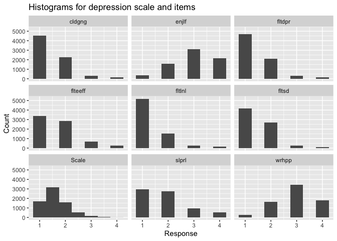
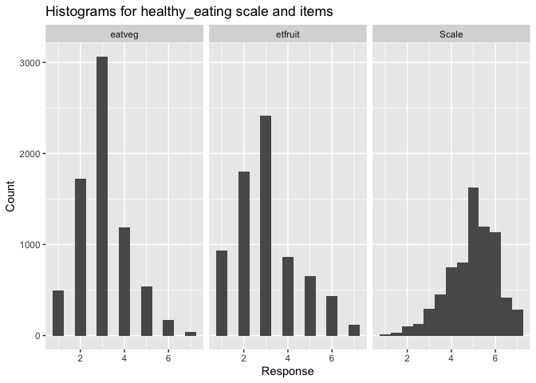

<!-- README.md is generated from README.Rmd. Please edit that file -->

# timesaveR 

<!-- badges: start -->

[](https://github.com/LukasWallrich/timesaveR/actions)
[](https://app.codecov.io/gh/LukasWallrich/timesaveR?branch=master)
<!-- badges: end -->

This package aims to speed up research projects in social psychology
(and related fields). For that, it primarily includes some functions
that help lay the groundwork and others that facilitate the reporting of
results.

Among others, the package can help with the following:

- **Creating scales**, including reverse-coding and reporting their
  internal consistency,
- **Creating correlation tables** in APA style, including descriptive
  statistics and confidence intervals, and an option to use survey
  weights, multiple imputation or full-information maximum-likelihood
  estimation
- **Creating regression tables** comparing standardised and
  non-standardised regression coefficients, and comparing the F-change
  between two nested models
- **Formatting numbers for statistical reporting**, including rounding
  with trailing zeros, or displaying numbers as *p*-values or as
  confidence intervals
- **Data entry and transfer**, for quick interactive use. This includes
  splitting clipboard content into vectors, converting tibbles to
  tribble code, or obtaining nicely formatted code and results to paste
  into another application

## Why use this package?

There are many packages that support data analysis and reporting. For
instance, the `psych` package offers functions to create scales, while
the `modelsummary` package offers options to create customisable tables
in a wide variety of output format. They power many of the functions
offered here ‘under the hood.’

`apa` and `papaja` are two packages that directly support the reporting
of results in APA style - they can complement this package well.
However, none of the existing offered quite what we needed. This package

- takes an end-to-end view of the data analysis process, streamlining
  time-consuming steps at various stages
- offers analysis templates that make it easy to get started,
  particularly for R novices,
- prioritises publication-readiness and good reporting practices over
  customisability in creating tables and charts
- integrates with the `tidyverse` by supporting tidy evaluation and
  returning tibbles where possible

## Status and scope

timesaveR grew out of our own research and teaching workflows, and that
is what it is maintained for: it is a personal/lab toolkit, distributed
via GitHub rather than CRAN (a deliberate choice, given the package’s
broad dependency surface and workflow-specific scope). It is tested and
actively used, but expect an opinionated toolkit rather than a
general-purpose product.

Its most distinctive parts are the pieces that are hard to find
elsewhere in one place: **scale construction with reliability and
reverse-coding** (including for survey-weighted and multiply-imputed
data), **survey-weighted and multiple-imputation descriptives,
correlation tables and t-tests**, and **mediation/moderated-mediation
models with publication-ready, annotated path diagrams**. For general
model tables, effect sizes, or full APA manuscripts, packages such as
`modelsummary`, `gtsummary`, `easystats`, `psych` and `papaja` are
excellent - timesaveR aims to complement them, not replace them.

# Installation

You can install timesaveR from GitHub with the command below. If you do
not have the `remotes`-package installed, run
`install.packages("remotes")` first.

``` r
remotes::install_github('lukaswallrich/timesaveR')
```

(timesaveR is not on CRAN, and this is currently not planned - see
above.)

# Get started

There are many functions in the package, and we will create vignettes
detailing various use cases. However, the following can give you an
initial flavor. The examples use data from the European Social Survey
Wave 7 (2014). Here, I ignore survey weights. However, the package
offers similar functions for analysing weighted survey data, which are
explained in the [survey data vignette](doc/survey_functions.html).

## Load the package

(I also load `dplyr` since that is the recommended usage - of course,
there are base R alternatives for all of the steps.)

``` r
library(dplyr)
#> 
#> Attaching package: 'dplyr'
#> The following objects are masked from 'package:stats':
#> 
#>     filter, lag
#> The following objects are masked from 'package:base':
#> 
#>     intersect, setdiff, setequal, union
library(timesaveR)
#> Note re timesaveR: Many functions in this package are alpha-versions - please treat results with care and report bugs and desired features.
```

## Create scales

Let’s create scales for health behaviours and depressive symptoms, each
including some reverse coding.

``` r
scales <- list(
  depression = c("fltdpr", "flteeff", "slprl", "wrhpp", "fltlnl", 
                 "enjlf", "fltsd", "cldgng"),
  healthy_eating = c("etfruit", "eatveg")
  )
  
scales_reverse <- list(
  depression = c("wrhpp", "enjlf"),
  healthy_eating = c("etfruit", "eatveg")
)

scales <- make_scales(ess_health, items = scales, reversed = scales_reverse)
#> The following scales will be calculated with specified reverse coding:
#> depression, healthy_eating
```



``` r

#Check descriptives, including reliability
scales$descriptives
#> # A tibble: 2 × 10
#>   Scale      n_items reliability reliability_method  mean    SD reversed rev_min
#>   <chr>        <int>       <dbl> <chr>              <dbl> <dbl> <chr>      <dbl>
#> 1 depression       8       0.802 cronbachs_alpha     1.67 0.484 wrhpp e…       1
#> 2 healthy_e…       2       0.658 spearman_brown      4.97 1.11  etfruit…       1
#> # ℹ 2 more variables: rev_max <dbl>, text <chr>

#Add scale scores to dataset
ess_health <- bind_cols(ess_health, scales$scores)
```

## Report correlations and descriptive statistics

Next, we are often interested in descriptive statistics, variable
distributions and correlations.

``` r
ess_health %>% select(agea, health, depression, healthy_eating) %>% 
    cor_matrix() %>% report_cor_table()
```

<div id="urujongvsf" style="padding-left:0px;padding-right:0px;padding-top:10px;padding-bottom:10px;overflow-x:auto;overflow-y:auto;width:auto;height:auto;">
<style>#urujongvsf table {
  font-family: times, system-ui, 'Segoe UI', Roboto, Helvetica, Arial, sans-serif, 'Apple Color Emoji', 'Segoe UI Emoji', 'Segoe UI Symbol', 'Noto Color Emoji';
  -webkit-font-smoothing: antialiased;
  -moz-osx-font-smoothing: grayscale;
}
&#10;#urujongvsf thead, #urujongvsf tbody, #urujongvsf tfoot, #urujongvsf tr, #urujongvsf td, #urujongvsf th {
  border-style: none;
}
&#10;#urujongvsf p {
  margin: 0;
  padding: 0;
}
&#10;#urujongvsf .gt_table {
  display: table;
  border-collapse: collapse;
  line-height: normal;
  margin-left: auto;
  margin-right: auto;
  color: #333333;
  font-size: 12px;
  font-weight: normal;
  font-style: normal;
  background-color: #FFFFFF;
  width: auto;
  border-top-style: none;
  border-top-width: 2px;
  border-top-color: #FFFFFF;
  border-right-style: none;
  border-right-width: 2px;
  border-right-color: #D3D3D3;
  border-bottom-style: none;
  border-bottom-width: 2px;
  border-bottom-color: #A8A8A8;
  border-left-style: none;
  border-left-width: 2px;
  border-left-color: #D3D3D3;
}
&#10;#urujongvsf .gt_caption {
  padding-top: 4px;
  padding-bottom: 4px;
}
&#10;#urujongvsf .gt_title {
  color: #333333;
  font-size: 12px;
  font-weight: initial;
  padding-top: 4px;
  padding-bottom: 4px;
  padding-left: 5px;
  padding-right: 5px;
  border-bottom-color: #FFFFFF;
  border-bottom-width: 0;
}
&#10;#urujongvsf .gt_subtitle {
  color: #333333;
  font-size: 12px;
  font-weight: initial;
  padding-top: 3px;
  padding-bottom: 5px;
  padding-left: 5px;
  padding-right: 5px;
  border-top-color: #FFFFFF;
  border-top-width: 0;
}
&#10;#urujongvsf .gt_heading {
  background-color: #FFFFFF;
  text-align: center;
  border-bottom-color: #FFFFFF;
  border-left-style: none;
  border-left-width: 1px;
  border-left-color: #D3D3D3;
  border-right-style: none;
  border-right-width: 1px;
  border-right-color: #D3D3D3;
}
&#10;#urujongvsf .gt_bottom_border {
  border-bottom-style: solid;
  border-bottom-width: 2px;
  border-bottom-color: #000000;
}
&#10;#urujongvsf .gt_col_headings {
  border-top-style: none;
  border-top-width: 2px;
  border-top-color: #D3D3D3;
  border-bottom-style: solid;
  border-bottom-width: 1px;
  border-bottom-color: #000000;
  border-left-style: none;
  border-left-width: 1px;
  border-left-color: #D3D3D3;
  border-right-style: none;
  border-right-width: 1px;
  border-right-color: #D3D3D3;
}
&#10;#urujongvsf .gt_col_heading {
  color: #333333;
  background-color: #FFFFFF;
  font-size: 100%;
  font-weight: normal;
  text-transform: inherit;
  border-left-style: none;
  border-left-width: 1px;
  border-left-color: #D3D3D3;
  border-right-style: none;
  border-right-width: 1px;
  border-right-color: #D3D3D3;
  vertical-align: bottom;
  padding-top: 5px;
  padding-bottom: 6px;
  padding-left: 5px;
  padding-right: 5px;
  overflow-x: hidden;
}
&#10;#urujongvsf .gt_column_spanner_outer {
  color: #333333;
  background-color: #FFFFFF;
  font-size: 100%;
  font-weight: normal;
  text-transform: inherit;
  padding-top: 0;
  padding-bottom: 0;
  padding-left: 4px;
  padding-right: 4px;
}
&#10;#urujongvsf .gt_column_spanner_outer:first-child {
  padding-left: 0;
}
&#10;#urujongvsf .gt_column_spanner_outer:last-child {
  padding-right: 0;
}
&#10;#urujongvsf .gt_column_spanner {
  border-bottom-style: solid;
  border-bottom-width: 1px;
  border-bottom-color: #000000;
  vertical-align: bottom;
  padding-top: 5px;
  padding-bottom: 5px;
  overflow-x: hidden;
  display: inline-block;
  width: 100%;
}
&#10;#urujongvsf .gt_spanner_row {
  border-bottom-style: hidden;
}
&#10;#urujongvsf .gt_group_heading {
  padding-top: 8px;
  padding-bottom: 8px;
  padding-left: 5px;
  padding-right: 5px;
  color: #333333;
  background-color: #FFFFFF;
  font-size: 100%;
  font-weight: initial;
  text-transform: inherit;
  border-top-style: none;
  border-top-width: 2px;
  border-top-color: #D3D3D3;
  border-bottom-style: none;
  border-bottom-width: 2px;
  border-bottom-color: #D3D3D3;
  border-left-style: none;
  border-left-width: 1px;
  border-left-color: #D3D3D3;
  border-right-style: none;
  border-right-width: 1px;
  border-right-color: #D3D3D3;
  vertical-align: middle;
  text-align: left;
}
&#10;#urujongvsf .gt_empty_group_heading {
  padding: 0.5px;
  color: #333333;
  background-color: #FFFFFF;
  font-size: 100%;
  font-weight: initial;
  border-top-style: none;
  border-top-width: 2px;
  border-top-color: #D3D3D3;
  border-bottom-style: none;
  border-bottom-width: 2px;
  border-bottom-color: #D3D3D3;
  vertical-align: middle;
}
&#10;#urujongvsf .gt_from_md > :first-child {
  margin-top: 0;
}
&#10;#urujongvsf .gt_from_md > :last-child {
  margin-bottom: 0;
}
&#10;#urujongvsf .gt_row {
  padding-top: 8px;
  padding-bottom: 8px;
  padding-left: 5px;
  padding-right: 5px;
  margin: 10px;
  border-top-style: none;
  border-top-width: 1px;
  border-top-color: #FFFFFF;
  border-left-style: none;
  border-left-width: 1px;
  border-left-color: #D3D3D3;
  border-right-style: none;
  border-right-width: 1px;
  border-right-color: #D3D3D3;
  vertical-align: middle;
  overflow-x: hidden;
}
&#10;#urujongvsf .gt_stub {
  color: #333333;
  background-color: #FFFFFF;
  font-size: 100%;
  font-weight: initial;
  text-transform: inherit;
  border-right-style: none;
  border-right-width: 2px;
  border-right-color: #D3D3D3;
  padding-left: 5px;
  padding-right: 5px;
}
&#10;#urujongvsf .gt_stub_row_group {
  color: #333333;
  background-color: #FFFFFF;
  font-size: 100%;
  font-weight: initial;
  text-transform: inherit;
  border-right-style: none;
  border-right-width: 2px;
  border-right-color: #D3D3D3;
  padding-left: 5px;
  padding-right: 5px;
  vertical-align: top;
}
&#10;#urujongvsf .gt_row_group_first td {
  border-top-width: 2px;
}
&#10;#urujongvsf .gt_row_group_first th {
  border-top-width: 2px;
}
&#10;#urujongvsf .gt_summary_row {
  color: #333333;
  background-color: #FFFFFF;
  text-transform: inherit;
  padding-top: 8px;
  padding-bottom: 8px;
  padding-left: 5px;
  padding-right: 5px;
}
&#10;#urujongvsf .gt_first_summary_row {
  border-top-style: none;
  border-top-color: #D3D3D3;
}
&#10;#urujongvsf .gt_first_summary_row.thick {
  border-top-width: 2px;
}
&#10;#urujongvsf .gt_last_summary_row {
  padding-top: 8px;
  padding-bottom: 8px;
  padding-left: 5px;
  padding-right: 5px;
  border-bottom-style: none;
  border-bottom-width: 2px;
  border-bottom-color: #D3D3D3;
}
&#10;#urujongvsf .gt_grand_summary_row {
  color: #333333;
  background-color: #FFFFFF;
  text-transform: inherit;
  padding-top: 8px;
  padding-bottom: 8px;
  padding-left: 5px;
  padding-right: 5px;
}
&#10;#urujongvsf .gt_first_grand_summary_row {
  padding-top: 8px;
  padding-bottom: 8px;
  padding-left: 5px;
  padding-right: 5px;
  border-top-style: none;
  border-top-width: 6px;
  border-top-color: #D3D3D3;
}
&#10;#urujongvsf .gt_last_grand_summary_row_top {
  padding-top: 8px;
  padding-bottom: 8px;
  padding-left: 5px;
  padding-right: 5px;
  border-bottom-style: none;
  border-bottom-width: 6px;
  border-bottom-color: #D3D3D3;
}
&#10;#urujongvsf .gt_striped {
  background-color: rgba(128, 128, 128, 0.05);
}
&#10;#urujongvsf .gt_table_body {
  border-top-style: solid;
  border-top-width: 1px;
  border-top-color: #000000;
  border-bottom-style: solid;
  border-bottom-width: 1px;
  border-bottom-color: #000000;
}
&#10;#urujongvsf .gt_footnotes {
  color: #333333;
  background-color: #FFFFFF;
  border-bottom-style: none;
  border-bottom-width: 2px;
  border-bottom-color: #D3D3D3;
  border-left-style: none;
  border-left-width: 2px;
  border-left-color: #D3D3D3;
  border-right-style: none;
  border-right-width: 2px;
  border-right-color: #D3D3D3;
}
&#10;#urujongvsf .gt_footnote {
  margin: 0px;
  font-size: 90%;
  padding-top: 4px;
  padding-bottom: 4px;
  padding-left: 5px;
  padding-right: 5px;
}
&#10;#urujongvsf .gt_sourcenotes {
  color: #333333;
  background-color: #FFFFFF;
  border-bottom-style: none;
  border-bottom-width: 2px;
  border-bottom-color: #D3D3D3;
  border-left-style: none;
  border-left-width: 2px;
  border-left-color: #D3D3D3;
  border-right-style: none;
  border-right-width: 2px;
  border-right-color: #D3D3D3;
}
&#10;#urujongvsf .gt_sourcenote {
  font-size: 90%;
  padding-top: 4px;
  padding-bottom: 4px;
  padding-left: 5px;
  padding-right: 5px;
}
&#10;#urujongvsf .gt_left {
  text-align: left;
}
&#10;#urujongvsf .gt_center {
  text-align: center;
}
&#10;#urujongvsf .gt_right {
  text-align: right;
  font-variant-numeric: tabular-nums;
}
&#10;#urujongvsf .gt_font_normal {
  font-weight: normal;
}
&#10;#urujongvsf .gt_font_bold {
  font-weight: bold;
}
&#10;#urujongvsf .gt_font_italic {
  font-style: italic;
}
&#10;#urujongvsf .gt_super {
  font-size: 65%;
}
&#10;#urujongvsf .gt_footnote_marks {
  font-size: 75%;
  vertical-align: 0.4em;
  position: initial;
}
&#10;#urujongvsf .gt_asterisk {
  font-size: 100%;
  vertical-align: 0;
}
&#10;#urujongvsf .gt_indent_1 {
  text-indent: 5px;
}
&#10;#urujongvsf .gt_indent_2 {
  text-indent: 10px;
}
&#10;#urujongvsf .gt_indent_3 {
  text-indent: 15px;
}
&#10;#urujongvsf .gt_indent_4 {
  text-indent: 20px;
}
&#10;#urujongvsf .gt_indent_5 {
  text-indent: 25px;
}
&#10;#urujongvsf .katex-display {
  display: inline-flex !important;
  margin-bottom: 0.75em !important;
}
&#10;#urujongvsf div.Reactable > div.rt-table > div.rt-thead > div.rt-tr.rt-tr-group-header > div.rt-th-group:after {
  height: 0px !important;
}
</style>
<table class="gt_table" data-quarto-disable-processing="false" data-quarto-bootstrap="false">
  <thead>
    <tr class="gt_col_headings">
      <th class="gt_col_heading gt_columns_bottom_border gt_left" rowspan="1" colspan="1" scope="col" id="Variable"><span class='gt_from_md'>Variable</span></th>
      <th class="gt_col_heading gt_columns_bottom_border gt_right" rowspan="1" colspan="1" scope="col" id="desc"><span class='gt_from_md'><em>M (SD)</em></span></th>
      <th class="gt_col_heading gt_columns_bottom_border gt_left" rowspan="1" colspan="1" scope="col" id="a1"><span class='gt_from_md'>1</span></th>
      <th class="gt_col_heading gt_columns_bottom_border gt_left" rowspan="1" colspan="1" scope="col" id="a2"><span class='gt_from_md'>2</span></th>
      <th class="gt_col_heading gt_columns_bottom_border gt_left" rowspan="1" colspan="1" scope="col" id="a3"><span class='gt_from_md'>3</span></th>
    </tr>
  </thead>
  <tbody class="gt_table_body">
    <tr><td headers="Variable" class="gt_row gt_left"><span class='gt_from_md'><ol>
<li>agea</li>
</ol>
</span></td>
<td headers="desc" class="gt_row gt_right"><span class='gt_from_md'>50.61 (18.51)</span></td>
<td headers="1" class="gt_row gt_left"><span class='gt_from_md'> <br /> </span></td>
<td headers="2" class="gt_row gt_left"><span class='gt_from_md'> <br /> </span></td>
<td headers="3" class="gt_row gt_left"><span class='gt_from_md'> <br /> </span></td></tr>
    <tr><td headers="Variable" class="gt_row gt_left"><span class='gt_from_md'><ol start="2">
<li>health</li>
</ol>
</span></td>
<td headers="desc" class="gt_row gt_right"><span class='gt_from_md'>2.26 (0.92)</span></td>
<td headers="1" class="gt_row gt_left"><span class='gt_from_md'>.28 ***<br /><span style="font-size:80%">[0.25, 0.30]</span></span></td>
<td headers="2" class="gt_row gt_left"><span class='gt_from_md'> <br /> </span></td>
<td headers="3" class="gt_row gt_left"><span class='gt_from_md'> <br /> </span></td></tr>
    <tr><td headers="Variable" class="gt_row gt_left"><span class='gt_from_md'><ol start="3">
<li>depression</li>
</ol>
</span></td>
<td headers="desc" class="gt_row gt_right"><span class='gt_from_md'>1.67 (0.48)</span></td>
<td headers="1" class="gt_row gt_left"><span class='gt_from_md'>.03 *<br /><span style="font-size:80%">[0.00, 0.05]</span></span></td>
<td headers="2" class="gt_row gt_left"><span class='gt_from_md'>.42 ***<br /><span style="font-size:80%">[0.40, 0.44]</span></span></td>
<td headers="3" class="gt_row gt_left"><span class='gt_from_md'> <br /> </span></td></tr>
    <tr><td headers="Variable" class="gt_row gt_left"><span class='gt_from_md'><ol start="4">
<li>healthy_eating</li>
</ol>
</span></td>
<td headers="desc" class="gt_row gt_right"><span class='gt_from_md'>4.97 (1.11)</span></td>
<td headers="1" class="gt_row gt_left"><span class='gt_from_md'>.17 ***<br /><span style="font-size:80%">[0.15, 0.19]</span></span></td>
<td headers="2" class="gt_row gt_left"><span class='gt_from_md'>-.09 ***<br /><span style="font-size:80%">[-0.11, -0.07]</span></span></td>
<td headers="3" class="gt_row gt_left"><span class='gt_from_md'>-.13 ***<br /><span style="font-size:80%">[-0.15, -0.10]</span></span></td></tr>
  </tbody>
  <tfoot>
    <tr class="gt_sourcenotes">
      <td class="gt_sourcenote" colspan="5"><span class='gt_from_md'><em>M</em> and <em>SD</em> are used to represent mean and standard deviation, respectively.</span></td>
    </tr>
    <tr class="gt_sourcenotes">
      <td class="gt_sourcenote" colspan="5"><span class='gt_from_md'>Values in square brackets indicate the confidence interval for each correlation.</span></td>
    </tr>
    <tr class="gt_sourcenotes">
      <td class="gt_sourcenote" colspan="5"><span class='gt_from_md'>† <em>p</em> &lt; .1, * <em>p</em> &lt; .05, ** <em>p</em> &lt; .01, *** <em>p</em> &lt; .001</span></td>
    </tr>
  </tfoot>
</table>
</div>

``` r

#It is often helpful to rename variables in this step
#Use get_rename_tribbles(ess_health) to get most of this code
var_renames <- tibble::tribble(
    ~old,     ~new,     
    "agea",   "Age",  
    "health",  "Poor health",
    "depression",  "Depression",
    "healthy_eating",  "Healthy eating",
)

#A rename tibble or vector automatically only selects the variables included into it
ess_health %>% cor_matrix(var_names = var_renames) %>% report_cor_table()
```

<div id="ialahilteb" style="padding-left:0px;padding-right:0px;padding-top:10px;padding-bottom:10px;overflow-x:auto;overflow-y:auto;width:auto;height:auto;">
<style>#ialahilteb table {
  font-family: times, system-ui, 'Segoe UI', Roboto, Helvetica, Arial, sans-serif, 'Apple Color Emoji', 'Segoe UI Emoji', 'Segoe UI Symbol', 'Noto Color Emoji';
  -webkit-font-smoothing: antialiased;
  -moz-osx-font-smoothing: grayscale;
}
&#10;#ialahilteb thead, #ialahilteb tbody, #ialahilteb tfoot, #ialahilteb tr, #ialahilteb td, #ialahilteb th {
  border-style: none;
}
&#10;#ialahilteb p {
  margin: 0;
  padding: 0;
}
&#10;#ialahilteb .gt_table {
  display: table;
  border-collapse: collapse;
  line-height: normal;
  margin-left: auto;
  margin-right: auto;
  color: #333333;
  font-size: 12px;
  font-weight: normal;
  font-style: normal;
  background-color: #FFFFFF;
  width: auto;
  border-top-style: none;
  border-top-width: 2px;
  border-top-color: #FFFFFF;
  border-right-style: none;
  border-right-width: 2px;
  border-right-color: #D3D3D3;
  border-bottom-style: none;
  border-bottom-width: 2px;
  border-bottom-color: #A8A8A8;
  border-left-style: none;
  border-left-width: 2px;
  border-left-color: #D3D3D3;
}
&#10;#ialahilteb .gt_caption {
  padding-top: 4px;
  padding-bottom: 4px;
}
&#10;#ialahilteb .gt_title {
  color: #333333;
  font-size: 12px;
  font-weight: initial;
  padding-top: 4px;
  padding-bottom: 4px;
  padding-left: 5px;
  padding-right: 5px;
  border-bottom-color: #FFFFFF;
  border-bottom-width: 0;
}
&#10;#ialahilteb .gt_subtitle {
  color: #333333;
  font-size: 12px;
  font-weight: initial;
  padding-top: 3px;
  padding-bottom: 5px;
  padding-left: 5px;
  padding-right: 5px;
  border-top-color: #FFFFFF;
  border-top-width: 0;
}
&#10;#ialahilteb .gt_heading {
  background-color: #FFFFFF;
  text-align: center;
  border-bottom-color: #FFFFFF;
  border-left-style: none;
  border-left-width: 1px;
  border-left-color: #D3D3D3;
  border-right-style: none;
  border-right-width: 1px;
  border-right-color: #D3D3D3;
}
&#10;#ialahilteb .gt_bottom_border {
  border-bottom-style: solid;
  border-bottom-width: 2px;
  border-bottom-color: #000000;
}
&#10;#ialahilteb .gt_col_headings {
  border-top-style: none;
  border-top-width: 2px;
  border-top-color: #D3D3D3;
  border-bottom-style: solid;
  border-bottom-width: 1px;
  border-bottom-color: #000000;
  border-left-style: none;
  border-left-width: 1px;
  border-left-color: #D3D3D3;
  border-right-style: none;
  border-right-width: 1px;
  border-right-color: #D3D3D3;
}
&#10;#ialahilteb .gt_col_heading {
  color: #333333;
  background-color: #FFFFFF;
  font-size: 100%;
  font-weight: normal;
  text-transform: inherit;
  border-left-style: none;
  border-left-width: 1px;
  border-left-color: #D3D3D3;
  border-right-style: none;
  border-right-width: 1px;
  border-right-color: #D3D3D3;
  vertical-align: bottom;
  padding-top: 5px;
  padding-bottom: 6px;
  padding-left: 5px;
  padding-right: 5px;
  overflow-x: hidden;
}
&#10;#ialahilteb .gt_column_spanner_outer {
  color: #333333;
  background-color: #FFFFFF;
  font-size: 100%;
  font-weight: normal;
  text-transform: inherit;
  padding-top: 0;
  padding-bottom: 0;
  padding-left: 4px;
  padding-right: 4px;
}
&#10;#ialahilteb .gt_column_spanner_outer:first-child {
  padding-left: 0;
}
&#10;#ialahilteb .gt_column_spanner_outer:last-child {
  padding-right: 0;
}
&#10;#ialahilteb .gt_column_spanner {
  border-bottom-style: solid;
  border-bottom-width: 1px;
  border-bottom-color: #000000;
  vertical-align: bottom;
  padding-top: 5px;
  padding-bottom: 5px;
  overflow-x: hidden;
  display: inline-block;
  width: 100%;
}
&#10;#ialahilteb .gt_spanner_row {
  border-bottom-style: hidden;
}
&#10;#ialahilteb .gt_group_heading {
  padding-top: 8px;
  padding-bottom: 8px;
  padding-left: 5px;
  padding-right: 5px;
  color: #333333;
  background-color: #FFFFFF;
  font-size: 100%;
  font-weight: initial;
  text-transform: inherit;
  border-top-style: none;
  border-top-width: 2px;
  border-top-color: #D3D3D3;
  border-bottom-style: none;
  border-bottom-width: 2px;
  border-bottom-color: #D3D3D3;
  border-left-style: none;
  border-left-width: 1px;
  border-left-color: #D3D3D3;
  border-right-style: none;
  border-right-width: 1px;
  border-right-color: #D3D3D3;
  vertical-align: middle;
  text-align: left;
}
&#10;#ialahilteb .gt_empty_group_heading {
  padding: 0.5px;
  color: #333333;
  background-color: #FFFFFF;
  font-size: 100%;
  font-weight: initial;
  border-top-style: none;
  border-top-width: 2px;
  border-top-color: #D3D3D3;
  border-bottom-style: none;
  border-bottom-width: 2px;
  border-bottom-color: #D3D3D3;
  vertical-align: middle;
}
&#10;#ialahilteb .gt_from_md > :first-child {
  margin-top: 0;
}
&#10;#ialahilteb .gt_from_md > :last-child {
  margin-bottom: 0;
}
&#10;#ialahilteb .gt_row {
  padding-top: 8px;
  padding-bottom: 8px;
  padding-left: 5px;
  padding-right: 5px;
  margin: 10px;
  border-top-style: none;
  border-top-width: 1px;
  border-top-color: #FFFFFF;
  border-left-style: none;
  border-left-width: 1px;
  border-left-color: #D3D3D3;
  border-right-style: none;
  border-right-width: 1px;
  border-right-color: #D3D3D3;
  vertical-align: middle;
  overflow-x: hidden;
}
&#10;#ialahilteb .gt_stub {
  color: #333333;
  background-color: #FFFFFF;
  font-size: 100%;
  font-weight: initial;
  text-transform: inherit;
  border-right-style: none;
  border-right-width: 2px;
  border-right-color: #D3D3D3;
  padding-left: 5px;
  padding-right: 5px;
}
&#10;#ialahilteb .gt_stub_row_group {
  color: #333333;
  background-color: #FFFFFF;
  font-size: 100%;
  font-weight: initial;
  text-transform: inherit;
  border-right-style: none;
  border-right-width: 2px;
  border-right-color: #D3D3D3;
  padding-left: 5px;
  padding-right: 5px;
  vertical-align: top;
}
&#10;#ialahilteb .gt_row_group_first td {
  border-top-width: 2px;
}
&#10;#ialahilteb .gt_row_group_first th {
  border-top-width: 2px;
}
&#10;#ialahilteb .gt_summary_row {
  color: #333333;
  background-color: #FFFFFF;
  text-transform: inherit;
  padding-top: 8px;
  padding-bottom: 8px;
  padding-left: 5px;
  padding-right: 5px;
}
&#10;#ialahilteb .gt_first_summary_row {
  border-top-style: none;
  border-top-color: #D3D3D3;
}
&#10;#ialahilteb .gt_first_summary_row.thick {
  border-top-width: 2px;
}
&#10;#ialahilteb .gt_last_summary_row {
  padding-top: 8px;
  padding-bottom: 8px;
  padding-left: 5px;
  padding-right: 5px;
  border-bottom-style: none;
  border-bottom-width: 2px;
  border-bottom-color: #D3D3D3;
}
&#10;#ialahilteb .gt_grand_summary_row {
  color: #333333;
  background-color: #FFFFFF;
  text-transform: inherit;
  padding-top: 8px;
  padding-bottom: 8px;
  padding-left: 5px;
  padding-right: 5px;
}
&#10;#ialahilteb .gt_first_grand_summary_row {
  padding-top: 8px;
  padding-bottom: 8px;
  padding-left: 5px;
  padding-right: 5px;
  border-top-style: none;
  border-top-width: 6px;
  border-top-color: #D3D3D3;
}
&#10;#ialahilteb .gt_last_grand_summary_row_top {
  padding-top: 8px;
  padding-bottom: 8px;
  padding-left: 5px;
  padding-right: 5px;
  border-bottom-style: none;
  border-bottom-width: 6px;
  border-bottom-color: #D3D3D3;
}
&#10;#ialahilteb .gt_striped {
  background-color: rgba(128, 128, 128, 0.05);
}
&#10;#ialahilteb .gt_table_body {
  border-top-style: solid;
  border-top-width: 1px;
  border-top-color: #000000;
  border-bottom-style: solid;
  border-bottom-width: 1px;
  border-bottom-color: #000000;
}
&#10;#ialahilteb .gt_footnotes {
  color: #333333;
  background-color: #FFFFFF;
  border-bottom-style: none;
  border-bottom-width: 2px;
  border-bottom-color: #D3D3D3;
  border-left-style: none;
  border-left-width: 2px;
  border-left-color: #D3D3D3;
  border-right-style: none;
  border-right-width: 2px;
  border-right-color: #D3D3D3;
}
&#10;#ialahilteb .gt_footnote {
  margin: 0px;
  font-size: 90%;
  padding-top: 4px;
  padding-bottom: 4px;
  padding-left: 5px;
  padding-right: 5px;
}
&#10;#ialahilteb .gt_sourcenotes {
  color: #333333;
  background-color: #FFFFFF;
  border-bottom-style: none;
  border-bottom-width: 2px;
  border-bottom-color: #D3D3D3;
  border-left-style: none;
  border-left-width: 2px;
  border-left-color: #D3D3D3;
  border-right-style: none;
  border-right-width: 2px;
  border-right-color: #D3D3D3;
}
&#10;#ialahilteb .gt_sourcenote {
  font-size: 90%;
  padding-top: 4px;
  padding-bottom: 4px;
  padding-left: 5px;
  padding-right: 5px;
}
&#10;#ialahilteb .gt_left {
  text-align: left;
}
&#10;#ialahilteb .gt_center {
  text-align: center;
}
&#10;#ialahilteb .gt_right {
  text-align: right;
  font-variant-numeric: tabular-nums;
}
&#10;#ialahilteb .gt_font_normal {
  font-weight: normal;
}
&#10;#ialahilteb .gt_font_bold {
  font-weight: bold;
}
&#10;#ialahilteb .gt_font_italic {
  font-style: italic;
}
&#10;#ialahilteb .gt_super {
  font-size: 65%;
}
&#10;#ialahilteb .gt_footnote_marks {
  font-size: 75%;
  vertical-align: 0.4em;
  position: initial;
}
&#10;#ialahilteb .gt_asterisk {
  font-size: 100%;
  vertical-align: 0;
}
&#10;#ialahilteb .gt_indent_1 {
  text-indent: 5px;
}
&#10;#ialahilteb .gt_indent_2 {
  text-indent: 10px;
}
&#10;#ialahilteb .gt_indent_3 {
  text-indent: 15px;
}
&#10;#ialahilteb .gt_indent_4 {
  text-indent: 20px;
}
&#10;#ialahilteb .gt_indent_5 {
  text-indent: 25px;
}
&#10;#ialahilteb .katex-display {
  display: inline-flex !important;
  margin-bottom: 0.75em !important;
}
&#10;#ialahilteb div.Reactable > div.rt-table > div.rt-thead > div.rt-tr.rt-tr-group-header > div.rt-th-group:after {
  height: 0px !important;
}
</style>
<table class="gt_table" data-quarto-disable-processing="false" data-quarto-bootstrap="false">
  <thead>
    <tr class="gt_col_headings">
      <th class="gt_col_heading gt_columns_bottom_border gt_left" rowspan="1" colspan="1" scope="col" id="Variable"><span class='gt_from_md'>Variable</span></th>
      <th class="gt_col_heading gt_columns_bottom_border gt_right" rowspan="1" colspan="1" scope="col" id="desc"><span class='gt_from_md'><em>M (SD)</em></span></th>
      <th class="gt_col_heading gt_columns_bottom_border gt_left" rowspan="1" colspan="1" scope="col" id="a1"><span class='gt_from_md'>1</span></th>
      <th class="gt_col_heading gt_columns_bottom_border gt_left" rowspan="1" colspan="1" scope="col" id="a2"><span class='gt_from_md'>2</span></th>
      <th class="gt_col_heading gt_columns_bottom_border gt_left" rowspan="1" colspan="1" scope="col" id="a3"><span class='gt_from_md'>3</span></th>
    </tr>
  </thead>
  <tbody class="gt_table_body">
    <tr><td headers="Variable" class="gt_row gt_left"><span class='gt_from_md'><ol>
<li>Age</li>
</ol>
</span></td>
<td headers="desc" class="gt_row gt_right"><span class='gt_from_md'>50.61 (18.51)</span></td>
<td headers="1" class="gt_row gt_left"><span class='gt_from_md'> <br /> </span></td>
<td headers="2" class="gt_row gt_left"><span class='gt_from_md'> <br /> </span></td>
<td headers="3" class="gt_row gt_left"><span class='gt_from_md'> <br /> </span></td></tr>
    <tr><td headers="Variable" class="gt_row gt_left"><span class='gt_from_md'><ol start="2">
<li>Poor health</li>
</ol>
</span></td>
<td headers="desc" class="gt_row gt_right"><span class='gt_from_md'>2.26 (0.92)</span></td>
<td headers="1" class="gt_row gt_left"><span class='gt_from_md'>.28 ***<br /><span style="font-size:80%">[0.25, 0.30]</span></span></td>
<td headers="2" class="gt_row gt_left"><span class='gt_from_md'> <br /> </span></td>
<td headers="3" class="gt_row gt_left"><span class='gt_from_md'> <br /> </span></td></tr>
    <tr><td headers="Variable" class="gt_row gt_left"><span class='gt_from_md'><ol start="3">
<li>Depression</li>
</ol>
</span></td>
<td headers="desc" class="gt_row gt_right"><span class='gt_from_md'>1.67 (0.48)</span></td>
<td headers="1" class="gt_row gt_left"><span class='gt_from_md'>.03 *<br /><span style="font-size:80%">[0.00, 0.05]</span></span></td>
<td headers="2" class="gt_row gt_left"><span class='gt_from_md'>.42 ***<br /><span style="font-size:80%">[0.40, 0.44]</span></span></td>
<td headers="3" class="gt_row gt_left"><span class='gt_from_md'> <br /> </span></td></tr>
    <tr><td headers="Variable" class="gt_row gt_left"><span class='gt_from_md'><ol start="4">
<li>Healthy eating</li>
</ol>
</span></td>
<td headers="desc" class="gt_row gt_right"><span class='gt_from_md'>4.97 (1.11)</span></td>
<td headers="1" class="gt_row gt_left"><span class='gt_from_md'>.17 ***<br /><span style="font-size:80%">[0.15, 0.19]</span></span></td>
<td headers="2" class="gt_row gt_left"><span class='gt_from_md'>-.09 ***<br /><span style="font-size:80%">[-0.11, -0.07]</span></span></td>
<td headers="3" class="gt_row gt_left"><span class='gt_from_md'>-.13 ***<br /><span style="font-size:80%">[-0.15, -0.10]</span></span></td></tr>
  </tbody>
  <tfoot>
    <tr class="gt_sourcenotes">
      <td class="gt_sourcenote" colspan="5"><span class='gt_from_md'><em>M</em> and <em>SD</em> are used to represent mean and standard deviation, respectively.</span></td>
    </tr>
    <tr class="gt_sourcenotes">
      <td class="gt_sourcenote" colspan="5"><span class='gt_from_md'>Values in square brackets indicate the confidence interval for each correlation.</span></td>
    </tr>
    <tr class="gt_sourcenotes">
      <td class="gt_sourcenote" colspan="5"><span class='gt_from_md'>† <em>p</em> &lt; .1, * <em>p</em> &lt; .05, ** <em>p</em> &lt; .01, *** <em>p</em> &lt; .001</span></td>
    </tr>
  </tfoot>
</table>
</div>

``` r

#Often, it is also interesting to include variable distributions
ess_health %>% cor_matrix(var_names = var_renames) %>%
    report_cor_table(add_distributions = TRUE, data = ess_health)
```

<div id="ignfvttmdo" style="padding-left:0px;padding-right:0px;padding-top:10px;padding-bottom:10px;overflow-x:auto;overflow-y:auto;width:auto;height:auto;">
<style>#ignfvttmdo table {
  font-family: times, system-ui, 'Segoe UI', Roboto, Helvetica, Arial, sans-serif, 'Apple Color Emoji', 'Segoe UI Emoji', 'Segoe UI Symbol', 'Noto Color Emoji';
  -webkit-font-smoothing: antialiased;
  -moz-osx-font-smoothing: grayscale;
}
&#10;#ignfvttmdo thead, #ignfvttmdo tbody, #ignfvttmdo tfoot, #ignfvttmdo tr, #ignfvttmdo td, #ignfvttmdo th {
  border-style: none;
}
&#10;#ignfvttmdo p {
  margin: 0;
  padding: 0;
}
&#10;#ignfvttmdo .gt_table {
  display: table;
  border-collapse: collapse;
  line-height: normal;
  margin-left: auto;
  margin-right: auto;
  color: #333333;
  font-size: 12px;
  font-weight: normal;
  font-style: normal;
  background-color: #FFFFFF;
  width: auto;
  border-top-style: none;
  border-top-width: 2px;
  border-top-color: #FFFFFF;
  border-right-style: none;
  border-right-width: 2px;
  border-right-color: #D3D3D3;
  border-bottom-style: none;
  border-bottom-width: 2px;
  border-bottom-color: #A8A8A8;
  border-left-style: none;
  border-left-width: 2px;
  border-left-color: #D3D3D3;
}
&#10;#ignfvttmdo .gt_caption {
  padding-top: 4px;
  padding-bottom: 4px;
}
&#10;#ignfvttmdo .gt_title {
  color: #333333;
  font-size: 12px;
  font-weight: initial;
  padding-top: 4px;
  padding-bottom: 4px;
  padding-left: 5px;
  padding-right: 5px;
  border-bottom-color: #FFFFFF;
  border-bottom-width: 0;
}
&#10;#ignfvttmdo .gt_subtitle {
  color: #333333;
  font-size: 12px;
  font-weight: initial;
  padding-top: 3px;
  padding-bottom: 5px;
  padding-left: 5px;
  padding-right: 5px;
  border-top-color: #FFFFFF;
  border-top-width: 0;
}
&#10;#ignfvttmdo .gt_heading {
  background-color: #FFFFFF;
  text-align: center;
  border-bottom-color: #FFFFFF;
  border-left-style: none;
  border-left-width: 1px;
  border-left-color: #D3D3D3;
  border-right-style: none;
  border-right-width: 1px;
  border-right-color: #D3D3D3;
}
&#10;#ignfvttmdo .gt_bottom_border {
  border-bottom-style: solid;
  border-bottom-width: 2px;
  border-bottom-color: #000000;
}
&#10;#ignfvttmdo .gt_col_headings {
  border-top-style: none;
  border-top-width: 2px;
  border-top-color: #D3D3D3;
  border-bottom-style: solid;
  border-bottom-width: 1px;
  border-bottom-color: #000000;
  border-left-style: none;
  border-left-width: 1px;
  border-left-color: #D3D3D3;
  border-right-style: none;
  border-right-width: 1px;
  border-right-color: #D3D3D3;
}
&#10;#ignfvttmdo .gt_col_heading {
  color: #333333;
  background-color: #FFFFFF;
  font-size: 100%;
  font-weight: normal;
  text-transform: inherit;
  border-left-style: none;
  border-left-width: 1px;
  border-left-color: #D3D3D3;
  border-right-style: none;
  border-right-width: 1px;
  border-right-color: #D3D3D3;
  vertical-align: bottom;
  padding-top: 5px;
  padding-bottom: 6px;
  padding-left: 5px;
  padding-right: 5px;
  overflow-x: hidden;
}
&#10;#ignfvttmdo .gt_column_spanner_outer {
  color: #333333;
  background-color: #FFFFFF;
  font-size: 100%;
  font-weight: normal;
  text-transform: inherit;
  padding-top: 0;
  padding-bottom: 0;
  padding-left: 4px;
  padding-right: 4px;
}
&#10;#ignfvttmdo .gt_column_spanner_outer:first-child {
  padding-left: 0;
}
&#10;#ignfvttmdo .gt_column_spanner_outer:last-child {
  padding-right: 0;
}
&#10;#ignfvttmdo .gt_column_spanner {
  border-bottom-style: solid;
  border-bottom-width: 1px;
  border-bottom-color: #000000;
  vertical-align: bottom;
  padding-top: 5px;
  padding-bottom: 5px;
  overflow-x: hidden;
  display: inline-block;
  width: 100%;
}
&#10;#ignfvttmdo .gt_spanner_row {
  border-bottom-style: hidden;
}
&#10;#ignfvttmdo .gt_group_heading {
  padding-top: 8px;
  padding-bottom: 8px;
  padding-left: 5px;
  padding-right: 5px;
  color: #333333;
  background-color: #FFFFFF;
  font-size: 100%;
  font-weight: initial;
  text-transform: inherit;
  border-top-style: none;
  border-top-width: 2px;
  border-top-color: #D3D3D3;
  border-bottom-style: none;
  border-bottom-width: 2px;
  border-bottom-color: #D3D3D3;
  border-left-style: none;
  border-left-width: 1px;
  border-left-color: #D3D3D3;
  border-right-style: none;
  border-right-width: 1px;
  border-right-color: #D3D3D3;
  vertical-align: middle;
  text-align: left;
}
&#10;#ignfvttmdo .gt_empty_group_heading {
  padding: 0.5px;
  color: #333333;
  background-color: #FFFFFF;
  font-size: 100%;
  font-weight: initial;
  border-top-style: none;
  border-top-width: 2px;
  border-top-color: #D3D3D3;
  border-bottom-style: none;
  border-bottom-width: 2px;
  border-bottom-color: #D3D3D3;
  vertical-align: middle;
}
&#10;#ignfvttmdo .gt_from_md > :first-child {
  margin-top: 0;
}
&#10;#ignfvttmdo .gt_from_md > :last-child {
  margin-bottom: 0;
}
&#10;#ignfvttmdo .gt_row {
  padding-top: 8px;
  padding-bottom: 8px;
  padding-left: 5px;
  padding-right: 5px;
  margin: 10px;
  border-top-style: none;
  border-top-width: 1px;
  border-top-color: #FFFFFF;
  border-left-style: none;
  border-left-width: 1px;
  border-left-color: #D3D3D3;
  border-right-style: none;
  border-right-width: 1px;
  border-right-color: #D3D3D3;
  vertical-align: middle;
  overflow-x: hidden;
}
&#10;#ignfvttmdo .gt_stub {
  color: #333333;
  background-color: #FFFFFF;
  font-size: 100%;
  font-weight: initial;
  text-transform: inherit;
  border-right-style: none;
  border-right-width: 2px;
  border-right-color: #D3D3D3;
  padding-left: 5px;
  padding-right: 5px;
}
&#10;#ignfvttmdo .gt_stub_row_group {
  color: #333333;
  background-color: #FFFFFF;
  font-size: 100%;
  font-weight: initial;
  text-transform: inherit;
  border-right-style: none;
  border-right-width: 2px;
  border-right-color: #D3D3D3;
  padding-left: 5px;
  padding-right: 5px;
  vertical-align: top;
}
&#10;#ignfvttmdo .gt_row_group_first td {
  border-top-width: 2px;
}
&#10;#ignfvttmdo .gt_row_group_first th {
  border-top-width: 2px;
}
&#10;#ignfvttmdo .gt_summary_row {
  color: #333333;
  background-color: #FFFFFF;
  text-transform: inherit;
  padding-top: 8px;
  padding-bottom: 8px;
  padding-left: 5px;
  padding-right: 5px;
}
&#10;#ignfvttmdo .gt_first_summary_row {
  border-top-style: none;
  border-top-color: #D3D3D3;
}
&#10;#ignfvttmdo .gt_first_summary_row.thick {
  border-top-width: 2px;
}
&#10;#ignfvttmdo .gt_last_summary_row {
  padding-top: 8px;
  padding-bottom: 8px;
  padding-left: 5px;
  padding-right: 5px;
  border-bottom-style: none;
  border-bottom-width: 2px;
  border-bottom-color: #D3D3D3;
}
&#10;#ignfvttmdo .gt_grand_summary_row {
  color: #333333;
  background-color: #FFFFFF;
  text-transform: inherit;
  padding-top: 8px;
  padding-bottom: 8px;
  padding-left: 5px;
  padding-right: 5px;
}
&#10;#ignfvttmdo .gt_first_grand_summary_row {
  padding-top: 8px;
  padding-bottom: 8px;
  padding-left: 5px;
  padding-right: 5px;
  border-top-style: none;
  border-top-width: 6px;
  border-top-color: #D3D3D3;
}
&#10;#ignfvttmdo .gt_last_grand_summary_row_top {
  padding-top: 8px;
  padding-bottom: 8px;
  padding-left: 5px;
  padding-right: 5px;
  border-bottom-style: none;
  border-bottom-width: 6px;
  border-bottom-color: #D3D3D3;
}
&#10;#ignfvttmdo .gt_striped {
  background-color: rgba(128, 128, 128, 0.05);
}
&#10;#ignfvttmdo .gt_table_body {
  border-top-style: solid;
  border-top-width: 1px;
  border-top-color: #000000;
  border-bottom-style: solid;
  border-bottom-width: 1px;
  border-bottom-color: #000000;
}
&#10;#ignfvttmdo .gt_footnotes {
  color: #333333;
  background-color: #FFFFFF;
  border-bottom-style: none;
  border-bottom-width: 2px;
  border-bottom-color: #D3D3D3;
  border-left-style: none;
  border-left-width: 2px;
  border-left-color: #D3D3D3;
  border-right-style: none;
  border-right-width: 2px;
  border-right-color: #D3D3D3;
}
&#10;#ignfvttmdo .gt_footnote {
  margin: 0px;
  font-size: 90%;
  padding-top: 4px;
  padding-bottom: 4px;
  padding-left: 5px;
  padding-right: 5px;
}
&#10;#ignfvttmdo .gt_sourcenotes {
  color: #333333;
  background-color: #FFFFFF;
  border-bottom-style: none;
  border-bottom-width: 2px;
  border-bottom-color: #D3D3D3;
  border-left-style: none;
  border-left-width: 2px;
  border-left-color: #D3D3D3;
  border-right-style: none;
  border-right-width: 2px;
  border-right-color: #D3D3D3;
}
&#10;#ignfvttmdo .gt_sourcenote {
  font-size: 90%;
  padding-top: 4px;
  padding-bottom: 4px;
  padding-left: 5px;
  padding-right: 5px;
}
&#10;#ignfvttmdo .gt_left {
  text-align: left;
}
&#10;#ignfvttmdo .gt_center {
  text-align: center;
}
&#10;#ignfvttmdo .gt_right {
  text-align: right;
  font-variant-numeric: tabular-nums;
}
&#10;#ignfvttmdo .gt_font_normal {
  font-weight: normal;
}
&#10;#ignfvttmdo .gt_font_bold {
  font-weight: bold;
}
&#10;#ignfvttmdo .gt_font_italic {
  font-style: italic;
}
&#10;#ignfvttmdo .gt_super {
  font-size: 65%;
}
&#10;#ignfvttmdo .gt_footnote_marks {
  font-size: 75%;
  vertical-align: 0.4em;
  position: initial;
}
&#10;#ignfvttmdo .gt_asterisk {
  font-size: 100%;
  vertical-align: 0;
}
&#10;#ignfvttmdo .gt_indent_1 {
  text-indent: 5px;
}
&#10;#ignfvttmdo .gt_indent_2 {
  text-indent: 10px;
}
&#10;#ignfvttmdo .gt_indent_3 {
  text-indent: 15px;
}
&#10;#ignfvttmdo .gt_indent_4 {
  text-indent: 20px;
}
&#10;#ignfvttmdo .gt_indent_5 {
  text-indent: 25px;
}
&#10;#ignfvttmdo .katex-display {
  display: inline-flex !important;
  margin-bottom: 0.75em !important;
}
&#10;#ignfvttmdo div.Reactable > div.rt-table > div.rt-thead > div.rt-tr.rt-tr-group-header > div.rt-th-group:after {
  height: 0px !important;
}
</style>
<table class="gt_table" data-quarto-disable-processing="false" data-quarto-bootstrap="false">
  <thead>
    <tr class="gt_col_headings">
      <th class="gt_col_heading gt_columns_bottom_border gt_left" rowspan="1" colspan="1" scope="col" id="Variable"><span class='gt_from_md'>Variable</span></th>
      <th class="gt_col_heading gt_columns_bottom_border gt_right" rowspan="1" colspan="1" scope="col" id="desc"><span class='gt_from_md'><em>M (SD)</em></span></th>
      <th class="gt_col_heading gt_columns_bottom_border gt_right" rowspan="1" colspan="1" scope="col" id="Distributions"><span class='gt_from_md'>Distributions</span></th>
      <th class="gt_col_heading gt_columns_bottom_border gt_left" rowspan="1" colspan="1" scope="col" id="a1"><span class='gt_from_md'>1</span></th>
      <th class="gt_col_heading gt_columns_bottom_border gt_left" rowspan="1" colspan="1" scope="col" id="a2"><span class='gt_from_md'>2</span></th>
      <th class="gt_col_heading gt_columns_bottom_border gt_left" rowspan="1" colspan="1" scope="col" id="a3"><span class='gt_from_md'>3</span></th>
    </tr>
  </thead>
  <tbody class="gt_table_body">
    <tr><td headers="Variable" class="gt_row gt_left"><span class='gt_from_md'><ol>
<li>Age</li>
</ol>
</span></td>
<td headers="desc" class="gt_row gt_right"><span class='gt_from_md'>50.61 (18.51)</span></td>
<td headers="Distributions" class="gt_row gt_right"><img src="" style="height:50px;"></td>
<td headers="1" class="gt_row gt_left"><span class='gt_from_md'> <br /> </span></td>
<td headers="2" class="gt_row gt_left"><span class='gt_from_md'> <br /> </span></td>
<td headers="3" class="gt_row gt_left"><span class='gt_from_md'> <br /> </span></td></tr>
    <tr><td headers="Variable" class="gt_row gt_left"><span class='gt_from_md'><ol start="2">
<li>Poor health</li>
</ol>
</span></td>
<td headers="desc" class="gt_row gt_right"><span class='gt_from_md'>2.26 (0.92)</span></td>
<td headers="Distributions" class="gt_row gt_right"><img src="" style="height:50px;"></td>
<td headers="1" class="gt_row gt_left"><span class='gt_from_md'>.28 ***<br /><span style="font-size:80%">[0.25, 0.30]</span></span></td>
<td headers="2" class="gt_row gt_left"><span class='gt_from_md'> <br /> </span></td>
<td headers="3" class="gt_row gt_left"><span class='gt_from_md'> <br /> </span></td></tr>
    <tr><td headers="Variable" class="gt_row gt_left"><span class='gt_from_md'><ol start="3">
<li>Depression</li>
</ol>
</span></td>
<td headers="desc" class="gt_row gt_right"><span class='gt_from_md'>1.67 (0.48)</span></td>
<td headers="Distributions" class="gt_row gt_right"><img src="" style="height:50px;"></td>
<td headers="1" class="gt_row gt_left"><span class='gt_from_md'>.03 *<br /><span style="font-size:80%">[0.00, 0.05]</span></span></td>
<td headers="2" class="gt_row gt_left"><span class='gt_from_md'>.42 ***<br /><span style="font-size:80%">[0.40, 0.44]</span></span></td>
<td headers="3" class="gt_row gt_left"><span class='gt_from_md'> <br /> </span></td></tr>
    <tr><td headers="Variable" class="gt_row gt_left"><span class='gt_from_md'><ol start="4">
<li>Healthy eating</li>
</ol>
</span></td>
<td headers="desc" class="gt_row gt_right"><span class='gt_from_md'>4.97 (1.11)</span></td>
<td headers="Distributions" class="gt_row gt_right"><img src="" style="height:50px;"></td>
<td headers="1" class="gt_row gt_left"><span class='gt_from_md'>.17 ***<br /><span style="font-size:80%">[0.15, 0.19]</span></span></td>
<td headers="2" class="gt_row gt_left"><span class='gt_from_md'>-.09 ***<br /><span style="font-size:80%">[-0.11, -0.07]</span></span></td>
<td headers="3" class="gt_row gt_left"><span class='gt_from_md'>-.13 ***<br /><span style="font-size:80%">[-0.15, -0.10]</span></span></td></tr>
  </tbody>
  <tfoot>
    <tr class="gt_sourcenotes">
      <td class="gt_sourcenote" colspan="6"><span class='gt_from_md'><em>M</em> and <em>SD</em> are used to represent mean and standard deviation, respectively.</span></td>
    </tr>
    <tr class="gt_sourcenotes">
      <td class="gt_sourcenote" colspan="6"><span class='gt_from_md'>Values in square brackets indicate the confidence interval for each correlation.</span></td>
    </tr>
    <tr class="gt_sourcenotes">
      <td class="gt_sourcenote" colspan="6"><span class='gt_from_md'>† <em>p</em> &lt; .1, * <em>p</em> &lt; .05, ** <em>p</em> &lt; .01, *** <em>p</em> &lt; .001</span></td>
    </tr>
  </tfoot>
</table>
</div>

## Describe categorical variables and their relation with an outcome

Often, we are also interested in how the means of an outcome variable
differ between different groups. It can be fiddly to get these tables
and the pairwise significance tests done, but this function does it in a
breeze.

``` r
# Start with this in the console - that gets you 80% of the tribbles below.
# get_rename_tribbles(ess_health, gndr, cntry)

var_renames <- tribble(
    ~old,     ~new,     
    "gndr",   "Gender",  
    "cntry",  "Country"
)

level_renames <- tribble(
    ~var,     ~level_old, ~level_new, 
    "gndr",   "1",        "male",       
    "gndr",   "2",        "female",       
    "cntry",  "DE",       "Germany",      
    "cntry",  "FR",       "France",      
    "cntry",  "GB",       "UK"
)

report_cat_vars(ess_health, health, gndr, cntry, var_names = var_renames, 
              level_names = level_renames)
```

<html lang="en">

<head>

<meta charset="utf-8"/>

<style>body{background-color:white;}</style>

</head>

<body>

<div id="rwzrtkemfm"
style="padding-left:0px;padding-right:0px;padding-top:10px;padding-bottom:10px;overflow-x:auto;overflow-y:auto;width:auto;height:auto;">

<style>\#rwzrtkemfm table { font-family: times, system-ui, ‘Segoe UI’,
Roboto, Helvetica, Arial, sans-serif, ‘Apple Color Emoji’, ‘Segoe UI
Emoji’, ‘Segoe UI Symbol’, ‘Noto Color Emoji’; -webkit-font-smoothing:
antialiased; -moz-osx-font-smoothing: grayscale; }

\#rwzrtkemfm thead, \#rwzrtkemfm tbody, \#rwzrtkemfm tfoot, \#rwzrtkemfm
tr, \#rwzrtkemfm td, \#rwzrtkemfm th { border-style: none; }

\#rwzrtkemfm p { margin: 0; padding: 0; }

\#rwzrtkemfm .gt_table { display: table; border-collapse: collapse;
line-height: normal; margin-left: auto; margin-right: auto; color:
\#333333; font-size: 12px; font-weight: normal; font-style: normal;
background-color: \#FFFFFF; width: auto; border-top-style: none;
border-top-width: 2px; border-top-color: \#FFFFFF; border-right-style:
none; border-right-width: 2px; border-right-color: \#D3D3D3;
border-bottom-style: none; border-bottom-width: 2px;
border-bottom-color: \#A8A8A8; border-left-style: none;
border-left-width: 2px; border-left-color: \#D3D3D3; }

\#rwzrtkemfm .gt_caption { padding-top: 4px; padding-bottom: 4px; }

\#rwzrtkemfm .gt_title { color: \#333333; font-size: 12px; font-weight:
initial; padding-top: 4px; padding-bottom: 4px; padding-left: 5px;
padding-right: 5px; border-bottom-color: \#FFFFFF; border-bottom-width:
0; }

\#rwzrtkemfm .gt_subtitle { color: \#333333; font-size: 12px;
font-weight: initial; padding-top: 3px; padding-bottom: 5px;
padding-left: 5px; padding-right: 5px; border-top-color: \#FFFFFF;
border-top-width: 0; }

\#rwzrtkemfm .gt_heading { background-color: \#FFFFFF; text-align:
center; border-bottom-color: \#FFFFFF; border-left-style: none;
border-left-width: 1px; border-left-color: \#D3D3D3; border-right-style:
none; border-right-width: 1px; border-right-color: \#D3D3D3; }

\#rwzrtkemfm .gt_bottom_border { border-bottom-style: solid;
border-bottom-width: 2px; border-bottom-color: \#000000; }

\#rwzrtkemfm .gt_col_headings { border-top-style: none;
border-top-width: 2px; border-top-color: \#D3D3D3; border-bottom-style:
solid; border-bottom-width: 1px; border-bottom-color: \#000000;
border-left-style: none; border-left-width: 1px; border-left-color:
\#D3D3D3; border-right-style: none; border-right-width: 1px;
border-right-color: \#D3D3D3; }

\#rwzrtkemfm .gt_col_heading { color: \#333333; background-color:
\#FFFFFF; font-size: 100%; font-weight: normal; text-transform: inherit;
border-left-style: none; border-left-width: 1px; border-left-color:
\#D3D3D3; border-right-style: none; border-right-width: 1px;
border-right-color: \#D3D3D3; vertical-align: bottom; padding-top: 5px;
padding-bottom: 6px; padding-left: 5px; padding-right: 5px; overflow-x:
hidden; }

\#rwzrtkemfm .gt_column_spanner_outer { color: \#333333;
background-color: \#FFFFFF; font-size: 100%; font-weight: normal;
text-transform: inherit; padding-top: 0; padding-bottom: 0;
padding-left: 4px; padding-right: 4px; }

\#rwzrtkemfm .gt_column_spanner_outer:first-child { padding-left: 0; }

\#rwzrtkemfm .gt_column_spanner_outer:last-child { padding-right: 0; }

\#rwzrtkemfm .gt_column_spanner { border-bottom-style: solid;
border-bottom-width: 1px; border-bottom-color: \#000000; vertical-align:
bottom; padding-top: 5px; padding-bottom: 5px; overflow-x: hidden;
display: inline-block; width: 100%; }

\#rwzrtkemfm .gt_spanner_row { border-bottom-style: hidden; }

\#rwzrtkemfm .gt_group_heading { padding-top: 8px; padding-bottom: 8px;
padding-left: 5px; padding-right: 5px; color: \#333333;
background-color: \#FFFFFF; font-size: 100%; font-weight: initial;
text-transform: inherit; border-top-style: none; border-top-width: 2px;
border-top-color: \#D3D3D3; border-bottom-style: none;
border-bottom-width: 2px; border-bottom-color: \#D3D3D3;
border-left-style: none; border-left-width: 1px; border-left-color:
\#D3D3D3; border-right-style: none; border-right-width: 1px;
border-right-color: \#D3D3D3; vertical-align: middle; text-align: left;
}

\#rwzrtkemfm .gt_empty_group_heading { padding: 0.5px; color: \#333333;
background-color: \#FFFFFF; font-size: 100%; font-weight: initial;
border-top-style: none; border-top-width: 2px; border-top-color:
\#D3D3D3; border-bottom-style: none; border-bottom-width: 2px;
border-bottom-color: \#D3D3D3; vertical-align: middle; }

\#rwzrtkemfm .gt_from_md \> :first-child { margin-top: 0; }

\#rwzrtkemfm .gt_from_md \> :last-child { margin-bottom: 0; }

\#rwzrtkemfm .gt_row { padding-top: 8px; padding-bottom: 8px;
padding-left: 5px; padding-right: 5px; margin: 10px; border-top-style:
none; border-top-width: 1px; border-top-color: \#FFFFFF;
border-left-style: none; border-left-width: 1px; border-left-color:
\#D3D3D3; border-right-style: none; border-right-width: 1px;
border-right-color: \#D3D3D3; vertical-align: middle; overflow-x:
hidden; }

\#rwzrtkemfm .gt_stub { color: \#333333; background-color: \#FFFFFF;
font-size: 100%; font-weight: initial; text-transform: inherit;
border-right-style: none; border-right-width: 2px; border-right-color:
\#D3D3D3; padding-left: 5px; padding-right: 5px; }

\#rwzrtkemfm .gt_stub_row_group { color: \#333333; background-color:
\#FFFFFF; font-size: 100%; font-weight: initial; text-transform:
inherit; border-right-style: none; border-right-width: 2px;
border-right-color: \#D3D3D3; padding-left: 5px; padding-right: 5px;
vertical-align: top; }

\#rwzrtkemfm .gt_row_group_first td { border-top-width: 2px; }

\#rwzrtkemfm .gt_row_group_first th { border-top-width: 2px; }

\#rwzrtkemfm .gt_summary_row { color: \#333333; background-color:
\#FFFFFF; text-transform: inherit; padding-top: 8px; padding-bottom:
8px; padding-left: 5px; padding-right: 5px; }

\#rwzrtkemfm .gt_first_summary_row { border-top-style: none;
border-top-color: \#D3D3D3; }

\#rwzrtkemfm .gt_first_summary_row.thick { border-top-width: 2px; }

\#rwzrtkemfm .gt_last_summary_row { padding-top: 8px; padding-bottom:
8px; padding-left: 5px; padding-right: 5px; border-bottom-style: none;
border-bottom-width: 2px; border-bottom-color: \#D3D3D3; }

\#rwzrtkemfm .gt_grand_summary_row { color: \#333333; background-color:
\#FFFFFF; text-transform: inherit; padding-top: 8px; padding-bottom:
8px; padding-left: 5px; padding-right: 5px; }

\#rwzrtkemfm .gt_first_grand_summary_row { padding-top: 8px;
padding-bottom: 8px; padding-left: 5px; padding-right: 5px;
border-top-style: none; border-top-width: 6px; border-top-color:
\#D3D3D3; }

\#rwzrtkemfm .gt_last_grand_summary_row_top { padding-top: 8px;
padding-bottom: 8px; padding-left: 5px; padding-right: 5px;
border-bottom-style: none; border-bottom-width: 6px;
border-bottom-color: \#D3D3D3; }

\#rwzrtkemfm .gt_striped { background-color: rgba(128, 128, 128, 0.05);
}

\#rwzrtkemfm .gt_table_body { border-top-style: solid; border-top-width:
1px; border-top-color: \#000000; border-bottom-style: solid;
border-bottom-width: 1px; border-bottom-color: \#000000; }

\#rwzrtkemfm .gt_footnotes { color: \#333333; background-color:
\#FFFFFF; border-bottom-style: none; border-bottom-width: 2px;
border-bottom-color: \#D3D3D3; border-left-style: none;
border-left-width: 2px; border-left-color: \#D3D3D3; border-right-style:
none; border-right-width: 2px; border-right-color: \#D3D3D3; }

\#rwzrtkemfm .gt_footnote { margin: 0px; font-size: 90%; padding-top:
4px; padding-bottom: 4px; padding-left: 5px; padding-right: 5px; }

\#rwzrtkemfm .gt_sourcenotes { color: \#333333; background-color:
\#FFFFFF; border-bottom-style: none; border-bottom-width: 2px;
border-bottom-color: \#D3D3D3; border-left-style: none;
border-left-width: 2px; border-left-color: \#D3D3D3; border-right-style:
none; border-right-width: 2px; border-right-color: \#D3D3D3; }

\#rwzrtkemfm .gt_sourcenote { font-size: 90%; padding-top: 4px;
padding-bottom: 4px; padding-left: 5px; padding-right: 5px; }

\#rwzrtkemfm .gt_left { text-align: left; }

\#rwzrtkemfm .gt_center { text-align: center; }

\#rwzrtkemfm .gt_right { text-align: right; font-variant-numeric:
tabular-nums; }

\#rwzrtkemfm .gt_font_normal { font-weight: normal; }

\#rwzrtkemfm .gt_font_bold { font-weight: bold; }

\#rwzrtkemfm .gt_font_italic { font-style: italic; }

\#rwzrtkemfm .gt_super { font-size: 65%; }

\#rwzrtkemfm .gt_footnote_marks { font-size: 75%; vertical-align: 0.4em;
position: initial; }

\#rwzrtkemfm .gt_asterisk { font-size: 100%; vertical-align: 0; }

\#rwzrtkemfm .gt_indent_1 { text-indent: 5px; }

\#rwzrtkemfm .gt_indent_2 { text-indent: 10px; }

\#rwzrtkemfm .gt_indent_3 { text-indent: 15px; }

\#rwzrtkemfm .gt_indent_4 { text-indent: 20px; }

\#rwzrtkemfm .gt_indent_5 { text-indent: 25px; }

\#rwzrtkemfm .katex-display { display: inline-flex !important;
margin-bottom: 0.75em !important; }

\#rwzrtkemfm div.Reactable \> div.rt-table \> div.rt-thead \>
div.rt-tr.rt-tr-group-header \> div.rt-th-group:after { height: 0px
!important; } </style>
<table class="gt_table" data-quarto-disable-processing="false" data-quarto-bootstrap="false">

<thead>

<tr class="gt_col_headings">

<th class="gt_col_heading gt_columns_bottom_border gt_left" rowspan="1" colspan="1" scope="col" id="a::stub">

</th>

<th class="gt_col_heading gt_columns_bottom_border gt_right" rowspan="1" colspan="1" scope="col" id="N">

<span class="gt_from_md">N</span>
</th>

<th class="gt_col_heading gt_columns_bottom_border gt_right" rowspan="1" colspan="1" scope="col" id="Share">

<span class="gt_from_md">Share</span>
</th>

<th class="gt_col_heading gt_columns_bottom_border gt_left" rowspan="1" colspan="1" scope="col" id="a*M-(SD)*">

<span class="gt_from_md"><em>M (SD)</em></span>
</th>

</tr>

</thead>

<tbody class="gt_table_body">

<tr class="gt_group_heading_row">

<th colspan="4" class="gt_group_heading" style="font-weight: bold; background-color: #E0E0E0;" scope="colgroup" id="Gender">

Gender
</th>

</tr>

<tr class="gt_row_group_first">

<th id="stub_1_1" scope="row" class="gt_row gt_left gt_stub">

<span class="gt_from_md">male</span>
</th>

<td headers="Gender stub_1_1 N" class="gt_row gt_right">

<span class="gt_from_md">3482</span>
</td>

<td headers="Gender stub_1_1 Share" class="gt_row gt_right">

48.2%
</td>

<td headers="Gender stub_1_1 *M (SD)*" class="gt_row gt_left">

<span class="gt_from_md">2.23 (0.90) <sup>b</sup></span>
</td>

</tr>

<tr>

<th id="stub_1_2" scope="row" class="gt_row gt_left gt_stub">

<span class="gt_from_md">female</span>
</th>

<td headers="Gender stub_1_2 N" class="gt_row gt_right">

<span class="gt_from_md">3744</span>
</td>

<td headers="Gender stub_1_2 Share" class="gt_row gt_right">

51.8%
</td>

<td headers="Gender stub_1_2 *M (SD)*" class="gt_row gt_left">

<span class="gt_from_md">2.30 (0.93) <sup>a</sup></span>
</td>

</tr>

<tr class="gt_group_heading_row">

<th colspan="4" class="gt_group_heading" style="font-weight: bold; background-color: #E0E0E0;" scope="colgroup" id="Country">

Country
</th>

</tr>

<tr class="gt_row_group_first">

<th id="stub_1_3" scope="row" class="gt_row gt_left gt_stub">

<span class="gt_from_md">Germany</span>
</th>

<td headers="Country stub_1_3 N" class="gt_row gt_right">

<span class="gt_from_md">3045</span>
</td>

<td headers="Country stub_1_3 Share" class="gt_row gt_right">

42.1%
</td>

<td headers="Country stub_1_3 *M (SD)*" class="gt_row gt_left">

<span class="gt_from_md">2.34 (0.88) <sup>a</sup></span>
</td>

</tr>

<tr>

<th id="stub_1_4" scope="row" class="gt_row gt_left gt_stub">

<span class="gt_from_md">France</span>
</th>

<td headers="Country stub_1_4 N" class="gt_row gt_right">

<span class="gt_from_md">1917</span>
</td>

<td headers="Country stub_1_4 Share" class="gt_row gt_right">

26.5%
</td>

<td headers="Country stub_1_4 *M (SD)*" class="gt_row gt_left">

<span class="gt_from_md">2.29 (0.89) <sup>a</sup></span>
</td>

</tr>

<tr>

<th id="stub_1_5" scope="row" class="gt_row gt_left gt_stub">

<span class="gt_from_md">UK</span>
</th>

<td headers="Country stub_1_5 N" class="gt_row gt_right">

<span class="gt_from_md">2264</span>
</td>

<td headers="Country stub_1_5 Share" class="gt_row gt_right">

31.3%
</td>

<td headers="Country stub_1_5 *M (SD)*" class="gt_row gt_left">

<span class="gt_from_md">2.14 (0.97) <sup>b</sup></span>
</td>

</tr>

</tbody>

<tfoot>

<tr class="gt_sourcenotes">

<td class="gt_sourcenote" colspan="4">

<span class="gt_from_md"><em>M</em> and <em>SD</em> are used to
represent mean and standard deviation for health for that group,
respectively.<br></span>
</td>

</tr>

<tr class="gt_sourcenotes">

<td class="gt_sourcenote" colspan="4">

<span class="gt_from_md">Within each variable, the means of groups with
different superscripts differ with <em>p</em> \< .05 <br>
(<em>p</em>-values were adjusted using the Holm-method.)</span>
</td>

</tr>

</tfoot>

</table>

</div>

</body>

## Report regression models with standardized coefficients

In psychology, it is often expected that regression models are reported
with both unstandardised (B) and standardized (beta) coefficients. This
can be fiddly as separate tables will contain too much redundant
information. The functions below easily run a model with standardised
variables and create a publication-ready table.

``` r
ess_health$gndr <- factor(ess_health$gndr)

#Standard lm model
mod1 <- lm(depression ~ agea + gndr + health + cntry, ess_health)

#Model with standardised coefficients

mod2 <- lm_std(depression ~ agea + gndr + health + cntry, ess_health)

report_lm_with_std(mod1, mod2)
#> Warning: The `tidy()` method for objects of class `lm_std` is not maintained by the broom team, and is only supported through the `lm` tidier method. Please be cautious in interpreting and reporting broom output.
#> 
#> This warning is displayed once per session.
```

<html lang="en">

<head>

<meta charset="utf-8"/>

<style>body{background-color:white;}</style>

</head>

<body>

<div id="ocdxhaxnys"
style="padding-left:0px;padding-right:0px;padding-top:10px;padding-bottom:10px;overflow-x:auto;overflow-y:auto;width:auto;height:auto;">

<style>\#ocdxhaxnys table { font-family: times, system-ui, ‘Segoe UI’,
Roboto, Helvetica, Arial, sans-serif, ‘Apple Color Emoji’, ‘Segoe UI
Emoji’, ‘Segoe UI Symbol’, ‘Noto Color Emoji’; -webkit-font-smoothing:
antialiased; -moz-osx-font-smoothing: grayscale; }

\#ocdxhaxnys thead, \#ocdxhaxnys tbody, \#ocdxhaxnys tfoot, \#ocdxhaxnys
tr, \#ocdxhaxnys td, \#ocdxhaxnys th { border-style: none; }

\#ocdxhaxnys p { margin: 0; padding: 0; }

\#ocdxhaxnys .gt_table { display: table; border-collapse: collapse;
line-height: normal; margin-left: auto; margin-right: auto; color:
\#333333; font-size: 12px; font-weight: normal; font-style: normal;
background-color: \#FFFFFF; width: auto; border-top-style: none;
border-top-width: 2px; border-top-color: \#FFFFFF; border-right-style:
none; border-right-width: 2px; border-right-color: \#D3D3D3;
border-bottom-style: none; border-bottom-width: 2px;
border-bottom-color: \#A8A8A8; border-left-style: none;
border-left-width: 2px; border-left-color: \#D3D3D3; }

\#ocdxhaxnys .gt_caption { padding-top: 4px; padding-bottom: 4px; }

\#ocdxhaxnys .gt_title { color: \#333333; font-size: 12px; font-weight:
initial; padding-top: 4px; padding-bottom: 4px; padding-left: 5px;
padding-right: 5px; border-bottom-color: \#FFFFFF; border-bottom-width:
0; }

\#ocdxhaxnys .gt_subtitle { color: \#333333; font-size: 12px;
font-weight: initial; padding-top: 3px; padding-bottom: 5px;
padding-left: 5px; padding-right: 5px; border-top-color: \#FFFFFF;
border-top-width: 0; }

\#ocdxhaxnys .gt_heading { background-color: \#FFFFFF; text-align:
center; border-bottom-color: \#FFFFFF; border-left-style: none;
border-left-width: 1px; border-left-color: \#D3D3D3; border-right-style:
none; border-right-width: 1px; border-right-color: \#D3D3D3; }

\#ocdxhaxnys .gt_bottom_border { border-bottom-style: solid;
border-bottom-width: 2px; border-bottom-color: \#000000; }

\#ocdxhaxnys .gt_col_headings { border-top-style: none;
border-top-width: 2px; border-top-color: \#D3D3D3; border-bottom-style:
solid; border-bottom-width: 1px; border-bottom-color: \#000000;
border-left-style: none; border-left-width: 1px; border-left-color:
\#D3D3D3; border-right-style: none; border-right-width: 1px;
border-right-color: \#D3D3D3; }

\#ocdxhaxnys .gt_col_heading { color: \#333333; background-color:
\#FFFFFF; font-size: 100%; font-weight: normal; text-transform: inherit;
border-left-style: none; border-left-width: 1px; border-left-color:
\#D3D3D3; border-right-style: none; border-right-width: 1px;
border-right-color: \#D3D3D3; vertical-align: bottom; padding-top: 5px;
padding-bottom: 6px; padding-left: 5px; padding-right: 5px; overflow-x:
hidden; }

\#ocdxhaxnys .gt_column_spanner_outer { color: \#333333;
background-color: \#FFFFFF; font-size: 100%; font-weight: normal;
text-transform: inherit; padding-top: 0; padding-bottom: 0;
padding-left: 4px; padding-right: 4px; }

\#ocdxhaxnys .gt_column_spanner_outer:first-child { padding-left: 0; }

\#ocdxhaxnys .gt_column_spanner_outer:last-child { padding-right: 0; }

\#ocdxhaxnys .gt_column_spanner { border-bottom-style: solid;
border-bottom-width: 1px; border-bottom-color: \#000000; vertical-align:
bottom; padding-top: 5px; padding-bottom: 5px; overflow-x: hidden;
display: inline-block; width: 100%; }

\#ocdxhaxnys .gt_spanner_row { border-bottom-style: hidden; }

\#ocdxhaxnys .gt_group_heading { padding-top: 8px; padding-bottom: 8px;
padding-left: 5px; padding-right: 5px; color: \#333333;
background-color: \#FFFFFF; font-size: 100%; font-weight: initial;
text-transform: inherit; border-top-style: none; border-top-width: 2px;
border-top-color: \#D3D3D3; border-bottom-style: none;
border-bottom-width: 2px; border-bottom-color: \#D3D3D3;
border-left-style: none; border-left-width: 1px; border-left-color:
\#D3D3D3; border-right-style: none; border-right-width: 1px;
border-right-color: \#D3D3D3; vertical-align: middle; text-align: left;
}

\#ocdxhaxnys .gt_empty_group_heading { padding: 0.5px; color: \#333333;
background-color: \#FFFFFF; font-size: 100%; font-weight: initial;
border-top-style: none; border-top-width: 2px; border-top-color:
\#D3D3D3; border-bottom-style: none; border-bottom-width: 2px;
border-bottom-color: \#D3D3D3; vertical-align: middle; }

\#ocdxhaxnys .gt_from_md \> :first-child { margin-top: 0; }

\#ocdxhaxnys .gt_from_md \> :last-child { margin-bottom: 0; }

\#ocdxhaxnys .gt_row { padding-top: 8px; padding-bottom: 8px;
padding-left: 5px; padding-right: 5px; margin: 10px; border-top-style:
none; border-top-width: 1px; border-top-color: \#FFFFFF;
border-left-style: none; border-left-width: 1px; border-left-color:
\#D3D3D3; border-right-style: none; border-right-width: 1px;
border-right-color: \#D3D3D3; vertical-align: middle; overflow-x:
hidden; }

\#ocdxhaxnys .gt_stub { color: \#333333; background-color: \#FFFFFF;
font-size: 100%; font-weight: initial; text-transform: inherit;
border-right-style: none; border-right-width: 2px; border-right-color:
\#D3D3D3; padding-left: 5px; padding-right: 5px; }

\#ocdxhaxnys .gt_stub_row_group { color: \#333333; background-color:
\#FFFFFF; font-size: 100%; font-weight: initial; text-transform:
inherit; border-right-style: none; border-right-width: 2px;
border-right-color: \#D3D3D3; padding-left: 5px; padding-right: 5px;
vertical-align: top; }

\#ocdxhaxnys .gt_row_group_first td { border-top-width: 2px; }

\#ocdxhaxnys .gt_row_group_first th { border-top-width: 2px; }

\#ocdxhaxnys .gt_summary_row { color: \#333333; background-color:
\#FFFFFF; text-transform: inherit; padding-top: 8px; padding-bottom:
8px; padding-left: 5px; padding-right: 5px; }

\#ocdxhaxnys .gt_first_summary_row { border-top-style: none;
border-top-color: \#D3D3D3; }

\#ocdxhaxnys .gt_first_summary_row.thick { border-top-width: 2px; }

\#ocdxhaxnys .gt_last_summary_row { padding-top: 8px; padding-bottom:
8px; padding-left: 5px; padding-right: 5px; border-bottom-style: none;
border-bottom-width: 2px; border-bottom-color: \#D3D3D3; }

\#ocdxhaxnys .gt_grand_summary_row { color: \#333333; background-color:
\#FFFFFF; text-transform: inherit; padding-top: 8px; padding-bottom:
8px; padding-left: 5px; padding-right: 5px; }

\#ocdxhaxnys .gt_first_grand_summary_row { padding-top: 8px;
padding-bottom: 8px; padding-left: 5px; padding-right: 5px;
border-top-style: none; border-top-width: 6px; border-top-color:
\#D3D3D3; }

\#ocdxhaxnys .gt_last_grand_summary_row_top { padding-top: 8px;
padding-bottom: 8px; padding-left: 5px; padding-right: 5px;
border-bottom-style: none; border-bottom-width: 6px;
border-bottom-color: \#D3D3D3; }

\#ocdxhaxnys .gt_striped { background-color: rgba(128, 128, 128, 0.05);
}

\#ocdxhaxnys .gt_table_body { border-top-style: solid; border-top-width:
1px; border-top-color: \#000000; border-bottom-style: solid;
border-bottom-width: 1px; border-bottom-color: \#000000; }

\#ocdxhaxnys .gt_footnotes { color: \#333333; background-color:
\#FFFFFF; border-bottom-style: none; border-bottom-width: 2px;
border-bottom-color: \#D3D3D3; border-left-style: none;
border-left-width: 2px; border-left-color: \#D3D3D3; border-right-style:
none; border-right-width: 2px; border-right-color: \#D3D3D3; }

\#ocdxhaxnys .gt_footnote { margin: 0px; font-size: 90%; padding-top:
4px; padding-bottom: 4px; padding-left: 5px; padding-right: 5px; }

\#ocdxhaxnys .gt_sourcenotes { color: \#333333; background-color:
\#FFFFFF; border-bottom-style: none; border-bottom-width: 2px;
border-bottom-color: \#D3D3D3; border-left-style: none;
border-left-width: 2px; border-left-color: \#D3D3D3; border-right-style:
none; border-right-width: 2px; border-right-color: \#D3D3D3; }

\#ocdxhaxnys .gt_sourcenote { font-size: 90%; padding-top: 4px;
padding-bottom: 4px; padding-left: 5px; padding-right: 5px; }

\#ocdxhaxnys .gt_left { text-align: left; }

\#ocdxhaxnys .gt_center { text-align: center; }

\#ocdxhaxnys .gt_right { text-align: right; font-variant-numeric:
tabular-nums; }

\#ocdxhaxnys .gt_font_normal { font-weight: normal; }

\#ocdxhaxnys .gt_font_bold { font-weight: bold; }

\#ocdxhaxnys .gt_font_italic { font-style: italic; }

\#ocdxhaxnys .gt_super { font-size: 65%; }

\#ocdxhaxnys .gt_footnote_marks { font-size: 75%; vertical-align: 0.4em;
position: initial; }

\#ocdxhaxnys .gt_asterisk { font-size: 100%; vertical-align: 0; }

\#ocdxhaxnys .gt_indent_1 { text-indent: 5px; }

\#ocdxhaxnys .gt_indent_2 { text-indent: 10px; }

\#ocdxhaxnys .gt_indent_3 { text-indent: 15px; }

\#ocdxhaxnys .gt_indent_4 { text-indent: 20px; }

\#ocdxhaxnys .gt_indent_5 { text-indent: 25px; }

\#ocdxhaxnys .katex-display { display: inline-flex !important;
margin-bottom: 0.75em !important; }

\#ocdxhaxnys div.Reactable \> div.rt-table \> div.rt-thead \>
div.rt-tr.rt-tr-group-header \> div.rt-th-group:after { height: 0px
!important; } </style>
<table class="gt_table" data-quarto-disable-processing="false" data-quarto-bootstrap="false">

<thead>

<tr class="gt_col_headings">

<th class="gt_col_heading gt_columns_bottom_border gt_left" rowspan="1" colspan="1" scope="col" id="a-">

<span class="gt_from_md"></span>
</th>

<th class="gt_col_heading gt_columns_bottom_border gt_right" rowspan="1" colspan="1" scope="col" id="Model1">

<span class='gt_from_md'><em>
<center>

B (SE)
</center>

</em></span>
</th>

<th class="gt_col_heading gt_columns_bottom_border gt_right" rowspan="1" colspan="1" scope="col" id="Model2">

<span class='gt_from_md'><em>
<center>

β \[95% CI\]
</center>

</em></span>
</th>

</tr>

</thead>

<tbody class="gt_table_body">

<tr>

<td headers=" " class="gt_row gt_left">

<span class="gt_from_md">(Intercept)</span>
</td>

<td headers="Model1" class="gt_row gt_right">

<span class='gt_from_md'>1.20 (0.02)\*\*\*</span>
</td>

<td headers="Model2" class="gt_row gt_right">

<span class="gt_from_md">-0.14 \[-0.18, -0.10\]</span>
</td>

</tr>

<tr>

<td headers=" " class="gt_row gt_left">

<span class="gt_from_md">agea</span>
</td>

<td headers="Model1" class="gt_row gt_right">

<span class='gt_from_md'>-0.00 (0.00)\*\*\*</span>
</td>

<td headers="Model2" class="gt_row gt_right">

<span class="gt_from_md">-0.10 \[-0.12, -0.08\]</span>
</td>

</tr>

<tr>

<td headers=" " class="gt_row gt_left">

<span class="gt_from_md">gndr2</span>
</td>

<td headers="Model1" class="gt_row gt_right">

<span class='gt_from_md'>0.12 (0.01)\*\*\*</span>
</td>

<td headers="Model2" class="gt_row gt_right">

<span class="gt_from_md">0.24 \[0.20, 0.28\]</span>
</td>

</tr>

<tr>

<td headers=" " class="gt_row gt_left">

<span class="gt_from_md">health</span>
</td>

<td headers="Model1" class="gt_row gt_right">

<span class='gt_from_md'>0.23 (0.01)\*\*\*</span>
</td>

<td headers="Model2" class="gt_row gt_right">

<span class="gt_from_md">0.44 \[0.42, 0.47\]</span>
</td>

</tr>

<tr>

<td headers=" " class="gt_row gt_left">

<span class="gt_from_md">cntryFR</span>
</td>

<td headers="Model1" class="gt_row gt_right">

<span class="gt_from_md">-0.01 (0.01)   </span>
</td>

<td headers="Model2" class="gt_row gt_right">

<span class="gt_from_md">-0.02 \[-0.08, 0.03\]</span>
</td>

</tr>

<tr>

<td headers=" " class="gt_row gt_left">

<span class="gt_from_md">cntryGB</span>
</td>

<td headers="Model1" class="gt_row gt_right">

<span class='gt_from_md'>0.04 (0.01)\*\* </span>
</td>

<td headers="Model2" class="gt_row gt_right">

<span class="gt_from_md">0.08 \[0.03, 0.13\]</span>
</td>

</tr>

<tr style="border-top-style: solid; border-top-width: 2px;">

<td class="gt_row gt_left" rowspan="1" colspan="1">

<em>N
</td>

<td class="gt_row gt_center" rowspan="1" colspan="2">

7171
</td>

</tr>

<tr>

<td class="gt_row gt_left" rowspan="1" colspan="1">

<em>R<sup>2</sup>
</td>

<td class="gt_row gt_center" rowspan="1" colspan="2">

.20
</td>

</tr>

<tr>

<td class="gt_row gt_left" rowspan="1" colspan="1">

<em>F</em>-tests
</td>

<td class="gt_row gt_center" rowspan="1" colspan="2">

<p>

<em>F</em>(5, 7165) = 358.25, <em>p</em> \< .001
</p>

</td>

</tr>

</tbody>

<tfoot>

<tr class="gt_sourcenotes">

<td class="gt_sourcenote" colspan="3">

<span class="gt_from_md">† <em>p</em> \< .1, \* <em>p</em> \< .05, \*\*
<em>p</em> \< .01, \*\*\* <em>p</em> \< .001</span>
</td>

</tr>

</tfoot>

</table>

</div>

</body>

``` r

#Often the coefficients should be renamed - get_coef_rename_tribble(mod1) 
#is the starting point. In that, markdown formatting can be used.

coef_names <- tribble(
  ~old,           ~new,           
   "(Intercept)",  "*(Intercept)*", 
   "agea",         "Age",        
   "gndr2",        "Gender *(female)*",       
   "health",       "Poor health",      
   "cntryFR",      "France *(vs DE)*",     
   "cntryGB",      "UK *(vs DE)*"
)

report_lm_with_std(mod1, mod2, coef_renames = coef_names)
```

<html lang="en">

<head>

<meta charset="utf-8"/>

<style>body{background-color:white;}</style>

</head>

<body>

<div id="ikedvyvnib"
style="padding-left:0px;padding-right:0px;padding-top:10px;padding-bottom:10px;overflow-x:auto;overflow-y:auto;width:auto;height:auto;">

<style>\#ikedvyvnib table { font-family: times, system-ui, ‘Segoe UI’,
Roboto, Helvetica, Arial, sans-serif, ‘Apple Color Emoji’, ‘Segoe UI
Emoji’, ‘Segoe UI Symbol’, ‘Noto Color Emoji’; -webkit-font-smoothing:
antialiased; -moz-osx-font-smoothing: grayscale; }

\#ikedvyvnib thead, \#ikedvyvnib tbody, \#ikedvyvnib tfoot, \#ikedvyvnib
tr, \#ikedvyvnib td, \#ikedvyvnib th { border-style: none; }

\#ikedvyvnib p { margin: 0; padding: 0; }

\#ikedvyvnib .gt_table { display: table; border-collapse: collapse;
line-height: normal; margin-left: auto; margin-right: auto; color:
\#333333; font-size: 12px; font-weight: normal; font-style: normal;
background-color: \#FFFFFF; width: auto; border-top-style: none;
border-top-width: 2px; border-top-color: \#FFFFFF; border-right-style:
none; border-right-width: 2px; border-right-color: \#D3D3D3;
border-bottom-style: none; border-bottom-width: 2px;
border-bottom-color: \#A8A8A8; border-left-style: none;
border-left-width: 2px; border-left-color: \#D3D3D3; }

\#ikedvyvnib .gt_caption { padding-top: 4px; padding-bottom: 4px; }

\#ikedvyvnib .gt_title { color: \#333333; font-size: 12px; font-weight:
initial; padding-top: 4px; padding-bottom: 4px; padding-left: 5px;
padding-right: 5px; border-bottom-color: \#FFFFFF; border-bottom-width:
0; }

\#ikedvyvnib .gt_subtitle { color: \#333333; font-size: 12px;
font-weight: initial; padding-top: 3px; padding-bottom: 5px;
padding-left: 5px; padding-right: 5px; border-top-color: \#FFFFFF;
border-top-width: 0; }

\#ikedvyvnib .gt_heading { background-color: \#FFFFFF; text-align:
center; border-bottom-color: \#FFFFFF; border-left-style: none;
border-left-width: 1px; border-left-color: \#D3D3D3; border-right-style:
none; border-right-width: 1px; border-right-color: \#D3D3D3; }

\#ikedvyvnib .gt_bottom_border { border-bottom-style: solid;
border-bottom-width: 2px; border-bottom-color: \#000000; }

\#ikedvyvnib .gt_col_headings { border-top-style: none;
border-top-width: 2px; border-top-color: \#D3D3D3; border-bottom-style:
solid; border-bottom-width: 1px; border-bottom-color: \#000000;
border-left-style: none; border-left-width: 1px; border-left-color:
\#D3D3D3; border-right-style: none; border-right-width: 1px;
border-right-color: \#D3D3D3; }

\#ikedvyvnib .gt_col_heading { color: \#333333; background-color:
\#FFFFFF; font-size: 100%; font-weight: normal; text-transform: inherit;
border-left-style: none; border-left-width: 1px; border-left-color:
\#D3D3D3; border-right-style: none; border-right-width: 1px;
border-right-color: \#D3D3D3; vertical-align: bottom; padding-top: 5px;
padding-bottom: 6px; padding-left: 5px; padding-right: 5px; overflow-x:
hidden; }

\#ikedvyvnib .gt_column_spanner_outer { color: \#333333;
background-color: \#FFFFFF; font-size: 100%; font-weight: normal;
text-transform: inherit; padding-top: 0; padding-bottom: 0;
padding-left: 4px; padding-right: 4px; }

\#ikedvyvnib .gt_column_spanner_outer:first-child { padding-left: 0; }

\#ikedvyvnib .gt_column_spanner_outer:last-child { padding-right: 0; }

\#ikedvyvnib .gt_column_spanner { border-bottom-style: solid;
border-bottom-width: 1px; border-bottom-color: \#000000; vertical-align:
bottom; padding-top: 5px; padding-bottom: 5px; overflow-x: hidden;
display: inline-block; width: 100%; }

\#ikedvyvnib .gt_spanner_row { border-bottom-style: hidden; }

\#ikedvyvnib .gt_group_heading { padding-top: 8px; padding-bottom: 8px;
padding-left: 5px; padding-right: 5px; color: \#333333;
background-color: \#FFFFFF; font-size: 100%; font-weight: initial;
text-transform: inherit; border-top-style: none; border-top-width: 2px;
border-top-color: \#D3D3D3; border-bottom-style: none;
border-bottom-width: 2px; border-bottom-color: \#D3D3D3;
border-left-style: none; border-left-width: 1px; border-left-color:
\#D3D3D3; border-right-style: none; border-right-width: 1px;
border-right-color: \#D3D3D3; vertical-align: middle; text-align: left;
}

\#ikedvyvnib .gt_empty_group_heading { padding: 0.5px; color: \#333333;
background-color: \#FFFFFF; font-size: 100%; font-weight: initial;
border-top-style: none; border-top-width: 2px; border-top-color:
\#D3D3D3; border-bottom-style: none; border-bottom-width: 2px;
border-bottom-color: \#D3D3D3; vertical-align: middle; }

\#ikedvyvnib .gt_from_md \> :first-child { margin-top: 0; }

\#ikedvyvnib .gt_from_md \> :last-child { margin-bottom: 0; }

\#ikedvyvnib .gt_row { padding-top: 8px; padding-bottom: 8px;
padding-left: 5px; padding-right: 5px; margin: 10px; border-top-style:
none; border-top-width: 1px; border-top-color: \#FFFFFF;
border-left-style: none; border-left-width: 1px; border-left-color:
\#D3D3D3; border-right-style: none; border-right-width: 1px;
border-right-color: \#D3D3D3; vertical-align: middle; overflow-x:
hidden; }

\#ikedvyvnib .gt_stub { color: \#333333; background-color: \#FFFFFF;
font-size: 100%; font-weight: initial; text-transform: inherit;
border-right-style: none; border-right-width: 2px; border-right-color:
\#D3D3D3; padding-left: 5px; padding-right: 5px; }

\#ikedvyvnib .gt_stub_row_group { color: \#333333; background-color:
\#FFFFFF; font-size: 100%; font-weight: initial; text-transform:
inherit; border-right-style: none; border-right-width: 2px;
border-right-color: \#D3D3D3; padding-left: 5px; padding-right: 5px;
vertical-align: top; }

\#ikedvyvnib .gt_row_group_first td { border-top-width: 2px; }

\#ikedvyvnib .gt_row_group_first th { border-top-width: 2px; }

\#ikedvyvnib .gt_summary_row { color: \#333333; background-color:
\#FFFFFF; text-transform: inherit; padding-top: 8px; padding-bottom:
8px; padding-left: 5px; padding-right: 5px; }

\#ikedvyvnib .gt_first_summary_row { border-top-style: none;
border-top-color: \#D3D3D3; }

\#ikedvyvnib .gt_first_summary_row.thick { border-top-width: 2px; }

\#ikedvyvnib .gt_last_summary_row { padding-top: 8px; padding-bottom:
8px; padding-left: 5px; padding-right: 5px; border-bottom-style: none;
border-bottom-width: 2px; border-bottom-color: \#D3D3D3; }

\#ikedvyvnib .gt_grand_summary_row { color: \#333333; background-color:
\#FFFFFF; text-transform: inherit; padding-top: 8px; padding-bottom:
8px; padding-left: 5px; padding-right: 5px; }

\#ikedvyvnib .gt_first_grand_summary_row { padding-top: 8px;
padding-bottom: 8px; padding-left: 5px; padding-right: 5px;
border-top-style: none; border-top-width: 6px; border-top-color:
\#D3D3D3; }

\#ikedvyvnib .gt_last_grand_summary_row_top { padding-top: 8px;
padding-bottom: 8px; padding-left: 5px; padding-right: 5px;
border-bottom-style: none; border-bottom-width: 6px;
border-bottom-color: \#D3D3D3; }

\#ikedvyvnib .gt_striped { background-color: rgba(128, 128, 128, 0.05);
}

\#ikedvyvnib .gt_table_body { border-top-style: solid; border-top-width:
1px; border-top-color: \#000000; border-bottom-style: solid;
border-bottom-width: 1px; border-bottom-color: \#000000; }

\#ikedvyvnib .gt_footnotes { color: \#333333; background-color:
\#FFFFFF; border-bottom-style: none; border-bottom-width: 2px;
border-bottom-color: \#D3D3D3; border-left-style: none;
border-left-width: 2px; border-left-color: \#D3D3D3; border-right-style:
none; border-right-width: 2px; border-right-color: \#D3D3D3; }

\#ikedvyvnib .gt_footnote { margin: 0px; font-size: 90%; padding-top:
4px; padding-bottom: 4px; padding-left: 5px; padding-right: 5px; }

\#ikedvyvnib .gt_sourcenotes { color: \#333333; background-color:
\#FFFFFF; border-bottom-style: none; border-bottom-width: 2px;
border-bottom-color: \#D3D3D3; border-left-style: none;
border-left-width: 2px; border-left-color: \#D3D3D3; border-right-style:
none; border-right-width: 2px; border-right-color: \#D3D3D3; }

\#ikedvyvnib .gt_sourcenote { font-size: 90%; padding-top: 4px;
padding-bottom: 4px; padding-left: 5px; padding-right: 5px; }

\#ikedvyvnib .gt_left { text-align: left; }

\#ikedvyvnib .gt_center { text-align: center; }

\#ikedvyvnib .gt_right { text-align: right; font-variant-numeric:
tabular-nums; }

\#ikedvyvnib .gt_font_normal { font-weight: normal; }

\#ikedvyvnib .gt_font_bold { font-weight: bold; }

\#ikedvyvnib .gt_font_italic { font-style: italic; }

\#ikedvyvnib .gt_super { font-size: 65%; }

\#ikedvyvnib .gt_footnote_marks { font-size: 75%; vertical-align: 0.4em;
position: initial; }

\#ikedvyvnib .gt_asterisk { font-size: 100%; vertical-align: 0; }

\#ikedvyvnib .gt_indent_1 { text-indent: 5px; }

\#ikedvyvnib .gt_indent_2 { text-indent: 10px; }

\#ikedvyvnib .gt_indent_3 { text-indent: 15px; }

\#ikedvyvnib .gt_indent_4 { text-indent: 20px; }

\#ikedvyvnib .gt_indent_5 { text-indent: 25px; }

\#ikedvyvnib .katex-display { display: inline-flex !important;
margin-bottom: 0.75em !important; }

\#ikedvyvnib div.Reactable \> div.rt-table \> div.rt-thead \>
div.rt-tr.rt-tr-group-header \> div.rt-th-group:after { height: 0px
!important; } </style>
<table class="gt_table" data-quarto-disable-processing="false" data-quarto-bootstrap="false">

<thead>

<tr class="gt_col_headings">

<th class="gt_col_heading gt_columns_bottom_border gt_left" rowspan="1" colspan="1" scope="col" id="a-">

<span class="gt_from_md"></span>
</th>

<th class="gt_col_heading gt_columns_bottom_border gt_right" rowspan="1" colspan="1" scope="col" id="Model1">

<span class='gt_from_md'><em>
<center>

B (SE)
</center>

</em></span>
</th>

<th class="gt_col_heading gt_columns_bottom_border gt_right" rowspan="1" colspan="1" scope="col" id="Model2">

<span class='gt_from_md'><em>
<center>

β \[95% CI\]
</center>

</em></span>
</th>

</tr>

</thead>

<tbody class="gt_table_body">

<tr>

<td headers=" " class="gt_row gt_left">

<span class="gt_from_md"><em>(Intercept)</em></span>
</td>

<td headers="Model1" class="gt_row gt_right">

<span class='gt_from_md'>1.20 (0.02)\*\*\*</span>
</td>

<td headers="Model2" class="gt_row gt_right">

<span class="gt_from_md">-0.14 \[-0.18, -0.10\]</span>
</td>

</tr>

<tr>

<td headers=" " class="gt_row gt_left">

<span class="gt_from_md">Age</span>
</td>

<td headers="Model1" class="gt_row gt_right">

<span class='gt_from_md'>-0.00 (0.00)\*\*\*</span>
</td>

<td headers="Model2" class="gt_row gt_right">

<span class="gt_from_md">-0.10 \[-0.12, -0.08\]</span>
</td>

</tr>

<tr>

<td headers=" " class="gt_row gt_left">

<span class="gt_from_md">Gender <em>(female)</em></span>
</td>

<td headers="Model1" class="gt_row gt_right">

<span class='gt_from_md'>0.12 (0.01)\*\*\*</span>
</td>

<td headers="Model2" class="gt_row gt_right">

<span class="gt_from_md">0.24 \[0.20, 0.28\]</span>
</td>

</tr>

<tr>

<td headers=" " class="gt_row gt_left">

<span class="gt_from_md">Poor health</span>
</td>

<td headers="Model1" class="gt_row gt_right">

<span class='gt_from_md'>0.23 (0.01)\*\*\*</span>
</td>

<td headers="Model2" class="gt_row gt_right">

<span class="gt_from_md">0.44 \[0.42, 0.47\]</span>
</td>

</tr>

<tr>

<td headers=" " class="gt_row gt_left">

<span class="gt_from_md">France <em>(vs DE)</em></span>
</td>

<td headers="Model1" class="gt_row gt_right">

<span class="gt_from_md">-0.01 (0.01)   </span>
</td>

<td headers="Model2" class="gt_row gt_right">

<span class="gt_from_md">-0.02 \[-0.08, 0.03\]</span>
</td>

</tr>

<tr>

<td headers=" " class="gt_row gt_left">

<span class="gt_from_md">UK <em>(vs DE)</em></span>
</td>

<td headers="Model1" class="gt_row gt_right">

<span class='gt_from_md'>0.04 (0.01)\*\* </span>
</td>

<td headers="Model2" class="gt_row gt_right">

<span class="gt_from_md">0.08 \[0.03, 0.13\]</span>
</td>

</tr>

<tr style="border-top-style: solid; border-top-width: 2px;">

<td class="gt_row gt_left" rowspan="1" colspan="1">

<em>N
</td>

<td class="gt_row gt_center" rowspan="1" colspan="2">

7171
</td>

</tr>

<tr>

<td class="gt_row gt_left" rowspan="1" colspan="1">

<em>R<sup>2</sup>
</td>

<td class="gt_row gt_center" rowspan="1" colspan="2">

.20
</td>

</tr>

<tr>

<td class="gt_row gt_left" rowspan="1" colspan="1">

<em>F</em>-tests
</td>

<td class="gt_row gt_center" rowspan="1" colspan="2">

<p>

<em>F</em>(5, 7165) = 358.25, <em>p</em> \< .001
</p>

</td>

</tr>

</tbody>

<tfoot>

<tr class="gt_sourcenotes">

<td class="gt_sourcenote" colspan="3">

<span class="gt_from_md">† <em>p</em> \< .1, \* <em>p</em> \< .05, \*\*
<em>p</em> \< .01, \*\*\* <em>p</em> \< .001</span>
</td>

</tr>

</tfoot>

</table>

</div>

</body>

``` r

#You can also easily display multiple nested models side-by-side and get the
#F-change significance test. For that, all models need to be fit on the same
#dataset, so that I will drop all missing data.

mod1 <- lm(depression ~ agea + gndr + health + cntry, tidyr::drop_na(ess_health))
mod2 <- lm_std(depression ~ agea + gndr + health + cntry, tidyr::drop_na(ess_health))


mod3 <- lm(depression ~ agea * gndr + eisced + health + cntry, tidyr::drop_na(ess_health))
mod4 <- lm_std(depression ~ agea * gndr + eisced + health + cntry, tidyr::drop_na(ess_health))

coef_names <- tribble(
  ~old,           ~new,           
   "(Intercept)",  "*(Intercept)*", 
   "agea",         "Age",        
   "gndr2",        "Gender *(female)*",       
   "health",       "Poor health",      
   "cntryFR",      "France *(vs DE)*",     
   "cntryGB",      "UK *(vs DE)*",
   "eisced",       "Education",
   "agea:gndr2",   "Age x Female",
)

report_lm_with_std(mod = list(mod1, mod3), mod_std = list(mod2, mod4),
                   coef_renames = coef_names, R2_change = TRUE)
```

<html lang="en">

<head>

<meta charset="utf-8"/>

<style>body{background-color:white;}</style>

</head>

<body>

<div id="hnldanaxjp"
style="padding-left:0px;padding-right:0px;padding-top:10px;padding-bottom:10px;overflow-x:auto;overflow-y:auto;width:auto;height:auto;">

<style>\#hnldanaxjp table { font-family: times, system-ui, ‘Segoe UI’,
Roboto, Helvetica, Arial, sans-serif, ‘Apple Color Emoji’, ‘Segoe UI
Emoji’, ‘Segoe UI Symbol’, ‘Noto Color Emoji’; -webkit-font-smoothing:
antialiased; -moz-osx-font-smoothing: grayscale; }

\#hnldanaxjp thead, \#hnldanaxjp tbody, \#hnldanaxjp tfoot, \#hnldanaxjp
tr, \#hnldanaxjp td, \#hnldanaxjp th { border-style: none; }

\#hnldanaxjp p { margin: 0; padding: 0; }

\#hnldanaxjp .gt_table { display: table; border-collapse: collapse;
line-height: normal; margin-left: auto; margin-right: auto; color:
\#333333; font-size: 12px; font-weight: normal; font-style: normal;
background-color: \#FFFFFF; width: auto; border-top-style: none;
border-top-width: 2px; border-top-color: \#FFFFFF; border-right-style:
none; border-right-width: 2px; border-right-color: \#D3D3D3;
border-bottom-style: none; border-bottom-width: 2px;
border-bottom-color: \#A8A8A8; border-left-style: none;
border-left-width: 2px; border-left-color: \#D3D3D3; }

\#hnldanaxjp .gt_caption { padding-top: 4px; padding-bottom: 4px; }

\#hnldanaxjp .gt_title { color: \#333333; font-size: 12px; font-weight:
initial; padding-top: 4px; padding-bottom: 4px; padding-left: 5px;
padding-right: 5px; border-bottom-color: \#FFFFFF; border-bottom-width:
0; }

\#hnldanaxjp .gt_subtitle { color: \#333333; font-size: 12px;
font-weight: initial; padding-top: 3px; padding-bottom: 5px;
padding-left: 5px; padding-right: 5px; border-top-color: \#FFFFFF;
border-top-width: 0; }

\#hnldanaxjp .gt_heading { background-color: \#FFFFFF; text-align:
center; border-bottom-color: \#FFFFFF; border-left-style: none;
border-left-width: 1px; border-left-color: \#D3D3D3; border-right-style:
none; border-right-width: 1px; border-right-color: \#D3D3D3; }

\#hnldanaxjp .gt_bottom_border { border-bottom-style: solid;
border-bottom-width: 2px; border-bottom-color: \#000000; }

\#hnldanaxjp .gt_col_headings { border-top-style: none;
border-top-width: 2px; border-top-color: \#D3D3D3; border-bottom-style:
solid; border-bottom-width: 1px; border-bottom-color: \#000000;
border-left-style: none; border-left-width: 1px; border-left-color:
\#D3D3D3; border-right-style: none; border-right-width: 1px;
border-right-color: \#D3D3D3; }

\#hnldanaxjp .gt_col_heading { color: \#333333; background-color:
\#FFFFFF; font-size: 100%; font-weight: normal; text-transform: inherit;
border-left-style: none; border-left-width: 1px; border-left-color:
\#D3D3D3; border-right-style: none; border-right-width: 1px;
border-right-color: \#D3D3D3; vertical-align: bottom; padding-top: 5px;
padding-bottom: 6px; padding-left: 5px; padding-right: 5px; overflow-x:
hidden; }

\#hnldanaxjp .gt_column_spanner_outer { color: \#333333;
background-color: \#FFFFFF; font-size: 100%; font-weight: normal;
text-transform: inherit; padding-top: 0; padding-bottom: 0;
padding-left: 4px; padding-right: 4px; }

\#hnldanaxjp .gt_column_spanner_outer:first-child { padding-left: 0; }

\#hnldanaxjp .gt_column_spanner_outer:last-child { padding-right: 0; }

\#hnldanaxjp .gt_column_spanner { border-bottom-style: solid;
border-bottom-width: 1px; border-bottom-color: \#000000; vertical-align:
bottom; padding-top: 5px; padding-bottom: 5px; overflow-x: hidden;
display: inline-block; width: 100%; }

\#hnldanaxjp .gt_spanner_row { border-bottom-style: hidden; }

\#hnldanaxjp .gt_group_heading { padding-top: 8px; padding-bottom: 8px;
padding-left: 5px; padding-right: 5px; color: \#333333;
background-color: \#FFFFFF; font-size: 100%; font-weight: initial;
text-transform: inherit; border-top-style: none; border-top-width: 2px;
border-top-color: \#D3D3D3; border-bottom-style: none;
border-bottom-width: 2px; border-bottom-color: \#D3D3D3;
border-left-style: none; border-left-width: 1px; border-left-color:
\#D3D3D3; border-right-style: none; border-right-width: 1px;
border-right-color: \#D3D3D3; vertical-align: middle; text-align: left;
}

\#hnldanaxjp .gt_empty_group_heading { padding: 0.5px; color: \#333333;
background-color: \#FFFFFF; font-size: 100%; font-weight: initial;
border-top-style: none; border-top-width: 2px; border-top-color:
\#D3D3D3; border-bottom-style: none; border-bottom-width: 2px;
border-bottom-color: \#D3D3D3; vertical-align: middle; }

\#hnldanaxjp .gt_from_md \> :first-child { margin-top: 0; }

\#hnldanaxjp .gt_from_md \> :last-child { margin-bottom: 0; }

\#hnldanaxjp .gt_row { padding-top: 8px; padding-bottom: 8px;
padding-left: 5px; padding-right: 5px; margin: 10px; border-top-style:
none; border-top-width: 1px; border-top-color: \#FFFFFF;
border-left-style: none; border-left-width: 1px; border-left-color:
\#D3D3D3; border-right-style: none; border-right-width: 1px;
border-right-color: \#D3D3D3; vertical-align: middle; overflow-x:
hidden; }

\#hnldanaxjp .gt_stub { color: \#333333; background-color: \#FFFFFF;
font-size: 100%; font-weight: initial; text-transform: inherit;
border-right-style: none; border-right-width: 2px; border-right-color:
\#D3D3D3; padding-left: 5px; padding-right: 5px; }

\#hnldanaxjp .gt_stub_row_group { color: \#333333; background-color:
\#FFFFFF; font-size: 100%; font-weight: initial; text-transform:
inherit; border-right-style: none; border-right-width: 2px;
border-right-color: \#D3D3D3; padding-left: 5px; padding-right: 5px;
vertical-align: top; }

\#hnldanaxjp .gt_row_group_first td { border-top-width: 2px; }

\#hnldanaxjp .gt_row_group_first th { border-top-width: 2px; }

\#hnldanaxjp .gt_summary_row { color: \#333333; background-color:
\#FFFFFF; text-transform: inherit; padding-top: 8px; padding-bottom:
8px; padding-left: 5px; padding-right: 5px; }

\#hnldanaxjp .gt_first_summary_row { border-top-style: none;
border-top-color: \#D3D3D3; }

\#hnldanaxjp .gt_first_summary_row.thick { border-top-width: 2px; }

\#hnldanaxjp .gt_last_summary_row { padding-top: 8px; padding-bottom:
8px; padding-left: 5px; padding-right: 5px; border-bottom-style: none;
border-bottom-width: 2px; border-bottom-color: \#D3D3D3; }

\#hnldanaxjp .gt_grand_summary_row { color: \#333333; background-color:
\#FFFFFF; text-transform: inherit; padding-top: 8px; padding-bottom:
8px; padding-left: 5px; padding-right: 5px; }

\#hnldanaxjp .gt_first_grand_summary_row { padding-top: 8px;
padding-bottom: 8px; padding-left: 5px; padding-right: 5px;
border-top-style: none; border-top-width: 6px; border-top-color:
\#D3D3D3; }

\#hnldanaxjp .gt_last_grand_summary_row_top { padding-top: 8px;
padding-bottom: 8px; padding-left: 5px; padding-right: 5px;
border-bottom-style: none; border-bottom-width: 6px;
border-bottom-color: \#D3D3D3; }

\#hnldanaxjp .gt_striped { background-color: rgba(128, 128, 128, 0.05);
}

\#hnldanaxjp .gt_table_body { border-top-style: solid; border-top-width:
1px; border-top-color: \#000000; border-bottom-style: solid;
border-bottom-width: 1px; border-bottom-color: \#000000; }

\#hnldanaxjp .gt_footnotes { color: \#333333; background-color:
\#FFFFFF; border-bottom-style: none; border-bottom-width: 2px;
border-bottom-color: \#D3D3D3; border-left-style: none;
border-left-width: 2px; border-left-color: \#D3D3D3; border-right-style:
none; border-right-width: 2px; border-right-color: \#D3D3D3; }

\#hnldanaxjp .gt_footnote { margin: 0px; font-size: 90%; padding-top:
4px; padding-bottom: 4px; padding-left: 5px; padding-right: 5px; }

\#hnldanaxjp .gt_sourcenotes { color: \#333333; background-color:
\#FFFFFF; border-bottom-style: none; border-bottom-width: 2px;
border-bottom-color: \#D3D3D3; border-left-style: none;
border-left-width: 2px; border-left-color: \#D3D3D3; border-right-style:
none; border-right-width: 2px; border-right-color: \#D3D3D3; }

\#hnldanaxjp .gt_sourcenote { font-size: 90%; padding-top: 4px;
padding-bottom: 4px; padding-left: 5px; padding-right: 5px; }

\#hnldanaxjp .gt_left { text-align: left; }

\#hnldanaxjp .gt_center { text-align: center; }

\#hnldanaxjp .gt_right { text-align: right; font-variant-numeric:
tabular-nums; }

\#hnldanaxjp .gt_font_normal { font-weight: normal; }

\#hnldanaxjp .gt_font_bold { font-weight: bold; }

\#hnldanaxjp .gt_font_italic { font-style: italic; }

\#hnldanaxjp .gt_super { font-size: 65%; }

\#hnldanaxjp .gt_footnote_marks { font-size: 75%; vertical-align: 0.4em;
position: initial; }

\#hnldanaxjp .gt_asterisk { font-size: 100%; vertical-align: 0; }

\#hnldanaxjp .gt_indent_1 { text-indent: 5px; }

\#hnldanaxjp .gt_indent_2 { text-indent: 10px; }

\#hnldanaxjp .gt_indent_3 { text-indent: 15px; }

\#hnldanaxjp .gt_indent_4 { text-indent: 20px; }

\#hnldanaxjp .gt_indent_5 { text-indent: 25px; }

\#hnldanaxjp .katex-display { display: inline-flex !important;
margin-bottom: 0.75em !important; }

\#hnldanaxjp div.Reactable \> div.rt-table \> div.rt-thead \>
div.rt-tr.rt-tr-group-header \> div.rt-th-group:after { height: 0px
!important; } </style>
<table class="gt_table" data-quarto-disable-processing="false" data-quarto-bootstrap="false">

<thead>

<tr class="gt_col_headings gt_spanner_row">

<th class="gt_col_heading gt_columns_bottom_border gt_left" rowspan="2" colspan="1" scope="col" id="a-">

<span class="gt_from_md"></span>
</th>

<th class="gt_center gt_columns_top_border gt_column_spanner_outer" rowspan="1" colspan="2" scope="colgroup" id="**Model 1**">

<div class="gt_column_spanner">

<span class="gt_from_md"><strong>Model 1</strong></span>

</div>

</th>

<th class="gt_center gt_columns_top_border gt_column_spanner_outer" rowspan="1" colspan="2" scope="colgroup" id="**Model 2**">

<div class="gt_column_spanner">

<span class="gt_from_md"><strong>Model 2</strong></span>

</div>

</th>

</tr>

<tr class="gt_col_headings">

<th class="gt_col_heading gt_columns_bottom_border gt_right" rowspan="1" colspan="1" scope="col" id="Model1">

<span class='gt_from_md'><em>
<center>

B (SE)
</center>

</em></span>
</th>

<th class="gt_col_heading gt_columns_bottom_border gt_right" rowspan="1" colspan="1" scope="col" id="Model2">

<span class='gt_from_md'><em>
<center>

β \[95% CI\]
</center>

</em></span>
</th>

<th class="gt_col_heading gt_columns_bottom_border gt_right" rowspan="1" colspan="1" scope="col" id="Model3">

<span class='gt_from_md'><em>
<center>

B (SE)
</center>

</em></span>
</th>

<th class="gt_col_heading gt_columns_bottom_border gt_right" rowspan="1" colspan="1" scope="col" id="Model4">

<span class='gt_from_md'><em>
<center>

β \[95% CI\]
</center>

</em></span>
</th>

</tr>

</thead>

<tbody class="gt_table_body">

<tr>

<td headers=" " class="gt_row gt_left">

<span class="gt_from_md"><em>(Intercept)</em></span>
</td>

<td headers="Model1" class="gt_row gt_right">

<span class='gt_from_md'>1.21 (0.02)\*\*\*</span>
</td>

<td headers="Model2" class="gt_row gt_right">

<span class="gt_from_md">-0.14 \[-0.18, -0.10\]</span>
</td>

<td headers="Model3" class="gt_row gt_right">

<span class='gt_from_md'>1.27 (0.02)\*\*\*</span>
</td>

<td headers="Model4" class="gt_row gt_right">

<span class="gt_from_md">-0.14 \[-0.18, -0.10\]</span>
</td>

</tr>

<tr>

<td headers=" " class="gt_row gt_left">

<span class="gt_from_md">Age</span>
</td>

<td headers="Model1" class="gt_row gt_right">

<span class='gt_from_md'>-0.00 (0.00)\*\*\*</span>
</td>

<td headers="Model2" class="gt_row gt_right">

<span class="gt_from_md">-0.10 \[-0.12, -0.08\]</span>
</td>

<td headers="Model3" class="gt_row gt_right">

<span class='gt_from_md'>-0.00 (0.00)\*\*\*</span>
</td>

<td headers="Model4" class="gt_row gt_right">

<span class="gt_from_md">-0.14 \[-0.17, -0.10\]</span>
</td>

</tr>

<tr>

<td headers=" " class="gt_row gt_left">

<span class="gt_from_md">Gender <em>(female)</em></span>
</td>

<td headers="Model1" class="gt_row gt_right">

<span class='gt_from_md'>0.11 (0.01)\*\*\*</span>
</td>

<td headers="Model2" class="gt_row gt_right">

<span class="gt_from_md">0.24 \[0.20, 0.28\]</span>
</td>

<td headers="Model3" class="gt_row gt_right">

<span class="gt_from_md">0.03 (0.03)   </span>
</td>

<td headers="Model4" class="gt_row gt_right">

<span class="gt_from_md">0.24 \[0.20, 0.28\]</span>
</td>

</tr>

<tr>

<td headers=" " class="gt_row gt_left">

<span class="gt_from_md">Poor health</span>
</td>

<td headers="Model1" class="gt_row gt_right">

<span class='gt_from_md'>0.23 (0.01)\*\*\*</span>
</td>

<td headers="Model2" class="gt_row gt_right">

<span class="gt_from_md">0.44 \[0.42, 0.46\]</span>
</td>

<td headers="Model3" class="gt_row gt_right">

<span class='gt_from_md'>0.23 (0.01)\*\*\*</span>
</td>

<td headers="Model4" class="gt_row gt_right">

<span class="gt_from_md">0.44 \[0.42, 0.46\]</span>
</td>

</tr>

<tr>

<td headers=" " class="gt_row gt_left">

<span class="gt_from_md">France <em>(vs DE)</em></span>
</td>

<td headers="Model1" class="gt_row gt_right">

<span class="gt_from_md">-0.01 (0.01)   </span>
</td>

<td headers="Model2" class="gt_row gt_right">

<span class="gt_from_md">-0.03 \[-0.08, 0.02\]</span>
</td>

<td headers="Model3" class="gt_row gt_right">

<span class="gt_from_md">-0.01 (0.01)   </span>
</td>

<td headers="Model4" class="gt_row gt_right">

<span class="gt_from_md">-0.03 \[-0.08, 0.02\]</span>
</td>

</tr>

<tr>

<td headers=" " class="gt_row gt_left">

<span class="gt_from_md">UK <em>(vs DE)</em></span>
</td>

<td headers="Model1" class="gt_row gt_right">

<span class='gt_from_md'>0.04 (0.01)\*\* </span>
</td>

<td headers="Model2" class="gt_row gt_right">

<span class="gt_from_md">0.08 \[0.03, 0.13\]</span>
</td>

<td headers="Model3" class="gt_row gt_right">

<span class='gt_from_md'>0.04 (0.01)\*\* </span>
</td>

<td headers="Model4" class="gt_row gt_right">

<span class="gt_from_md">0.08 \[0.03, 0.13\]</span>
</td>

</tr>

<tr>

<td headers=" " class="gt_row gt_left">

<span class="gt_from_md">Education</span>
</td>

<td headers="Model1" class="gt_row gt_right">

<span class="gt_from_md"></span>
</td>

<td headers="Model2" class="gt_row gt_right">

<span class="gt_from_md"></span>
</td>

<td headers="Model3" class="gt_row gt_right">

<span class="gt_from_md">-0.00 (0.00)†  </span>
</td>

<td headers="Model4" class="gt_row gt_right">

<span class="gt_from_md">-0.02 \[-0.04, 0.00\]</span>
</td>

</tr>

<tr>

<td headers=" " class="gt_row gt_left">

<span class="gt_from_md">Age x Female</span>
</td>

<td headers="Model1" class="gt_row gt_right">

<span class="gt_from_md"></span>
</td>

<td headers="Model2" class="gt_row gt_right">

<span class="gt_from_md"></span>
</td>

<td headers="Model3" class="gt_row gt_right">

<span class='gt_from_md'>0.00 (0.00)\*\* </span>
</td>

<td headers="Model4" class="gt_row gt_right">

<span class="gt_from_md">0.07 \[0.02, 0.11\]</span>
</td>

</tr>

<tr style="border-top-style: solid; border-top-width: 2px;">

<td class="gt_row gt_left" rowspan="1" colspan="1">

<em>N
</td>

<td class="gt_row gt_center" rowspan="1" colspan="2">

6852
</td>

<td class="gt_row gt_center" rowspan="1" colspan="2">

6852
</td>

</tr>

<tr>

<td class="gt_row gt_left" rowspan="1" colspan="1">

<em>R<sup>2</sup>
</td>

<td class="gt_row gt_center" rowspan="1" colspan="2">

.20
</td>

<td class="gt_row gt_center" rowspan="1" colspan="2">

.20
</td>

</tr>

<tr>

<td class="gt_row gt_left" rowspan="1" colspan="1">

<em>F</em>-tests
</td>

<td class="gt_row gt_center" rowspan="1" colspan="2">

<p>

<em>F</em>(5, 6846) = 337.06, <em>p</em> \< .001
</p>

</td>

<td class="gt_row gt_center" rowspan="1" colspan="2">

<p>

<em>F</em>(7, 6844) = 243.10, <em>p</em> \< .001
</p>

</td>

</tr>

<tr>

<td class="gt_row gt_left" rowspan="1" colspan="1">

<em>Change</em>
</td>

<td class="gt_row gt_center" rowspan="1" colspan="4">

Δ<em>R</em><sup>2</sup> = .00, <em>F</em>(2, 6844) = 6.78, <em>p</em> =
.001
</td>

</tr>

</tbody>

<tfoot>

<tr class="gt_sourcenotes">

<td class="gt_sourcenote" colspan="5">

<span class="gt_from_md">† <em>p</em> \< .1, \* <em>p</em> \< .05, \*\*
<em>p</em> \< .01, \*\*\* <em>p</em> \< .001</span>
</td>

</tr>

</tfoot>

</table>

</div>

</body>

# Related/alternative packages

- [`modelsummary`](https://modelsummary.com/) allows you to create
  highly customisable tables with data summaries or the output of
  statistical models that can be saved in a wide range of formats.
- [`apa`](https://CRAN.R-project.org/package=apa) mostly offers
  functions that turn the output of statistical tests (e.g., t-tests)
  into text, in line with APA guidelines.
- [`papaja`](https://github.com/crsh/papaja) offers the opportunity to
  create full APA-style journal manuscripts in R. It’s `apa_table`
  function is a generic alternative to the table functions in this
  package, which support many more types of models, but includes fewer
  details.
